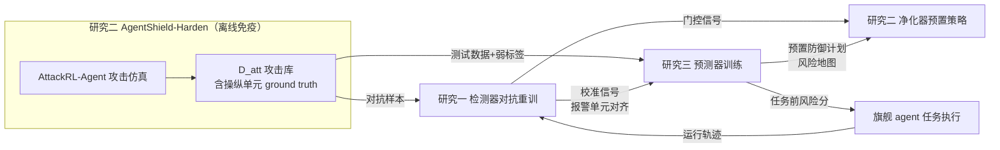
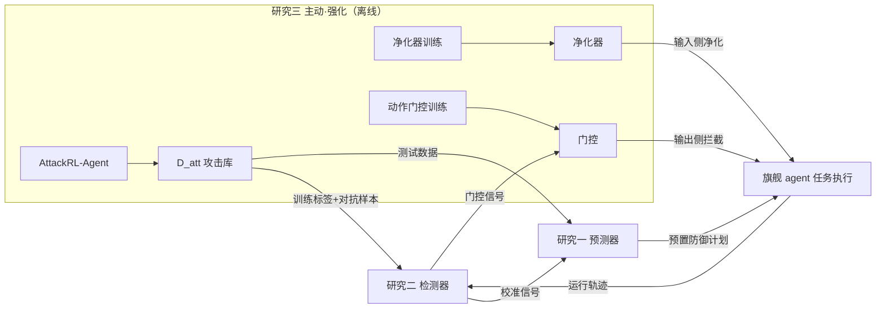

# 系列 v9：编码智能体外部安全层（AgentShield）——预判 / 检测 / 免疫 三研究设计

- 版本：v9（2026-08-18）；提案文档，不覆盖 00–07，待评审确认后再推进 04/05/06/07 的 v9 版（另开文件）。
- v8→v9 关键修改：
  1. **研究三（归因与净化 AgentTrace）废弃**，替换为**任务级攻击面预测 + 预算约束预置防御分配（AgentShield-Anticipate）**。理由：归因是"事后取证"，防御价值弱、算法分量不足（移除重跑式因果检验难以撑起一篇算法研究）；新研究三是"事前防御"，算法=深度预测 + 随机优化双组件，价值直接（预防伤害、节省成本），且与 IS 顶级期刊的"主动式决策"范式（ISR 2024 PRR、JMIS 2021 First Do No Harm）同构。
  2. **研究二去旗舰冲突**：不再微调编码智能体模型权重（回应"微调小模型打不过旗舰模型、旗舰可能一开始就表现优异"的担忧）。鲁棒化对象改为**外部防护组件**（上下文净化器 + 动作门控 + 检测器对抗重训）；评估改为"裸旗舰 vs 旗舰+防护层"的**叠加增益**，不进行任何模型能力比拼。
  3. 全系列统一"**模型外安全层**"架构：三个算法都位于模型之外（上下文层/工具层/规划层），**不依赖任何特定模型权重**，可叠加在任何 agent（开源/闭源/旗舰）之上。该架构是设计选择（纵深防御 + 供应商托管实践情境 + 效用保护，理由见 0.1 节），**不是实施能力妥协**——写作中不得以"无法修改模型"作为研究动机。开发全部本地算力，评估全部公开数据集。
  4. 命名统一为 AgentShield 家族：AgentShield-Detect（研究一）/ AgentShield-Harden（研究二）/ AgentShield-Anticipate（研究三）。
- 灵感来源（51 篇精读）：PRR（ISR 2024）、First Do No Harm（JMIS 2021）、Proactive CTI（MISQ 2024）、#26 ARText（JMIS 2022）、#50 Shapley Masking（MISQ 2026）、RADAR（MISQ 2025）、Hybrid ES+DRL（DSS 2024）——具体映射见第 8 节。

## 0. 用户约束与设计原则（v9 的出发点）

| 约束 | v9 应对 |
|---|---|
| 研究三太弱（归因=移除单元重跑，算法分量不足；价值是取证而非防御） | 换成"事前预判+预算化预置防御"：预测器+分配器双算法组件，价值=预防伤害、降低防御成本 |
| 研究二危险（微调小模型 vs 旗舰；旗舰可能本来就好） | 不微调 agent 权重；鲁棒化对象=外部防护组件；评估=同一旗舰上叠加防护层前后的 ASR/效用差 |
| 算法开发需本地算力 | 检测器/净化器/门控/预测器全部本地训练（2×4090 级）；API 只用于 agent 任务执行与旗舰对比 |
| 不与特定模型绑定，可叠加 | 全部算法位于模型之外（model-agnostic）；外部层提供模型层防御提供不了的能力（仓库信任边界知识、外部内容包裹、动作权限模型） |
| 全部公开可获取数据集 | SWE-bench Verified、AgentDojo、MalSkillBench、OSS 威胁语料（沿用 06 号清单） |

## 1. 核心大问题（v9）

> 编码智能体在信息操纵威胁（间接注入、仓库投毒、恶意技能、工具滥用）下如何保持安全与任务效用？现有防御以运行中检测与规则为主，缺乏系统化、模型无关的防护能力。本文遵循纵深防御原则，开发三层**模型外**安全算法——**事前预判**（攻击面预测+预算化预置防御）、**事中检测**（实时攻击检测）、**主动强化**（RL 攻击仿真+防护组件鲁棒化）——在不牺牲任务效用的前提下构建攻防生命周期闭环。（本文档主体为 v9 初版编号，v9.1/v9.2 新编号与写作口径见第 11/12 节及 09 文档）

## 2. 三个研究总览

| | 研究一（事中·感知） | 研究二（离线·免疫+事中处置） | 研究三（事前·预判） |
|---|---|---|---|
| 算法 | AgentShield-Detect：实时攻击检测 | AgentShield-Harden：RL 攻击仿真 + 外部防护组件鲁棒化（上下文净化器、动作门控、检测器对抗重训） | AgentShield-Anticipate：攻击面风险预测 + 预算约束预置防御分配 |
| 层位置 | 模型外监视层（只读） | 模型外防护层（净化+门控，运行时）与训练层（离线） | 模型外规划层（任务开始前） |
| 时间尺度 | 逐时间步（毫秒~秒级） | 离线训练周级；运行时逐单元/逐动作 | 任务开始前（秒级） |
| 修改 agent 模型？ | 否 | 否（只训练外部组件） | 否 |
| IS 谱系 | #25/#28/#30/#32/#11 | RADAR、#26、#50 | PRR、First Do No Harm、Proactive CTI、#26 |
| 主要产出 | 报警轨迹、门控信号、校准信号 | 攻击库 D_att、净化器、门控策略、加固检测器 | 风险地图、预置防御计划、预防收益报告 |
| 拟投 | DSS / JAIS | JMIS / MISQ（并行 CS） | ISR / DSS / JAIS |

**系列叙事（由浅入深）**：研究一"看见攻击"（感知，反应式起点）→ 研究二"学会防御"（攻击仿真驱动免疫，闭环核心）→ 研究三"预见攻击"（把防御整体前置，主动式终点）。整个系列本身走完"反应式→主动式"的升级弧线，与 PRR 论文"reactive→proactive"的核心主张同构。

---

## 3. 研究一详细设计：AgentShield-Detect（事中·实时攻击检测）

> 与 v8 差异最小，保留三通道检测器主体；明确两处修改：①对抗训练样本改由研究二攻击库 D_att 提供（不再自造）；②输出除门控信号外，新增"校准信号"（检测分与任务阶段/单元的对齐），供研究三做任务前预测的监督信号来源。

### 3.1 动机与问题
编码智能体在真实攻击下已经失败：恶意 issue 穿透 guardrail 的比例高达 66.5%，且拒绝几乎全部来自 LLM 自身而非任何防护系统（IssueTrojanBench）；恶意技能包（MalSkillBench 3,944 个）与工具描述投毒（MCPTox、MCP-TDP）构成新的低门槛攻击面。现有防护（CodeSentinel、ClawGuard、TokenWall）均为"运行中检测"，但检测是事后防御的起点——没有可靠的逐时间步检测信号，任何门控/隔离/恢复都无从谈起。**研究一回答：在不能修改模型的前提下，能否在模型之外构建一个可叠加的、逐时间步的实时攻击检测器，且误报率受控、自身可对抗绕过？**

### 3.2 目标
- 流式判定"当前输入/轨迹是否正被攻击"，输出逐时间步攻击概率 p_t ∈ [0,1]；
- 误报率受约束（不打断正常开发：正常任务误报率目标【占位，如 <5%】）；
- 检测器自身对研究二生成的对抗样本具有可度量的绕过率（对抗鲁棒评估）。

### 3.3 输入 / 输出
- 输入（流式，全部来自 agent 运行日志，模型外只读）：文本通道（issue/文档/工具描述原文）、行为通道（工具调用序列、文件读写、命令执行）、结构通道（agent-工具-文件调用图）。
- 输出：逐时间步 p_t、可解释告警（命中的通道与特征）、门控信号（p_t 阈值分层：隔离/降权/放行）、校准信号（报警时间点与上下文单元的对应关系，用于研究三训练）。

### 3.4 实现（模型外监视层，本地训练）
1. 三通道特征提取（同 v8）：
   - 文本意图：指令性语气、越权请求、隐藏指令模式的特征工程（#28 式）+ 冻结文本编码器嵌入；
   - 行为序列：工具调用频率/顺序异常、敏感路径访问、异常突发性（#30 式）；
   - 结构：agent-工具-文件异构图，节点/边特征（#25/#46 式）。
2. 模型组合：无标签轨迹自编码器（重建误差=异常分，无监督）+ 异构图 GNN（结构异常分类）+ 时序融合头输出 p_t；弱标签半监督（#32 式：公开攻击集 AgentDojo/MalSkillBench 提供弱标签）。
3. 对抗重训：以研究二攻击库 D_att 为对抗样本做对抗训练（#26 ARText 式），报告对抗绕过率（v8→v9 修改点 1）。
4. 流式部署：滑动窗口 + 增量推理，报告端到端检测延迟（目标【占位，如 <500ms/步】）。

### 3.5 指标
P/R/F1、AUC、检测延迟、误报率、对抗绕过率；与基线对比：关键词规则、单通道（仅文本）检测器、CodeSentinel 式静态检查基线。

### 3.6 数据与算力（全部公开）
- 正常轨迹：SWE-bench Verified（500 实例，主实验 200 实例子集）+ SWE-Gym 公开轨迹；
- 攻击样本：AgentDojo（85 任务/636 注入）、MalSkillBench（3,944 恶意 skill）、研究二 D_att（300–500 实例，自建但基于公开基座）；
- 算力：本地 1×4090（24G）训练 1–2 天；无大模型训练，编码器冻结或使用公开嵌入 API 均可。

---

## 4. 研究二详细设计：AgentShield-Harden（离线·攻击仿真 + 外部防护组件鲁棒化）

> v8→v9 核心修改：**不再微调 agent 模型权重**。鲁棒化对象 = 三个外部组件：①上下文净化器（输入到 agent 前的中性化/包裹处理）；②动作门控（权限模型，按动作类别与敏感度阈值放行/隔离）；③检测器对抗重训（与研究一共用）。评估 = 同一旗舰 agent 上"裸旗舰 vs 旗舰+防护层"的叠加增益。攻击仿真器 AttackRL-Agent 保留（吸收原攻击研究，作为 D_att 生产器）。

### 4.1 动机与问题
旗舰 agent（GPT-5 级/Claude 级/DeepSeek 旗舰 API）无法被任何研究者修改权重；而直接对开放权重小模型做安全微调又面临两条死路：一是小模型能力不如旗舰，微调后"打不过"；二是防御训练可能摧毁自主性——Autonomy Tax 实证显示防御训练后 agent 99% 任务超时（基线 13%）。因此，**鲁棒化必须发生在模型之外：不改变 agent 会什么，只改变它"看到什么"和"被允许做什么"**。研究二回答：在完全不动 agent 权重的前提下，能否通过"净化器 + 门控 + 对抗重训检测器"三个外部组件的协同，显著降低攻击成功率，同时保持良性任务完成率不塌？

### 4.2 目标
- 生产高质量、多样化、可迁移的自适应攻击库 D_att（带 ground truth：哪些上下文单元被操纵、预期危害动作），供研究一对抗训练、研究三测试；
- 鲁棒化三个外部组件，使旗舰 agent 在防护层加持下 ASR 显著下降、Robust Resolve Rate 不塌、Autonomy Tax 受控；
- 全部评估在同一旗舰基底上做"叠加前 vs 叠加后"，不出现任何"我们的模型 vs 旗舰模型"的能力比较。

### 4.3 输入 / 输出
- 输入：SWE-bench Verified（良性任务基座）、AgentDojo + MalSkillBench（公开攻击环境/素材）、研究一检测器（门控信号）。
- 输出：攻击库 D_att（含操纵单元 ground truth）、净化器权重（本地小模型）、动作门控策略（规则+可学习阈值）、对抗重训后的检测器 v2、叠加增益评估报告（裸旗舰 vs 旗舰+防护层）。

### 4.4 实现（三组件，全部外部、本地可训练）

**组件 A：AttackRL-Agent（攻击仿真器，生产 D_att）**
- 对抗 MDP：状态 =（仓库快照嵌入, issue, agent 轨迹摘要）；动作 = 先选通道（issue 改写 / 仓库文件注入 / 工具描述或技能篡改）再生成内容；奖励 = 危害信号（产出漏洞补丁或有害动作 +1，被拒/正常 0）− λ·检测器得分（隐蔽惩罚，与研究一联动）− κ·编辑成本；
- PPO 训练生成式攻击策略；基线：SWExploit（恶意 issue 模板）、FCV（漏洞诱导）、RLbreaker（通用越狱）、随机改写；
- 验证奖励信号的小实验：危害判定器 = CodeQL 规则 + LLM-as-judge，先在 20 个实例上校准（成本 <$50）。

**组件 B：上下文净化器（context sanitizer，输入侧）**
- 位置：所有外部文本进入 agent 上下文之前（issue/README/工具描述/技能包元数据）；
- 算法：本地小模型（如 7B 或专用序列标注模型）做三类处理——①不信任内容包裹（用边界标记明确"外部内容，仅供参考"）；②高风险指令中性化（改写为陈述句、剥离命令语气，Hybrid ES+DRL 的"规则层参与"思路：规则先判，模型再修）；③隔离候选（高可疑单元直接移入隔离区，交给门控决定）；
- 关键点：净化器只改"agent 看到什么"，不改"agent 能做什么"，因此对任何旗舰可叠加；其本身是 IS 味十足的"防护组件"，可独立成篇评估。

**组件 C：动作门控（action gating，输出侧）**
- 位置：agent 工具调用/命令执行之前（模型外拦截层）；
- 算法：动作类别白名单/黑名单 + 敏感度评分（写文件/执行命令/网络访问/读取密钥/安装依赖等按风险分级）+ 可学习阈值（阈值本身用 RL 小循环优化，或规则表+人工校准起步）；
- 与检测器联动：p_t > θ_high → 隔离动作；θ_mid < p_t ≤ θ_high → 降权（忽略可疑上下文片段后继续）或人工确认；
- 支持回滚（对已执行动作的可逆性标记：哪些动作可回滚、如何回滚——但回滚不是研究主题，只是门控的兜底策略，回应"攻击奏效后再回滚"的疑问：回滚只是最后手段，研究重点是把动作挡在发生之前）。

**组件 D（复用研究一）：检测器对抗重训**
- 以 D_att 为对抗样本重训检测器 v2；v2 同时服务研究一门控与研究三的校准信号。

### 4.5 指标（双指标结构，回应 Autonomy Tax）
- 主指标：ASR（攻击成功率，对抗前 vs 对抗后）、Robust Resolve Rate（防护下良性任务完成率）、Autonomy Tax 检验（防护前后良性任务完成率差，目标【占位：下降 <5pp】）；
- 附加：RAUC（性能-扰动曲线下面积，#26 式）、成本/任务（防护层引入的额外 token 与延迟）、检测器对抗绕过率。

### 4.6 数据与算力
- 全部公开：SWE-bench Verified、AgentDojo、MalSkillBench、SWE-Gym；D_att 自建但基于公开基座；
- 算力：净化器/门控阈值本地 2×4090 训练（2–4 天）；PPO 攻击训练是成本大头（API 执行约 $800–1,500，沿用 06 号方案 B 预算）；
- 明确"不做什么"：不训练任何 agent 主模型权重，不出现小模型 vs 旗舰的能力对比表。

---

## 5. 研究三详细设计：AgentShield-Anticipate（事前·攻击面预测 + 预算约束预置防御）

> v9 新增研究（替代 v8 归因/净化 AgentTrace）。这是全系列的"主动式"顶点，与 PRR（ISR 2024）"reactive→proactive"决策结构、First Do No Harm（JMIS 2021）"预测在前、干预提前"范式同构。

### 5.1 动机与问题
现有全部防御（含研究一、二）都是"攻击发生中/发生后"才起作用：检测需要攻击已经开始、净化需要先报警、门控需要先有可疑信号。而攻击者在发布恶意 issue/提交投毒 PR 之前，任务本身已携带可观测的"事前线索"：issue 的措辞模式、仓库的信任边界（哪些文件被第三方可写）、技能/工具依赖的来源风险、与已知恶意语料的相似度。**能否在任务开始之前就预测"这个任务的风险有多高、哪些上下文单元可能被利用"，并据此在预算约束下预置防御（哪些单元隔离、哪些工具提升监控、哪些依赖延迟安装）？** 研究三回答：把防御从"事件中"整体前置到"事件前"，算法 = 深度攻击面预测器 + 预算约束预置防御分配器双组件。

### 5.2 目标
- 任务开始前输出：任务级攻击面风险分 R ∈ [0,1] + 预置防御计划（上下文单元清单 C 上的隔离/监控/延迟决策）；
- 在安全运营预算 B（每任务可承受的防护开销，如额外隔离检查数、监控深度）约束下最小化预期损害；
- 与研究一形成"任务前预测 vs 任务中检测"的互补，两者可叠加。

### 5.3 输入 / 输出
- 输入（任务开始前可得的全部公开信息）：
  - issue/任务文本（SWE-bench Verified 的 issue 原文、AgentDojo 的用户任务）；
  - 仓库静态快照（文件清单、配置、依赖、权限边界——基准自带或公开镜像）；
  - 技能/工具/依赖元数据（MalSkillBench 技能包、MCP 工具描述、依赖来源）；
  - 公开威胁语料（OSS 恶意样本、CVE 描述、攻击基准的注入模板）。
- 输出：风险分 R、Top-k 高风险上下文单元清单、预置防御计划（每单元动作：隔离/监控/延迟/放行）、预期收益报告（预警后阻断的 ASR 降幅估计【占位】）。

### 5.4 实现（双组件算法）
**组件 A：深度攻击面预测器**
- 多模态编码：issue 文本编码器（冻结 LLM 嵌入或小模型微调）+ 仓库异构图 GNN（文件/目录/依赖/权限节点与边）+ 技能/元数据侧信道特征（来源域、作者、变更频率）；
- 训练标签来源（全部公开可得）：①研究二 D_att 的 ground truth（哪些单元被操纵）做弱监督；②公开攻击基准（AgentDojo 注入位置标注、SWExploit/FCV 攻击实例）做跨基准迁移；③研究一检测器的校准信号（真实运行中报警的单元，回流做自训练信号）；
- 输出：单元级攻击面风险 s_i（i ∈ 上下文单元）+ 任务级聚合 R。

**组件 B：预算约束预置防御分配器**
- 问题形式化（与 PRR 的随机优化同构）：给定预算 B（如最多可隔离 k 个单元、最多可对 m 个单元做深度扫描），选择预置动作集 A ⊂ C，最小化 E[预期损害] = Σ_i s_i · d_i · I(单元 i 未被预置保护)，其中 d_i 为单元被利用时的损害权重；
- 求解：带约束的随机优化/背包式贪心+局部搜索（PRR 用问题性质设计高效解法，我们沿用"性质→解法"路线，先验证贪心+上界，再评估是否需要整数规划）；
- 输出：确定性防御计划，与具体 agent 无关（纯外部层），每实例推理秒级、无重放成本。

### 5.5 指标
- 预测能力：Top-20% 高风险任务命中率、单元级定位 F1（对照 D_att ground truth）、AUC；
- 防御收益：预置防御（隔离/延迟）后 ASR 降幅 vs 基线（无预置、随机预置、经验规则预置、仅依赖研究一检测器+慢速全量扫描）；
- 预算-收益曲线：B 从 0 到上限的边际收益（证明"预算约束"是研究的实质内容，不是简单的"全都隔离"）；
- 效用保持：预置防御导致的正常任务 resolve 率损失【占位目标 <3pp】。

### 5.6 数据与算力
- 全部公开：SWE-bench Verified、AgentDojo、MalSkillBench、D_att（研究二自建）；仓库快照由基准自带；
- 算力：预测器本地 2×4090 训练 1–2 周；分配器为优化求解器（CPU 分钟级）；评估走 API（复用研究二已生成的攻击实例，增量成本低——这是"研究二攻击库供研究三测试"的系列红利）。

### 5.7 与 v8 归因研究的对比（为什么新研究三"更重"）
| 维度 | v8 归因（废弃） | v9 预判（新） |
|---|---|---|
| 时间位置 | 攻击后（取证） | 攻击前（预防） |
| 算法分量 | 单元移除重放（推理期过程，无模型训练） | 深度预测器（训练）+ 预算约束分配器（优化）双组件 |
| 价值主张 | 恢复任务 | 预防伤害、节省防御成本（First Do No Harm 式"成本节省"叙事） |
| 与检测的关系 | 依赖检测报警 | 不依赖报警，独立前置 |
| IS 同构 | #50（归因→掩蔽） | PRR（未来需求预测+当前决策）、First Do No Harm（预测→干预→成本节省）、Proactive CTI（事前情报） |

---

## 6. 三研究数据流与共享语言（v9 闭环）

1. 研究二输出攻击库 D_att（自建但基于公开基座）→ 研究一对抗重训、研究三预测器训练/测试——**攻击不单独成篇，全部内嵌为系列组件**；
2. 研究一输出门控信号 → 研究二动作门控联动；输出校准信号（报警单元对齐）→ 研究三自训练信号——**检测经验反哺事前预测**；
3. 研究三输出预置防御计划（哪些单元隔离/延迟）→ 研究二净化器与门控的预置策略输入——**事前预测指导事中处置**；
4. 共享战场：SWE-bench Verified（500 实例）+ AgentDojo + MalSkillBench；共享指标语言：ASR、Robust Resolve Rate、误报率、成本/任务、定位 F1、预算-收益。

---

## 7. 与 v8 的差异及如何回应"研究二旗舰冲突、研究三太弱"

### 7.1 研究三（v8 归因 → v9 预判）
- 用户质疑：归因=移除单元重跑，算法分量不足、价值是取证而非防御 → 新研究三是**训练型预测器 + 优化型分配器**双组件，每实例推理秒级，价值=预防伤害+节省成本，且与 PRR/First Do No Harm/Proactive CTI 同构，IS 身份更硬；
- 归因的合理成分已并入研究二组件 C（回滚作为兜底）与研究一（可解释告警），不丢失"事后处置"能力，但不再单独撑一篇。

### 7.2 研究二（v8 微调 agent → v9 外部组件鲁棒化）
- 用户质疑：微调小模型 vs 旗舰，旗舰可能本来就好 → v9 **彻底不碰 agent 权重**，鲁棒化对象=净化器+门控+检测器重训，全部外部、本地可训练；
- 用户质疑：理想算法应与旗舰"可叠加" → v9 全系列模型外架构：外部层提供模型层防御提供不了的能力（仓库信任边界知识、外部内容包裹、动作权限模型），与模型无关、可叠加；
- 评估口径：裸旗舰 vs 旗舰+防护层（同一基底、同一种子），只报叠加增益，杜绝能力比拼。

### 7.3 全系列一致性（回应"松散"）
- 一个核心大问题：**旗舰不可修改 → 防御=可叠加外部安全层**；三个研究 = 同一问题的三个时间维度（事前预判/事中检测/离线免疫）；
- 系列本身走完 reactive→proactive 弧线（研究一反应式起点 → 研究二离线免疫核心 → 研究三主动式顶点），与 PRR 的主张同构；
- 数据、指标、战场全部共享（第 6 节），每个研究的输出都是下一个研究的输入。

---

## 8. IS 文献灵感映射表（51 篇精读结论）

| 锚点（期刊/年份） | 它做了什么 | v9 吸取什么 | 用在哪个研究 |
|---|---|---|---|
| #49 RADAR（MISQ 2025） | DRL 攻击器 r-VAC + RL-RO 鲁棒化，鲁棒性提升约 7 倍；提出"active/proactive 指导"但未操作化 | RL 攻防范式原样迁移；把"proactive 指导"操作化为研究三的预置防御 | 研究二（AttackRL-Agent）、研究三（proactive 落点） |
| PRR（ISR 2024） | 本地机构"reactive→proactive"资源请求决策：未来需求预测（DL/TPP）+ 随机优化双组件；四个 gap 逐一对应方法创新 | **研究三的直接模板**：未来攻击面预测 + 预算约束分配 = 需求预测 + 随机优化 | 研究三（结构同构） |
| First Do No Harm（JMIS 2021） | SALT 预测住院不良事件；评估三：预测精度 → 实用价值（模拟成本节省） | "预测在前、干预提前"叙事；**评估层加入成本节省/预防收益**（研究三预算-收益曲线） | 研究三（价值主张） |
| Proactive CTI（MISQ 2024） | 开源威胁情报自动打标签（DTL-EL），把黑客论坛文本转成结构化 exploit 情报 | 公开威胁语料 → 攻击面特征的思路（预测器输入含 OSS 威胁语料） | 研究三（数据输入） |
| #26 ARText（JMIS 2022） | 对抗鲁棒评估+增强框架：鲁棒性度量（RAUC）+ 对抗重训；三原因式 gap | 评估/重训双组件结构；"三原因式 gap"写法用于研究二 Intro | 研究二（评估+重训） |
| #50 Shapley Masking（MISQ 2026） | 归因→掩蔽，风险-效用权衡，特征级 mask 决策 | 单元级"风险-效用权衡"语言（研究三预置决策的每个单元都是 risk-utility 权衡）；#50 证明"归因-处置"是 IS 可发表链路 | 研究三（决策语言） |
| Hybrid ES+DRL（DSS 2024） | 规则专家系统参与 RL 状态输入，规则层+学习层协同 | 净化器"规则先判、模型再修"的规则层参与设计 | 研究二（组件 B） |
| #32 社交机器人（ISR 2023） | 弱标签/众包标签 + 现象驱动 gap | 弱标签半监督范式（检测器训练） | 研究一（训练范式） |
| #25/#28/#30（DSS/JAIS 谱系） | 欺诈网站/评论的结构、文本、行为特征检测 | 三通道特征工程谱系迁移 | 研究一（特征） |

---

## 9. 研究三试金石验证清单（先做小实验再定去留，成本 <$50）

研究三是否成立，取决于一个核心假设：**"任务开始前的静态信息足以预测攻击面"**。若不成立，v9 需要回到"以研究一/二为主体"的方案。验证步骤（1–2 周）：

1. **数据准备**：取 AgentDojo 85 个任务 + 636 个注入攻击（有注入位置标注）+ SWE-bench Verified 200 实例；构造"任务前快照特征"（issue 文本、仓库静态结构、依赖/技能元数据）；
2. **预测器雏形**：用冻结文本嵌入 + 轻量 GNN，在"注入攻击 vs 正常任务"上训练二分类，看任务级 AUC 是否显著 > 0.6（随机基线）——若 AUC 过低，说明静态信息不足，需重新设计特征（可能并入"仓库历史提交模式"等公开信号）；
3. **预置防御雏形**：对预测为 Top-20% 高风险的 AgentDojo 攻击实例，把注入单元提前隔离（不进入 agent 上下文），测量 ASR 降幅 vs 无预置基线——隔离成本为 0（本来就是隔离区），只看收益端；
4. **预算-收益雏形**：在 10–20 个实例上枚举"隔离 k 个单元"的 k-B 曲线，验证边际收益递减、且有明显的最优点（若收益与 k 无关，则"预算约束"不构成研究实质）；
5. **判定标准**：步骤 2 的 AUC ≥ 0.7 且步骤 3 的 ASR 降幅 ≥ 20pp【占位目标】，研究三保留并进入正式设计；否则降级为研究二的附加章节（"预置策略"作为净化器的输入模块）。

**研究一/二同样有小验证**：研究一用 AgentDojo 公开攻击复现 2–3 个注入（验证环境与危害判定，<1 周）；研究二先在 20 个 SWE-bench 实例上校准攻击奖励信号（危害判定器一致性，<$50）。

---

## 10. 下一步（待用户确认 v9 方向）

1. 确认三个研究的大方向（预判/检测/免疫）与"模型外安全层"架构（写作口径见 0.1 节）；
2. 确认后另开文件：04/05/06/07 的 v9 版（五段 Introduction 对标 RADAR、算法实现设计、实验实施预算、IS gap 论述分析）；
3. 若研究三试金石通过，按第 9 节进入 1–2 周小实验（<$50）；
4. 本提案文档不覆盖 00–07 任何内容。

---

## 11. v9.1 修订：系列顺序改为"事前 → 事中 → 主动"，三研究算法详解

> 修订原因：原 v9 把研究一（事中检测）放前面、研究三（事前预判）放最后，叙事是"反应式→主动式"；但用户指出更自然的时间线是**事前 → 事中 → 主动**。修订后：研究一=事前预判（Anticipate）、研究二=事中检测（Detect）、研究三=主动防御（Harden，离线周期强化，全系列算法顶点）。本修订不影响任何算法内容，只重排研究编号与叙事顺序。

### 11.1 新系列结构与位置

| | 研究一（事前·预判） | 研究二（事中·检测） | 研究三（主动·强化） |
|---|---|---|---|
| 算法 | AgentShield-Anticipate：攻击面预测器 + 预算约束预置防御分配器 | AgentShield-Detect：三通道流式检测器 | AgentShield-Harden：AttackRL-Agent + 净化器训练 + 动作门控 + 检测器对抗重训 |
| 时间位置 | 任务开始前（秒级推理） | 任务执行中（逐时间步） | 离线周期（周级训练）；部署的净化器/门控在事中执行 |
| 回答的问题 | 哪些任务/哪些上下文单元值得预先防护？ | 当前轨迹是否正被攻击？ | 如何让整个防护体系越打越强？ |
| 修改 agent 权重 | 否 | 否 | 否 |
| 部署方式 | 规划层（决定预置动作） | 监视层（提供信号） | 防护层（净化器/门控执行） |
| 主要产出 | 风险分、预置防御计划 | p_t、告警、门控信号、校准信号 | D_att、净化器、门控、检测器 v2 |

**叙事**：事前（规划）→ 事中（感知）→ 主动（强化），三者构成"规划-感知-强化"闭环；研究三作为终点，其 RL 攻防闭环是 RADAR 范式最重的算法贡献，压轴合理。

### 11.2 研究一算法详解（AgentShield-Anticipate）

**算法 A1：深度攻击面预测器（Deep Attack-Surface Predictor）**
- 输入（任务前可得，全部公开）：issue 文本；仓库静态快照（文件树、依赖清单、配置、权限边界）；技能/工具元数据（来源域、作者、更新频率）；公开威胁语料；
- 编码：issue → 冻结 LLM 嵌入（文本向量）；仓库 → 异构图 GNN（节点=文件/目录/依赖/技能，边=包含/引用/依赖，节点特征=文件类型、是否第三方可写、与已知恶意样本相似度）；技能元数据 → 侧信道向量；
- 融合：MLP 融合三类编码 → 单元级操纵风险 s_i ∈ [0,1] + 任务级风险 R；
- 训练标签：D_att ground truth（研究三产出，哪些单元被操纵）+ AgentDojo 注入位置标注 + 研究二检测器的校准信号回流（自训练）；
- 输出：每个上下文单元的风险分与排序。

**算法 A2：预算约束预置防御分配器（Budgeted Proactive Defense Allocator）**
- 形式化：给定预算 B（最多隔离 k 个单元、深度扫描 m 个、延迟安装 l 个依赖），选预置动作集 A，最大化 Σ_{i∈A} s_i·d_i（受保护单元的预期损害减少），d_i 为单元被利用的损害权重；
- 求解：背包式贪心 + 上界剪枝（先验证贪心与最优解差距），规模大时用开源整数规划求解器（CBC/SCIP）；
- 输出：确定性防御计划（单元 → 隔离/监控/延迟/放行），与具体 agent 无关，每实例推理秒级。

**预期效果（全部【占位】）**：Top-20% 高风险任务命中率、单元级定位 F1、预置后 ASR 降幅（vs 随机/经验规则/仅检测器基线）、预算-收益曲线边际递减、正常任务 resolve 损失 <3pp。

### 11.3 研究二算法详解（AgentShield-Detect）

**算法 B1：三通道流式检测器**
- 通道 1 文本意图：指令性语气、越权请求、隐藏指令模式 → 特征工程（#28 式）+ 冻结文本编码器嵌入；
- 通道 2 行为序列：工具调用频率/顺序异常、敏感路径访问、异常突发性 → 序列模型（LSTM/Transformer）编码；
- 通道 3 结构：agent-工具-文件调用图 → GNN 异常分类；
- 辅助：无监督自编码器（重建误差=异常分，无需标签）；
- 融合：时序注意力头输出逐时间步攻击概率 p_t；
- 训练：弱标签半监督（AgentDojo/MalSkillBench 公开攻击集做弱标签）→ 再以研究三 D_att 做对抗重训（#26 ARText 式）→ 检测器 v2；
- 输出：p_t、可解释告警（命中的通道与特征）、门控信号（p_t 分层）、校准信号（报警单元对齐，回流研究一）。

**预期效果（全部【占位】）**：危害动作完成前触发（检测延迟 <500ms/步）、正常任务误报率 <5%、对抗绕过率有界。

### 11.4 研究三算法详解（AgentShield-Harden）

**算法 C1：AttackRL-Agent（RL 攻击仿真器，生产 D_att）**
- 对抗 MDP：状态 =（仓库快照嵌入, issue, agent 轨迹摘要）；动作 = 两级（先选通道：issue 改写/仓库文件注入/工具描述或技能篡改，再生成内容）；奖励 = 危害信号（产出漏洞补丁或有害动作 +1，被拒/正常 0）− λ×检测器得分（隐蔽惩罚，与研究二联动）− κ×编辑成本；
- 训练：PPO 100–200 轮 × 32 实例/轮；基线：SWExploit、FCV、RLbreaker、随机改写；
- 产出：攻击策略 + D_att（300–500 实例，带操纵单元 ground truth）。

**算法 C2：净化器训练（Context Sanitizer）**
- 位置：外部文本进入 agent 上下文之前；本地小模型（7B 级或专用序列模型）；
- 功能：①操纵单元检测（哪些片段是注入）；②中性化改写（剥离命令语气、改为陈述句，Hybrid ES+DRL 式"规则先判、模型再修"）；③高可疑单元移入隔离区；
- 监督信号：D_att ground truth + LLM-as-judge 一致性校验。

**算法 C3：动作门控（Action Gate）**
- 位置：工具调用/命令执行之前；动作类别风险表（写文件/执行命令/网络访问/读密钥/安装依赖分级）+ 可学习阈值；
- 联动：p_t > θ_high → 隔离；θ_mid < p_t ≤ θ_high → 降权（忽略可疑上下文片段）或人工确认；回滚仅作兜底；
- 阈值学习：与检测器联合的 RL 小循环或规则表+人工校准。

**算法 C4：检测器对抗重训**：以 D_att 重训研究二检测器 v2（服务门控与研究一校准信号）。

**预期效果（全部【占位】）**：ASR 显著下降（对照研究二裸旗舰）、Robust Resolve Rate 不塌（Autonomy Tax <5pp）、RAUC、成本/任务（防护层额外 token 与延迟）。

### 11.5 新闭环（重排后）

- 研究一（事前）决定"哪些内容根本不进 agent / 提升监控" → 直接改变 RUN 的输入组成；
- 研究二（事中）提供实时信号 → 驱动 GATE 联动、校准信号回流 R1；
- 研究三（主动）离线练强 D_att/净化器/门控/检测器 v2 → 三者共同支撑 RUN 的安全执行。

### 11.6 回应"事中有两种加强方式"

- 是的：事中防护 = 感知（研究二检测器）+ 执行（研究三部署的净化器与门控），两种执行方式互补——**净化器管"读到什么"（输入侧，语义层）**，**门控管"能做什么"（输出侧，动作层）**；
- 研究三的算法贡献不是"两个规则组件"本身，而是**RL 攻防闭环**（C1 生成自适应攻击 → C2/C3/C4 在对抗数据上练强），这与 RADAR 的"DRL 攻击器 + 鲁棒化"结构同构，只是鲁棒化对象从模型权重换成外部组件；
- 若担心净化器/门控分量不足，评估上以"叠加增益 + Autonomy Tax 双指标 + 预算-收益"三张表支撑，叙事对标 #26 的"评估+增强"双组件框架。

---

## 12. v9.2 定稿说明（写作口径修正 + 系列逻辑）

- 用户评审意见：**"旗舰编码智能体无法被修改"不得作为写作中的研究动机**——这是实施能力的可行性约束，与动机和内容无关；写进论文会被审稿人视为次优妥协。
- 修正：核心大问题已改为现象驱动表述（本文件第 1 节）；"模型外"架构的写作口径（纵深防御 / 供应商托管实践情境 / Autonomy Tax 效用保护 / model-agnostic 通用性）与系列逻辑论证（对标 thesis_collection 三篇博士论文）**见 09 文档（v9.2 定稿）**，本文件保留为讨论轨迹。
- 全文编号以 v9.1（第 11 节）与 v9.2（09 文档）为准：研究一=事前预判（AgentShield-Anticipate）、研究二=事中检测（AgentShield-Detect）、研究三=主动强化（AgentShield-Harden）。
