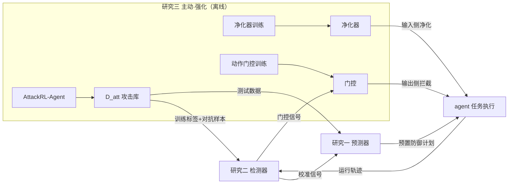

# 系列 v9.2 定稿：编码智能体模型外安全层（AgentShield）——预判 / 检测 / 强化 三研究设计

- 版本：v9.2（2026-08-18）。本文档为 v9 系列**定稿版**；08 文档为讨论轨迹（保留不删）。
- 版本沿革：
  - v9：弃归因/净化（研究三太弱），换"事前预判"；研究二去权重微调，鲁棒化对象改为外部组件；
  - v9.1：系列顺序改为 事前 → 事中 → 主动（研究一=预判、研究二=检测、研究三=强化）；
  - v9.2（本版）：**写作口径修正**——"模型外"是设计选择，不是实施能力妥协；**补系列逻辑论证**（对标 thesis_collection 三篇博士论文）。
- 命名：AgentShield-Anticipate（研究一·事前预判）/ AgentShield-Detect（研究二·事中检测）/ AgentShield-Harden（研究三·主动强化）。

---

## 0. 写作口径（v9.2 修正的核心）

### 0.1 禁止表述（内部讨论语言，绝不进入论文）

| 禁止 | 原因 |
|---|---|
| "旗舰模型无法被修改" | 实施能力的可行性约束，不是研究动机；等于自认次优 |
| "我们微调不了旗舰，所以只能做外部层" | "因为做不到 X，所以做 Y"的表述一律禁止 |
| "不与旗舰冲突" | 内部决策语言，审稿人看到的只是"为什么选这个架构" |
| "裸旗舰 vs 旗舰+防护层"中的"裸" | 改为"基线 agent vs 叠加防护层后的 agent" |

原则：论文中不出现任何以"我们做不到/不能做"为理由的表述；架构选择的正当性全部来自现象、理论、证据（见 0.2）。

### 0.2 "模型外"架构的三条正当理由（写作可用）

1. **纵深防御（Defense in Depth）**：安全架构分层是基本原则（网络层/主机层/应用层/数据层），没有哪一层是唯一防线。编码智能体安全同样分层：权重级防御只是其中一层，上下文层/工具层/规划层防护是标准安全架构实践。文献现状（A 综述）：现有防御以运行中检测与规则为主，训练级鲁棒化缺失——模型外防护恰好补的是这个缺口，而不是"模型层被占了所以做外面"。
2. **实践情境（供应商托管）**：企业部署编码智能体时，模型由供应商维护（API/托管平台），组织安全团队不管理模型权重，但须对代码、凭据、发布流程负责——模型外防护是安全团队实际可部署的层。这是实践中普遍存在的真实约束，作为**情境描述**写（如同 RADAR 写"组织依赖第三方模型"的口吻），不是能力声明。
3. **效用保护（实证证据）**：权重级防御训练有实证风险——Autonomy Tax（arXiv:2603.19423）：防御训练后 agent 99% 任务超时（基线 13%）。模型外防护不触碰权重、只在外围拦截，目标=**同时保证安全性与任务效用**。双指标评估（ASR + Robust Resolve Rate）正是这个设计目标的体现——评估设计本身就是论证。

补充优点（写入贡献/讨论）：**model-agnostic（模型无关）**——外部层可叠加在任何 agent（开源/闭源/旗舰）之上，一次开发、处处部署；且外部层拦截的是攻击**必经之路**（任何攻击最终都要化为 agent 的输入或动作，外部层在输入侧和动作侧拦截），覆盖面比单模型防御更广。

### 0.3 核心大问题（现象驱动，定稿表述）

> 编码智能体在信息操纵威胁（间接注入、仓库投毒、恶意技能、工具滥用）下如何保持安全与任务效用？现有防御以运行中检测与规则为主，缺乏系统化、模型无关的防护能力。本文遵循纵深防御原则，开发三层模型外安全算法——**事前预判**（攻击面预测+预算化预置防御）、**事中检测**（实时攻击检测）、**主动强化**（RL 攻击仿真+防护组件鲁棒化）——在不牺牲任务效用的前提下构建攻防生命周期闭环。

---

## 1. 系列逻辑论证（博士论文级关联）

### 1.1 thesis_collection 三篇的系列公式（先归纳再对照）

| 论文 | 核心大问题 | 三个子研究 | 递进逻辑 |
|---|---|---|---|
| 陈诗沁（众筹多媒体，2024） | 信息过载视角下多媒体内容如何影响融资绩效 | 阶段一封面图片 → 阶段二模态内信息复杂性 → 跨模态信息重叠 | 统一情境（众筹两阶段）+ 统一视角（信息过载）；由局部到整体 |
| 浙大移动文娱（2023） | 平台如何平衡内容生成与使用 | 点击/滑动机制 → 点击模式决策方法 → 滑动模式决策方法 | 先理解机制，再基于机制设计方法；研究一为研究二三提供依据 |
| 浙大 AI 抵制（2024） | 医疗 AI 用户抵制 | 构念开发 → 下游效应与机制 → 主体间传递效应 | 由浅入深：构念 → 机制 → 边界 |

**共同公式**：①一句话核心大问题（现象驱动）；②统一情境与视角；③N 个递进子问题，各自独立可发表（独立理论/方法/数据）；④子研究之间写明递进或依赖关系（"研究二是研究一的延续与深化"）；⑤总-分-总结构（绪论+综述 → 各子研究 → 综合结论）。

### 1.2 我们的对应（一一对照）

| 公式要素 | 我们的实现 |
|---|---|
| 核心大问题 | 编码智能体在信息操纵威胁下如何保持安全与任务效用（0.3 节） |
| 统一情境与视角 | 情境=编码智能体的软件开发任务（SWE-bench/AgentDojo/MalSkillBench 共享战场）；视角=信息操纵威胁下的模型外防御 |
| 三个递进子问题 | 研究一**预见**攻击（规划能力）→ 研究二**感知**攻击（执行能力）→ 研究三**进化**防御（学习能力） |
| 递进/依赖关系 | 决策深度递进：信息→风险判断（预见）、轨迹→攻击判断（感知）、经验→新能力（进化）；数据依赖闭环：D_att→研究一二训练、检测信号→门控与回流、真实拦截→回流强化 |
| 总-分-总结构 | 第 1-2 章：大问题+攻防文献+统一框架；第 3-5 章：三个子研究（各可独立投稿）；第 6 章：三模块如何构成完整安全层 |

**递进逻辑为什么是"预见→感知→进化"而不是时间线**：这是**防御决策深度的递进**，也是任何智能防御系统缺一不可的三项能力——只有预见没有感知，攻击发生时无法确认与处置；只有感知没有进化，防御永远停留在第一天的水平；只有进化没有运行组件，能力无处安放。三个研究=同一个安全层系统的三个必需模块。

**对标 thesis_collection 的对应关系**：
- 移动文娱"机制→方法"↔ 我们的"强化机制（研究三）最早开工（没有攻击库，研究一二无法训练）、最后呈现（它是系统完整性的体现）"，依赖关系同样明确；
- 陈诗沁"由局部到整体" ↔ 我们的"由单点感知到系统进化"；
- AI 抵制"由浅入深" ↔ 我们的"由反应式到主动式"。

### 1.3 三研究缺一不可（审稿防御论证）

- 只有研究一：能预见风险，但攻击发生时无法确认、无法处置、无法应对新攻击；
- 只有研究二：能发现攻击，但无法预先防护、无法自我进化；
- 只有研究三：有攻击库和强化方法，但没有运行时的感知与预判模块，无处安放。
- 三者合起来才构成"预见-感知-进化"完整闭环——这正是"一个系统拆成三个模块、分别发表"的博士论文级关联。

---

## 2. 三个研究总览（v9.2 定稿顺序）

| | 研究一（事前·预判） | 研究二（事中·检测） | 研究三（主动·强化） |
|---|---|---|---|
| 算法 | AgentShield-Anticipate：攻击面预测器 + 预算约束预置防御分配器 | AgentShield-Detect：三通道流式检测器 | AgentShield-Harden：AttackRL-Agent + 净化器训练 + 动作门控 + 检测器对抗重训 |
| 时间位置 | 任务开始前（秒级推理） | 任务执行中（逐时间步） | 离线周期（周级）；部署的净化器/门控在事中执行 |
| 回答的问题 | 哪些任务/单元值得预先防护？ | 当前轨迹是否正被攻击？ | 如何让防护体系越打越强？ |
| 层位置 | 规划层 | 监视层 | 防护层（净化+门控）+ 训练层 |
| 修改 agent 权重 | 否 | 否 | 否 |
| 主要产出 | 风险分、预置防御计划 | p_t、告警、门控信号、校准信号 | D_att、净化器、门控、检测器 v2 |
| IS 谱系 | PRR、First Do No Harm、Proactive CTI | #25/#28/#30/#32 | RADAR、#26、Hybrid ES+DRL |

---

## 3. 研究一详细设计：AgentShield-Anticipate（事前·预判）

### 3.1 动机与问题
编码智能体的攻击在执行前已携带可观测线索：恶意 issue 的措辞模式、仓库的信任边界（哪些文件第三方可写）、技能/依赖来源风险。现有防御（含研究二、三的运行时组件）都是"攻击发生中"才起作用。**能否在任务开始前预测攻击面、并在预算约束下预置防御（哪些单元隔离、哪些工具提升监控、哪些依赖延迟安装）？**

### 3.2 目标
- 任务开始前输出：任务级风险分 R ∈ [0,1] + 预置防御计划；
- 在安全运营预算 B 下最小化预期损害；
- 与研究二形成"任务前预测 vs 任务中检测"互补，可叠加。

### 3.3 输入 / 输出
- 输入（任务前可得，全部公开）：issue/任务文本；仓库静态快照（文件树、依赖、配置、权限边界）；技能/工具/依赖元数据（来源、作者、更新频率）；公开威胁语料（OSS 恶意样本、CVE 描述、攻击基准注入模板）。
- 输出：风险分 R、Top-k 高风险单元清单、预置防御计划（单元→隔离/监控/延迟/放行）、预防收益报告【占位】。

### 3.4 实现（双组件算法）
**组件 A：深度攻击面预测器**
- 多模态编码：issue 文本编码器（冻结 LLM 嵌入或小模型微调）+ 仓库异构图 GNN（文件/目录/依赖/权限节点与边）+ 技能/元数据侧信道特征；
- 训练标签（全部公开可得）：研究三 D_att 的 ground truth（弱监督）、AgentDojo 注入位置标注（跨基准迁移）、研究二检测器校准信号（真实报警单元回流，自训练）；
- 输出：单元级操纵风险 s_i + 任务级聚合 R。

**组件 B：预算约束预置防御分配器**
- 形式化：给定预算 B（最多隔离 k 个单元、深度扫描 m 个、延迟安装 l 个），选预置动作集 A，最大化 Σ_{i∈A} s_i·d_i（d_i=单元被利用的损害权重）——与 PRR（ISR 2024）"未来需求预测+随机优化"结构同构；
- 求解：背包式贪心+上界剪枝；规模大时开源整数规划（CBC/SCIP）；
- 输出：确定性防御计划，与具体 agent 无关，每实例推理秒级、无重放成本。

### 3.5 指标
Top-20% 高风险任务命中率、单元级定位 F1（对照 D_att ground truth）、AUC；预置后 ASR 降幅（vs 无预置/随机预置/经验规则/仅检测器+慢速全量扫描）；预算-收益曲线（边际收益递减，证明"预算约束"是研究实质）；正常任务 resolve 损失【占位目标 <3pp】。

### 3.6 数据与算力
SWE-bench Verified、AgentDojo、MalSkillBench、D_att（研究三产出）；本地 2×4090 训练 1–2 周；分配器 CPU 分钟级；评估走 API（复用研究三攻击实例，增量成本低）。

---

## 4. 研究二详细设计：AgentShield-Detect（事中·检测）

### 4.1 动机与问题
真实攻击证据：恶意 issue 穿透 guardrail 达 66.5%（IssueTrojanBench），拒绝几乎全部来自 LLM 自身而非防护系统；恶意技能包 3,944 个（MalSkillBench）；MCP 工具投毒（MCPTox）。现有检测器（CodeSentinel 等）以规则/静态检查为主。**能否在模型外构建逐时间步的实时攻击检测器，误报率受控、自身可对抗绕过？**

### 4.2 目标
流式判定"当前输入/轨迹是否正被攻击"，输出 p_t；误报率受约束（不打断正常开发）；检测器对研究三对抗样本的可度量绕过率。

### 4.3 输入 / 输出
- 输入（流式，模型外只读）：文本通道（issue/文档/工具描述）、行为通道（工具调用序列、文件读写、命令执行）、结构通道（agent-工具-文件调用图）。
- 输出：逐时间步 p_t、可解释告警、门控信号（分层阈值）、校准信号（报警单元对齐，回流研究一）。

### 4.4 实现
1. 三通道特征：文本意图（指令性语气/越权请求/隐藏指令，特征工程+冻结编码器）、行为序列（频率/顺序/敏感路径/突发性，序列模型）、结构（调用图 GNN 异常分类）；
2. 模型：无监督自编码器（重建误差=异常分）+ 异构图 GNN + 时序融合头输出 p_t；弱标签半监督（AgentDojo/MalSkillBench）；
3. 对抗重训：以研究三 D_att 重训（#26 ARText 式）→ 检测器 v2；报告对抗绕过率；
4. 流式：滑动窗口+增量推理，端到端延迟【占位 <500ms/步】。

### 4.5 指标
P/R/F1、AUC、检测延迟、误报率、对抗绕过率；基线：关键词规则、单通道检测器、CodeSentinel 式静态检查。

### 4.6 数据与算力
SWE-bench Verified（200 实例子集）+ SWE-Gym 公开轨迹 + AgentDojo + MalSkillBench + D_att；本地 1×4090 训练 1–2 天。

---

## 5. 研究三详细设计：AgentShield-Harden（主动·强化）

### 5.1 动机与问题
防御组件（净化器/门控/检测器）的识别能力来自训练数据；被动等公开攻击出现再收录，永远落后于攻击者。RADAR（MISQ 2025）证明"DRL 攻击器+鲁棒化"可在恶意软件检测上把鲁棒性提升约 7 倍；编码智能体尚无此范式落地。**能否用 RL 主动生成攻击（包括真实世界尚未出现的变体），据此强化全部模型外防护组件，并度量叠加增益与效用保持？**

### 5.2 目标
- 生产高质量、多样化、可迁移的自适应攻击库 D_att（带操纵单元 ground truth），供研究一训练标签、研究二对抗重训、研究三评估；
- 强化净化器/门控/检测器 v2，使叠加后 ASR 显著下降、Robust Resolve Rate 不塌（Autonomy Tax 受控）；
- 评估口径：基线 agent vs 叠加防护层（同基底、同种子），只报叠加增益。

### 5.3 输入 / 输出
- 输入：SWE-bench Verified（良性基座）、AgentDojo + MalSkillBench（公开攻击环境/素材）、研究二检测器（门控信号与隐蔽惩罚）。
- 输出：D_att（含 ground truth）、净化器权重（本地小模型）、动作门控策略（风险表+可学习阈值）、检测器 v2、叠加增益评估报告。

### 5.4 实现（四组件；与 RADAR 一一对应但有三处实质差异）

**组件 A：AttackRL-Agent（攻击仿真器，对应 r-VAC）**
- 对抗 MDP：状态=（仓库快照嵌入, issue, agent 轨迹摘要）；动作=两级（先选通道：issue 改写/仓库文件注入/工具描述或技能篡改，再生成内容）；奖励=危害信号（漏洞补丁或有害动作 +1，被拒/正常 0）− λ·检测器得分（隐蔽惩罚，与研究二联动）− κ·编辑成本；
- PPO 训练生成式攻击策略；基线：SWExploit、FCV、RLbreaker、随机改写；
- 产出：攻击策略 + D_att（300–500 实例）。

**组件 B：净化器训练（对应 RL-RO 的鲁棒化对象之一）**
- 位置：外部文本进入 agent 上下文之前；本地小模型（7B 级或专用序列模型）；
- 功能：①操纵单元检测（序列标注）；②中性化改写（剥离命令语气；规则先判、模型再修，Hybrid ES+DRL 思路）；③高可疑单元移入隔离区；
- 监督：D_att ground truth + LLM-as-judge 一致性校验。

**组件 C：动作门控（鲁棒化对象之二）**
- 位置：工具调用/命令执行之前；动作类别风险表（写文件/执行命令/网络/读密钥/装依赖分级）+ 可学习阈值；
- 联动：p_t > θ_high → 隔离；θ_mid < p_t ≤ θ_high → 降权或人工确认；回滚仅兜底；
- 阈值学习：与检测器联合的 RL 小循环或规则表+人工校准。

**组件 D：检测器对抗重训（鲁棒化对象之三）**：以 D_att 重训研究二检测器 v2。

**与 RADAR 的三处实质差异（不照抄）**：
1. 攻击空间：字节/结构操作 → 内容级语义操纵（自然语言注入、仓库投毒、动作链诱导）；
2. 鲁棒化对象：检测器模型权重 → 模型外组件（净化器/门控/检测器），不触碰任何 agent 权重；
3. 防御约束：只优化检测精度 → Autonomy Tax 约束（正常任务完成率不塌为第一约束，arXiv:2603.19423 实证）。

### 5.5 指标
ASR（叠加前 vs 叠加后）、Robust Resolve Rate、Autonomy Tax 检验【占位：下降 <5pp】、RAUC（#26 式）、成本/任务（防护层额外 token 与延迟）、检测器对抗绕过率。

### 5.6 数据与算力
全部公开（同研究一/二）+ D_att 自建；净化器/门控本地 2×4090 训练 2–4 天；PPO 攻击训练 API $800–1,500（沿用 06 号方案 B 预算）；明确不训练任何 agent 主模型权重。

### 5.7 "研究三如何生效"（实践走查：周一被绕 → 回流 → 周末重训 → 下周一拦住）
1. 周一：攻击者用新套路（依赖 README 藏指令+装包后自动执行），检测器 p_t=0.4 未拦，沙箱兜底，拦截日志记录；
2. 周一晚：攻击轨迹加入 D_att；
3. 周末：净化器/门控/检测器重训——学会"依赖 README 中与安装无关的命令句可疑"、"装包+执行未知脚本"高风险组合；
4. 下周一：同套路 p_t=0.85，装包前门控拦截；
5. 长期：每次真实拦截、公开基准更新、仿真器新变体持续回流——越打越强。

---

## 6. 数据流与共享语言（三研究闭环）

1. 研究三（主动）离线产出 D_att → 研究一训练标签、研究二对抗重训；
2. 研究一（事前）预置计划决定哪些内容不进 agent（输入组成）；
3. 研究二（事中）实时信号驱动门控联动，校准信号回流研究一；
4. 真实拦截回流研究三（每次实战都是学习素材）；
5. 共享战场：SWE-bench Verified + AgentDojo + MalSkillBench；共享指标：ASR、Robust Resolve Rate、误报率、成本/任务、定位 F1、预算-收益。

---

## 7. IS 文献灵感映射表（51 篇精读结论）

| 锚点（期刊/年份） | 它做了什么 | 我们吸取什么 | 用在哪个研究 |
|---|---|---|---|
| #49 RADAR（MISQ 2025） | DRL 攻击器 r-VAC + RL-RO 鲁棒化，鲁棒性提升约 7 倍；"proactive 指导"未操作化 | RL 攻防范式迁移；把 proactive 操作化为预置防御 | 研究三（结构）、研究一（proactive 落点） |
| PRR（ISR 2024） | 本地机构 reactive→proactive 资源请求：需求预测（DL）+随机优化双组件 | 研究一直接模板：未来攻击面预测 + 预算约束分配 | 研究一（结构同构） |
| First Do No Harm（JMIS 2021） | SALT 预测住院不良事件；评估含成本节省（模拟 $5.85M/年级） | "预测在前、干预提前"叙事；评估加预防收益（预算-收益曲线） | 研究一（价值主张） |
| Proactive CTI（MISQ 2024） | 开源威胁情报自动打标签（DTL-EL） | 公开威胁语料→攻击面特征 | 研究一（数据输入） |
| #26 ARText（JMIS 2022） | 对抗鲁棒评估+增强框架（RAUC+对抗重训）；三原因式 gap | 评估/重训双组件结构；gap 写法 | 研究二/三（评估+重训） |
| #50 Shapley Masking（MISQ 2026） | 归因→掩蔽，风险-效用权衡 | 单元级 risk-utility 权衡语言 | 研究一（决策语言） |
| Hybrid ES+DRL（DSS 2024） | 规则专家系统参与 RL 状态输入 | 净化器"规则先判、模型再修" | 研究三（组件 B） |
| #32 社交机器人（ISR 2023） | 弱标签+现象驱动 gap | 弱标签半监督范式 | 研究二（训练范式） |
| #25/#28/#30（DSS/JAIS 谱系） | 欺诈网站/评论的结构、文本、行为特征检测 | 三通道特征工程谱系迁移 | 研究二（特征） |

---

## 8. 试金石验证清单（先做小实验再定去留，成本 <$50）

**研究一（最关键，决定"事前预判"是否成立）**：核心假设="任务开始前的静态信息足以预测攻击面"。
1. 数据：AgentDojo 85 任务 + 636 注入（有位置标注）+ SWE-bench Verified 200 实例；构造任务前快照特征；
2. 预测器雏形：冻结文本嵌入+轻量 GNN，注入 vs 正常二分类，任务级 AUC 是否 >0.6（随机基线）；
3. 预置防御雏形：Top-20% 高风险攻击实例提前隔离注入单元，测 ASR 降幅；
4. 预算-收益雏形：10–20 实例枚举"隔离 k 单元"曲线，验证边际收益递减且有最优点；
5. 判定：AUC ≥0.7 且 ASR 降幅 ≥20pp【占位】→ 保留研究一；否则降级为研究三净化器的输入模块。

**研究二**：AgentDojo 公开攻击复现 2–3 个注入（验证环境与危害判定，<1 周）。

**研究三**：20 个 SWE-bench 实例校准攻击奖励信号（危害判定器一致性，<$50）；小规模 PPO 跑通（20 实例×数十轮）验证奖励不崩。

---

## 9. 下一步（待用户确认 v9.2 定稿）

1. 确认写作口径（0 节：禁止表述 + 三条正当理由 + 核心大问题）与系列逻辑（1 节）；
2. 确认后另开文件：04/05/06/07 的 v9.2 版（对标 RADAR 五段 Introduction、算法实现设计、实验预算、IS gap 论述分析）；
3. 按第 8 节进入 1–2 周小实验（<$50）；
4. 本文档与 08 均不覆盖 00–07。
