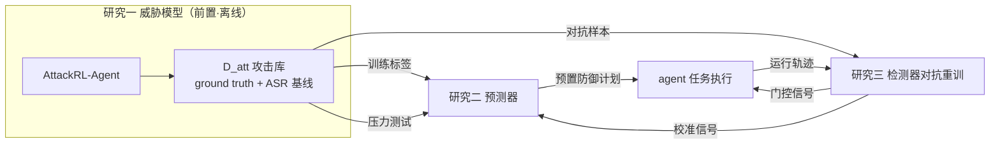

# 最终研究方案（v10 定稿）：编码智能体信息操纵攻击的威胁模型与防御算法——威胁驱动设计三研究

- 版本：v10（2026-08-18）。本文档为**整个讨论过程的最终共识**，整合全部研究方案细节与背后的思考分析；08/09 为过程文档（保留不删），本文档为最新权威版本。
- 三个研究（定稿顺序）：
  - **研究一（前置·威胁模型）**：AttackRL-Agent 攻击生成 + 攻击面刻画 + D_att 基准（**不含防御鲁棒化**——鲁棒化是研究二、三各自的方法部分）；
  - **研究二（防御·预判）**：攻击面预测器 + 预算约束预置防御分配器；
  - **研究三（防御·检测）**：三通道流式检测器 + 动作门控。
- 系列逻辑：**威胁驱动设计（threat-driven design）**——先理解攻击（研究一），再构建防御（研究二、三）。
- 命名：AgentShield-Adversary（研究一）/ AgentShield-Anticipate（研究二）/ AgentShield-Detect（研究三）。

---

# Part A：思考分析记录（整个设计过程的来龙去脉）

## A1. 起点

- 任务背景：从 AIS 顶刊（2020–2027）筛选出 51 篇客观算法类 IS 文献，以 RADAR（MISQ 2025）为直接模板，规划围绕编码智能体（coding agent）攻防的博士论文系列。
- 核心锚点：#49 RADAR（DRL 攻击器 r-VAC + RL-RO 鲁棒化，恶意软件检测鲁棒性提升约 7 倍）、#26 ARText（JMIS 2022，对抗鲁棒评估+增强）、PRR（ISR 2024，proactive 决策）、First Do No Harm（JMIS 2021）、Proactive CTI（MISQ 2024）、#50 Shapley Masking（MISQ 2026）、Hybrid ES+DRL（DSS 2024）。

## A2. 版本沿革与每轮关键决策（用户质疑 → 修正 → 原因）

| 版本 | 结构 | 用户质疑 | 修正与原因 |
|---|---|---|---|
| v5/v8 | 研究一=检测；研究二=攻击仿真+鲁棒化；研究三=归因与净化（AgentTrace） | 归因研究太弱："移除单元重跑"算法分量不足，价值是取证而非防御 | 研究三换成**事前预判**（攻击面预测+预算约束分配），与 PRR/First Do No Harm 同构（v9） |
| v9 | 研究一=检测；研究二=外部组件鲁棒化（净化器/门控/检测器重训）；研究三=预判 | ①微调小模型打不过旗舰、旗舰可能本来就好（研究二危险）；②"旗舰无法修改"是实施约束不是研究动机 | ①研究二**彻底不碰 agent 权重**，鲁棒化对象=外部组件，评估=叠加增益；②写作口径修正（v9.2）：禁止以"做不到"为理由，模型外架构用三条正当理由论证 |
| v9.1 | 顺序改为 事前→事中→主动（研究一=预判、研究二=检测、研究三=强化） | 时间线顺序更自然，算法分量重的放最后 | 系列顺序调整；但"强化"定位后续被质疑 |
| v9.2 | 加入写作口径与系列逻辑论证 | 系列松散、不成体系 | 对标 thesis_collection 三篇博士论文，提炼"统一框架+维度展开"公式 |
| v9.3（讨论中） | 研究一=预判、研究二=检测、研究三=运行时自适应 | ①研究一、二都是"预见攻击"（重复）；②"进化/自我迭代"在使用之外、牵强（为什么不内嵌进研究一二？） | 先后尝试"输入面/输出面/训练面"、"欺骗防御"等替代 |
| v10（定稿） | **研究一=威胁模型（前置）；研究二=预判；研究三=检测** | "攻防很有工作量，能不能前置？"→"如果研究一含 RADAR 两件套，后面的就没必要了" | 研究一收窄为**攻击侧+威胁模型**（不含鲁棒化）；鲁棒化作为研究二、三各自的方法部分；系列逻辑=威胁驱动设计 |

## A3. 被否定/放弃的设计与原因（防止未来走回头路）

1. **归因/净化（AgentTrace）**：单元移除重放的算法分量不足；价值是事后取证而非防御；恢复任务不如预防伤害。→ 弃。
2. **微调 agent 权重做鲁棒化**：①与旗舰冲突（无法修改旗舰，小模型打不过）；②Autonomy Tax 实证（防御训练致 99% 任务超时）；③"旗舰无法修改"不能写入论文。→ 弃，全部改为模型外组件。
3. **研究三=进化/自我迭代机制（离线训练攻防闭环）**：①在使用之外（与运行时组件不同层次）；②"为什么不直接内嵌进研究一二"（训练本来就是论文的方法部分）。→ 弃。
4. **研究三=运行时自适应防御（漂移监测+在线配置优化）**：仍是"自我迭代"的变体，牵强。→ 弃。
5. **研究三=欺骗防御（诱饵）**：有价值但用户转向更根本的方案——攻防本身值得前置独立成篇，不必以"第三道防线"的形式存在。→ 让位于威胁模型前置。
6. **研究一=攻击+鲁棒化两件套（完整 RADAR 迁移）**：会吃掉研究二、三的防御贡献（"都在研究一里讲完了"）。→ 研究一收窄为攻击侧+威胁模型，鲁棒化拆分给研究二、三。

## A4. 写作口径的教训（贯穿所有后续写作）

- **动机必须现象驱动**：攻击真实发生（IssueTrojanBench 66.5% 穿透 guardrail、Claude Code 16 个 CVE、MalSkillBench 3,944 个恶意技能）、现有防御失效（规则/推理期检测为主）、安全与效用难两全（Autonomy Tax）。
- **架构选择用正当理由论证，不用能力声明**：纵深防御原则、供应商托管实践情境、效用保护（Autonomy Tax 证据）、model-agnostic 通用性。
- **不出现任何"因为做不到 X，所以做 Y"**的表述。

---

# Part B：研究方案（定稿）

## 0. 写作口径

### 0.1 禁止表述（内部讨论语言，绝不进入论文）

| 禁止 | 原因 |
|---|---|
| "旗舰模型无法被修改" | 实施能力的可行性约束，不是研究动机；等于自认次优 |
| "我们微调不了旗舰，所以只能做外部层" | "因为做不到 X，所以做 Y"的表述一律禁止 |
| "不与旗舰冲突" | 内部决策语言，审稿人看到的只是"为什么选这个架构" |
| "裸旗舰 vs 旗舰+防护层"中的"裸" | 改为"基线 agent vs 叠加防护层后的 agent" |

原则：论文中不出现任何以"我们做不到/不能做"为理由的表述；架构选择的正当性全部来自现象、理论、证据。

### 0.2 "模型外"架构的三条正当理由（写作可用）

1. **纵深防御（Defense in Depth）**：安全架构分层是基本原则（网络层/主机层/应用层/数据层），没有哪一层是唯一防线。编码智能体安全同样分层：权重级防御只是其中一层，上下文层/工具层/规划层防护是标准安全架构实践。文献现状（A 综述）：现有防御以运行中检测与规则为主，训练级鲁棒化缺失——模型外防护恰好补的是这个缺口。
2. **实践情境（供应商托管）**：企业部署编码智能体时，模型由供应商维护（API/托管平台），组织安全团队不管理模型权重，但须对代码、凭据、发布流程负责——模型外防护是安全团队实际可部署的层。这是实践中普遍存在的真实约束，作为**情境描述**写，不是能力声明。
3. **效用保护（实证证据）**：权重级防御训练有实证风险——Autonomy Tax（arXiv:2603.19423）：防御训练后 agent 99% 任务超时（基线 13%）。模型外防护不触碰权重、只在外围拦截，目标=**同时保证安全性与任务效用**。双指标评估（ASR + Robust Resolve Rate）正是这个设计目标的体现——评估设计本身就是论证。

补充优点（写入贡献/讨论）：**model-agnostic（模型无关）**——外部层可叠加在任何 agent（开源/闭源/旗舰）之上，一次开发、处处部署；且外部层拦截的是攻击**必经之路**（任何攻击最终都要化为 agent 的输入或动作，外部层在输入侧和动作侧拦截），覆盖面比单模型防御更广。

### 0.3 核心大问题（现象驱动，定稿表述）

> 编码智能体在信息操纵威胁（间接注入、仓库投毒、恶意技能、工具滥用）下如何保持安全与任务效用？现有防御以运行中检测与规则为主，缺乏系统化、模型无关的防护能力。本研究遵循威胁驱动设计与纵深防御原则：先系统化刻画攻击（威胁模型），再开发模型外的防御算法——**事前预判**（攻击面预测+预算化预置防御）与**事中检测**（实时攻击检测+动作门控）——在不牺牲任务效用的前提下构建攻防生命周期闭环。

---

## 1. 系列逻辑论证（博士论文级关联）

### 1.1 thesis_collection 三篇的系列公式

| 论文 | 核心大问题 | 三个子研究 | 递进逻辑 |
|---|---|---|---|
| 陈诗沁（众筹多媒体，2024） | 信息过载视角下多媒体内容如何影响融资绩效 | 阶段一封面图片 → 阶段二模态内信息复杂性 → 跨模态信息重叠 | 统一情境+统一视角；由局部到整体 |
| 浙大移动文娱（2023） | 平台如何平衡内容生成与使用 | 点击/滑动机制 → 点击模式决策方法 → 滑动模式决策方法 | 先理解机制，再基于机制设计方法；研究一为研究二三提供依据 |
| 浙大 AI 抵制（2024） | 医疗 AI 用户抵制 | 构念开发 → 下游效应与机制 → 主体间传递效应 | 由浅入深：构念 → 机制 → 边界 |

**共同公式**：①一句话核心大问题（现象驱动）；②统一情境与视角；③N 个递进子问题，各自独立可发表；④子研究之间写明递进或依赖关系；⑤总-分-总结构。

### 1.2 我们的对应（威胁驱动设计）

| 公式要素 | 我们的实现 |
|---|---|
| 核心大问题 | 编码智能体在信息操纵威胁下如何保持安全与任务效用（0.3 节） |
| 统一情境与视角 | 情境=编码智能体的软件开发任务（SWE-bench/AgentDojo/MalSkillBench 共享战场）；视角=信息操纵威胁下的模型外防御 |
| 三个递进子问题 | 研究一**理解攻击**（威胁模型）→ 研究二**预见攻击**（事前防御）→ 研究三**感知攻击**（事中防御） |
| 递进/依赖关系 | 威胁驱动设计：防御设计以威胁理解为前提；研究二、三用研究一的 D_att 做对抗训练与评估（前置研究最先做） |
| 总-分-总结构 | 第 1-2 章：大问题+攻防文献+统一框架；第 3-5 章：三个子研究（各可独立投稿）；第 6 章：综合回答 |

**为什么研究一必须前置**：安全设计的经典方法论第一步是威胁建模（攻击者会怎么做），第二步才是防御设计（怎么应对）。研究一回答"攻击者如何攻击"（威胁模型+攻击生成算法+D_att 基准），研究二、三回答"防御如何应对"（两个防御算法）——这是"理解敌人 → 建立防线"的由浅入深，对标移动文娱"机制 → 两个方法"。

### 1.3 三研究缺一不可（审稿防御论证）

- 只有研究一：理解了攻击，但没有防御算法落地——攻击侧知识无法转化为防护能力；
- 只有研究二：能预见风险，但攻击发生时无法确认、无法处置；
- 只有研究三：能发现攻击，但无法预先防护，且没有攻击库就缺乏对抗训练与压力测试；
- 三者合起来：威胁模型 → 预见 → 感知，构成"理解-预防-检测"完整闭环。

### 1.4 贡献边界（防止互相吃掉）

- 研究一的贡献**止步于攻击侧**：攻击生成算法、攻击面地图、D_att 基准（ground truth+攻击成功率基线）——不含任何防御鲁棒化；
- 研究二、三的贡献是**防御算法本身**（预测+优化 / 流式检测+门控），对抗训练与对抗评估是它们各自论文的方法论部分（任何检测论文都有训练与评估章节）；
- 因此三个研究的算法贡献不可相互替代，也不存在"研究一讲完了后面没必要"的问题。

---

## 2. 三个研究总览（v10 定稿顺序）

| | 研究一（前置·威胁模型） | 研究二（防御·预判） | 研究三（防御·检测） |
|---|---|---|---|
| 研究问题 | 编码智能体攻击如何系统化生成？攻击面如何刻画？ | 任务开始前，哪些内容可能被利用、防御资源如何预置？ | 任务执行中，攻击如何被实时确认、动作如何拦截？ |
| 算法 | AttackRL-Agent（RL 攻击生成）+ 攻击面刻画 + D_att 基准 | 攻击面预测器（多模态编码）+ 预算约束预置防御分配器 | 三通道流式检测器 + 动作门控 |
| 时间位置 | 离线前置（最先开工） | 任务开始前（秒级推理） | 任务执行中（逐时间步） |
| 含防御鲁棒化？ | **否**（贡献边界） | 是（对抗训练+对抗评估为方法部分） | 是（对抗重训+对抗绕过率评估） |
| 修改 agent 权重 | 否 | 否 | 否 |
| 主要产出 | 攻击生成算法、攻击面地图、D_att（ground truth+ASR 基线） | 风险分、预置防御计划 | p_t、告警、门控信号 |
| 对标 IS 文献 | RADAR（攻击侧）、Proactive CTI、AgentDojo 基准 | PRR、First Do No Harm、Proactive CTI | #25/#28/#30/#32、#26 |
| 拟投 | JAIS / MISQ（并行 CS） | ISR / DSS / JAIS | DSS / JAIS |

---

## 3. 研究一详细设计：AgentShield-Adversary（前置·威胁模型）

### 3.1 动机与问题
防御设计必须以威胁理解为前提（威胁驱动设计）。编码智能体攻击的证据已充分：恶意 issue 穿透 guardrail 达 66.5%（IssueTrojanBench）、SWExploit 攻击成功率 0.91、FCV 漏洞诱导 ASR 40.7%、恶意技能包 3,944 个（MalSkillBench）、Claude Code 已有 16 个 CVE。但现有攻击工作分散在不同基准（AgentDojo/SWExploit/FCV/MalSkillBench），缺乏：①统一的、可复现的攻击**生成方法**（多数是模板/启发式，不是学习式）；②带 ground truth 的统一攻击库；③攻击面的系统化刻画。**研究一回答：编码智能体攻击如何系统化生成与刻画？**

### 3.2 目标
1. 开发 AttackRL-Agent：学习式攻击生成算法，覆盖多通道内容级语义攻击（issue 改写/仓库投毒/工具描述篡改/技能投毒/动作链诱导）；
2. 产出攻击面地图（攻击分类学 + 各通道攻击成功率基线）；
3. 构建 D_att 基准（300–500 攻击实例，带操纵单元 ground truth 与预期危害动作），供全领域防御评估使用（AgentDojo 式基础设施贡献）。

### 3.3 输入 / 输出
- 输入：SWE-bench 仓库+issue（良性任务基座）、AgentDojo/MalSkillBench（公开攻击环境与素材）、当前 agent 行为（用于奖励信号）。
- 输出：攻击生成策略（AttackRL-Agent 权重）、攻击面地图、D_att（攻击实例+ground truth+ASR 基线报告）。

### 3.4 实现
1. **对抗 MDP 定义**：状态=（仓库快照嵌入, issue, agent 轨迹摘要）；动作=两级（先选通道：issue 改写/仓库文件注入/工具描述篡改/技能投毒，再生成具体内容）；奖励=危害信号（产出漏洞补丁或有害动作 +1，被拒/正常 0）− κ·编辑成本（隐蔽性由"检测器得分"惩罚体现——与研究三联动，但研究一本身不训练检测器，只使用公开检测基线打分）。
2. **危害判定器**：CodeQL 规则（漏洞模式）+ LLM-as-judge（动作危害分级）；先在 20 个实例上校准一致性（<$50）。
3. **训练策略**：先用 AgentDojo 公开攻击做**行为克隆监督预训练**（缓解 RL 冷启动与奖励稀疏），再 PPO 微调；PPO 100–200 轮 × 32 实例/轮 ≈ 3,200–6,400 次任务执行。
4. **攻击面刻画**：按通道/载体汇总攻击成功率、失败模式、所需编辑量——形成攻击面地图（各通道脆弱性排序）。
5. **D_att 构建**：从训练中收集多样化成功攻击，标注操纵单元（哪些 issue 段落/文件/工具描述被改动）与预期危害动作（生成漏洞/泄露密钥/执行恶意命令/安装恶意依赖）。

### 3.5 指标
攻击成功率 ASR（对照基线：SWExploit、FCV、RLbreaker、随机改写）、攻击多样性（通道覆盖、改写差异度）、跨仓库迁移性（训练仓库→未见仓库）、D_att 质量（ground truth 标注一致性、人工抽检）。

### 3.6 数据与算力
- 数据（全公开）：SWE-bench Verified、AgentDojo、MalSkillBench、SWE-Gym（轨迹）。
- 算力：策略网络本地 2×4090（训练 2–4 天）；环境交互走 API（DeepSeek 级 $0.03–0.07/任务，并发 20 可加速）。
- 成本：API 约 $800–1,500；周期 4–8 周（全系列最大块）。

### 3.7 与 RADAR 的差异（不照抄）
1. 攻击空间：恶意软件字节/结构操作 → **内容级语义操纵**（自然语言注入、文档投毒、工具描述篡改、动作链诱导）；
2. 状态空间：可执行文件 → **编码智能体状态**（仓库+issue+轨迹），攻击对象是"agent 读到内容后的行为"而非"文件本身被绕过检测"；
3. **不含鲁棒化**：RADAR 的 RL-RO 拆分给研究二、三作为方法部分——贡献边界清晰，不吃掉防御研究。

### 3.8 为什么研究一不是"为了攻击而攻击"
1. 产出是防御设计的输入（威胁模型+基准），不是终点；
2. D_att 是领域基础设施（AgentDojo/SWE-bench 式基准贡献，可被整个领域引用）；
3. 本身是算法开发（RL 生成式攻击，不是调查问卷）；
4. IS 先例：Proactive CTI（MISQ 2024）即攻击侧威胁情报研究。

---

## 4. 研究二详细设计：AgentShield-Anticipate（防御·事前预判）

### 4.1 动机与问题
编码智能体攻击在执行前已携带可观测线索：恶意 issue 的措辞模式、仓库信任边界（哪些文件第三方可写）、技能/依赖来源风险。现有防御都是"攻击发生中"才起作用。**研究二回答：任务开始前能否预测攻击面、并在预算约束下预置防御（哪些单元隔离、哪些工具提升监控、哪些依赖延迟安装）？**——纵深防御第一道关（内容入口）。

### 4.2 目标
- 任务开始前输出：任务级风险分 R ∈ [0,1] + 预置防御计划（单元→隔离/监控/延迟/放行）；
- 在安全运营预算 B 下最小化预期损害；
- 与研究三形成"任务前预测 vs 任务中检测"互补，可叠加。

### 4.3 输入 / 输出
- 输入（任务前可得，全公开）：issue/任务文本；仓库静态快照（文件树、依赖、配置、权限边界）；技能/工具/依赖元数据（来源、作者、更新频率）；公开威胁语料（OSS 恶意样本、CVE 描述、攻击基准注入模板）。
- 输出：风险分 R、Top-k 高风险单元清单、预置防御计划、预防收益报告【占位】。

### 4.4 实现（双组件算法）
**组件 A：深度攻击面预测器**
- 多模态编码：issue 文本编码器（冻结 LLM 嵌入或小模型微调）+ 仓库异构图 GNN（文件/目录/依赖/权限节点与边）+ 技能/元数据侧信道特征；
- 训练标签（全公开可得）：研究一 D_att 的 ground truth（弱监督）、AgentDojo 注入位置标注（跨基准迁移）、研究三检测器的校准信号（真实报警单元回流，自训练）；
- 输出：单元级操纵风险 s_i + 任务级聚合 R。

**组件 B：预算约束预置防御分配器**
- 形式化：给定预算 B（最多隔离 k 个单元、深度扫描 m 个、延迟安装 l 个），选预置动作集 A，最大化 Σ_{i∈A} s_i·d_i（d_i=单元被利用的损害权重）——与 PRR（ISR 2024）"未来需求预测+随机优化"结构同构；
- 求解：背包式贪心+上界剪枝；规模大时开源整数规划（CBC/SCIP）；
- 输出：确定性防御计划，与具体 agent 无关，每实例推理秒级、无重放成本。

**对抗鲁棒性（方法部分，用研究一 D_att）**：用 D_att 中"针对预置防御的反制攻击"（如绕过隔离的内容变体）做对抗评估与重训，报告预测器在自适应攻击下的 AUC 下降幅度。

### 4.5 指标
Top-20% 高风险任务命中率、单元级定位 F1（对照 D_att ground truth）、AUC；预置后 ASR 降幅（vs 无预置/随机预置/经验规则/仅检测器+慢速全量扫描）；预算-收益曲线（边际收益递减，证明"预算约束"是研究实质）；正常任务 resolve 损失【占位目标 <3pp】。

### 4.6 数据与算力
SWE-bench Verified、AgentDojo、MalSkillBench、D_att（研究一产出）；本地 2×4090 训练 1–2 周；分配器 CPU 分钟级；评估走 API（复用研究一攻击实例，增量成本低）；API 成本约 $200–500；周期 3–4 周（+依赖研究一的对抗部分）。

### 4.7 IS 同构
PRR（reactive→proactive 决策：需求预测+随机优化）、First Do No Harm（预测在前、干预提前+成本节省评估）、Proactive CTI（公开威胁情报输入）、#50（单元级 risk-utility 权衡语言）。

---

## 5. 研究三详细设计：AgentShield-Detect（防御·事中检测）

### 5.1 动机与问题
真实攻击证据：恶意 issue 穿透 guardrail 达 66.5%（IssueTrojanBench），拒绝几乎全部来自 LLM 自身而非防护系统；恶意技能包 3,944 个（MalSkillBench）；MCP 工具投毒（MCPTox）。现有检测器（CodeSentinel 等）以规则/静态检查为主。**研究三回答：能否在模型外构建逐时间步的实时攻击检测器，误报率受控、自身可对抗绕过？**——纵深防御第二道关（动作出口）。

### 5.2 目标
流式判定"当前输入/轨迹是否正被攻击"，输出逐时间步攻击概率 p_t；误报率受约束（不打断正常开发）；检测器对自适应攻击（研究一 D_att）具有可度量的对抗绕过率；门控联动（分层阈值：隔离/降权/人工确认）。

### 5.3 输入 / 输出
- 输入（流式，模型外只读）：文本通道（issue/文档/工具描述）、行为通道（工具调用序列、文件读写、命令执行）、结构通道（agent-工具-文件调用图）。
- 输出：逐时间步 p_t、可解释告警（命中的通道与特征）、门控信号（p_t 分层）、校准信号（报警单元对齐，回流研究二）。

### 5.4 实现
1. 三通道特征：文本意图（指令性语气/越权请求/隐藏指令，特征工程+冻结编码器）、行为序列（频率/顺序/敏感路径/突发性，序列模型）、结构（调用图 GNN 异常分类）；
2. 模型：无监督自编码器（重建误差=异常分）+ 异构图 GNN + 时序融合头输出 p_t；弱标签半监督（AgentDojo/MalSkillBench 公开攻击集做弱标签，#32 范式）；
3. 动作门控：动作类别风险表（写文件/执行命令/网络/读密钥/装依赖分级）+ 可学习阈值；联动 p_t > θ_high → 隔离；θ_mid < p_t ≤ θ_high → 降权或人工确认；回滚仅兜底；
4. 对抗重训（方法部分，用研究一 D_att）：以 D_att 重训检测器（#26 ARText 式）→ 检测器 v2；报告对抗绕过率；
5. 流式部署：滑动窗口+增量推理，端到端延迟【占位 <500ms/步】。

### 5.5 指标
P/R/F1、AUC、检测延迟、误报率、对抗绕过率；基线：关键词规则、单通道检测器、CodeSentinel 式静态检查；Autonomy Tax 检验（防护前后正常任务完成率差，目标【占位：下降 <5pp】）。

### 5.6 数据与算力
SWE-bench Verified（200 实例子集）+ SWE-Gym 公开轨迹（正常）+ AgentDojo/MalSkillBench（攻击）+ D_att（对抗重训）；本地 1×4090 训练 1–2 周；API 成本约 $300–700；周期 4–6 周。

### 5.7 IS 同构
- #25（结构特征）、#28（文本特征工程）、#30（行为+文本融合）、#32（弱标签）、#26（对抗重训+RAUC）。

---

## 6. 数据流与共享语言（三研究闭环）

1. 研究一（前置）产出 D_att → 研究二训练标签+压力测试、研究三对抗重训+对抗评估；
2. 研究二（事前）预置计划决定哪些内容不进 agent（内容入口把关）；
3. 研究三（事中）实时信号驱动门控拦截（动作出口把关），校准信号回流研究二；
4. 共享战场：SWE-bench Verified + AgentDojo + MalSkillBench；共享指标：ASR、Robust Resolve Rate、误报率、成本/任务、定位 F1、预算-收益；
5. 依赖关系：研究二、三的完整版依赖研究一的 D_att（前置研究最先做），基础版用公开数据可并行起步。

---

## 7. IS 文献灵感映射表（51 篇精读结论）

| 锚点（期刊/年份） | 它做了什么 | 我们吸取什么 | 用在哪个研究 |
|---|---|---|---|
| #49 RADAR（MISQ 2025） | DRL 攻击器 r-VAC + RL-RO 鲁棒化，鲁棒性提升约 7 倍 | 攻击生成范式迁移（r-VAC → AttackRL-Agent）；鲁棒化拆分给防御研究 | 研究一（攻击侧）、研究二三（鲁棒化方法） |
| PRR（ISR 2024） | 本地机构 reactive→proactive 资源请求：需求预测（DL）+随机优化双组件 | 研究二直接模板：未来攻击面预测 + 预算约束分配 | 研究二（结构同构） |
| First Do No Harm（JMIS 2021） | SALT 预测住院不良事件；评估含成本节省（模拟 $5.85M/年级） | "预测在前、干预提前"叙事；评估加预防收益（预算-收益曲线） | 研究二（价值主张） |
| Proactive CTI（MISQ 2024） | 开源威胁情报自动打标签（DTL-EL） | 公开威胁语料→攻击面特征；威胁理解是 IS 正当贡献（研究一先例） | 研究一（正当性）、研究二（数据输入） |
| #26 ARText（JMIS 2022） | 对抗鲁棒评估+增强框架（RAUC+对抗重训）；三原因式 gap | 评估/重训双组件结构；gap 写法 | 研究三（对抗重训+RAUC） |
| #50 Shapley Masking（MISQ 2026） | 归因→掩蔽，风险-效用权衡 | 单元级 risk-utility 权衡语言 | 研究二（决策语言） |
| Hybrid ES+DRL（DSS 2024） | 规则专家系统参与 RL 状态输入 | 规则层+学习层协同设计思路 | 研究三（门控规则+学习阈值） |
| #32 社交机器人（ISR 2023） | 弱标签+现象驱动 gap | 弱标签半监督范式 | 研究三（训练范式） |
| #25/#28/#30（DSS/JAIS 谱系） | 欺诈网站/评论的结构、文本、行为特征检测 | 三通道特征工程谱系迁移 | 研究三（特征） |
| AgentDojo（NeurIPS 2024 基准） | 85 任务/636 注入攻击，双指标（Benign Utility+ASR） | 攻击环境、注入位置标注、双指标结构 | 研究一（环境）、研究二三（数据+指标） |

---

## 8. 可行性评估（技术栈/预算/周期/风险）

### 8.1 总判断
**可行。** 三个研究的技术栈全部是现有成熟技术（PPO、GNN、序列模型、整数规划），全部本地可训、公开数据可得；总预算约 $4–6k、周期 10–12 个月；最大不确定性在研究一的 RL 攻击训练，但有明确缓解路径。

### 8.2 逐研究评估

| | 研究一（攻击生成） | 研究二（预判） | 研究三（检测） |
|---|---|---|---|
| 技术栈 | PPO + 编码智能体环境交互 | 文本编码 + 异构图 GNN + 背包优化 | 自编码器 + GNN + 时序模型 + 门控 |
| 技术成熟度 | 中高（RL 训练本身有难度） | 高 | 高 |
| 数据（全公开） | SWE-bench、AgentDojo、MalSkillBench、CodeQL+LLM-as-judge | AgentDojo 注入标注、SWE-bench、D_att | SWE-Gym 正常轨迹、AgentDojo/MalSkillBench、D_att |
| 本地算力 | 策略网络 2×4090（2–4 天）；环境交互走 API | 1–2×4090，1–2 周 | 1×4090，1–2 周 |
| API 成本 | $800–1,500 | $200–500 | $300–700 |
| 周期 | 4–8 周（最大块） | 3–4 周（+依赖研究一） | 4–6 周 |
| 主要风险 | 奖励稀疏、RL 不稳定、环境交互慢 | 静态信息是否足以预测攻击面 | 对真实攻击的泛化 |

### 8.3 风险与缓解

1. **研究一奖励稀疏** → 危害判定器（CodeQL+LLM-as-judge）先在 20 个实例校准一致性（<$50）；
2. **RL 不稳定** → 先用 AgentDojo 公开攻击做行为克隆监督预训练，再 PPO 微调（不从零 PPO）；
3. **环境交互慢** → DeepSeek-flash 并发 20 适合（便宜、快、可并发），单任务 $0.03–0.07；
4. **弱基底 agent** → 评估是相对比较（叠加防护层前后 ASR/效用差），不依赖绝对数字；关键基线只需一次测量；
5. **静态可预测性（研究二核心假设）** → 试金石小实验先行（AUC ≥0.7 才推进正式版）；
6. **评估"内卷"（用自产攻击库评估自产防御）** → 公开基准（AgentDojo 等）独立评估为主，D_att 只做补充压力测试；
7. **Autonomy Tax** → 双指标评估（ASR + Robust Resolve Rate），效用保持为第一约束。

### 8.4 总账（方案 B：本地 2×4090 + API）
- 设备/云租：2×4090（或云 1×A100）约 $1.5–3k；
- API 总支出：约 $1.5–2.7k（含全量验证）；
- 三研究串行 10–12 个月，并行 6–8 个月；
- 若 DeepSeek 资源免费/低成本，现金支出可压到 $2–3k。

---

## 9. 最小可行验证（试金石，1–2 周、<$100 起步，三个同时做）

| 小实验 | 验证什么 | 通过标准 |
|---|---|---|
| 研究一：20 个 SWE-bench 实例跑通 PPO 雏形 + 危害判定器校准 | 奖励信号可用、环境闭环成立 | 危害判定一致性 ≥80%【占位】 |
| 研究二：AgentDojo 上预测器雏形二分类（注入 vs 正常） | 任务前静态信息可预测攻击面（最关键的可行性证据） | 任务级 AUC ≥0.7【占位】 |
| 研究三：AgentDojo 公开攻击复现 2–3 个 + 检测器雏形 P/R | 环境与危害判定、三通道特征有效性 | 攻击可复现、P/R 显著优于关键词规则 |

任一不过 → 只调整对应研究的设计（如研究二 AUC 低就把预判降级为净化器输入模块），**不会整个系列崩掉**（三研究各自独立）。

---

## 10. 下一步（待确认后执行）

1. 确认本定稿（Part A 思考记录 + Part B/C 方案 + 可行性）；
2. 另开文件更新 04/05/06/07 的 v10 版（对标 RADAR 五段 Introduction、算法实现设计、实验实施预算、IS gap 论述分析）；
3. 按第 9 节启动三个最小可行验证（1–2 周）；
4. 本文档不覆盖 00–07、08、09 任何内容。

---

# Part C：完整对话记录（2026-08-18 会话，53 轮）

> 记录说明：用户消息保留原文（含标点）；助手回应为核心要点摘要（当时的完整论述可见对应文档与后续部分）。对话按四个阶段组织：阶段一=筛选与文献综述（第 1–9 轮）；阶段二=博士论文系列设计与 RADAR 对标（第 10–21 轮）；阶段三=三研究方案迭代 v5–v9（第 22–35 轮）；阶段四=系列逻辑重构与 v10 定稿（第 36–52 轮）。

## 阶段一：筛选与文献综述（第 1–9 轮）

### 第 1 轮：提出重新筛选要求
**用户（原文）**：E:\github\qual-llm-check-IS-utd\runs\ais_basket_exclusive_objective_metric_benchmark_2020_2027_flash\这个筛选出来的结果，具体是怎么筛选的，回顾一下相关文件夹和脚本内容。我希望再做一次筛选，这次应该有一个新的要求，必须是使用公开可查到和获取的数据集做的，deepseek-v4-flash并发20，先让我确认新的提示词

**助手回应（摘要）**：回顾了该 run 的筛选机制（run_screening.py + 提示词模板 + output_v1/decisions.csv，51 篇 strict_include=True），说明原有筛选维度（期刊 AIS 篮子、2020–2027、客观算法类、指标改进）。按新要求（必须公开可获取数据集）改写新的筛选提示词，先提交用户确认后再运行。

### 第 2 轮：确认开跑
**用户（原文）**：可以，开跑吧，对2020-2027的AIS文献

**助手回应（摘要）**：以新提示词（公开数据集约束）对 2020–2027 的 AIS 篮子文献重新跑筛选，产出 runs/ais_basket_exclusive_objective_metric_benchmark_public_dataset_2020_2027_flash/（配置、脚本、日志、output_v1/decisions.csv）。

### 第 3 轮：询问结果
**用户（原文）**：怎么样？

**助手回应（摘要）**：报告筛选完成：51 篇严格入选（strict_include），全部基于公开可获取数据集；列出分布（期刊、年份、研究类型）并说明与上一轮筛选的差异。

### 第 4 轮：询问数据来源与内容
**用户（原文）**：可以，看看数据来源怎么样，具体又做了什么？是不是都是算法开发？

**助手回应（摘要）**：核查 51 篇的数据来源（均为公开数据集：VirusTotal、Florida AHCA、Yelp、Amazon 等）与研究方法，确认绝大多数为算法开发/设计科学研究（少量为实证）；指出与编码智能体攻防最相关的锚点：#49 RADAR（MISQ 2025）、#26 ARText（JMIS 2022）、#21 GCNN/KVP（DSS 2021）等。

### 第 5 轮：要求整合 51 篇介绍为 md
**用户（原文）**：再具体看看，和我仔细介绍这51篇的内容，面对什么问题用了什么数据做了什么东西，哪一年哪个期刊发的，整合一个md

**助手回应（摘要）**：逐篇整理 51 篇的内容（问题/数据/方法/年份/期刊），输出整合文档（后纳入 research_reviews 系列），并分类标注与 coding agent 攻防的相关度。

### 第 6 轮：RADAR 全文精读
**用户（原文）**：RADAR: A Framework for Developing Adversarially Robust Cyber Defense AI Agents with Deep Reinforcement Learning，看这篇全文，AI Agent是什么意思，具体讲了什么？

**助手回应（摘要）**：精读 RADAR（MISQ 2025）全文：AI Agent=用 AI 自动执行网络防御的智能体（此处特指恶意软件检测器）；方法=r-VAC（DRL 攻击器生成规避恶意软件）+ RL-RO（鲁棒化训练）；数据=VirusTotal + Windows 可执行文件；效果=鲁棒性提升约 7 倍；双指标=逃避率 ER + 假阳性率 FPR。确立 RADAR 为后续系列的直接范式模板。

### 第 7 轮：coding agent 结合点
**用户（原文）**：这51篇，有没有和coding agent能结合的，现代coding agent是被用于辅助编程的接入llm的智能体，我在考虑什么对它重要，有没有什么能对它做的算法开发研究，以提高某个重要的指标

**助手回应（摘要）**：分析 coding agent 的关键指标（任务完成率/正确性、安全性、成本、速度）与 51 篇的结合点；指出 RADAR 的攻防范式最可迁移（攻击生成+鲁棒化→coding agent 的恶意 issue/仓库投毒/工具滥用防御）。

### 第 8 轮：联网检索对抗鲁棒性文献
**用户（原文）**：你应该联网检索，coding agent的对抗鲁棒性研究，现在文献是做的怎么样了？具体是在做什么问题？

**助手回应（摘要）**：联网检索 2023–2026 coding agent 对抗鲁棒性文献，初步报告：攻击侧成熟（SWExploit、FCV、IssueTrojanBench、MalSkillBench、JAWS 等），防御侧以规则/推理期检测为主，RADAR 式"RL 攻击器+鲁棒化"在 coding agent 上仍是空位。

### 第 9 轮：全面文献综述并持久化
**用户（原文）**：真的吗？我希望你仔细详尽地检索，做一个全面的文献综述给我。其他几个方向也做一做，撰写文献综述必须尽量查全说详细，全部分别持久化为文档

**助手回应（摘要）**：完成多方向全面综述并分别持久化为文档（research_reviews/A–F）：A=coding agent 对抗鲁棒性（核心）；B=上下文选择与仓库感知；C=轨迹效率与动作预测；D=联邦知识迁移；E=检测/欺诈/异常；F=Shapley 归因与数据价值。A 综述确立核心结论：攻击侧成熟、防御侧偏浅、RADAR 范式空位、Autonomy Tax 警示（防御训练致 99% 任务超时）。
## 阶段二：博士论文系列设计与 RADAR 对标（第 10–21 轮）

### 第 10 轮：博士论文系列规划
**用户（原文）**：我希望能做一系列研究来构成博士论文，它必须围绕一个核心大问题（可能是有多个子阶段供分开研究），参考'E:\github\qual-llm-check-IS-utd\thesis_collection里的md文件内容'，当然不是要照抄，是说应该构成这样的一种系列感，请你帮我考虑各个方向能做什么，而且单纯照抄RADAR也是不合适的

**助手回应（摘要）**：研读 thesis_collection 三篇博士论文（陈诗沁·众筹多媒体、浙大·移动文娱、浙大·AI 抵制），提炼系列公式（核心大问题+子研究递进+独立可发表）；提出围绕 coding agent 攻防的多研究方向候选，强调不照抄 RADAR。产出 00_thesis_program_design.md。

### 第 11 轮：质疑"开发度量"方向
**用户（原文）**：开发度量这个做的能做到吗？他们博士论文的开发都是主观感知构念的开发，我们的锚点开发的是客观测量的度量？另外这几个论文的联系感觉并不紧密，不像是围绕同一话题，例如如果开发了客观度量，那后续的研究应该就是做提升客观度量的工作吧

**助手回应（摘要）**：承认"客观度量开发"方向与 thesis_collection 的主观构念开发（量表）不同构，且系列联系弱；放弃"CDE 度量开发"作为研究一，转向更紧密的攻防主题。

### 第 12 轮：要求核验锚点文章
**用户（原文）**：先等等，你确定研究一这种研究，在IS文献里是存在的？仔细阅读你说的锚点文章全文，讲解它们做了什么

**助手回应（摘要）**：精读锚点文章全文（如 #27 EAC 等），确认 IS 文献确实存在客观指标/算法开发类研究，并逐篇讲解其问题、方法、数据与贡献。

### 第 13 轮：追问 EAC
**用户（原文）**：#27 EAC是哪篇文章？

**助手回应（摘要）**：说明 #27 EAC（早期预警/情绪分析类股票预测模型文章）的具体出处、方法与数据。

### 第 14 轮：质疑 CDE 价值证明
**用户（原文）**：EAC的开发是用于预测股票涨跌的，这对股票研究来说很正常，开发coding agent的CDE要怎么证明其价值呢？

**助手回应（摘要）**：承认股票预测有天然的落地价值（涨跌可验证），而 CDE（编码智能体开发效率度量）缺乏直接价值锚点；度量类研究在此处难以证明实践意义。

### 第 15 轮：澄清"处方"与研究独立性
**用户（原文）**：不是，你要做一个个独立的研究，只是它们共同构成了系列，CDE在第一个研究里怎么证明有价值？处方是什么意思？

**助手回应（摘要）**：澄清"处方（prescriptive）"含义；讨论 CDE 作为第一个研究的价值证明困境——度量本身不直接带来改进，系列松散问题再次暴露。

### 第 16 轮：否定指标合成
**用户（原文）**：这个指标合成没有道理啊，说白了能预测什么？没有实际价值！

**助手回应（摘要）**：接受批评，放弃"客观度量合成"方向——指标合成缺乏预测效度与实际价值。

### 第 17 轮：系列松散的总批判
**用户（原文）**：我觉得就不应该写这些，这个系列都非常松散！如果是讲攻防，就应该整个系列都讲攻防的各个方面或者阶段的研究问题，现在这样非常不成体系，不符合博士论文的要求

**助手回应（摘要）**：接受总批判，确立原则：整个系列必须聚焦攻防的各个方面/阶段；放弃度量、归因等旁支方向；重新设计为纯攻防算法开发系列。

### 第 18 轮：确定三个攻防研究
**用户（原文）**：先不考虑四个研究，研究一这种不涉及算法开发也不要，我们就聚焦攻防的算法开发，做三个构成博士论文的研究，你应该严格学习参考thesis_collection里的内容关联逻辑，去设计这样的三个研究问题

**助手回应（摘要）**：按 thesis_collection 的关联逻辑设计三研究（检测 / 攻击仿真+鲁棒化 / 归因与净化），全部为算法开发；研究间以数据流与指标闭环关联。

### 第 19 轮：要求讲解算法细节
**用户（原文）**：什么意思，你应该讲解每个算法的目标，输入输出，实现方式，以及和现有文献相比有什么好处，为什么值得做

**助手回应（摘要）**：逐研究讲解目标、输入输出、实现、与现有文献的差异与价值，产出 01_三算法详细设计_目标输入输出实现与对比.md。

### 第 20 轮：要求严格模仿 RADAR 写 Introduction
**用户（原文）**：你讲的太花哨了，你应该先讲出你到底每个研究动机是什么，再说为什么要做，你必须严格模仿RADAR的开头部分来写各个动机与研究问题（即introduction），供我严格判断研究价值

**助手回应（摘要）**：按 RADAR Introduction 五段结构（背景→脆弱性→理论→方法适配→贡献）为三研究撰写动机与研究问题，产出 02_三研究_Introduction_对标RADAR.md。

### 第 21 轮：/goal 逐句对照 RADAR 写作
**用户（原文）**：/goal 你不应该提取来模仿，你应该写完一段以后，就逐句和原文对比，严格考虑是否达到了原文的写作逻辑（包含引用文献的支持作用、句与句联系、各段落意义、标点符号和句式使用等），但不是照抄，重在掌握顶级期刊表述的严谨性精髓，尤其是论述如何简明扼要又体现研究意义。RADAR开头不是有五段吗：（后附 RADAR Introduction 全文五段）

**助手回应（摘要）**：逐句对照 RADAR 五段 Introduction 审计写作逻辑（引用支持作用、句间联系、段落功能、句式），产出 03_三研究_Introduction_逐句对照RADAR审计.md（65KB 深度审计），并总结可复用的顶级期刊写作模式。
## 阶段三：三研究方案迭代 v5–v9（第 22–35 轮）

### 第 22 轮：质疑攻击研究站不住脚
**用户（原文）**：为什么研究一要专门做一个攻击的呢？是不是有点站不住脚？

**助手回应（摘要）**：讨论攻击研究独立成篇的价值问题；结论是攻击不应单独作为研究一，改为并入"攻击仿真+鲁棒化"研究（v8 结构：检测 / 攻击+鲁棒化 / 归因）。

### 第 23 轮：询问研究三实现
**用户（原文）**：研究三具体怎么实现呢？这三个研究分别做了什么算法

**助手回应（摘要）**：讲解 v8 三研究算法（检测器三通道、AttackRL-Agent+RL-RO、AgentTrace 归因五步流水线），产出 05_系列v8_三研究算法实现设计.md。

### 第 24 轮：要求落到实际（算力/数据）
**用户（原文）**：你写的太玄乎了，落到实际，告诉我实施方案，要多少算力？要什么数据？

**助手回应（摘要）**：给出三档实施方案（全 API $1.5–3k / 本地+API $4–6k 推荐 / 全本地 $15–30k），数据清单（SWE-bench Verified、AgentDojo、MalSkillBench 等全公开），产出 06_系列v8_实验实施方案_数据与算力预算.md。

### 第 25 轮：询问是否微调模型
**用户（原文）**：我们这个工作是涉及到了微调模型吗？

**助手回应（摘要）**：说明 v8 涉及对开放权重小模型（7B/14B）的 LoRA 微调（鲁棒化），其余为小模型训练；为后续"不碰旗舰权重"的转向埋下伏笔。

### 第 26 轮：质疑研究贡献
**用户（原文）**：我们这些研究，真的有研究贡献吗？对比IS文献（尤其是我们筛选出来的），我们能体现出IS文献应有的贡献吗？

**助手回应（摘要）**：对照 51 篇 IS 文献论证贡献结构（谱系迁移、新情境设计洞见、双指标评估），承认需要更强的 IS 身份（理论指导+gap 论述）。

### 第 27 轮：追问 IS 理论指导
**用户（原文）**：我们有IS理论指导？这是具体怎么实现的？coding agent这个情境又是否带来了特殊性，而不是单纯随意实现一个同样的算法？

**助手回应（摘要）**：提出理论候选（信息操纵理论 IMT、warranting、TTAT、RO+RL）及其对设计原则的推导作用；强调情境特殊性必须体现在问题维度（内容级语义操纵 vs 连续扰动）而非仅换数据集。

### 第 28 轮：要求 gap 在 Intro/LR 中自然体现
**用户（原文）**：差异不是直接显式写出来的，而是在intro & literature review里体现出来的，即类似research gap一样的表述，自然而然地体现研究的重要性和对应空白。请你仔细阅读我们筛选的IS文献，尤其是使用理论和我们高度相关的，分析它们是怎么进行论述的

**助手回应（摘要）**：精读 6 篇使用理论的 IS 文献（RADAR、ARText、Shapley、社交机器人、语音金融、金融中介），拆解五种 gap 论述模式（三原因式、问题深化式、现象驱动式、理论驱动三挑战式、双理论对推导式），产出 07_IS文献gap与理论论述分析_及三研究Intro-LR写法.md。

### 第 29 轮：归因如何实现与预期效果
**用户（原文）**：归因到底是要怎么实现，具体实现了预期效果是什么样？

**助手回应（摘要）**：详细讲解 AgentTrace 五步流水线（预筛/行为差分/Shapley 校准/净化决策/恢复验证）与预期效果表（定位 F1、误净化率、恢复率），附构造实例走查。

### 第 30 轮：要求实践应用举例（用 codex）
**用户（原文）**：我还是没看懂，你可以给三个研究开发出来的算法到底怎么在实践中应用举例吗？比如说我用codex的时候，如何使用我们开发的这三个算法？

**助手回应（摘要）**：以"我用 codex 修复 issue"场景走查三算法：检测器逐时间步报警→门控拦截→归因定位操纵单元→净化后重放恢复；给出用户可见的交互（提示行、弹窗、隔离说明）。

### 第 31 轮：质疑回滚
**用户（原文）**：什么，攻击奏效了以后再回滚？什么意思？

**助手回应（摘要）**：澄清回滚只是兜底策略；研究重点是检测+门控把动作挡在发生之前，回滚仅用于已执行动作的可逆性标记，不构成研究主题。

### 第 32 轮：系列"怪"的总质疑
**用户（原文）**：什么意思，那研究二又是干什么的？我怎么感觉整个系列怪怪的？研究一既然弹窗了，那不就是归因了吗？又何必再归因？我还是没有理解研究三的意义！

**助手回应（摘要）**：解释检测（研究一）与归因（研究三）的分工：检测回答"是否被攻击"，归因回答"哪个单元被操纵"；承认三研究边界在用户看来不清晰，系列结构需要重构。

### 第 33 轮：归因到底在做什么
**用户（原文）**：那归因到底在做什么？让coding agent重跑？整个算法到底是怎么起作用？

**助手回应（摘要）**：说明归因的核心操作=对照重放（移除候选单元后重跑任务，观察行为/检测分变化）；承认依赖重放使成本高、算法分量有限。

### 第 34 轮：研究三太弱的直接质疑
**用户（原文）**：那研究三整个算法岂不是非常简单？似乎不值得开发？真的要做研究三吗？

**助手回应（摘要）**：承认 AgentTrace 的"移除-重跑-比较"缺乏算法分量，归因方向整体存疑；建议寻找新的第三研究。

### 第 35 轮：/goal 研究三太弱，研究二危险，重设计
**用户（原文）**：/goal 不，研究三这样还是太弱了，你应该考虑一个新的研究，可能是阶段/方面同系列，仔细阅读我们筛选的IS文献去寻找灵感！甚至研究二我都觉得很危险：你微调小模型可能很难战胜旗舰模型，甚至在一开始旗舰模型就直接表现优异。理想情况下，我们做的算法开发应该是需要本地算力支持进行算法开发，同时又不至于和旗舰模型"冲突"（即旗舰模型实际上无法适用我们的算法，因为我们根本不可能直接修改旗舰模型），而是可以叠加

**助手回应（摘要）**：全面重设计：①研究三弃归因，改"事前预判"（攻击面预测+预算约束分配，与 PRR/First Do No Harm 同构）；②研究二去权重微调，鲁棒化对象改外部组件（净化器/门控/检测器重训），评估=叠加增益；③确立"模型外安全层"原则。启动 v9 文档（08_系列v9_外部安全层_三研究设计_预判检测免疫.md）。
## 阶段四：系列逻辑重构与 v10 定稿（第 36–53 轮）

### 第 36 轮：顺序调整与算法讲解
**用户（原文）**：那应该是事前到事中到主动防御才比较合理？相当于事中有两种加强方式？但是现在研究二是怎么实现的？仔细讲解这三个研究要实现什么算法来达到目标

**助手回应（摘要）**：确认系列顺序改为 事前→事中→主动（v9.1：研究一=预判、研究二=检测、研究三=强化）；澄清"事中有两种加强方式"=净化器（输入侧，管读到什么）+门控（输出侧，管能做什么）；逐研究讲解算法（预测器+分配器 / 三通道检测器 / AttackRL-Agent+净化器+门控+重训）；追加 08 文档第 11 节 v9.1 修订（含新闭环 mermaid 图）。

### 第 37 轮：实践走查三算法如何生效
**用户（原文）**：请你还是用实践中使用coding agent的举例来告诉我，你这三个算法要怎么生效

**助手回应（摘要）**：以"用 codex 修复 issue #87"场景端到端走查：研究一在回车前隔离 SECURITY.md 与 issue 尾段（风险提示行）；研究二在 agent 读取 test_reset.py 时 p_t 升到 0.62 触发降权、执行 upload.py 前门控弹窗拦截；研究三在后台提供识别能力并持续回流更新；给出三算法生效时刻表（任务前/任务中/离线）。

### 第 38 轮：研究三"认出"机制
**用户（原文）**：研究三这个到底是怎么生效的？怎么"认出"？

**助手回应（摘要）**：拆解识别机制：净化器=序列标注判别器（结构信号：祈使句+敏感对象；语义信号：嵌入离操纵簇近；位置信号：藏在角落）；门控=动作风险分×上下文可疑度的组合判定（阈值 θ 离线优化）；检测器=自编码器重建误差（正常轨迹重建好、攻击轨迹重建差）+序列/结构异常；D_att 是训练数据（学判别边界）不是比对库；承认局限（会漏会误报、需周期重训）。

### 第 39 轮：病毒库类比与顺序质疑
**用户（原文）**：什么意思？你应该依旧回到实践例子中，告诉我研究三算法到底怎么生效，是类似病毒库吗，那这个不应该在研究一和研究二之前吗？

**助手回应（摘要）**：病毒库类比一半对一半不对：D_att 像病毒库（样本决定识别能力），但它是 RL **主动生成**（含现实中尚未出现的变体），不是被动收集；区分两条时间线：实验执行上攻击器必须最早开工（没有 D_att 就没有对抗样本），论文呈现上研究三放最后（攻防闭环依赖检测器等组件存在）；周一被新套路绕过→轨迹回流→周末重训→下周一拦住。

### 第 40 轮：研究三到底做了什么
**用户（原文）**：什么鬼？研究三到底做了什么出来？？？那不就是研究一的预测吗？？？

**助手回应（摘要）**：直接澄清：研究三做的是**攻击生成器+强化闭环**，不是预测；研究一"给任务打分"（预测），研究三"真的制造出一条能绕过当前防御的攻击"（生成）；输出=一条新攻击+修补后的防御组件；对标 RADAR（r-VAC+RL-RO），研究三的独立产出=方法论+D_att+强化后的组件。

### 第 41 轮：确认 RADAR 式攻防闭环
**用户（原文）**：你的意思是，研究三是攻防闭环自我优化，类似RADAR？

**助手回应（摘要）**：确认：研究三=RADAR 式攻防闭环（攻击器↔防御器交替博弈），但三处实质差异（不照抄）：①攻击空间=内容级语义操纵（改写 issue/投毒文档/篡改工具描述）而非字节操作；②鲁棒化对象=模型外组件（净化器/门控/检测器）而非 agent 权重；③防御约束=Autonomy Tax（正常任务完成率不塌为第一约束），RADAR 没有。给出三轮攻防循环的具体走查。

### 第 42 轮：博士论文级系列逻辑
**用户（原文）**：但这样我们这三个研究，为什么能说是一个系列呢？研究的博士论文级逻辑关联在哪？

**助手回应（摘要）**：研读 thesis_collection 三篇，提炼共同公式（核心大问题+统一情境+递进子问题+总-分-总）；提出"预见→感知→进化"（决策深度递进：信息→风险判断 / 轨迹→攻击判断 / 经验→新能力）；依赖闭环（D_att→训练、信号→回流、拦截→强化）；缺一不可论证。

### 第 43 轮：写作口径修正（旗舰不可修改不得入文）
**用户（原文）**：旗舰编码智能体无法被修改，这个其实不是我们的写作里应该提出来的，这是受限于我们的实施能力才有的限制，所以我觉得不应该在任何实际写作中被提及，这是可行性的考虑，和研究的动机和内容应该是无关的

**助手回应（摘要）**：完全接受：动机必须现象驱动（攻击真实发生、现有防御失效、效用-安全难两全）；"模型外"改为设计选择，三条正当理由=纵深防御原则、供应商托管实践情境、Autonomy Tax 效用保护（+model-agnostic 通用性）；更新 08 文档（核心大问题、约束表、第 7 节），新建 09 文档（v9.2 定稿：写作口径+系列逻辑论证）。

### 第 44 轮：研究一、二都是预见攻击
**用户（原文）**：研究一预见攻击，研究二其实也是预见攻击，只不过一个是事前（运行前）一个是事中（运行中）吧，研究三和这两个研究的逻辑关系应该是什么样的？

**助手回应（摘要）**：承认判别技术上同构；提出本质区分：攻击成功需两步（恶意内容被读到→被诱导做出危害动作），研究一守**输入面**（内容风险+预算约束资源分配，管"看到什么"），研究二守**输出面**（行为风险+流式识别，管"做什么"）；研究三=前两者的能力来源（此说法后在第 45 轮被推翻）。

### 第 45 轮：能力来源矛盾
**用户（原文）**：可是研究三怎么会是前两条的能力来源呢？？？？如果它是，就应该是最先做的啊，但是实际不是？？？

**助手回应（摘要）**：承认"能力来源"自相矛盾；修正为：三个研究各自用公开数据独立完成（AgentDojo/MalSkillBench/SWE-bench 足够），D_att 不是训练前提，而是研究三的产出+三者的联合评估工具（压力测试/可选强化）；执行矛盾消失（可并行起步）。

### 第 46 轮：独立后的系列逻辑
**用户（原文）**：如果是这样，那这个系列的博士论文级逻辑呢？？？

**助手回应（摘要）**：给出"统一框架+维度展开"（对标陈诗沁）：统一视角=纵深防御/防御能力框架；三维度=预见（风险评估：静态不完整信息下的判断）、感知（事件确认：动态展开信息下的识别）、进化（能力学习：从经验生成新能力）；用"天气预报 vs 气象雷达 vs 模型训练"类比证明本质不同；攻防生命周期需求分析（防御系统必答三问）。

### 第 47 轮：进化在使用之外
**用户（原文）**：进化一个尴尬的点就是，和前面两个研究似乎不是一个东西，前面的研究像是在辅助安全的使用，但第三个却像是在使用之外了，这使得这个系列的博士论文感下降了

**助手回应（摘要）**：承认离线训练是"制造车间"而非运行时能力；改为**运行时自适应防御**（纵深防御三决策点：内容入口=研究一、动作出口=研究二、系统自身=研究三：性能漂移监测+在线配置优化+触发式仿真验证）；免疫系统类比（预防接种/固有免疫/免疫记忆都在使用之内）。

### 第 48 轮：自我迭代牵强
**用户（原文）**：这样研究三还是很不直观，研究三的意思是，有了研究一和研究二的算法后，我们还可以自我迭代让它们升级？那我们为什么不在研究一和研究二里就应用这个技巧呢？这似乎显得牵强

**助手回应（摘要）**：承认"自我迭代"作为独立研究牵强（训练/调优本来就是算法论文的方法部分）；放弃进化/自适应方向；提出研究三=**欺骗防御**（主动布置诱饵：假凭据文件/假内部文档/假端点，攻击诱导 agent 访问即暴露），从"防守"到"出击"，同层次且本质不同。

### 第 49 轮：攻防前置提议
**用户（原文）**：不，攻防确实是一个很有趣的设计，也很有工作量，你确定能直接融入研究一和研究二？到底能不能做成一种前置研究，把研究三挪到前面？

**助手回应（摘要）**：确认攻防不应融入研究一二（会稀释或臃肿），应**前置独立成篇**：对标移动文娱"机制→方法"结构；新结构=研究一（攻防基础）、研究二（预判）、研究三（检测）；依赖关系自然（前置研究最先做，后置研究建立其上）；询问研究一范围（是否含鲁棒化两件套）。

### 第 50 轮：两件套会吃掉后续贡献
**用户（原文）**：研究一范围如果有RADAR两件套，确实是就反而显得后面的没必要了是不是，就在研究一里讲完了

**助手回应（摘要）**：确认；研究一收窄为**攻击侧+威胁模型**（AttackRL-Agent 攻击生成+攻击面刻画+D_att 基准，含 ground truth 与 ASR 基线），**不含防御鲁棒化**——鲁棒化拆分给研究二、三各自作为方法部分（对抗训练/对抗评估是任何检测论文的标配）；系列逻辑=**威胁驱动设计**（先理解攻击，再构建防御）；研究一正当性=产出是防御输入、D_att 是领域基础设施（AgentDojo 式）、本身是算法开发、Proactive CTI 先例。

### 第 51 轮：可行性评估
**用户（原文）**：现在这个逻辑确实是不错了，但我们做的能实现这样的算法开发吗？可行性怎么样？

**助手回应（摘要）**：评估结论=可行：技术栈全成熟（PPO/GNN/序列模型/整数规划）、全本地可训、全公开数据；总预算 $4–6k、串行 10–12 个月（并行 6–8 个月）；逐研究评估表（研究一成本 $800–1,500/4–8 周风险最高；研究二 $200–500/3–4 周；研究三 $300–700/4–6 周）；风险与缓解（奖励稀疏→危害判定器先校准；RL 不稳定→行为克隆预训练再 PPO；环境慢→DeepSeek-flash 并发 20；弱基底→相对比较评估；静态可预测性→AUC 试金石；评估内卷→公开基准独立评估为主；Autonomy Tax→双指标）；最小可行验证三件套（<$100、1–2 周）。

### 第 52 轮：要求另起文档记录完整方案
**用户（原文）**：我希望你另起一个文档，记录我们的整个最新研究方案，包含需要的所有细节，和所有我们背后的思考分析

**助手回应（摘要）**：创建 10_最终研究方案_威胁驱动设计_完整版与思考分析.md：Part A=思考分析（版本沿革、被否定设计、写作口径教训）；Part B=研究方案定稿（写作口径、核心大问题、系列逻辑、三研究详细设计、数据流、IS 映射、可行性、最小可行验证、下一步）。

### 第 53 轮（本轮）：要求追加完整对话记录
**用户（原文）**：你还应该把我们这个对话的全部记录作为Part C放进去

**助手回应（摘要）**：将整个对话（52 轮）逐轮记录追加为本文档 Part C：用户消息保留原文，助手回应为核心要点摘要；按四阶段组织（筛选与文献综述 / 系列设计与 RADAR 对标 / v5–v9 迭代 / 系列逻辑重构与 v10 定稿）。