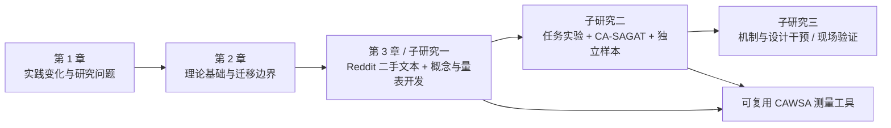

# 编码代理工作情境觉察的概念发展、量表开发与作用机制研究

## 第一至三章写作初稿

> **稿件状态。** 本文是 thesis 的前三章写作底稿，而非研究结果报告。文中关于既有研究、行业调查和理论的陈述均有来源；关于 Reddit 样本、编码结果、维度、量表、统计参数和因果关系的内容均使用“拟”“将”“待检验”等措辞，须待实证研究完成后改写。
>
> **章节模仿原则。** 章节顺序和论证功能模仿 Dong thesis 的“绪论 - 理论基础与分析 - 概念发展与量表开发”结构；第 3 章的二手文本编码、理论往返、量表开发和竞争模型检验设计，则具体借鉴 Chen et al. (2024) 的程序。本文不复制两篇文献的文字或既有结论。
>
> **暂定概念名。** “编码代理工作情境觉察”（coding-agent work-situation awareness, **CAWSA**）只是本研究启动时的工作名称。若 Reddit 编码显示其内涵、边界或名称不成立，概念名称与结构应随证据调整；唯一预先选定的理论出发点是 situation awareness（SA）。

---

## 摘要

能够检索代码库、编辑多个文件、调用终端与外部工具、运行测试并在较少实时指令下完成多步任务的 coding agent，正在改变软件开发中的信息系统使用方式。与传统 IDE、代码补全工具和问答式大语言模型不同，coding agent 不仅提供建议，还会持续生成并执行行动，由此改变代码库、测试环境和用户后续需要承担的判断责任。当前研究和产品讨论通常聚焦 agent 的能力、准确性、信任、透明性或生产率，却尚不足以刻画一个更基础的个体层面问题：在 agent 持续行动和代码状态变化时，用户是否准确把握了当前发生什么、这些变化对任务意味着什么，以及接下来可能出现什么风险。若这一认知状态不足，用户即使拥有审批或回滚权限，也可能陷入自动化研究所称的 out-of-the-loop 困境。

本论文以 Endsley 的 situation awareness 理论为唯一基础概念，拟发展“编码代理工作情境觉察”（CAWSA）。暂定地，CAWSA 指用户在一次具体 coding-agent 编程任务中，对由 agent 行动、代码库状态、工具执行结果、任务约束和后续行动风险共同构成的动态工作情境进行感知、理解和预测的程度。该构念是随任务片段变化的认知状态，而非用户对 agent 的一般信任、可控制感、技术能力、代码知识或界面评价。

论文采用顺序探索式混合研究设计。第一项子研究将分析公开 Reddit 讨论中的 coding-agent 实际使用叙述，通过双人开放编码、轴向编码和与 SA 理论的持续比较，识别构念的经验内涵及其与传统 SA 的匹配和偏离；随后依照规范的量表开发程序生成、修订和验证测量条目。为避免把“我觉得自己知道”误当作真实认知状态，量表验证将与基于任务真值的 coding-agent Situation Awareness Global Assessment Technique（CA-SAGAT）式探针配合使用。后续子研究将初步检验界面中的工作状态证据支持、任务自主性与不确定性、用户经验和任务复杂度如何影响 CAWSA，以及 CAWSA 如何关联审批准确性、及时接管、校准依赖、感知控制与任务结果。

本研究预期贡献在于：第一，将 SA 从传统动态控制环境严谨迁移到 agent-mediated coding work，界定其在编码代理监督情境中的对象、边界和可测量内容；第二，提供一个以真实用户叙述生成、以客观任务探针校准的个体层面构念和量表；第三，为 coding agent 的计划、diff、日志、测试、审批与通知设计提供可诊断的认知工程依据，而不把“更快完成代码”误作“更好的用户协作”。

**关键词：** coding agent；agentic IS artifact；situation awareness；人机协作；概念发展；量表开发；软件开发者体验

---

# 第 1 章 绪论

## 1.1 选题背景与问题提出

### 1.1.1 从 AI 编程工具到可行动的编码代理

生成式 AI 已进入软件开发者的日常工作流，但“使用 AI 写代码”并不是一个同质现象。早期的代码补全或问答工具主要在用户发起的局部交互中生成建议；用户逐行阅读、选择和整合建议，仍直接掌握编辑过程。coding agent 则将这一交互关系推进到另一层次：它可以检查仓库、搜索文档、制定或修订计划、跨文件编辑、执行命令与测试，并根据中间反馈继续行动。SWE-agent 的研究将这种能力概括为 agent 通过专门的 agent-computer interface 在真实软件环境中创建和编辑文件、导航仓库并运行程序的能力（Yang et al., 2024）。从信息系统理论看，这种 artifact 不再只是被动等待使用的工具，而具备在不确定条件下承接任务、发起后续行动并寻求结果的 agentic 属性（Baird & Maruping, 2021）。

实践扩散也说明应把注意力从一般 AI 工具转向 agent 化使用方式。Stack Overflow 2025 Developer Survey 显示，在报告于工作中使用 AI agents 的软件开发者中，83.5% 将软件工程列为其 agent 用途；约七成 agent 用户认可其减少特定开发任务耗时或提高生产率，但开发者对 agent 提供信息的准确性、数据安全与隐私、工作流整合和学习成本仍有显著担忧（Stack Overflow, 2025）。GitHub 对四国 2,000 名软件开发团队成员的调查也发现，受访者广泛试用 AI coding tools，并把理解既有代码库、生成测试和将时间腾挪给系统设计与协作视为重要收益；但该调查是厂商调查，因而只能作为现象的实践背景，而不应被解释为普遍因果效应（Daigle & GitHub Staff, 2024）。

因此，本研究所说的 coding agent 并不等同于所有带有 AI 的开发工具。它指的是：在一个或多个自然语言目标约束下，能够获取代码库与工具环境的信息、产生或修订多步行动、修改可执行的软件制品，并在执行过程中请求或接受人类监督的 AI 软件工程 agent。这个界定强调五项可观察特征：跨文件代码制品操作、工具或终端调用、多步与可延续行动、对中间环境反馈的响应，以及用户可以或需要进行的边界设定、审批、纠偏和接管。只有同时具备这些特征的使用片段，才属于本论文的研究情境。

### 1.1.2 新的效率承诺与新的监督困境

coding agent 的价值主张是替用户承担一部分检索、编辑、执行与验证工作。可是，自动化并不会简单地“拿走工作”。Parasuraman、Sheridan 和 Wickens（2000）指出，自动化会改变人类活动，并可能给操作者带来新的协调要求。对 coding agent 而言，用户从直接写每一行代码，转向定义任务边界、理解 agent 是否找对上下文、判断它的修改是否符合架构与安全约束、解读测试结果、批准或拒绝下一步行动，并在必要时接手。这不是较少的认知工作，而是不同类型且常常更间歇的认知工作。

这种变化具有直接的现实后果。agent 的动作可能规模很小，也可能跨越多个模块；一次“测试通过”可能只说明某个有限检查成功，而不能自动证明代码满足用户目标、架构约束、性能要求或安全边界。用户若只看到摘要、命令输出或长 diff 的局部片段，可能无法判断 agent 做了什么、为什么做、哪些约束仍未被满足，以及若允许它继续行动会影响何处。近期对 17 位经验开发者的软件 agent 监督访谈也初步发现，开发者需要在事前控制、共同规划、实时监控和事后审查之间切换，并会采用把测试结果当作正确性保证等“足够好”的监督启发式；作者特别指出审查 agent 生成代码本身的困难（Dhanorkar et al., 2026）。该研究仍是预印本和探索性证据，却准确显示了一个值得理论化的个体体验问题。

软件工程中并非从未讨论“了解工作状态”。例如，D’Avila et al.（2020）提出 SW-Context 以为维护人员提供代码与设计问题的上下文历史，从而支持开发者的 situational awareness；Nageria 和 Hall（2020）也把开发错误与开发过程中的情境觉察丧失联系起来。这些工作证明 SA 与软件开发并不陌生。但它们面对的主要是开发者理解代码与任务环境，而非一个会持续检索、编辑、执行并可能偏离用户意图的 agent。coding agent 使“正在行动的非人类协作方”本身成为用户必须了解的情境元素，也使用户的预测对象从环境变化扩展到 agent 的后续行动轨迹和由此可能扩散的代码影响。

### 1.1.3 现有概念不足与研究问题

现有研究可以用信任、可控性、透明性、认知负荷、可用性或接受意向解释 coding agent 使用的一部分现象，但这些概念不能彼此替代，也不能直接回答上述监督困境。信任描述用户愿意在脆弱性条件下依赖自动化的意愿；控制描述用户影响系统的权力或能力；透明性描述系统提供信息或可解释性的属性；认知负荷描述任务对认知资源的要求；可用性则是用户对完成目标效率、效果和满意度的评价。它们分别可以是 CAWSA 的前因、后果或并列变量，却都不直接测量用户此刻是否掌握了 agent-mediated coding situation。

经典 SA 理论提供了更合适的出发点。Endsley（1995a）将 SA 定义为人在动态环境中对相关元素的感知、对其意义的理解以及对其近期状态的预测。该理论强调 SA 是认知状态（state/product），而不是搜集信息、阅读日志或询问 agent 的过程（situation assessment）。更重要的是，自动化研究早已发现：操作者可能在自动化正常运转时逐渐脱离系统回路，以致自动化失效或情境突变时无法及时、有效地接管；这一问题与 SA 降低密切相关（Endsley & Kiris, 1995）。

然而，将 SA 的名称放在 coding agent 前面并不足以形成新构念。本研究必须回答三个更严格的问题。第一，coding agent 的动态“工作情境”究竟由哪些元素构成，哪些元素是传统 SA 定义或测量中没有具体处理的？第二，这些元素是否真的构成一个重要且具有区分效度的个体认知状态，而不只是信任、掌控感或界面透明性的换名？第三，如何开发能够描述用户主观体验、又不把自我感觉错当作客观认知准确性的测量工具？

据此，论文提出以下研究问题：

1. 在 coding-agent 编程任务中，用户需要形成何种工作情境觉察；其经验内涵、边界和结构是什么？
2. Situation awareness 的既有理论在 coding-agent 情境中哪些部分仍适用，哪些部分需要被具体化、扩展或重新操作化？
3. 如何开发并验证编码代理工作情境觉察的测量工具，并将“感知到的 CAWSA”与相对于任务真值的 CAWSA 区分开来？
4. 哪些设计和任务条件可能影响 CAWSA，CAWSA 又可能通过何种方式影响开发者的审批、接管、依赖和任务结果？

## 1.2 研究目的与研究意义

### 1.2.1 研究目的

本论文的总体目的不是证明 coding agent “好”或“不好”，也不是以生产率替代用户体验，而是发展一个能够解释人如何在 agent 代为行动时仍保持有效监督的个体层面构念。具体而言，论文拟完成四项相互衔接的工作。

第一，基于 SA 的经典定义，清楚界定 coding agent、工作情境、任务片段和用户角色的边界。第二，基于公开的 coding-agent 使用叙述，识别用户实际关心、跟踪、误解、预测和介入的对象，发展 CAWSA 的概念内涵。第三，遵循严格的量表开发程序，形成可复用的主观 CAWSA 测量，并通过 CA-SAGAT 式客观探针检验其与任务真值的关系。第四，提出并逐步检验“系统和任务条件 - CAWSA - 人机协作结果”的作用机制，为后续 coding-agent 设计提供可检验的理论命题。

### 1.2.2 理论意义

本研究的第一项理论意义，是将 agentic IS use 的讨论推进到用户监督时的动态认知状态。Baird 和 Maruping（2021）指出，agentic IS artifacts 要求重新审视传统 IS use 默认的人类主导假设，并将 delegation 作为关键过程。本研究进一步提出：在 delegation 发生以后，用户是否仍拥有足以进行判断和干预的工作情境觉察，是理解该关系质量不可忽视的中间层。它并不取代 delegation、信任或控制理论，而是解释这些变量为何在同样的授权安排下可能导致不同的监督结果。

第二，本研究以一个单一且成熟的基础概念开展情境化发展，避免把多个相邻概念拼接成一个难以辨识的“新词”。Jaeger 和 Eckhardt（2021）将 SA 迁移为 situational information security awareness，研究个体经验、警告设计和 phishing 情境线索如何影响觉察及后续安全行为；Nadj、Maedche 和 Schieder（2020）则用 SA 解释交互分析 dashboard 特征与任务表现的关系。这些研究说明 SA 可以在 IS 情境中被严谨具体化。coding agent 的贡献不在于否认 SA 的三层核心，而在于识别在“agent 行动 - 软件制品状态 - 工具结果 - 任务约束 - 未来风险”耦合系统中，何为用户必须觉察的相关元素及其特有的后果。

第三，本研究对 IS 构念开发提出方法上的增量。Chen et al.（2024）以大规模用户评论的开放、轴向和选择性编码开发语音交互可用性的维度，再与单一的合作原则理论反复比较并完成多轮量表验证。该路径特别适合尚缺乏稳定用户体验语言的新兴技术情境。本研究沿用“理论引导而不强迫编码”的逻辑：Reddit 文本不是 SA 的测量结果，而是发现用户如何描述其经验、哪些既有概念失配、以及新量表语言应该贴近何种任务事件的材料。随后再以独立量化样本和客观任务探针完成构念验证。

### 1.2.3 实践意义

实践上，CAWSA 将把“透明一点”“多给日志”这类笼统建议转化为可以诊断的设计问题。若用户不知道 agent 修改了什么，是当前行动和制品状态的感知问题；若用户看见 diff 却不理解其与需求、架构或测试失败的关系，是意义理解问题；若用户不了解批准、继续运行或接管的后果，则是行动轨迹与风险预测问题。不同问题对应的设计干预可能不同：将计划、diff、命令、测试和约束孤立呈现，未必会提高 CAWSA；把它们与任务目标和关键决策点关联起来，才可能形成有效的状态证据支持。

对于开发团队，CAWSA 可帮助识别哪些审批与审查过程真正提高了判断质量，哪些只是把大量未经整合的证据转移给用户，造成审批疲劳。对于产品设计者，CAWSA 可作为比较不同 agent UI、异步通知、计划更新、风险提示和验证报告的指标。对于使用者，它也有助于从“是否相信 agent”转向更可行动的问题：我目前具体知道什么、还不知道什么、为何这一未知会影响我下一步的授权或接管决定。

## 1.3 研究现状及评述

### 1.3.1 Coding agent、agentic IS use 与开发者监督研究

关于 coding agent 的技术研究快速扩张，重点通常是任务完成率、代码修复基准、工具使用策略或 agent-computer interface 设计。例如，SWE-agent 证明为 agent 设计合适的动作接口可以显著改变其在真实软件工程任务中的表现（Yang et al., 2024）。这类研究解释“agent 能否完成任务”，却较少解释“人如何理解并监督 agent 的连续行动”。即使模型或 agent 的客观能力提升，用户仍可能难以界定任务、核验结果并判断何时介入。

IS 领域的 agentic IS use 框架为本研究提供了更契合的关系视角。该框架强调 agentic artifact 可以承接带有不确定性的任务、在一定程度上拥有行动主动性，因而用户与 artifact 之间会出现 delegation to/from 的关系（Baird & Maruping, 2021）。但框架本身并未为编码代理任务提供一个可测量的、任务时点上的监督认知状态。coding agent 的特殊之处在于，委托对象是可执行且演化的软件制品；用户既不能仅凭自然语言回复判断正确性，也不能完全以“测试通过”替代架构、风险和任务约束判断。

软件工程与 HCI 的新近研究已经报告了相关表象，如审查 AI 生成代码的困难、将测试用作正确性代理、事前约束与事后审查之间的切换（Dhanorkar et al., 2026）。这些发现为本研究提供问题证据，却尚未形成一个严谨的、个体层面、可与相邻构念区分的解释变量。现有开发者研究也往往把使用结果聚合为生产率、接受度或信任，未直接衡量使用者对于 agent 行动、代码变化、工具执行和未来风险的动态认知状态。

### 1.3.2 Situation awareness、自动化与软件开发情境

SA 起源于动态系统中的人类决策研究。Endsley（1995a）提出的三层模型包括：对相关元素状态、属性和变化的感知（Level 1）；将元素整合为对当前目标意义的理解（Level 2）；以及对近期未来状态的预测（Level 3）。该定义的关键是“与当前目标相关的动态情境”，而不是信息的总量、界面中是否有可见元素，或用户对自己表现的满意程度。Endsley（1995b）进一步发展 SAGAT，以暂停动态任务、移除显示并向操作者提问的方式，将回答与情境真值比较。

自动化研究为 coding agent 的问题提供了重要警示。Endsley 和 Kiris（1995）发现，较低 SA 与自动化失效后的决策时间下降有关，操作者的控制程度会调节这种 out-of-the-loop 损失。Parasuraman et al.（2000）则将自动化区分为信息获取、信息分析、决策选择和行动执行等不同阶段，并指出自动化水平和类型会改变人的工作。coding agent 同时触及这四类功能：它检索代码和文档、解释问题、提出或选择修复路径、编辑并执行命令。因此，不能仅把它视作“更强的代码补全”。

SA 在 IS 中已有有价值的情境化尝试。Jaeger 和 Eckhardt（2021）以多方法 phishing 实验显示，情境性信息安全觉察受用户经验、警告信号和邮件线索影响，并进一步关联威胁与应对评估及实际行为。Nadj et al.（2020）在 operational DSS 实验中发现，交互分析功能可能提高任务表现，却也可能降低 SA；该研究将 SAGAT 和眼动证据结合，提醒研究者不要仅以表面绩效推断用户仍在回路中。两篇研究均支持本论文的核心判断：在由系统支持的动态决策中，系统更快或更自动化不等于用户更理解情境。

然而，既有 SA 情境化研究的“环境元素”和“未来变化”大多可由外部场景或决策系统状态界定。coding agent 的情境中，agent 既是改变环境的行动者，又是用户须监督的协作方；真实状态分布在任务指令、仓库、diff、命令、测试、依赖和 agent 的计划或请求中。由此，传统 SA 不能被原封不动地操作化：研究者必须先识别何为 coding-agent task 的相关元素、用户如何将改变代码的行动与任务约束关联、以及“预测”是否包含授权后的 agent 行动与代码影响。

### 1.3.3 情境特定构念与测量研究

情境特定构念并不是给通用概念加上一个领域前缀。它要求说明：母概念在哪些抽象层面仍然成立，为什么已有定义、维度或测量在新对象上漏掉重要内容或包含不适配内容，以及新构念如何具有可区分和可检验的经验指称。Chen et al.（2024）开发 voice-interaction usability 时保留 usability 的目标导向内核，却说明网页和移动应用中依赖视觉、并行信息展示的属性不能直接涵盖语音交互；作者从用户评论中得到经验代码，再与 cooperative principle theory 比较，最终发现理论本身需在新情境补充 anthropomorphism 维度。

Dong thesis 的概念发展逻辑也有直接启发：先说明新兴情境中通用技术概念不能充分解释特定目标导向行为与技术特征的关系；以一个理论作为解释入口给出情境化定义；再结合文献、实践材料和专家讨论识别构念内涵；最后开发量表，为后续机制验证奠定基础。两篇文献共同要求本研究避免两个极端：不能在无理论约束下从 Reddit 评论任意命名概念，也不能在数据收集前把 SA 的三层预设为既成量表结构。

在测量层面，MacKenzie, Podsakoff, and Podsakoff（2011）强调构念定义、指标与潜变量关系的正确设定，以及内容、收敛和区分效度的累积证据；Moore 和 Benbasat（1991）则展示了通过多轮判断者分类和独立样本检验修订构念定义与题项的程序。对本研究尤其重要的是，SA 的主观与客观测量不可混为一谈。SART 可以获得用户对注意资源和理解状态的主观评价，但与基于情境真值的 SAGAT 并不等价（Endsley et al., 1998）。因此，CAWSA 的自评量表若能开发成功，应被定位为 perceived CAWSA；它不能单独证明用户实际掌握了 agent 的工作情境。

### 1.3.4 研究现状评述与理论缺口

综上，现有研究留下四个相互关联的缺口。

第一，coding agent 技术研究充分讨论 agent 的能力，却缺乏描述用户在实际监督中形成何种动态认知状态的个体层面构念。第二，trust、control、transparency、workload 和 usability 分别解释了用户体验的不同侧面，但不直接测量用户是否知道当前 agent-mediated coding situation 的关键事实、意义和后果。第三，SA 理论和 IS 情境化研究提供了坚实基础，却尚未界定 coding agent 情境中的相关元素、任务片段边界和真值来源。第四，若仅以自评问卷研究新构念，研究很容易把信心、满意度或事后合理化当作真实觉察；若只用任务成功或测试通过，又会把绩效当作 SA 的替代指标。

因此，本研究将理论缺口界定为：**缺少一个建立在 SA 基础上、以 agent-mediated coding task 为边界、可与信任和控制区分、并能同时接受主观与客观效度检验的个体层面认知状态构念。**

## 1.4 研究内容与结构

本论文由三个相互递进的子研究构成。子研究一是构念发展与量表开发，回答 CAWSA 是什么、如何与相邻概念区分、用户叙述中有哪些经验内容，以及如何建立可用的测量工具。子研究二是构念与测量验证，使用受控 coding-agent 任务、客观探针和独立问卷样本，检验 CAWSA 的状态性、结构、区分效度和预测关联。子研究三是机制与设计研究，在更接近实际工作的任务或现场环境中考察状态证据支持、任务自主性、任务不确定性、用户经验和复杂度如何共同影响 CAWSA 及后续协作结果。

前三章的功能与 Dong thesis 一致：第 1 章提出新情境中的重要问题、研究目的和整体路线；第 2 章界定对象、回顾理论并建立总体分析框架；第 3 章发展后续研究所需的核心构念和测量工具。第 4 章和第 5 章在本初稿中只保留预研究方案，待子研究一结果决定其具体假设与设计后再展开。

## 1.5 研究方法与技术路线

### 1.5.1 研究方法

本论文采用顺序探索式混合研究。选择该方法有三项原因。其一，CAWSA 尚未有经验证的 coding-agent-specific 定义和量表，先行的质性研究需要发现用户自然描述的任务事件、困惑、判断和策略。其二，仅凭质性文本不能确定构念结构、测量模型或与相邻概念的经验区分，需要后续独立样本进行量化检验。其三，SA 的理论属性要求把主观评价与客观任务真值分开，混合方法可以形成更强的 meta-inference（Venkatesh, Brown, & Bala, 2013）。

质性阶段将采用二手公开文本分析，而不是把 Reddit 当作方便的“访谈替代品”。它的作用是提供高生态效度的使用叙述，特别是用户在自发讨论中如何描述 agent 的行动、代码变更、测试、审批、疲劳和接管。量化阶段将采用多轮题项开发与独立样本验证。实验阶段将根据真实任务日志设计 CA-SAGAT 式冻结或自然断点探针，把用户回答与当时的 agent 日志、diff、测试结果、任务约束和允许行动进行比较。

### 1.5.2 技术路线

技术路线遵循“定义 - 发现 - 操作化 - 校准 - 解释”的顺序。首先基于 SA、自动化与 agentic IS use 文献定义研究对象和理论边界；其次从用户文本中归纳经验范畴并以理论持续比较；第三形成概念定义、候选维度和题项池；第四通过内容效度、量表结构和 CA-SAGAT 校准检验测量；最后才检验前因、后果与设计干预。每一阶段都保留返回前一阶段修订的可能：若文本不能支持 CAWSA 的独立经验内涵、若客观探针与自评完全无关、或若区分效度无法成立，则必须修订定义、缩小边界或放弃构念，而不是为了完成 thesis 强行保留它。

---

# 第 2 章 编码代理工作情境觉察的理论基础与分析

## 2.1 Coding agent 与 agent-mediated coding work 的内涵

### 2.1.1 研究对象的边界

为避免将所有 AI 编程体验混入同一研究对象，本文区分四类技术情境。传统 IDE 与版本控制工具主要由用户直接操作；代码补全工具在局部编辑点提出候选；问答式 coding assistant 可以解释或生成代码片段，但通常不持续操作工作区；coding agent 则在任务委托后可跨越多个行动步骤，在代码库和工具环境中持续产生可审查的行动与制品变化。研究对象不是某个品牌或模型，而是用户与后一类系统发生的任务片段。

| 对象 | 主要系统角色 | 用户通常直接掌握的对象 | 是否构成本文的核心情境 |
| --- | --- | --- | --- |
| 传统 IDE / Git 工具 | 被动工具 | 编辑、命令与版本状态 | 否，仅作背景 |
| 代码补全 | 局部建议者 | 每次采纳的代码片段 | 否，除非嵌入多步 agent 任务 |
| 对话式 coding assistant | 问答或片段生成者 | 提示与回复 | 通常否 |
| coding agent | 可执行多步工作的协作方 | 任务边界、状态证据、审批、纠偏、接管 | 是 |

本研究的分析单位是**用户 - coding agent - 具体编程任务片段**，而非组织、团队或整个项目。一个任务片段从用户将特定目标委托给 agent 开始，到用户批准、修改、接管、回滚或结束该任务为止。任务片段可以是同步的，也可以包含短时异步行动；但若时间跨度过长、任务目标发生根本变化，研究者应把它划分为新的片段，而不把长期的代码库熟悉度混入当下的 CAWSA。

### 2.1.2 动态工作情境的组成

编码代理工作情境不是“agent 内部想了什么”。它是用户需要用可获得证据形成判断的、与当前目标相关的外部任务状态。暂定包括五类元素：

1. **agent 行动状态：** agent 已经、正在或被请求执行的检索、编辑、命令、测试、工具调用和审批请求；
2. **软件制品状态：** 相关文件、diff、依赖、配置、版本、测试覆盖和工作区的变化；
3. **工具执行结果：** 命令返回、测试通过或失败、构建、lint、安全扫描与错误信息；
4. **任务约束：** 用户目标、范围、不能修改的部分、架构约定、性能或安全要求，以及允许的权限边界；
5. **后续行动与风险：** 如果 agent 继续、被批准、被拒绝或被接管，最可能发生的行动、受影响模块和需要核验的风险点。

用户的编程能力、项目经验、对代码库的长期熟悉度、一般 AI 自我效能和风险偏好并不属于 CAWSA 内容。这些变量可能决定用户多容易形成 CAWSA，因而应作为前因、控制变量或边界条件处理。类似地，计划面板、diff 视图、日志、测试报告和审批弹窗是系统提供的 SA support，不是 CAWSA 本身；它们是否真正帮助用户形成状态，必须由后续研究检验。

## 2.2 理论基础

### 2.2.1 Agentic IS use 与委托关系

传统 IS use 研究通常假定用户是主要行动者，系统作为支持其目标的被动 artifact。Baird 和 Maruping（2021）指出，agentic IS artifact 能够在不确定条件下寻求结果、承担部分任务责任，并可能发起行动，由此需要以 delegation to and from agents 的框架理解人 - IS 关系。coding agent 具有这一特征：用户不是在每一个低层编辑步骤上直接操控，而是在目标、权限、检查和决策节点上与 agent 形成分工。

这一理论基础解释了为什么 coding agent 的 UX 不能只用 adoption 或 ease of use 描述。委托并不意味着责任转移完全发生。用户往往仍要对合入代码、部署影响、质量和安全承担后果。因此，用户需要的不只是“能否影响 agent”，还需要用于决定是否影响、何时影响和如何影响的任务相关认知状态。CAWSA 正是在 delegation 已发生、但用户仍承担监督责任的空间中被提出。

### 2.2.2 Situation awareness：状态、层次与真值

Endsley（1995a）的 SA 理论以目标导向的动态环境为前提。SA 的 Level 1 是对关键元素当前状态、属性和变化的**感知**；Level 2 是将这些元素与目标、限制和彼此关系整合成意义的**理解**；Level 3 是依据当前理解对未来状态作出**预测**。这三层不是对三种 UI 功能的罗列，也不必然等于未来量表的三个因子；它们首先界定了何种认知内容才称得上 SA。

SA 与 situation assessment 必须严格区分。用户查看 diff、读日志、询问 agent、运行额外测试、点击审批或回滚，都是获取和处理信息的活动；它们可能形成或修复 SA，却不是 SA。CAWSA 也同样如此：它测量任务片段内用户所形成的、关于工作情境的认知状态，而不是用户做了多少监督动作。一个用户可以频繁阅读面板却仍不理解变更的影响；另一个用户也可能因已有任务模型和高质量证据，在较少操作后形成较高 CAWSA。

SA 还必须与绩效区分。任务成功、完成时间、bug、回滚或审批数量只能是 CAWSA 的可能后果、外部效标或相关表现，不能取代构念本身。Nadj et al.（2020）恰恰表明，在自动化支持中，更高的任务表现与更高 SA 不必同步。这一判断对 coding agent 尤其关键：agent 可以在用户并未充分理解的情况下交付一个暂时可运行的改动。

### 2.2.3 自动化、out-of-the-loop 与监督认知

Endsley 和 Kiris（1995）将 out-of-the-loop performance problem 描述为：当自动化正常工作时，操作者因技能、警觉、主动信息处理或反馈方式变化而失去接管所需的 SA。coding agent 不是飞行控制系统，因而不能把该结论机械外推；但是其机制上的共同点值得检验。agent 将检索、决策和执行压缩为连续步骤，用户获得的往往是摘要、状态提示或最终 diff。若这些证据无法让用户把行为、代码与约束关联，用户便可能在异常、范围漂移或错误通过测试时缺少有效接管基础。

Parasuraman et al.（2000）的四阶段框架进一步提示，coding agent 的自主性不是一个单一滑尺。它可在信息获取、分析、决策/行动选择和行动实施四个阶段具有不同程度的自主性。一个只自动执行用户指定 patch 的工具，与一个会主动选择文件、命令、修复路径并继续迭代的 agent，对 CAWSA 的要求不同。后续研究不应仅以“使用了 agent/没有使用 agent”编码自主性，而应记录任务片段中哪些阶段由 agent 承担、用户在哪些点获得或失去状态证据。

## 2.3 从 SA 到 CAWSA：迁移逻辑与概念边界

### 2.3.1 为什么核心理论适用

CAWSA 保留 SA 的核心，因为 coding-agent task 具备 SA 理论的三个必要条件。第一，情境是动态的：代码、工作区、测试和 agent 行动随时间变化。第二，用户有目标和约束：完成特定需求、避免范围外改动、维持兼容性、控制风险。第三，用户要在不完整信息下作出有后果的决策：继续授权、检查、纠偏、接管或回滚。这些条件使“用户是否形成对相关状态的感知、理解和预测”成为一个有意义的问题。

IS 文献的迁移先例也支持这一做法。Jaeger 和 Eckhardt（2021）没有把一般安全意识直接等同于 phishing 情境中的觉察，而是将动态威胁情境、个体经验和系统警告纳入定义和测量；Nadj et al.（2020）没有把 dashboard 的可视化程度当作 SA，而是把 dashboard 特征视为可能影响 SA 的设计条件。本研究采用相同逻辑：计划、日志、diff 和测试是条件或证据；用户对它们和当前任务关系的状态性掌握才是 CAWSA。

### 2.3.2 为什么必须情境化而非直接照搬

经典 SA 不能直接提供 coding agent 的测量内容，原因并非“场景换了”，而是相关元素、用户位置、真值和预测对象发生了结构性变化。

| SA 的经典动态系统 | Agent-mediated coding work | 对概念开发的含义 |
| --- | --- | --- |
| 相关元素多是外部环境或系统显示的状态 | 相关元素同时包括 agent 行动、代码制品、工具结果、任务约束与权限 | 必须从用户任务中识别哪些证据是真正相关的 |
| 操作者通常直接执行控制动作 | 用户常处于委托、审批、纠偏与接管位置 | 预测应覆盖继续授权和介入的后果 |
| 真值来自环境或模拟器 | 真值分布于 Git 状态、diff、命令、测试、依赖与任务说明 | 客观探针必须按任务日志定制 |
| 未来状态主要是环境演变 | 未来状态还包含 agent 的后续行动和代码影响传播 | 不能只问“下一项事实”，还应检验对行动轨迹和风险的预测 |

由此，CAWSA 不是声称 SA 理论完全失效，而是发展其在 coding agent 使用中“相关元素”和“任务后果”的情境化内容。只有当二手文本与后续研究表明用户确实围绕这些元素形成、丧失或修复状态性理解，且其与相邻构念具有区分效度时，CAWSA 才值得保留为独立构念。

### 2.3.3 与相邻概念的区分

| 概念 | 核心问题 | 与 CAWSA 的关系 | 不能替代 CAWSA 的原因 |
| --- | --- | --- | --- |
| 对 agent 的信任 / reliance | 我愿不愿意依赖它？ | 可能受 CAWSA 影响，也可能影响信息搜寻 | 高信任者未必知道 agent 具体做了什么；低信任者也可能高度觉察 |
| 感知控制 | 我是否有能力或权限改变系统行为？ | 可能是 CAWSA 的后果或设计条件 | 有暂停、拒绝、回滚按钮不等于用户知道何时使用 |
| 透明性 / 可解释性 | 系统是否提供可理解的过程或理由信息？ | 是潜在前因或设计属性 | 信息存在、可见或解释充分，不等于用户形成任务相关理解 |
| 认知负荷 | 任务对我的认知资源要求多高？ | 可能阻碍 CAWSA | 负荷高不说明用户究竟掌握了多少状态；低负荷也可能来自盲目依赖 |
| 代码库熟悉度 / 任务自我效能 | 我具备多少稳定知识和能力？ | 是前因或边界条件 | 它们跨任务相对稳定，CAWSA 应随具体任务片段变化 |
| 可用性 | 我是否能有效、高效、满意地完成目标？ | 广义 UX 后果或并列评价 | 可用性不定位用户在感知、理解或预测哪一项工作状态 |

这个区分将在第 3 章之后通过三类证据检验：内容效度中是否存在不可归入相邻构念的题项与叙述；量表验证中是否具有收敛和区分效度；任务实验中是否能在控制经验、负荷和系统信息量后，预测审批准确性或及时接管等结果。若任何一类证据不支持区分，研究应缩小或重新定位构念。

## 2.4 总体理论构架与研究命题空间

本论文不在概念开发完成前强行固定结构模型，但可以预先界定后续研究的逻辑空间。系统与任务条件为用户提供或遮蔽状态证据，并改变用户处理这些证据的成本；用户的经验与任务模型影响其解释证据的能力；二者共同影响任务片段内 CAWSA；CAWSA 再影响用户是否能形成合适的授权、审查、纠偏和接管决策。信任、感知控制、负荷和绩效不被写入 CAWSA 定义，而是在后续模型中作为前因、后果、替代解释或边界变量逐一检验。

后续可检验但尚未定稿的前因包括：

- **工作状态证据支持：** 系统是否把计划、行动、diff、命令、测试和任务约束以可追溯的方式关联，而非孤立堆叠；
- **agent 自主性与行动跨度：** agent 在四类自动化阶段承接多少工作，及一次行动涉及多少文件、命令与风险；
- **任务不确定性与复杂度：** 需求歧义、代码库陌生度、跨模块依赖、测试可观测性和时间压力；
- **用户先验条件：** 编程经验、代码库熟悉度、agent 使用经验和一般任务自我效能。

后续可检验的结果包括：任务真值意义上的审批准确性、无必要拒绝或误批风险行动的比例、发现异常后的介入时机、回滚与返工、校准的依赖、感知控制和任务表现。上述关系只是研究计划，不是本章提出的既定假设；子研究一必须先确认 CAWSA 的经验内涵，子研究二再决定模型中的变量、方向和可能的非线性关系。

## 2.5 本章小结

本章从 agentic IS use、SA 与自动化监督研究出发，界定了 coding agent 与一般 AI 编程工具的边界，说明 CAWSA 适合以 SA 为唯一基础概念。CAWSA 的理论必要性不来自技术的新颖性，而来自 coding agent 把非人类行动者、可执行制品变化、工具执行与残余用户责任耦合到同一个动态任务片段。与此同时，本章划清了 CAWSA 与信任、控制、透明性、负荷、能力和可用性的边界，并将其定位为随任务变化的认知状态。下一章将在这一边界内发展概念和量表，而不预先把三层 SA 固化为最终维度。

---

# 第 3 章 编码代理工作情境觉察的概念发展与量表开发

## 3.1 CAWSA 的概念发展

### 3.1.1 概念发展的问题与目标

第 2 章说明 SA 是理解 coding-agent supervision 的合理出发点，但这一结论本身不能替代构念发展。开发 CAWSA 的任务不是把 Endsley 的三个术语翻译成三组 Likert 题项，而是回答三个经验问题：使用者在真实 agent 任务中实际在意并跟踪哪些状态；当他们说“不知道 agent 在干什么”“不敢批准”“看不懂改动”或“测试过了但仍不放心”时，哪些叙述属于 SA、哪些属于信任、控制、情绪或其他体验；以及哪些状态内容在 coding agent 情境中具有普遍的重要性，而非只对应某一产品的 UI 缺陷。

Dong thesis 在发展社会化商务技术可供性时，先定义母概念在新情境中的目标导向含义，再认为定义不足以揭示内涵，因而通过文献、实践材料和专家讨论识别维度。本文采用相同的逻辑顺序，但在结构判定上更审慎：CAWSA 可能最终表现为与感知、理解、预测相对应的相关维度，也可能因 coding agent 的行动轨迹和代码影响而呈现不同的结构。任何维度、二阶模型或形成/反映式测量模型都不能仅凭理论名称预先决定。

### 3.1.2 暂定定义、对象和边界

在质性研究启动前，本文给出一个可被证据推翻和修订的工作定义：

> **编码代理工作情境觉察（CAWSA）是指，在一次具体 coding-agent 编程任务中，用户对由 agent 行动、代码库与工作区状态、工具执行结果、任务约束及其后续行动风险共同构成的动态工作情境所形成的感知、理解和预测程度。**

该定义包含五个边界。

第一，CAWSA 是**用户的认知状态**，不是 agent 的能力、意图、人格或内部推理状态。用户只能根据可获得的状态证据形成觉察。第二，它是**任务片段层面**的状态，而非“我平时是否了解这个代码库”或“我是否擅长使用 AI”的稳定特质。第三，它以**相关性**为条件：并非知道越多日志越高，而是知道对当前目标、约束、授权或介入决策重要的状态。第四，感知、理解、预测描述状态内容而非用户行为过程；查看 diff 和提问是可能前因，审批准确是可能后果。第五，该定义不把“正确性”写入主观构念；用户可能觉得自己觉察很高，却与任务真值不符，因此必须用客观探针校准。

### 3.1.3 理论敏感概念与待发现内容

Endsley 的三层 SA 将被用作理论敏感概念（sensitizing concepts），其作用是帮助研究团队提出问题、识别反例和检查概念遗漏，而不是将每条 Reddit 文本强制贴上既定标签。质性阶段至少需要检验以下可能性：

- 用户叙述是否自然涉及当前 agent 行动、制品变化和工具结果的状态掌握；
- 用户是否会把这些状态与任务目标、代码语义、架构、安全或范围约束联系起来；
- 用户是否会描述对 agent 后续行动、批准后果、变更影响或介入时机的预判；
- 是否存在无法由三层 SA 充分解释、却在 coding agent 情境中稳定出现并具有独特重要性的范畴；
- 反过来，哪些既有 SA 内容在离散、可暂停、可回溯的编程任务中并不重要，因而不应被引入量表。

这一步对应 Chen et al.（2024）从用户评论得到开放与轴向代码、再与合作原则理论迭代比较的做法。对本研究而言，关键结果不是“Reddit 中出现了多少次 SA”，而是形成一条可审计的证据链：原始叙述 - 开放代码 - 轴向范畴 - 与 SA 的匹配、扩展或反例 - 概念定义与候选条目。

## 3.2 概念维度识别的研究设计

### 3.2.1 总体设计与研究阶段

本章采用“二手用户文本的探索性概念发展 + 多阶段量表开发”的顺序探索设计。Chen et al.（2024）先对 30,834 条智能音箱用户评论进行预编码、全样本开放编码、轴向编码与理论映射，再以三轮独立样本建立并验证量表。本研究模仿其方法功能，而不照搬其样本规模、维度或统计结论。具体研究过程如下。

| 阶段 | 主要任务 | 主要产出 | 不应做出的结论 |
| --- | --- | --- | --- |
| 阶段 0 | 界定 coding agent、任务片段、数据来源和伦理边界 | 预注册式采样和编码方案 | 不预设 CAWSA 维度 |
| 阶段 1 | 小样本开放编码预试 | 修订后的编码手册与排除规则 | 不把预试频次当作普遍性 |
| 阶段 2 | 全样本开放编码与轴向编码 | 用户经验的概念范畴与反例 | 不把公开叙述当作实际 SA 分数 |
| 阶段 3 | 与 SA 理论持续比较和选择性编码 | CAWSA 的经验定义、边界、候选维度 | 不凭理论硬塞三层结构 |
| 阶段 4 | 条目生成、内容/表面效度与 Q-sort | 初始题项池 | 不预设形成或反映模型 |
| 阶段 5 | 多轮问卷、任务探针与独立样本验证 | 经检验的量表和测量模型 | 不将自评等同于任务真值 |

### 3.2.2 Reddit 二手文本的数据范围与抽样原则

Reddit 是本研究用来发现用户语言和情境变异的二手数据来源，而不是为了用帖子数量代替理论饱和。数据收集前将建立可复现的子版块与帖子筛选清单。纳入的社区必须以 coding agent 或 agentic software engineering 的实际使用为中心，或包含足够可辨识的 coding-agent 使用讨论；单纯讨论通用 ChatGPT、模型新闻、职业市场、基准性能或产品营销的内容不纳入。产品特定社区与一般开发者社区可并行抽样，但必须在数据中记录来源，避免把某个产品的界面故障误认为所有 coding agent 的共同属性。

帖子与评论的纳入标准拟为：发帖者或评论者描述了自己或可识别的使用者与 agent 共同完成具体编程任务；叙述涉及 agent 的计划、编辑、工具调用、测试、diff、审批、接管、失败、范围、验证或后续影响之一；文本足以判断任务目标或用户判断。排除标准包括纯粹的模型能力新闻、无任务语境的偏好表达、广告、重复转贴、无法区分 agent 与普通聊天工具的材料，以及包含敏感个人、公司或私有代码信息而无法安全改写的材料。

样本抽取将兼顾“正向有效协作”“不确定或疲劳”“错误、范围漂移与接管”三类事件，避免只从抱怨帖或成功案例中发展概念。研究团队将按时间、社区、产品形态和任务类型记录抽样矩阵，并在新增文本不再产生能改变定义、边界或候选维度的实质新范畴时判断理论饱和（Glaser & Strauss, 1967）。最终样本数量、社区名单、时间范围和饱和证据必须在实证完成后报告，不能在本章预填数字。

### 3.2.3 编码程序：从开放发现到理论比较

编码程序模仿 Chen et al.（2024）的双人独立编码与理论回扣，但针对 SA 的状态性作出调整。

1. **预编码与开放编码预试。** 两名受训编码者独立阅读随机抽取的小样本，逐句识别用户所说的对象、事件、判断、不确定性、行动和结果。例如，编码者不会直接标记“低 SA”，而会先记录“无法定位 agent 已修改文件”“无法判断测试结果是否覆盖需求”“不知道批准后 agent 是否会重构其他模块”等贴近文本的开放代码。编码者对不一致之处讨论，形成可修订的编码手册。

2. **全样本开放编码。** 两名编码者在不查看对方标签的条件下对全样本独立编码。编码对象是与用户经验相关的语义单元，而不是每个帖子只取一个主题。研究将计算编码一致性，并保留分歧、合并和删除的理由。频次可以辅助识别边缘代码，却不应仅因代码出现较少就删除理论上重要的风险事件。

3. **轴向编码。** 围绕条件、行动、对象、判断和后果，将开放代码聚集成更高层概念。此时需要刻意区分“系统给了什么信息”“用户做了什么信息搜寻”“用户形成什么理解”“用户是否愿意依赖”和“结果如何”。这一分离是防止把透明性、situation assessment、信任和 SA 混为一谈的关键。

4. **选择性编码与持续比较。** 研究团队将轴向范畴与 SA 三层及其定义逐一比较。匹配者说明 SA 在 coding agent 情境中的具体内容；不匹配者需要判断其是 CAWSA 的新情境内容、相邻构念、前因/后果，还是无关体验。所有不匹配类别都要保留审计轨迹，而不能为追求理论整齐而删去。至少两名具有 IS、HCI 或软件工程经验的高级研究者将参与概念聚合与命名讨论。

5. **负例与边界检验。** 编码团队将主动寻找看似相关但不应归入 CAWSA 的材料。例如，“我不信任这个 agent”没有指出对状态的具体认知内容时，可能是信任叙述；“我能随时撤销”是控制资源；“日志太长”可能是信息或负荷问题，除非文本进一步显示用户因此无法感知、理解或预测与当前目标相关的状态。负例是证明定义有边界的证据，而非噪声。

### 3.2.4 二手数据的伦理、质量与可审计性

公开可访问并不自动消除研究伦理责任。Fiesler 和 Proferes（2018）指出，在线文本的公开性、可搜索性和使用者对研究的预期之间存在张力；针对 Reddit 的 situated ethics 研究也主张根据社区、主题、潜在伤害和可识别性作情境化判断（Gliniecka, 2023）。因此，本研究在收集前将按所在机构要求申请伦理审查或豁免确认，并遵守 Reddit 平台规则与适用的数据使用政策。

具体保护措施包括：不主动联系用户或干预社区；不在论文中提供可检索的用户名、链接或原句组合；示例文本以最小必要原则摘录并在不改变含义的前提下改写；删除个人、组织、仓库、密钥和私有项目线索；不公开原始文本语料，只公开经脱敏的代码本、范畴定义、抽样逻辑与聚合统计。Reddit 还存在自选样本、极端体验更易发帖、社区文化和平台算法影响可见性的局限，因此其功能是构念发现而非总体比例估计。

## 3.3 CAWSA 的候选结构与概念判定规则

### 3.3.1 从定义到候选结构的审慎推导

在数据收集前，本研究不宣布 CAWSA 已经是一个三维、二阶或形成式构念。但依据经典 SA，质性与量化阶段应重点检验三个候选内容域：

| 候选内容域 | 在 coding agent 情境中的暂定含义 | 需要从数据确认的关键问题 |
| --- | --- | --- |
| 当前工作状态感知 | 用户是否掌握 agent 已做/正在做什么、哪些制品改变、哪些命令与测试产生何种结果 | 它是否只是“信息可见性”，还是用户实际掌握了相关状态？ |
| 任务意义理解 | 用户是否理解行动和结果与任务目标、代码语义、约束、风险的关系 | 它是否与代码知识或自我效能可区分？ |
| 后续行动与风险预测 | 用户是否能预判继续、批准、拒绝、接管后的可能行动、受影响范围与核验重点 | 它是否在离散、可暂停任务中稳定存在，还是只是一般信任？ |

这三个内容域来自 SA 理论，不是最终维度结论。若 Reddit 数据显示用户的“预测”与“理解”不可区分，或显示一个未被上述内容域捕捉但同时满足定义与重要性要求的范畴，研究应相应修订。最终也可能发现 CAWSA 是一个单一状态构念，由任务真值探针以三类问题测量，而主观量表存在另一种相关结构。测量模型的决定须依据定义中指标与潜变量的因果关系、可替代性和实证结果，而非追随一个常用统计模板（MacKenzie et al., 2011；Petter, Straub, & Rai, 2007）。

### 3.3.2 判定“coding-agent-specific”的四项规则

一个候选范畴只有同时通过以下四项规则，才能成为 CAWSA 的内容，而非背景或相邻变量。

1. **个体认知状态规则：** 它必须描述用户当前掌握或未掌握的、与任务相关的状态内容，而不是组织流程、agent 客观性能或用户稳定能力。
2. **agent-mediated coding 规则：** 其意义必须依赖 agent 的多步行动、制品修改、工具执行、授权边界或残余监督责任；换到传统 IDE 或普通聊天情境后，其核心内容应明显失配或缺失。
3. **决策后果规则：** 它应直接服务于继续授权、核验、纠偏、接管或回滚等有现实后果的判断，而不是一个狭窄偏好。
4. **非重叠规则：** 它不能被单独的信任、控制、透明性、负荷、可用性或代码库熟悉度完整描述；若可被描述，应将其重新定位为前因、后果或控制变量。

这四项规则既防止概念泛化，也防止为了“独特”而捏造没有实际价值的细小体验。它们还直接对应第 1 章的研究问题：只有在概念既具有经验内容、又具有 coding-agent-specific 的迁移必要性和现实判断价值时，后续量表开发才有正当性。

## 3.4 CAWSA 的量表开发与验证设计

### 3.4.1 条目生成

条目池将从三类来源交叉生成：第一类是修订后的构念定义与候选内容域；第二类是 Reddit 开放代码和经脱敏的典型用户表达；第三类是 SA 与相邻构念的既有测量表述。多来源生成的目的不是堆积条目，而是确保每一条都能回溯到清晰的理论内容和经验指称。条目应以具体 coding-agent task episode 为参照，例如“在刚才这个任务中”，避免“我通常”“总是”等将状态变量写成特质变量的措辞。

初始条目须满足：单一含义、清晰且不含产品品牌、避免双重问题、避免把前因或结果写入条目、避免要求被试评价 agent 的总体能力。下列示例仅用于展示写作方向，**不是最终量表**：

| 内容 | 仅作方向示例 | 不应混入的内容 |
| --- | --- | --- |
| 当前状态 | “在这个任务中，我知道 agent 已经修改或检查了哪些与任务相关的代码位置。” | “界面让我容易看到修改。”（透明性） |
| 意义理解 | “我理解 agent 当前的修改与任务要求和关键约束之间的关系。” | “我擅长理解代码。”（自我效能） |
| 未来预测 | “我能判断继续让 agent 执行时最需要核验的后续影响。” | “我相信 agent 会做对。”（信任） |

### 3.4.2 条目修订与内容效度

条目修订将模仿 Chen et al.（2024）和 Moore 与 Benbasat（1991）的多轮程序。首先，由 IS、HCI、人因工程和软件工程背景的专家独立检查定义与条目是否匹配、是否遗漏重要内容、是否混入相邻构念。其次，邀请具有实际 coding-agent 使用经验的开发者进行认知访谈，检查他们是否把题项理解为具体任务状态而非界面喜好或一般态度。第三，实施 confirmatory Q-sort：向独立参与者提供构念定义、相邻构念定义和随机排序的条目，检查每个条目是否被稳定归入预期概念，并记录被误分类的原因。

内容效度阶段必须特别设置区分对象：对 agent 的信任、感知控制、感知透明性、任务自我效能、认知负荷和代码库熟悉度。若专家或使用者经常把候选 CAWSA 条目归到这些概念，首先应修订或删除条目；若大量条目都无法区分，则应回到 3.3 节修订构念本身。

### 3.4.3 多轮量化验证与测量模型判定

在获得内容效度支持后，研究将使用至少两轮独立样本进行量表纯化与复检，必要时设置第三轮用于最终结构和 nomological validity。每轮调查要求被试回忆或现场完成一个最近的、具体的 coding-agent task episode，并记录任务类型、agent 形态、代码库熟悉度、经验和任务复杂度。数据质量筛选标准、样本来源、排除数量与时间阈值将在实证完成后透明报告。

量化分析将包括探索性因子分析、验证性因子分析、内部一致性、收敛效度和区分效度，并检验潜在共同方法偏差。测量模型可能是相关的一阶反映式因子、具有全局条目的高阶构念，或其他由定义和数据支持的结构；不会因为 Dong thesis 的社会化商务技术可供性采取形成式二阶模型，便预设 CAWSA 也必为形成式。若候选维度缺少可替代性、对总体概念构成因果性且删除后会改变其含义，形成式模型才可能合理；若它们是同一潜在状态的可互换表现，则更适合反映式或相关因子模型（Petter et al., 2007）。

### 3.4.4 主观 CAWSA 与客观 CA-SAGAT 的校准

自评量表最多测量用户**感知到的 CAWSA**，不能直接证明用户真实地掌握了任务状态。为此，研究将在受控 coding-agent 任务中开发 CA-SAGAT 式客观探针。探针必须基于每个任务的认知任务分析与可审计真值：任务说明、用户设定约束、agent 计划、时间戳日志、命令与工具调用、diff、测试输出和 Git 状态。

在自然断点暂停任务或隐藏部分显示后，研究者可提出三类问题：

| 探针层次 | 问题示例 | 真值来源 |
| --- | --- | --- |
| 当前状态 | “agent 刚刚修改或检查了哪些与任务相关的文件？” | 日志、diff、Git 状态 |
| 意义理解 | “这项失败的测试对当前需求或约束意味着什么？” | 任务说明、测试语义、专家标注 |
| 后续预测 | “若批准当前请求，下一步最可能影响何处，或最应先核验什么？” | agent 计划、权限请求、依赖与预先定义的可接受答案 |

回答将按正确、部分正确、错误或无法判断评分，并由领域专家和任务真值共同制定评分规则。CA-SAGAT 的目的不是要求用户记忆更多事实，而是检验其是否获得与当下目标相关的状态、意义和预测。探针时点需要在预试中检验反应性：过于频繁或过于引导性的提问会改变用户本来会采取的信息搜寻策略。客观探针与自评量表之间预期相关但不完全一致；若二者完全相同，可能说明自评只是记忆测验，若完全无关，则需检查是否测量了不同状态、任务和时间点，或自评构念本身是否应重写。

### 3.4.5 预测与增量效度

最终量表不仅要“看起来合理”，还应证明其在 coding-agent 任务中具有增量解释力。nomological validity 的候选结果包括：在控制任务经验、代码库熟悉度、任务复杂度、信任、感知控制和工作负荷后，CAWSA 是否仍与审批准确性、异常后的及时接管、校准依赖和任务结果关联。研究还将把 CAWSA 模型与只含 TAM/UTAUT、信任/控制或一般可用性变量的竞争模型比较，模仿 Chen et al.（2024）比较情境特定模型与经典模型预测力的思想。竞争结果必须如实报告：若 CAWSA 没有提供额外解释力，论文应将其定位为更精细的诊断语言，而不能宣称它取代所有既有 UX 理论。

## 3.5 本章小结

本章在第 1、2 章提出的问题和理论边界基础上，给出 CAWSA 的暂定定义，并设计了从 Reddit 二手文本到量表和客观任务探针的概念发展路径。该路径的关键不是“用大样本文本自动找新概念”，而是让真实使用叙述、SA 理论、相邻概念区分和任务真值相互约束。质性阶段将决定 CAWSA 是否具有独立经验内涵；量表阶段将决定其结构和主观测量是否成立；CA-SAGAT 阶段将防止研究把用户信心误写为实际觉察。只有通过这些检验，CAWSA 才能成为后续解释 coding-agent delegation、监督和设计干预的可靠变量。

---

# 后续子研究的初步方案（待第 3 章结果修订）

## 第 4 章 子研究二：CAWSA 的任务实验与效度验证

子研究二拟在可控的 coding-agent 环境中安排多个具有不同任务复杂度、agent 自主性和状态证据呈现方式的任务。研究将记录用户与 agent 的交互日志、屏幕行为、提交与回滚，并在自然断点实施 CA-SAGAT。该研究的优先目标是验证 CAWSA 的状态性和测量有效性，而不是急于证明某个界面功能“显著更好”。核心问题包括：不同证据支持是否改变客观与主观 CAWSA；CAWSA 是否与审批准确和及时介入相关；自评与任务真值的偏差在何种条件下扩大。

## 第 5 章 子研究三：CAWSA 的前因、后果与设计机制

在子研究一、二确定构念和测量后，子研究三拟使用现场日志结合事件后短问卷，或采用预注册的多任务实验，检验一个更完整的机制模型。候选前因是工作状态证据支持、agent 自主性/行动跨度、任务不确定性和用户先验经验；候选结果是校准依赖、感知控制、审批质量、接管、返工和任务表现。研究应特别检验替代解释：所谓 CAWSA 效果是否只是一般编程能力、对代码库的熟悉度、信任或界面透明性的效果。实际模型、假设方向和控制变量将在子研究一的内容边界和子研究二的测量结果明确后确定。

---

# 参考文献（初稿已引用来源）

> 后续正式论文应按照学校指定格式统一核对页码、DOI、版本和访问日期。以下条目优先列出前三章已实际使用的来源，避免用尚未精读的文献填充参考文献表。

- Baird, A., & Maruping, L. M. (2021). The next generation of research on IS use: A theoretical framework of delegation to and from agentic IS artifacts. *MIS Quarterly, 45*(1). https://doi.org/10.25300/MISQ/2021/15882
- Chen, Q., Gong, Y. Y., Keil, M., Liu, S., & Lu, Y. (2024). Conceptualization and measurement of voice interaction usability: The development of cooperative principle theory for smart product use. *MIS Quarterly, 48*(3), 1009-1046. https://aisel.aisnet.org/misq/vol48/iss3/6/
- D'Avila, L. F., Barbosa, J. L. V., & de Oliveira, K. S. F. (2020). SW-Context: A model to improve developers' situational awareness. *IET Software, 14*(5), 535-543. https://doi.org/10.1049/iet-sen.2018.5156
- Daigle, K., & GitHub Staff. (2024, updated 2025). Survey: The AI wave continues to grow on software development teams. *GitHub Blog*. https://github.blog/news-insights/research/survey-ai-wave-grows/
- Dhanorkar, S., Passi, S., & Vorvoreanu, M. (2026). Human oversight of agentic systems in practice: Examining the oversight work, challenges, and heuristics of developers using software agents. *arXiv preprint arXiv:2606.05391*. https://arxiv.org/abs/2606.05391
- Endsley, M. R. (1995a). Toward a theory of situation awareness in dynamic systems. *Human Factors, 37*(1), 32-64. https://doi.org/10.1518/001872095779049543
- Endsley, M. R. (1995b). Measurement of situation awareness in dynamic systems. *Human Factors, 37*(1), 65-84. https://doi.org/10.1518/001872095779049499
- Endsley, M. R., Selcon, S. J., Hardiman, T. D., & Croft, D. G. (1998). A comparative analysis of SAGAT and SART for evaluations of situation awareness. *Proceedings of the Human Factors and Ergonomics Society Annual Meeting, 42*(1), 82-86. https://doi.org/10.1177/154193129804200119
- Endsley, M. R., & Kiris, E. O. (1995). The out-of-the-loop performance problem and level of control in automation. *Human Factors, 37*(2), 381-394. https://doi.org/10.1518/001872095779064555
- Fiesler, C., & Proferes, N. (2018). “Participant” perceptions of Twitter research ethics. *Social Media + Society, 4*(1). https://doi.org/10.1177/2056305118763366
- Glaser, B. G., & Strauss, A. L. (1967). *The discovery of grounded theory: Strategies for qualitative research*. Aldine.
- Gliniecka, M. (2023). The ethics of publicly available data research: A situated ethics framework for Reddit. *Social Media + Society*. https://doi.org/10.1177/20563051231192021
- Hinkin, T. R. (1998). A brief tutorial on the development of measures for use in survey questionnaires. *Organizational Research Methods, 1*(1), 104-121. https://doi.org/10.1177/109442819800100106
- Jaeger, L., & Eckhardt, A. (2021). Eyes wide open: The role of situational information security awareness for security-related behaviour. *Information Systems Journal, 31*(3), 429-472. https://doi.org/10.1111/isj.12317
- Lee, J. D., & See, K. A. (2004). Trust in automation: Designing for appropriate reliance. *Human Factors, 46*(1), 50-80. https://doi.org/10.1518/hfes.46.1.50_30392
- MacKenzie, S. B., Podsakoff, P. M., & Podsakoff, N. P. (2011). Construct measurement and validation procedures in MIS and behavioral research: Integrating new and existing techniques. *MIS Quarterly, 35*(2), 293-334. https://doi.org/10.2307/23044045
- Moore, G. C., & Benbasat, I. (1991). Development of an instrument to measure the perceptions of adopting an information technology innovation. *Information Systems Research, 2*(3), 192-222. https://doi.org/10.1287/isre.2.3.192
- Nadj, M., Maedche, A., & Schieder, C. (2020). The effect of interactive analytical dashboard features on situation awareness and task performance. *Decision Support Systems, 131*, 113268. https://doi.org/10.1016/j.dss.2020.113268
- Nageria, B., & Hall, T. (2020). Reducing software developer human errors by improving situation awareness. *IEEE Software, 37*(6), 32-37.
- Parasuraman, R., Sheridan, T. B., & Wickens, C. D. (2000). A model for types and levels of human interaction with automation. *IEEE Transactions on Systems, Man, and Cybernetics - Part A: Systems and Humans, 30*(3), 286-297. https://doi.org/10.1109/3468.844354
- Petter, S., Straub, D., & Rai, A. (2007). Specifying formative constructs in information systems research. *MIS Quarterly, 31*(4), 623-656. https://doi.org/10.2307/25148814
- Stack Overflow. (2025). AI. *2025 Stack Overflow Developer Survey*. https://survey.stackoverflow.co/2025/ai
- Venkatesh, V., Brown, S. A., & Bala, H. (2013). Bridging the qualitative-quantitative divide: Guidelines for conducting mixed methods research in information systems. *MIS Quarterly, 37*(1), 21-54. https://doi.org/10.25300/MISQ/2013/37.1.02
- Yang, J., Jimenez, C. E., Wettig, A., Lieret, K., Yao, S., Narasimhan, K., & Press, O. (2024). SWE-agent: Agent-computer interfaces enable automated software engineering. *arXiv preprint arXiv:2405.15793*. https://arxiv.org/abs/2405.15793
