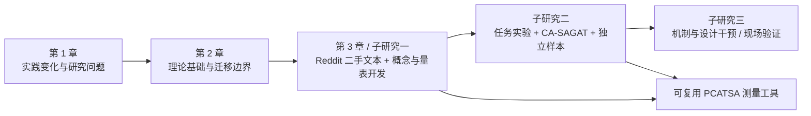

# 编码代理任务主观态势觉察的概念发展、量表开发与作用机制研究

## 第一至三章扩展写作初稿：以 Taylor 的 SART 主观 SA 传统为起点

> **稿件状态。** 本文是 thesis 的前三章写作底稿，而非研究结果报告。文中关于既有研究、行业调查和理论的陈述均有来源；关于 Reddit 样本、编码结果、维度、量表、统计参数和因果关系的内容均使用“拟”“将”“待检验”等措辞，须待实证研究完成后改写。
>
> **章节模仿原则。** 章节顺序和论证功能模仿 Dong thesis 的“绪论 - 理论基础与分析 - 概念发展与量表开发”结构；第 3 章的二手文本编码、理论往返、量表开发和竞争模型检验设计，则具体借鉴 Chen et al. (2024) 的程序。本文不复制两篇文献的文字或既有结论。
>
> **唯一理论起点与暂定概念名。** 本文以 Taylor (1990) 所建构的、面向复杂自动化监督任务的主观 situation awareness 及其原始操作化 SART 为唯一理论起点。Endsley 的三层 SA、SAGAT 和主客观比较文献只用作校准与效度边界，不构成第二个理论起点。本文暂以“编码代理任务主观态势觉察”（perceived coding-agent task situation awareness, **PCATSA**）命名拟开发构念；它不是“Coding-Agent SART”，也不是对原 SART 的翻译。若 Reddit 编码显示其内涵、边界、名称或结构不成立，概念和量表都必须随证据修订。

---

## 摘要

能够检索代码库、编辑多个文件、调用终端与外部工具、运行测试并在较少实时指令下完成多步任务的 coding agent，正在改变软件开发中的信息系统使用方式。与传统 IDE、代码补全工具和问答式大语言模型不同，coding agent 不仅提供建议，还会持续生成并执行行动，由此改变代码库、测试环境和用户后续需要承担的判断责任。当前研究和产品讨论通常聚焦 agent 的能力、准确性、信任、透明性或生产率，却尚不足以刻画一个更基础的个体层面问题：在 agent 持续行动和代码状态变化时，用户是否准确把握了当前发生什么、这些变化对任务意味着什么，以及接下来可能出现什么风险。若这一认知状态不足，用户即使拥有审批或回滚权限，也可能陷入自动化研究所称的 out-of-the-loop 困境。

本论文以 Taylor (1990) 对主观 situation awareness 的建构及其 SART 研究为唯一理论起点。Taylor 将 SA 理解为完成任务所需的、关于相关事件、因素和变量的知识、认知和预期，并从空勤人员的情境与个人构念中发展任务后主观 SA 估计工具。这一传统不以某一视觉 display 为研究对象，而是解释自动化监督任务中操作者对自己是否“掌握局面”的判断，因此特别适合迁移到信息分散、任务复杂且用户承担残余监督责任的 coding agent 情境。本论文暂定的 PCATSA 指用户在一次具体 coding-agent 编程任务中，对自己是否拥有安全、迅速且有效地界定、监督和完成该任务所需的、关于 agent 行动、代码制品变化、工具执行结果、任务约束和后续影响的知识、认知和预期的主观判断程度。它是任务片段层面的连续认知状态，不是 agent 的客观能力、用户的一般编程能力、对 agent 的信任、控制权限、界面透明性或任务绩效。

论文采用顺序探索式混合研究设计。第一项子研究将分析公开 Reddit 讨论中的 coding-agent 实际使用叙述，通过双人预编码、开放编码、轴向编码、负例分析和与 Taylor/SART 主观 SA 传统的持续比较，识别用户如何界定“掌握/未掌握 agent task situation”，并据此发展候选维度和条目。该阶段同时模仿 Chen et al. (2024) 的二手评论概念开发程序和 Taylor 的 construct elicitation 逻辑。子研究二将通过专家评估、认知访谈、Q-sort 和多轮独立问卷样本检验主观量表的内容、收敛和区分效度。子研究三将以基于任务日志、diff、测试、权限请求和任务约束的 CA-SAGAT 式探针校准主观量表，并检验状态证据支持、agent 自主性、任务不确定性、用户经验和任务复杂度如何影响 PCATSA，以及 PCATSA 如何关联审批准确性、及时接管、校准依赖、感知控制和任务结果。

本研究预期贡献在于：第一，将 Taylor 所建构的主观 SA 从传统自动化监督情境严谨迁移到 agent-mediated coding work，界定其在编码代理监督情境中的对象、边界和可测量内容；第二，提供一个以真实用户叙述生成、由任务真值探针校准的个体层面构念和量表；第三，为 coding agent 的计划、diff、日志、测试、审批与异步通知设计提供可诊断的认知工程依据，而不把“更快完成代码”误作“更好的用户协作”。

**关键词：** coding agent；agentic IS artifact；situational awareness rating technique；主观态势觉察；人机协作；概念发展；量表开发；软件开发者体验

---

# 第 1 章 绪论

## 1.1 选题背景与问题提出

### 1.1.1 从 AI 编程工具到可行动的编码代理

生成式 AI 已进入软件开发者的日常工作流，但“使用 AI 写代码”并不是一个同质现象。早期的代码补全或问答工具主要在用户发起的局部交互中生成建议；用户逐行阅读、选择和整合建议，仍直接掌握编辑过程。coding agent 则将这一交互关系推进到另一层次：它可以检查仓库、搜索文档、制定或修订计划、跨文件编辑、执行命令与测试，并根据中间反馈继续行动。SWE-agent 的研究将这种能力概括为 agent 通过专门的 agent-computer interface 在真实软件环境中创建和编辑文件、导航仓库并运行程序的能力（Yang et al., 2024）。从信息系统理论看，这种 artifact 不再只是被动等待使用的工具，而具备在不确定条件下承接任务、发起后续行动并寻求结果的 agentic 属性（Baird & Maruping, 2021）。

实践扩散也说明应把注意力从一般 AI 工具转向 agent 化使用方式。Stack Overflow 2025 Developer Survey 显示，在报告于工作中使用 AI agents 的软件开发者中，83.5% 将软件工程列为其 agent 用途；约七成 agent 用户认可其减少特定开发任务耗时或提高生产率，但开发者对 agent 提供信息的准确性、数据安全与隐私、工作流整合和学习成本仍有显著担忧（Stack Overflow, 2025）。GitHub 对四国 2,000 名软件开发团队成员的调查也发现，受访者广泛试用 AI coding tools，并把理解既有代码库、生成测试和将时间腾挪给系统设计与协作视为重要收益；但该调查是厂商调查，因而只能作为现象的实践背景，而不应被解释为普遍因果效应（Daigle & GitHub Staff, 2024）。

因此，本研究所说的 coding agent 并不等同于所有带有 AI 的开发工具。它指的是：在一个或多个自然语言目标约束下，能够获取代码库与工具环境的信息、产生或修订多步行动、修改可执行的软件制品，并在执行过程中请求或接受人类监督的 AI 软件工程 agent。这个界定强调五项可观察特征：跨文件代码制品操作、工具或终端调用、多步与可延续行动、对中间环境反馈的响应，以及用户可以或需要进行的边界设定、审批、纠偏和接管。只有同时具备这些特征的使用片段，才属于本论文的研究情境。

### 1.1.2 新的效率承诺与新的监督困境

coding agent 的价值主张是替用户承担一部分检索、编辑、执行与验证工作。可是，自动化并不会简单地“拿走工作”。Parasuraman、Sheridan 和 Wickens（2000）指出，自动化会改变人类活动，并可能给操作者带来新的协调要求。对 coding agent 而言，用户从直接写每一行代码，转向定义任务边界、理解 agent 是否找对上下文、判断它的修改是否符合架构与安全约束、解读测试结果、批准或拒绝下一步行动，并在必要时接手。这不是较少的认知工作，而是不同类型且常常更间歇的认知工作。

这种变化具有直接的现实后果。agent 的动作可能规模很小，也可能跨越多个模块；一次“测试通过”可能只说明某个有限检查成功，而不能自动证明代码满足用户目标、架构约束、性能要求或安全边界。用户若只看到摘要、命令输出或长 diff 的局部片段，可能无法判断 agent 做了什么、为什么做、哪些约束仍未被满足，以及若允许它继续行动会影响何处。近期对 17 位经验开发者的软件 agent 监督访谈也初步发现，开发者需要在事前控制、共同规划、实时监控和事后审查之间切换，并会采用把测试结果当作正确性保证等“足够好”的监督启发式；作者特别指出审查 agent 生成代码本身的困难（Dhanorkar et al., 2026）。该研究仍是预印本和探索性证据，却准确显示了一个值得理论化的个体体验问题。

软件工程中并非从未讨论“了解工作状态”。例如，D’Avila et al.（2020）提出 SW-Context 以为维护人员提供代码与设计问题的上下文历史，从而支持开发者的 situational awareness；Nageria 和 Hall（2020）也把开发错误与开发过程中的情境觉察丧失联系起来。这些工作证明 SA 与软件开发并不陌生。但它们面对的主要是开发者理解代码与任务环境，而非一个会持续检索、编辑、执行并可能偏离用户意图的 agent。coding agent 使“正在行动的非人类协作方”本身成为用户必须了解的情境元素，也使用户的预测对象从环境变化扩展到 agent 的后续行动轨迹和由此可能扩散的代码影响。

### 1.1.3 现有概念不足与研究问题

现有研究可以用信任、可控性、透明性、认知负荷、可用性或接受意向解释 coding agent 使用的一部分现象，但这些概念不能彼此替代，也不能直接回答上述监督困境。信任描述用户愿意在脆弱性条件下依赖自动化的意愿；控制描述用户影响系统的权力或能力；透明性描述系统提供信息或可解释性的属性；认知负荷描述任务对认知资源的要求；可用性则是用户对完成目标效率、效果和满意度的评价。它们分别可以是 PCATSA 的前因、后果或并列变量，却都不直接测量用户此刻是否掌握了 agent-mediated coding situation。

Taylor（1990）关于主观 SA 与 SART 的原始工作提供了更合适的起点。其关注点不是系统显示了多少信息，也不是操作者是否在客观意义上记住每个环境元素，而是自动化改变人类角色以后，任务参与者如何主观估计自己是否拥有完成任务所需的知识、认知和预期。Taylor 从空勤人员实际描述的任务情境和个人构念中发展 SART，而非从研究者预设的视觉属性中推导题项。对于 coding agent，这个问题可以直接改写为：在把部分编程工作委托给能够持续行动的 agent 后，开发者是否主观地认为自己仍掌握了安全、迅速、有效地界定、监督和完成当前任务所需的关键事件、因素与变量？

SART 的主观起点并不意味着放弃严格的真实性边界。Endsley（1995a）将 SA 界定为动态环境中对相关元素的感知、对意义的理解和对近期状态的预测；Endsley 和 Kiris（1995）则说明自动化正常运转可能使操作者脱离系统回路，进而在异常时无法有效接管。这些文献在本研究中用于校准：用户阅读日志、查看 diff 或反复提问 agent 是形成主观 SA 的过程，不是主观 SA 本身；用户主观上感到“我知道了”，也不必然代表其相对于任务真值具有准确的状态判断。

然而，将 SA 的名称放在 coding agent 前面并不足以形成新构念。本研究必须回答三个更严格的问题。第一，coding agent 的动态“工作情境”究竟由哪些元素构成，哪些元素是传统 SA 定义或测量中没有具体处理的？第二，这些元素是否真的构成一个重要且具有区分效度的个体认知状态，而不只是信任、掌控感或界面透明性的换名？第三，如何开发能够描述用户主观体验、又不把自我感觉错当作客观认知准确性的测量工具？

据此，论文提出以下研究问题：

1. 在 coding-agent 编程任务中，用户主观上认为自己需要掌握哪些事件、因素和变量，才能安全、迅速、有效地界定、监督和完成任务？
2. Taylor 的主观 SA/SART 传统在 coding-agent 情境中哪些内核仍适用，哪些空勤特定内容必须被重新识别、删除或扩展？
3. 如何开发并验证编码代理任务主观态势觉察的测量工具，并将用户的主观判断与相对于任务真值的状态准确性区分开来？
4. 哪些设计和任务条件可能影响 PCATSA，PCATSA 又可能通过何种方式影响开发者的审批、接管、依赖和任务结果？

## 1.2 研究目的与研究意义

### 1.2.1 研究目的

本论文的总体目的不是证明 coding agent “好”或“不好”，也不是以生产率替代用户体验，而是发展一个能够解释人如何在 agent 代为行动时仍保持有效监督的个体层面构念。具体而言，论文拟完成四项相互衔接的工作。

第一，基于 SA 的经典定义，清楚界定 coding agent、工作情境、任务片段和用户角色的边界。第二，基于公开的 coding-agent 使用叙述，识别用户实际关心、跟踪、误解、预测和介入的对象，发展 PCATSA 的概念内涵。第三，遵循严格的量表开发程序，形成可复用的主观 PCATSA 测量，并通过 CA-SAGAT 式客观探针检验其与任务真值的关系。第四，提出并逐步检验“系统和任务条件 - PCATSA - 人机协作结果”的作用机制，为后续 coding-agent 设计提供可检验的理论命题。

### 1.2.2 理论意义

本研究的第一项理论意义，是将 agentic IS use 的讨论推进到用户监督时的动态认知状态。Baird 和 Maruping（2021）指出，agentic IS artifacts 要求重新审视传统 IS use 默认的人类主导假设，并将 delegation 作为关键过程。本研究进一步提出：在 delegation 发生以后，用户是否仍拥有足以进行判断和干预的工作情境觉察，是理解该关系质量不可忽视的中间层。它并不取代 delegation、信任或控制理论，而是解释这些变量为何在同样的授权安排下可能导致不同的监督结果。

第二，本研究以一个单一且成熟的基础概念开展情境化发展，避免把多个相邻概念拼接成一个难以辨识的“新词”。Jaeger 和 Eckhardt（2021）将 SA 迁移为 situational information security awareness，研究个体经验、警告设计和 phishing 情境线索如何影响觉察及后续安全行为；Nadj、Maedche 和 Schieder（2020）则用 SA 解释交互分析 dashboard 特征与任务表现的关系。这些研究说明 SA 可以在 IS 情境中被严谨具体化。coding agent 的贡献不在于否认 SA 的三层核心，而在于识别在“agent 行动 - 软件制品状态 - 工具结果 - 任务约束 - 未来风险”耦合系统中，何为用户必须觉察的相关元素及其特有的后果。

第三，本研究对 IS 构念开发提出方法上的增量。Chen et al.（2024）以大规模用户评论的开放、轴向和选择性编码开发语音交互可用性的维度，再与单一的合作原则理论反复比较并完成多轮量表验证。该路径特别适合尚缺乏稳定用户体验语言的新兴技术情境。本研究沿用“理论引导而不强迫编码”的逻辑：Reddit 文本不是 SA 的测量结果，而是发现用户如何描述其经验、哪些既有概念失配、以及新量表语言应该贴近何种任务事件的材料。随后再以独立量化样本和客观任务探针完成构念验证。

### 1.2.3 实践意义

实践上，PCATSA 将把“透明一点”“多给日志”这类笼统建议转化为可以诊断的设计问题。若用户不知道 agent 修改了什么，是当前行动和制品状态的感知问题；若用户看见 diff 却不理解其与需求、架构或测试失败的关系，是意义理解问题；若用户不了解批准、继续运行或接管的后果，则是行动轨迹与风险预测问题。不同问题对应的设计干预可能不同：将计划、diff、命令、测试和约束孤立呈现，未必会提高 PCATSA；把它们与任务目标和关键决策点关联起来，才可能形成有效的状态证据支持。

对于开发团队，PCATSA 可帮助识别哪些审批与审查过程真正提高了判断质量，哪些只是把大量未经整合的证据转移给用户，造成审批疲劳。对于产品设计者，PCATSA 可作为比较不同 agent UI、异步通知、计划更新、风险提示和验证报告的指标。对于使用者，它也有助于从“是否相信 agent”转向更可行动的问题：我目前具体知道什么、还不知道什么、为何这一未知会影响我下一步的授权或接管决定。

## 1.3 研究现状及评述

### 1.3.1 Coding agent、agentic IS use 与开发者监督研究

关于 coding agent 的技术研究快速扩张，重点通常是任务完成率、代码修复基准、工具使用策略或 agent-computer interface 设计。例如，SWE-agent 证明为 agent 设计合适的动作接口可以显著改变其在真实软件工程任务中的表现（Yang et al., 2024）。这类研究解释“agent 能否完成任务”，却较少解释“人如何理解并监督 agent 的连续行动”。即使模型或 agent 的客观能力提升，用户仍可能难以界定任务、核验结果并判断何时介入。

IS 领域的 agentic IS use 框架为本研究提供了更契合的关系视角。该框架强调 agentic artifact 可以承接带有不确定性的任务、在一定程度上拥有行动主动性，因而用户与 artifact 之间会出现 delegation to/from 的关系（Baird & Maruping, 2021）。但框架本身并未为编码代理任务提供一个可测量的、任务时点上的监督认知状态。coding agent 的特殊之处在于，委托对象是可执行且演化的软件制品；用户既不能仅凭自然语言回复判断正确性，也不能完全以“测试通过”替代架构、风险和任务约束判断。

软件工程与 HCI 的新近研究已经报告了相关表象，如审查 AI 生成代码的困难、将测试用作正确性代理、事前约束与事后审查之间的切换（Dhanorkar et al., 2026）。这些发现为本研究提供问题证据，却尚未形成一个严谨的、个体层面、可与相邻构念区分的解释变量。现有开发者研究也往往把使用结果聚合为生产率、接受度或信任，未直接衡量使用者对于 agent 行动、代码变化、工具执行和未来风险的动态认知状态。

### 1.3.2 Situation awareness、自动化与软件开发情境

SA 起源于动态系统中的人类决策研究。Endsley（1995a）提出的三层模型包括：对相关元素状态、属性和变化的感知（Level 1）；将元素整合为对当前目标意义的理解（Level 2）；以及对近期未来状态的预测（Level 3）。该定义的关键是“与当前目标相关的动态情境”，而不是信息的总量、界面中是否有可见元素，或用户对自己表现的满意程度。Endsley（1995b）进一步发展 SAGAT，以暂停动态任务、移除显示并向操作者提问的方式，将回答与情境真值比较。

自动化研究为 coding agent 的问题提供了重要警示。Endsley 和 Kiris（1995）发现，较低 SA 与自动化失效后的决策时间下降有关，操作者的控制程度会调节这种 out-of-the-loop 损失。Parasuraman et al.（2000）则将自动化区分为信息获取、信息分析、决策选择和行动执行等不同阶段，并指出自动化水平和类型会改变人的工作。coding agent 同时触及这四类功能：它检索代码和文档、解释问题、提出或选择修复路径、编辑并执行命令。因此，不能仅把它视作“更强的代码补全”。

SA 在 IS 中已有有价值的情境化尝试。Jaeger 和 Eckhardt（2021）以多方法 phishing 实验显示，情境性信息安全觉察受用户经验、警告信号和邮件线索影响，并进一步关联威胁与应对评估及实际行为。Nadj et al.（2020）在 operational DSS 实验中发现，交互分析功能可能提高任务表现，却也可能降低 SA；该研究将 SAGAT 和眼动证据结合，提醒研究者不要仅以表面绩效推断用户仍在回路中。两篇研究均支持本论文的核心判断：在由系统支持的动态决策中，系统更快或更自动化不等于用户更理解情境。

然而，既有 SA 情境化研究的“环境元素”和“未来变化”大多可由外部场景或决策系统状态界定。coding agent 的情境中，agent 既是改变环境的行动者，又是用户须监督的协作方；真实状态分布在任务指令、仓库、diff、命令、测试、依赖和 agent 的计划或请求中。由此，传统 SA 不能被原封不动地操作化：研究者必须先识别何为 coding-agent task 的相关元素、用户如何将改变代码的行动与任务约束关联、以及“预测”是否包含授权后的 agent 行动与代码影响。

### 1.3.3 Taylor 的主观 SA/SART 传统及其对 Coding Agent 的启发

Taylor（1990）发展 SART 的历史语境与本文的问题具有直接的可比性。随着自动化技术进入空勤系统，操作者的角色不再局限于稳定地操纵仪表和控制面，而更需要在不完整信息、突发变化和高度自动化之间保持足够的任务判断。Taylor 由此把研究重心从“操作者的工作负荷是否降低”推进到“操作者是否仍主观地拥有完成任务所需的情境掌握”。这一转向的重要性在于：一个系统可以降低部分操作负担，却同时让操作者对任务的全貌、限制和后续变化失去把握。coding agent 也面临同样的张力。它可以显著减少搜索、样板代码和局部修复的时间，却可能把用户从直接编辑者改造成只在关键节点介入的监督者；这种角色转变不能只用效率或满意度评价。

Taylor 的构念发展程序尤其值得认真模仿。原始研究并非先把 SA 分解为一套通用维度，再要求空勤人员打分；它先以 scenario generation 识别具有不同 SA 特征的实际任务情境，再通过半结构的个人构念引出，询问空勤人员在何种情境下感觉自己“掌握”或“不掌握”任务，最后对所引出的构念结构进行验证。可访问的再版资料显示，该研究涉及 84 名 RAF 空勤人员，使用固定协议的 Personal Construct/Repertory Grid Technique，并以主成分分析和 varimax rotation 形成构念结构。换言之，SART 的学术价值不仅在于一个后来的评分公式，更在于它将使用者的主观任务判断当作概念发展的原始材料。

SART 最终将操作者的主观判断概括为 attentional demand、attentional supply 和 understanding 三类内容。常用简化表单把 situation instability、complexity、variability 置于 demand；将 arousal、concentration、division of attention、spare mental capacity 置于 supply；将 information quantity、information quality 和 familiarity 置于 understanding。部分版本另含三个高阶部分的全局判断和整体 SA judgement，因此文献中可见十项、十三项和十四项的不同报告。对本研究的启发不是选择某一个版本照搬，而是理解其理论机制：主观 SA 既与用户是否理解相关，也与任务的变化、复杂性和用户可动用的注意资源有关。

然而，coding agent 情境不能把 demand、supply 和 understanding 直接当作最终维度。第一，代码任务的复杂性、审批频率和日志冗余可能是降低用户主观 SA 的条件，而不一定构成 SA 本身。第二，用户面对的不是飞机、威胁目标和飞行路径，而是会主动搜索、编辑、执行、失败和继续行动的非人类协作方；用户主观掌握的对象因此必须同时包括 agent 行动、制品状态、工具结果、目标约束和后续影响。第三，编程任务通常可以暂停、回溯、重放和版本化，但这种可逆性并不自动消除理解和责任风险。正因如此，本研究采用 Taylor 的主观 SA 内核和构念引出逻辑，却将具体内容完全交给 coding-agent 用户经验重新发展。

SART 的局限同样必须进入论文主线。Endsley et al.（1998）在同一飞行模拟研究中发现，SART 与简单的主观 SA、主观充分性、confidence 和主观 performance 高度相关，却与基于情境真值查询的 SAGAT 不相关。该结果并不意味着主观 SA 没有价值；恰恰相反，主观上认为自己“掌握了”可能决定用户是谨慎地检查还是大胆地行动。但它迫使本研究在定义和测量上保持诚实：PCATSA 是用户对自己任务掌握程度的主观判断，不应被宣称为真实状态准确性的直接替代。后续设计必须同时观察主观判断、任务真值探针和实际审批/接管行为。

从这个意义上说，本文将 SART 视为 coding agent 研究的理论起点，而将 SAGAT 视为校准工具。前者回答“用户如何评价自己是否掌握复杂 agent task”；后者回答“用户当时实际上知道哪些任务真值”。二者的差距本身可能是最有实践意义的结果之一：主观 SA 很高而客观准确性很低的用户，可能承担过度依赖和错误审批风险；主观 SA 很低而客观准确性较高的用户，则可能遭遇不必要的复查、拒绝和低效接管。

### 1.3.4 情境特定构念与测量研究

情境特定构念并不是给通用概念加上一个领域前缀。它要求说明：母概念在哪些抽象层面仍然成立，为什么已有定义、维度或测量在新对象上漏掉重要内容或包含不适配内容，以及新构念如何具有可区分和可检验的经验指称。Chen et al.（2024）开发 voice-interaction usability 时保留 usability 的目标导向内核，却说明网页和移动应用中依赖视觉、并行信息展示的属性不能直接涵盖语音交互；作者从用户评论中得到经验代码，再与 cooperative principle theory 比较，最终发现理论本身需在新情境补充 anthropomorphism 维度。

Dong thesis 的概念发展逻辑也有直接启发：先说明新兴情境中通用技术概念不能充分解释特定目标导向行为与技术特征的关系；以一个理论作为解释入口给出情境化定义；再结合文献、实践材料和专家讨论识别构念内涵；最后开发量表，为后续机制验证奠定基础。两篇文献共同要求本研究避免两个极端：不能在无理论约束下从 Reddit 评论任意命名概念，也不能在数据收集前把 SA 的三层预设为既成量表结构。

在测量层面，MacKenzie, Podsakoff, and Podsakoff（2011）强调构念定义、指标与潜变量关系的正确设定，以及内容、收敛和区分效度的累积证据；Moore 和 Benbasat（1991）则展示了通过多轮判断者分类和独立样本检验修订构念定义与题项的程序。对本研究尤其重要的是，SA 的主观与客观测量不可混为一谈。SART 可以获得用户对注意资源和理解状态的主观评价，但与基于情境真值的 SAGAT 并不等价（Endsley et al., 1998）。因此，PCATSA 的自评量表若能开发成功，应被定位为 perceived PCATSA；它不能单独证明用户实际掌握了 agent 的工作情境。

### 1.3.5 研究现状评述与理论缺口

综上，现有研究留下四个相互关联的缺口。

第一，coding agent 技术研究充分讨论 agent 的能力，却缺乏描述用户在实际监督中形成何种动态认知状态的个体层面构念。第二，trust、control、transparency、workload 和 usability 分别解释了用户体验的不同侧面，但不直接测量用户是否知道当前 agent-mediated coding situation 的关键事实、意义和后果。第三，SA 理论和 IS 情境化研究提供了坚实基础，却尚未界定 coding agent 情境中的相关元素、任务片段边界和真值来源。第四，若仅以自评问卷研究新构念，研究很容易把信心、满意度或事后合理化当作真实觉察；若只用任务成功或测试通过，又会把绩效当作 SA 的替代指标。

因此，本研究将理论缺口界定为：**缺少一个建立在 SA 基础上、以 agent-mediated coding task 为边界、可与信任和控制区分、并能同时接受主观与客观效度检验的个体层面认知状态构念。**

## 1.4 研究内容与结构

本论文由三个相互递进的子研究构成。子研究一是构念发展与量表开发，回答 PCATSA 是什么、如何与相邻概念区分、用户叙述中有哪些经验内容，以及如何建立可用的测量工具。子研究二是构念与测量验证，使用受控 coding-agent 任务、客观探针和独立问卷样本，检验 PCATSA 的状态性、结构、区分效度和预测关联。子研究三是机制与设计研究，在更接近实际工作的任务或现场环境中考察状态证据支持、任务自主性、任务不确定性、用户经验和复杂度如何共同影响 PCATSA 及后续协作结果。

前三章的功能与 Dong thesis 一致：第 1 章提出新情境中的重要问题、研究目的和整体路线；第 2 章界定对象、回顾理论并建立总体分析框架；第 3 章发展后续研究所需的核心构念和测量工具。第 4 章和第 5 章在本初稿中只保留预研究方案，待子研究一结果决定其具体假设与设计后再展开。

## 1.5 研究方法与技术路线

### 1.5.1 研究方法

本论文采用顺序探索式混合研究。选择该方法有三项原因。其一，PCATSA 尚未有经验证的 coding-agent-specific 定义和量表，先行的质性研究需要发现用户自然描述的任务事件、困惑、判断和策略。其二，仅凭质性文本不能确定构念结构、测量模型或与相邻概念的经验区分，需要后续独立样本进行量化检验。其三，SA 的理论属性要求把主观评价与客观任务真值分开，混合方法可以形成更强的 meta-inference（Venkatesh, Brown, & Bala, 2013）。

质性阶段将采用二手公开文本分析，而不是把 Reddit 当作方便的“访谈替代品”。它的作用是提供高生态效度的使用叙述，特别是用户在自发讨论中如何描述 agent 的行动、代码变更、测试、审批、疲劳和接管。量化阶段将采用多轮题项开发与独立样本验证。实验阶段将根据真实任务日志设计 CA-SAGAT 式冻结或自然断点探针，把用户回答与当时的 agent 日志、diff、测试结果、任务约束和允许行动进行比较。

### 1.5.2 技术路线

技术路线遵循“定义 - 发现 - 操作化 - 校准 - 解释”的顺序。首先基于 SA、自动化与 agentic IS use 文献定义研究对象和理论边界；其次从用户文本中归纳经验范畴并以理论持续比较；第三形成概念定义、候选维度和题项池；第四通过内容效度、量表结构和 CA-SAGAT 校准检验测量；最后才检验前因、后果与设计干预。每一阶段都保留返回前一阶段修订的可能：若文本不能支持 PCATSA 的独立经验内涵、若客观探针与自评完全无关、或若区分效度无法成立，则必须修订定义、缩小边界或放弃构念，而不是为了完成 thesis 强行保留它。

---

# 第 2 章 编码代理任务主观态势觉察的理论基础与分析

## 2.1 Coding agent 与 agent-mediated coding work 的内涵

### 2.1.1 研究对象的边界

为避免将所有 AI 编程体验混入同一研究对象，本文区分四类技术情境。传统 IDE 与版本控制工具主要由用户直接操作；代码补全工具在局部编辑点提出候选；问答式 coding assistant 可以解释或生成代码片段，但通常不持续操作工作区；coding agent 则在任务委托后可跨越多个行动步骤，在代码库和工具环境中持续产生可审查的行动与制品变化。研究对象不是某个品牌或模型，而是用户与后一类系统发生的任务片段。

| 对象 | 主要系统角色 | 用户通常直接掌握的对象 | 是否构成本文的核心情境 |
| --- | --- | --- | --- |
| 传统 IDE / Git 工具 | 被动工具 | 编辑、命令与版本状态 | 否，仅作背景 |
| 代码补全 | 局部建议者 | 每次采纳的代码片段 | 否，除非嵌入多步 agent 任务 |
| 对话式 coding assistant | 问答或片段生成者 | 提示与回复 | 通常否 |
| coding agent | 可执行多步工作的协作方 | 任务边界、状态证据、审批、纠偏、接管 | 是 |

本研究的分析单位是**用户 - coding agent - 具体编程任务片段**，而非组织、团队或整个项目。一个任务片段从用户将特定目标委托给 agent 开始，到用户批准、修改、接管、回滚或结束该任务为止。任务片段可以是同步的，也可以包含短时异步行动；但若时间跨度过长、任务目标发生根本变化，研究者应把它划分为新的片段，而不把长期的代码库熟悉度混入当下的 PCATSA。

### 2.1.2 动态工作情境的组成

编码代理工作情境不是“agent 内部想了什么”。它是用户需要用可获得证据形成判断的、与当前目标相关的外部任务状态。暂定包括五类元素：

1. **agent 行动状态：** agent 已经、正在或被请求执行的检索、编辑、命令、测试、工具调用和审批请求；
2. **软件制品状态：** 相关文件、diff、依赖、配置、版本、测试覆盖和工作区的变化；
3. **工具执行结果：** 命令返回、测试通过或失败、构建、lint、安全扫描与错误信息；
4. **任务约束：** 用户目标、范围、不能修改的部分、架构约定、性能或安全要求，以及允许的权限边界；
5. **后续行动与风险：** 如果 agent 继续、被批准、被拒绝或被接管，最可能发生的行动、受影响模块和需要核验的风险点。

用户的编程能力、项目经验、对代码库的长期熟悉度、一般 AI 自我效能和风险偏好并不属于 PCATSA 内容。这些变量可能决定用户多容易形成 PCATSA，因而应作为前因、控制变量或边界条件处理。类似地，计划面板、diff 视图、日志、测试报告和审批弹窗是系统提供的 SA support，不是 PCATSA 本身；它们是否真正帮助用户形成状态，必须由后续研究检验。

## 2.2 理论基础

### 2.2.1 Taylor 的主观 SA 与 SART：概念内核、结构和可迁移性

#### 2.2.1.1 从工作负荷管理到主观任务掌握

Taylor（1990）发展 SART 的直接动因，是自动化环境中单纯以 workload 评价系统已经不够。一个自动化系统可以让操作者执行的手动动作减少，却不一定使其在异常、变化或需要判断时更有把握。对空勤人员而言，系统设计需要支持的不是抽象的舒适感，而是在不确定条件下对任务是否可以安全、迅速、有效完成的主观掌握。因而，Taylor 将 situation awareness 表述为与任务执行后果直接相关的 knowledge、cognition 和 anticipation：操作者需要对会影响任务的事件、因素和变量有所了解、形成认知并具有预期。

这一逻辑对 coding agent 的迁移应从“开发者在何种时刻仍认为自己掌握任务”出发，而不是从“agent 界面是否展示更多内容”出发。coding agent 会将用户从持续编辑的直接操作者，改变为间歇地提出目标、检查状态、授权、纠偏和接管的任务监督者。用户可能花费更少时间写出具体语句，却需要判断 agent 是否理解范围、代码变更是否符合约束、测试通过是否真的支持合入，以及继续行动是否会扩大影响。因而，研究对象不是某一种界面视觉设计，而是用户对当前任务情境的主观掌握。

Taylor 的任务相关性原则为后续概念划定了严格边界。PCATSA 不是用户对所有 agent 日志、代码细节和系统状态的总知识量。只有那些影响当前任务安全、迅速和有效完成的状态内容，才应进入构念。譬如，一个与本次需求无关的历史文件即使被 agent 检查，也不必然是用户应当觉察的要素；相反，一项看似很小的 package-lock 修改若会改变依赖、构建或安全边界，便可能是高度相关的情境内容。相关性的判断必须由任务目标、约束、代码语义和预期后果共同决定，而不能由界面显示数量决定。

#### 2.2.1.2 SART 的构念引出与测量结构

Taylor 的原始研究在方法论上包含三个值得直接模仿的步骤。首先，scenario generation 让参与者描述或比较不同情境，而不是脱离具体任务抽象评价“我是否有 SA”。其次，construct elicitation 通过半结构的个人构念引出，识别参与者用什么语言判断自己是否掌握局面。最后，construct structure validation 对引出的构念及其与不同情境的关系进行结构化检验。这个逻辑与 Chen et al.（2024）对用户评论的编码程序高度相似：用户文本先生成经验概念，理论再用于组织和检验，而不是由研究者预先为文本寻找印证。

SART 后续以三类主观判断组织内容。attentional demand 反映情境对用户注意资源的要求，例如不稳定、复杂和多变量变化；attentional supply 反映用户可动用的注意状态，例如警觉、集中、注意分配和剩余心智容量；understanding 反映用户认为自己获得、理解和熟悉情境信息的程度，例如信息数量、信息质量和熟悉度。常见的综合计算方式为 `Understanding - (Demand - Supply)`。这个表达式将“我理解了多少”与“任务要我处理多少、我还剩多少注意资源”放在同一个主观 SA 估计中，反映了 Taylor 的系统设计评价意图。

但这种结构不能被直接复制为 PCATSA 的最终结构。原因在于，coding agent 的 demand 和 supply 很可能是由 agent 自主性、任务复杂度、异步通知、审批节奏、上下文切换和信息冗余产生的条件。若研究者把它们直接合并进 PCATSA，就无法回答一个本应独立的问题：某种状态证据支持是否降低了用户的主观处理负担，并进而提升其任务掌握？因此，本论文继承 SART 的主观 SA 解释内核和构念引出方法，而把 demand、supply、understanding 视为**待检验的 sensitizing categories**。Reddit 编码和后续结构检验将决定它们是构念内容、前因、结果，还是根本不适合 coding agent 情境的历史遗留项。

#### 2.2.1.3 为什么 Coding Agent 比航空视觉任务更复杂

将 coding agent 简单称作“更复杂的 display”是不准确的。航空任务中，飞行状态、威胁、航路和系统警示通常呈现在受控的传感与显示体系中；coding agent 的相关状态则跨越自然语言、代码、命令、制品、版本、测试、外部工具、权限和组织约定。更重要的是，agent 自己会改变这个状态空间：它可以搜索新文件、选择新的修复路径、运行副作用不明的命令、产生新的 diff、根据失败再规划，并请求用户批准范围或权限。因此，用户的主观 SA 既涉及“现状是什么”，也涉及“这一行动者正在以什么方式改变现状”。

coding agent 的复杂性还表现在语义层级不一致。一个用户可能准确知道 agent 修改了三个文件，却不了解这些文件与业务规则、数据库迁移、依赖版本或安全控制之间的关系；也可能理解当前 patch 的局部语义，却无法预期 agent 继续执行后的影响范围。视觉上可见的状态与任务上可用的理解在此明显分离。SART 的 task-oriented subjective estimation 为研究者提供了比“可见性”更合适的起点，因为它允许我们问：用户是否主观上觉得自己拥有完成当前任务所需的知识、认知和预期，而不要求先把所有信息变成某一类视觉元素。

#### 2.2.1.4 初步迁移命题与概念排除

基于 Taylor 的定义，PCATSA 的潜在内容应满足三个必要条件。第一，它必须是用户关于**当前任务相关状态**的主观掌握，而不是对产品优劣的总体评价。第二，它必须与**完成当前任务的安全、迅速和有效性**相关，而不是对 agent 的一般好感或未来使用意向。第三，它必须能够随 task episode 改变；同一用户在简单、范围明确的测试补充任务中可能主观 SA 高，在跨模块重构和异步执行任务中可能低。

相反，以下内容不宜直接纳入构念定义：用户是否喜欢 agent、是否信任其能力、是否拥有暂停权限、是否对代码库长期熟悉、界面是否美观、任务最后是否成功、agent 实际有没有犯错。它们均可能与 PCATSA 密切相关，但其概念指称不同。尤其应避免把“我可以控制 agent”写成 PCATSA 条目；控制权只给用户提供干预的可能性，不保证用户知道何时、为何和怎样干预。也应避免把“agent 的解释很清楚”写成 PCATSA；解释质量是系统提供的状态证据特征，只有当用户因此形成主观任务掌握时，才可能影响 PCATSA。

### 2.2.2 Agentic IS use 与委托关系

传统 IS use 研究通常假定用户是主要行动者，系统作为支持其目标的被动 artifact。Baird 和 Maruping（2021）指出，agentic IS artifact 能够在不确定条件下寻求结果、承担部分任务责任，并可能发起行动，由此需要以 delegation to and from agents 的框架理解人 - IS 关系。coding agent 具有这一特征：用户不是在每一个低层编辑步骤上直接操控，而是在目标、权限、检查和决策节点上与 agent 形成分工。

这一理论基础解释了为什么 coding agent 的 UX 不能只用 adoption 或 ease of use 描述。委托并不意味着责任转移完全发生。用户往往仍要对合入代码、部署影响、质量和安全承担后果。因此，用户需要的不只是“能否影响 agent”，还需要用于决定是否影响、何时影响和如何影响的任务相关认知状态。PCATSA 正是在 delegation 已发生、但用户仍承担监督责任的空间中被提出。

### 2.2.3 从 SART 到任务真值校准：主观 SA、客观 SA 与状态边界

Endsley（1995a）的 SA 理论以目标导向的动态环境为前提。SA 的 Level 1 是对关键元素当前状态、属性和变化的**感知**；Level 2 是将这些元素与目标、限制和彼此关系整合成意义的**理解**；Level 3 是依据当前理解对未来状态作出**预测**。这三层不是对三种 UI 功能的罗列，也不必然等于未来量表的三个因子；它们首先界定了何种认知内容才称得上 SA。

SA 与 situation assessment 必须严格区分。用户查看 diff、读日志、询问 agent、运行额外测试、点击审批或回滚，都是获取和处理信息的活动；它们可能形成或修复 SA，却不是 SA。PCATSA 也同样如此：它测量任务片段内用户所形成的、关于工作情境的认知状态，而不是用户做了多少监督动作。一个用户可以频繁阅读面板却仍不理解变更的影响；另一个用户也可能因已有任务模型和高质量证据，在较少操作后形成较高 PCATSA。

SA 还必须与绩效区分。任务成功、完成时间、bug、回滚或审批数量只能是 PCATSA 的可能后果、外部效标或相关表现，不能取代构念本身。Nadj et al.（2020）恰恰表明，在自动化支持中，更高的任务表现与更高 SA 不必同步。这一判断对 coding agent 尤其关键：agent 可以在用户并未充分理解的情况下交付一个暂时可运行的改动。

### 2.2.4 自动化、out-of-the-loop 与监督认知

Endsley 和 Kiris（1995）将 out-of-the-loop performance problem 描述为：当自动化正常工作时，操作者因技能、警觉、主动信息处理或反馈方式变化而失去接管所需的 SA。coding agent 不是飞行控制系统，因而不能把该结论机械外推；但是其机制上的共同点值得检验。agent 将检索、决策和执行压缩为连续步骤，用户获得的往往是摘要、状态提示或最终 diff。若这些证据无法让用户把行为、代码与约束关联，用户便可能在异常、范围漂移或错误通过测试时缺少有效接管基础。

Parasuraman et al.（2000）的四阶段框架进一步提示，coding agent 的自主性不是一个单一滑尺。它可在信息获取、分析、决策/行动选择和行动实施四个阶段具有不同程度的自主性。一个只自动执行用户指定 patch 的工具，与一个会主动选择文件、命令、修复路径并继续迭代的 agent，对 PCATSA 的要求不同。后续研究不应仅以“使用了 agent/没有使用 agent”编码自主性，而应记录任务片段中哪些阶段由 agent 承担、用户在哪些点获得或失去状态证据。

## 2.3 从 SA 到 PCATSA：迁移逻辑与概念边界

### 2.3.1 为什么核心理论适用

PCATSA 保留 SA 的核心，因为 coding-agent task 具备 SA 理论的三个必要条件。第一，情境是动态的：代码、工作区、测试和 agent 行动随时间变化。第二，用户有目标和约束：完成特定需求、避免范围外改动、维持兼容性、控制风险。第三，用户要在不完整信息下作出有后果的决策：继续授权、检查、纠偏、接管或回滚。这些条件使“用户是否形成对相关状态的感知、理解和预测”成为一个有意义的问题。

IS 文献的迁移先例也支持这一做法。Jaeger 和 Eckhardt（2021）没有把一般安全意识直接等同于 phishing 情境中的觉察，而是将动态威胁情境、个体经验和系统警告纳入定义和测量；Nadj et al.（2020）没有把 dashboard 的可视化程度当作 SA，而是把 dashboard 特征视为可能影响 SA 的设计条件。本研究采用相同逻辑：计划、日志、diff 和测试是条件或证据；用户对它们和当前任务关系的状态性掌握才是 PCATSA。

### 2.3.2 为什么必须情境化而非直接照搬

经典 SA 不能直接提供 coding agent 的测量内容，原因并非“场景换了”，而是相关元素、用户位置、真值和预测对象发生了结构性变化。

| SA 的经典动态系统 | Agent-mediated coding work | 对概念开发的含义 |
| --- | --- | --- |
| 相关元素多是外部环境或系统显示的状态 | 相关元素同时包括 agent 行动、代码制品、工具结果、任务约束与权限 | 必须从用户任务中识别哪些证据是真正相关的 |
| 操作者通常直接执行控制动作 | 用户常处于委托、审批、纠偏与接管位置 | 预测应覆盖继续授权和介入的后果 |
| 真值来自环境或模拟器 | 真值分布于 Git 状态、diff、命令、测试、依赖与任务说明 | 客观探针必须按任务日志定制 |
| 未来状态主要是环境演变 | 未来状态还包含 agent 的后续行动和代码影响传播 | 不能只问“下一项事实”，还应检验对行动轨迹和风险的预测 |

由此，PCATSA 不是声称 SA 理论完全失效，而是发展其在 coding agent 使用中“相关元素”和“任务后果”的情境化内容。只有当二手文本与后续研究表明用户确实围绕这些元素形成、丧失或修复状态性理解，且其与相邻构念具有区分效度时，PCATSA 才值得保留为独立构念。

### 2.3.3 与相邻概念的区分

| 概念 | 核心问题 | 与 PCATSA 的关系 | 不能替代 PCATSA 的原因 |
| --- | --- | --- | --- |
| 对 agent 的信任 / reliance | 我愿不愿意依赖它？ | 可能受 PCATSA 影响，也可能影响信息搜寻 | 高信任者未必知道 agent 具体做了什么；低信任者也可能高度觉察 |
| 感知控制 | 我是否有能力或权限改变系统行为？ | 可能是 PCATSA 的后果或设计条件 | 有暂停、拒绝、回滚按钮不等于用户知道何时使用 |
| 透明性 / 可解释性 | 系统是否提供可理解的过程或理由信息？ | 是潜在前因或设计属性 | 信息存在、可见或解释充分，不等于用户形成任务相关理解 |
| 认知负荷 | 任务对我的认知资源要求多高？ | 可能阻碍 PCATSA | 负荷高不说明用户究竟掌握了多少状态；低负荷也可能来自盲目依赖 |
| 代码库熟悉度 / 任务自我效能 | 我具备多少稳定知识和能力？ | 是前因或边界条件 | 它们跨任务相对稳定，PCATSA 应随具体任务片段变化 |
| 可用性 | 我是否能有效、高效、满意地完成目标？ | 广义 UX 后果或并列评价 | 可用性不定位用户在感知、理解或预测哪一项工作状态 |

这个区分将在第 3 章之后通过三类证据检验：内容效度中是否存在不可归入相邻构念的题项与叙述；量表验证中是否具有收敛和区分效度；任务实验中是否能在控制经验、负荷和系统信息量后，预测审批准确性或及时接管等结果。若任何一类证据不支持区分，研究应缩小或重新定位构念。

## 2.4 总体理论构架与研究命题空间

本论文不在概念开发完成前强行固定结构模型，但可以预先界定后续研究的逻辑空间。系统与任务条件为用户提供或遮蔽状态证据，并改变用户处理这些证据的成本；用户的经验与任务模型影响其解释证据的能力；二者共同影响任务片段内 PCATSA；PCATSA 再影响用户是否能形成合适的授权、审查、纠偏和接管决策。信任、感知控制、负荷和绩效不被写入 PCATSA 定义，而是在后续模型中作为前因、后果、替代解释或边界变量逐一检验。

后续可检验但尚未定稿的前因包括：

- **工作状态证据支持：** 系统是否把计划、行动、diff、命令、测试和任务约束以可追溯的方式关联，而非孤立堆叠；
- **agent 自主性与行动跨度：** agent 在四类自动化阶段承接多少工作，及一次行动涉及多少文件、命令与风险；
- **任务不确定性与复杂度：** 需求歧义、代码库陌生度、跨模块依赖、测试可观测性和时间压力；
- **用户先验条件：** 编程经验、代码库熟悉度、agent 使用经验和一般任务自我效能。

后续可检验的结果包括：任务真值意义上的审批准确性、无必要拒绝或误批风险行动的比例、发现异常后的介入时机、回滚与返工、校准的依赖、感知控制和任务表现。上述关系只是研究计划，不是本章提出的既定假设；子研究一必须先确认 PCATSA 的经验内涵，子研究二再决定模型中的变量、方向和可能的非线性关系。

## 2.5 本章小结

本章从 agentic IS use、SA 与自动化监督研究出发，界定了 coding agent 与一般 AI 编程工具的边界，说明 PCATSA 适合以 SA 为唯一基础概念。PCATSA 的理论必要性不来自技术的新颖性，而来自 coding agent 把非人类行动者、可执行制品变化、工具执行与残余用户责任耦合到同一个动态任务片段。与此同时，本章划清了 PCATSA 与信任、控制、透明性、负荷、能力和可用性的边界，并将其定位为随任务变化的认知状态。下一章将在这一边界内发展概念和量表，而不预先把三层 SA 固化为最终维度。

---

# 第 3 章 编码代理任务主观态势觉察的概念发展与量表开发

## 3.1 PCATSA 的概念发展

### 3.1.1 概念发展的问题与目标

第 2 章说明 SA 是理解 coding-agent supervision 的合理出发点，但这一结论本身不能替代构念发展。开发 PCATSA 的任务不是把 Endsley 的三个术语翻译成三组 Likert 题项，而是回答三个经验问题：使用者在真实 agent 任务中实际在意并跟踪哪些状态；当他们说“不知道 agent 在干什么”“不敢批准”“看不懂改动”或“测试过了但仍不放心”时，哪些叙述属于 SA、哪些属于信任、控制、情绪或其他体验；以及哪些状态内容在 coding agent 情境中具有普遍的重要性，而非只对应某一产品的 UI 缺陷。

Dong thesis 在发展社会化商务技术可供性时，先定义母概念在新情境中的目标导向含义，再认为定义不足以揭示内涵，因而通过文献、实践材料和专家讨论识别维度。本文采用相同的逻辑顺序，但在结构判定上更审慎：PCATSA 可能最终表现为与感知、理解、预测相对应的相关维度，也可能因 coding agent 的行动轨迹和代码影响而呈现不同的结构。任何维度、二阶模型或形成/反映式测量模型都不能仅凭理论名称预先决定。

### 3.1.2 暂定定义、对象和边界

在质性研究启动前，本文给出一个可被证据推翻和修订的工作定义：

> **编码代理任务主观态势觉察（PCATSA）是指，在一次具体 coding-agent 编程任务中，用户对由 agent 行动、代码库与工作区状态、工具执行结果、任务约束及其后续行动风险共同构成的动态工作情境所形成的感知、理解和预测程度。**

该定义包含五个边界。

第一，PCATSA 是**用户的认知状态**，不是 agent 的能力、意图、人格或内部推理状态。用户只能根据可获得的状态证据形成觉察。第二，它是**任务片段层面**的状态，而非“我平时是否了解这个代码库”或“我是否擅长使用 AI”的稳定特质。第三，它以**相关性**为条件：并非知道越多日志越高，而是知道对当前目标、约束、授权或介入决策重要的状态。第四，感知、理解、预测描述状态内容而非用户行为过程；查看 diff 和提问是可能前因，审批准确是可能后果。第五，该定义不把“正确性”写入主观构念；用户可能觉得自己觉察很高，却与任务真值不符，因此必须用客观探针校准。

### 3.1.3 理论敏感概念与待发现内容

Endsley 的三层 SA 将被用作理论敏感概念（sensitizing concepts），其作用是帮助研究团队提出问题、识别反例和检查概念遗漏，而不是将每条 Reddit 文本强制贴上既定标签。质性阶段至少需要检验以下可能性：

- 用户叙述是否自然涉及当前 agent 行动、制品变化和工具结果的状态掌握；
- 用户是否会把这些状态与任务目标、代码语义、架构、安全或范围约束联系起来；
- 用户是否会描述对 agent 后续行动、批准后果、变更影响或介入时机的预判；
- 是否存在无法由三层 SA 充分解释、却在 coding agent 情境中稳定出现并具有独特重要性的范畴；
- 反过来，哪些既有 SA 内容在离散、可暂停、可回溯的编程任务中并不重要，因而不应被引入量表。

这一步对应 Chen et al.（2024）从用户评论得到开放与轴向代码、再与合作原则理论迭代比较的做法。对本研究而言，关键结果不是“Reddit 中出现了多少次 SA”，而是形成一条可审计的证据链：原始叙述 - 开放代码 - 轴向范畴 - 与 SA 的匹配、扩展或反例 - 概念定义与候选条目。

## 3.2 概念维度识别的研究设计

### 3.2.1 总体设计与研究阶段

本章采用“二手用户文本的探索性概念发展 + 多阶段量表开发”的顺序探索设计。Chen et al.（2024）先对 30,834 条智能音箱用户评论进行预编码、全样本开放编码、轴向编码与理论映射，再以三轮独立样本建立并验证量表。本研究模仿其方法功能，而不照搬其样本规模、维度或统计结论。具体研究过程如下。

| 阶段 | 主要任务 | 主要产出 | 不应做出的结论 |
| --- | --- | --- | --- |
| 阶段 0 | 界定 coding agent、任务片段、数据来源和伦理边界 | 预注册式采样和编码方案 | 不预设 PCATSA 维度 |
| 阶段 1 | 小样本开放编码预试 | 修订后的编码手册与排除规则 | 不把预试频次当作普遍性 |
| 阶段 2 | 全样本开放编码与轴向编码 | 用户经验的概念范畴与反例 | 不把公开叙述当作实际 SA 分数 |
| 阶段 3 | 与 SA 理论持续比较和选择性编码 | PCATSA 的经验定义、边界、候选维度 | 不凭理论硬塞三层结构 |
| 阶段 4 | 条目生成、内容/表面效度与 Q-sort | 初始题项池 | 不预设形成或反映模型 |
| 阶段 5 | 多轮问卷、任务探针与独立样本验证 | 经检验的量表和测量模型 | 不将自评等同于任务真值 |

### 3.2.2 Reddit 二手文本的数据范围与抽样原则

Reddit 是本研究用来发现用户语言和情境变异的二手数据来源，而不是为了用帖子数量代替理论饱和。数据收集前将建立可复现的子版块与帖子筛选清单。纳入的社区必须以 coding agent 或 agentic software engineering 的实际使用为中心，或包含足够可辨识的 coding-agent 使用讨论；单纯讨论通用 ChatGPT、模型新闻、职业市场、基准性能或产品营销的内容不纳入。产品特定社区与一般开发者社区可并行抽样，但必须在数据中记录来源，避免把某个产品的界面故障误认为所有 coding agent 的共同属性。

帖子与评论的纳入标准拟为：发帖者或评论者描述了自己或可识别的使用者与 agent 共同完成具体编程任务；叙述涉及 agent 的计划、编辑、工具调用、测试、diff、审批、接管、失败、范围、验证或后续影响之一；文本足以判断任务目标或用户判断。排除标准包括纯粹的模型能力新闻、无任务语境的偏好表达、广告、重复转贴、无法区分 agent 与普通聊天工具的材料，以及包含敏感个人、公司或私有代码信息而无法安全改写的材料。

样本抽取将兼顾“正向有效协作”“不确定或疲劳”“错误、范围漂移与接管”三类事件，避免只从抱怨帖或成功案例中发展概念。研究团队将按时间、社区、产品形态和任务类型记录抽样矩阵，并在新增文本不再产生能改变定义、边界或候选维度的实质新范畴时判断理论饱和（Glaser & Strauss, 1967）。最终样本数量、社区名单、时间范围和饱和证据必须在实证完成后报告，不能在本章预填数字。

### 3.2.3 编码程序：从开放发现到理论比较

编码程序模仿 Chen et al.（2024）的双人独立编码与理论回扣，但针对 SA 的状态性作出调整。

1. **预编码与开放编码预试。** 两名受训编码者独立阅读随机抽取的小样本，逐句识别用户所说的对象、事件、判断、不确定性、行动和结果。例如，编码者不会直接标记“低 SA”，而会先记录“无法定位 agent 已修改文件”“无法判断测试结果是否覆盖需求”“不知道批准后 agent 是否会重构其他模块”等贴近文本的开放代码。编码者对不一致之处讨论，形成可修订的编码手册。

2. **全样本开放编码。** 两名编码者在不查看对方标签的条件下对全样本独立编码。编码对象是与用户经验相关的语义单元，而不是每个帖子只取一个主题。研究将计算编码一致性，并保留分歧、合并和删除的理由。频次可以辅助识别边缘代码，却不应仅因代码出现较少就删除理论上重要的风险事件。

3. **轴向编码。** 围绕条件、行动、对象、判断和后果，将开放代码聚集成更高层概念。此时需要刻意区分“系统给了什么信息”“用户做了什么信息搜寻”“用户形成什么理解”“用户是否愿意依赖”和“结果如何”。这一分离是防止把透明性、situation assessment、信任和 SA 混为一谈的关键。

4. **选择性编码与持续比较。** 研究团队将轴向范畴与 SA 三层及其定义逐一比较。匹配者说明 SA 在 coding agent 情境中的具体内容；不匹配者需要判断其是 PCATSA 的新情境内容、相邻构念、前因/后果，还是无关体验。所有不匹配类别都要保留审计轨迹，而不能为追求理论整齐而删去。至少两名具有 IS、HCI 或软件工程经验的高级研究者将参与概念聚合与命名讨论。

5. **负例与边界检验。** 编码团队将主动寻找看似相关但不应归入 PCATSA 的材料。例如，“我不信任这个 agent”没有指出对状态的具体认知内容时，可能是信任叙述；“我能随时撤销”是控制资源；“日志太长”可能是信息或负荷问题，除非文本进一步显示用户因此无法感知、理解或预测与当前目标相关的状态。负例是证明定义有边界的证据，而非噪声。

### 3.2.4 二手数据的伦理、质量与可审计性

公开可访问并不自动消除研究伦理责任。Fiesler 和 Proferes（2018）指出，在线文本的公开性、可搜索性和使用者对研究的预期之间存在张力；针对 Reddit 的 situated ethics 研究也主张根据社区、主题、潜在伤害和可识别性作情境化判断（Gliniecka, 2023）。因此，本研究在收集前将按所在机构要求申请伦理审查或豁免确认，并遵守 Reddit 平台规则与适用的数据使用政策。

具体保护措施包括：不主动联系用户或干预社区；不在论文中提供可检索的用户名、链接或原句组合；示例文本以最小必要原则摘录并在不改变含义的前提下改写；删除个人、组织、仓库、密钥和私有项目线索；不公开原始文本语料，只公开经脱敏的代码本、范畴定义、抽样逻辑与聚合统计。Reddit 还存在自选样本、极端体验更易发帖、社区文化和平台算法影响可见性的局限，因此其功能是构念发现而非总体比例估计。

### 3.2.5 样本记录、编码可靠性与理论饱和的具体程序

为使二手文本概念开发具备与 Taylor 的 construct elicitation 和 Chen et al.（2024）双人编码相当的可审计性，本研究将为每一个纳入文本建立结构化记录。记录不以用户名为识别单位，而以脱敏后的文本单元为单位；至少包括采集日期、社区类型、产品或 agent 形态、同步/异步使用方式、任务类型、是否有权限或审批节点、是否涉及代码修改/工具调用/测试、叙述的主要结果以及初步纳入理由。该记录有两个作用：一是让研究团队能够检查某一候选范畴是否只来自单一产品、单一社区或单一失败情境；二是让后续论文能够报告理论饱和何时、在什么样的情境覆盖下发生。

编码手册将在预试后至少包含五类字段。第一类是**任务情境字段**，记录用户目标、任务边界、代码库或项目条件、agent 被委托的工作以及结果是否可观察。第二类是**状态证据字段**，记录 agent 计划、行动消息、命令、diff、测试、警告、审批请求或其他用户可见证据。第三类是**主观掌握字段**，以用户明确表达的知道、理解、能预期、困惑、意外、无法判断、担心遗漏等语义为线索，但不直接给出高低 SA 判断。第四类是**应对与监督行为字段**，记录用户查看、追问、限制、拒绝、批准、额外测试、接管、回滚或放弃的行为。第五类是**相邻概念字段**，记录信任、不信任、控制、透明性、工作负荷、满意度、能力、自我效能和绩效陈述。

两名编码者将在正式编码前完成共同训练。训练材料应包含典型正例、边界例和反例。例如，“agent 显示了哪些文件被修改”只标为状态证据，而不自动标为主观掌握；“我看到它改了文件，但不知道这会不会破坏兼容性”可以同时有状态证据与主观掌握不足；“我不相信它会修对”若没有对状态的具体陈述，暂只归入信任；“我太累了不想看 diff”可能是 attentional supply/负荷线索，只有当它与用户无法主观掌握任务相关状态相连时，才可能成为 PCATSA 的前因或边界条件。

正式编码中，编码者先独立标注，再定期比较并讨论不一致。Cohen's kappa 或适用于多标签编码的替代一致性指标将作为过程透明度证据，而非替代理论判断。对于概念性分歧，研究团队不能仅以多数票解决，而应回到原始文本、编码规则和构念定义，记录为什么一个表达被归为主观任务掌握、形成过程、相邻构念或结果变量。Chen et al.（2024）在开放编码、轴向聚类和理论选择性编码之间设置了不同角色的研究者审议；本研究也将在轴向与选择性编码阶段引入具有 IS、软件工程和人因/测量经验的高级审阅者，以减少两位初级编码者将既有理论强套到文本的风险。

理论饱和的判断将分三层进行。**代码饱和**指新增文本不再产生新的开放代码；**意义饱和**指已存在代码的含义、条件、反例和边界不再被实质改变；**理论饱和**指新增文本不再要求修改 PCATSA 的定义、候选结构或与相邻概念的区分。只有第三层达到，才适合结束概念开发的质性部分。若成功经验和失败经验在不同产品、同步/异步模式、不同任务复杂度下给出不一致的结构，研究不应简单宣布饱和，而应将这种差异视为潜在边界条件或需要分层开发的信号。

### 3.2.6 从 Reddit 文本到 Taylor/SART 的理论回扣规则

理论回扣不能以“文本能否放进 SART 三个盒子”为目的。正确的程序应分为四步。第一步，只根据文本和任务语境形成轴向范畴，例如“难以把测试结果与用户需求关联”“不清楚 agent 是否已越过修改范围”“对异步完成后的实际改动没有把握”“重复审批但无法判断审批后果”。第二步，为每个范畴写出条件、用户主观状态、行为反应和直接后果。第三步，再询问该范畴与 Taylor 的 knowledge、cognition、anticipation，以及 demand、supply、understanding 分别是什么关系。第四步，判定该范畴属于 PCATSA 内容、形成 PCATSA 的过程、影响 PCATSA 的条件、PCATSA 的行为后果，还是完全不同的相邻构念。

为防止循环论证，理论回扣必须允许至少三种结果。结果 A 是**延续**：文本范畴与 Taylor 的主观 SA 内核一致，只是在 coding agent 中有新的经验对象，例如用户是否主观上知道 agent 已运行什么命令。结果 B 是**情境化扩展**：范畴不在空勤任务中显著，却是 coding agent 中完成任务所必需的主观掌握内容，例如用户能否预期授权后 agent 的行动边界和代码影响。结果 C 是**排除或外置**：范畴确实重要，但它描述的是状态证据质量、注意负荷、信任、控制或最终绩效，而不是主观 SA 的内容。只有 A 和经严格论证的 B 才能进入候选构念。

研究者还需要报告理论没有解释什么。假如文本中大量出现“我觉得 agent 很烦”“它太慢”“价格太贵”“我喜欢 CLI/不喜欢 CLI”等表达，这些可能是重要 UX 经验，却未必与 PCATSA 有关。把它们排除并不贬低其价值，而是维护构念的可辨识性。反过来，若用户讨论的主要是 general usability、trust 或 product preference，几乎不涉及自己是否掌握任务相关事件、因素和变量，研究也应承认 Taylor/SART 并非 coding agent UX 的合适起点，而不是继续强行发展量表。

## 3.3 PCATSA 的候选结构与概念判定规则

### 3.3.1 从定义到候选结构的审慎推导

在数据收集前，本研究不宣布 PCATSA 已经是一个三维、二阶或形成式构念。但依据经典 SA，质性与量化阶段应重点检验三个候选内容域：

| 候选内容域 | 在 coding agent 情境中的暂定含义 | 需要从数据确认的关键问题 |
| --- | --- | --- |
| 当前工作状态感知 | 用户是否掌握 agent 已做/正在做什么、哪些制品改变、哪些命令与测试产生何种结果 | 它是否只是“信息可见性”，还是用户实际掌握了相关状态？ |
| 任务意义理解 | 用户是否理解行动和结果与任务目标、代码语义、约束、风险的关系 | 它是否与代码知识或自我效能可区分？ |
| 后续行动与风险预测 | 用户是否能预判继续、批准、拒绝、接管后的可能行动、受影响范围与核验重点 | 它是否在离散、可暂停任务中稳定存在，还是只是一般信任？ |

这三个内容域来自 SA 理论，不是最终维度结论。若 Reddit 数据显示用户的“预测”与“理解”不可区分，或显示一个未被上述内容域捕捉但同时满足定义与重要性要求的范畴，研究应相应修订。最终也可能发现 PCATSA 是一个单一状态构念，由任务真值探针以三类问题测量，而主观量表存在另一种相关结构。测量模型的决定须依据定义中指标与潜变量的因果关系、可替代性和实证结果，而非追随一个常用统计模板（MacKenzie et al., 2011；Petter, Straub, & Rai, 2007）。

### 3.3.2 判定“coding-agent-specific”的四项规则

一个候选范畴只有同时通过以下四项规则，才能成为 PCATSA 的内容，而非背景或相邻变量。

1. **个体认知状态规则：** 它必须描述用户当前掌握或未掌握的、与任务相关的状态内容，而不是组织流程、agent 客观性能或用户稳定能力。
2. **agent-mediated coding 规则：** 其意义必须依赖 agent 的多步行动、制品修改、工具执行、授权边界或残余监督责任；换到传统 IDE 或普通聊天情境后，其核心内容应明显失配或缺失。
3. **决策后果规则：** 它应直接服务于继续授权、核验、纠偏、接管或回滚等有现实后果的判断，而不是一个狭窄偏好。
4. **非重叠规则：** 它不能被单独的信任、控制、透明性、负荷、可用性或代码库熟悉度完整描述；若可被描述，应将其重新定位为前因、后果或控制变量。

这四项规则既防止概念泛化，也防止为了“独特”而捏造没有实际价值的细小体验。它们还直接对应第 1 章的研究问题：只有在概念既具有经验内容、又具有 coding-agent-specific 的迁移必要性和现实判断价值时，后续量表开发才有正当性。

### 3.3.3 候选结构的竞争解释与测量模型判定

在 PCATSA 的量表开发之前，至少存在四种理论上可竞争的结构解释。第一种是**SART 延续模型**：demand、supply 和 understanding 仍构成主观 SA 的主要内容，只是每一部分由 coding-agent-specific 条目体现。第二种是**任务掌握模型**：knowledge、cognition 和 anticipation 是主观 SA 的内容；demand/supply 主要是形成这种掌握的前因或阻碍。第三种是**多对象模型**：用户对 agent action、code artifact、execution result、task constraint 和 future consequence 的主观掌握分别形成相关维度。第四种是**单一全局判断模型**：不同任务相关内容共同反映一个总体的“我是否掌握当前 agent task”状态。

这四种模型都不能在 Reddit 编码前被宣布为正确。SART 的历史告诉我们，构念结构应由任务参与者的个人构念和结构验证引出；Chen et al.（2024）也说明，二手用户文本可能既支持原理论的维度，也可能要求增加原理论没有的情境特定维度。因而，文本分析、专家审议和量化分析应共同完成模型判定。研究者需要特别警惕一个诱人的但错误的做法：因为 coding agent 情境包含多种对象，便把它们都设为形成式维度。对象数量多不等于它们是潜变量的因果组成；只有当每一维度不可互换、缺失会改变 PCATSA 的定义、并且理论上由维度共同形成总体主观判断时，形成式建模才可能成立。

本研究将在量表开发前形成一份“构念 - 指标关系说明表”。对每个候选维度，表中要说明：该维度是用户主观 SA 的可替换表现，还是形成总体 SA 的不可替换组成；它是否先于、同时于或后于主观任务掌握；若删除该维度，定义是否改变；其条目是否应该高度相关；以及它最容易与哪个相邻概念混淆。该表将作为选择 EFA、CFA、二阶模型或形成式模型的理论依据，防止研究者在看到统计结果后反向编造结构解释。

为便于后续审查，表 3-3 给出当前的**分析性假设**，不是最终维度表。

| 初步分析性范畴 | Taylor/SART 的可能关系 | 在 coding agent 中的可能经验对象 | 主要重叠风险 | 进入构念的最低证据 |
| --- | --- | --- | --- | --- |
| 任务相关状态掌握 | knowledge / understanding | agent 已做什么、哪些文件/命令/测试发生变化 | 信息可见性、透明性 | 用户不仅提到看见信息，而且把它作为自己是否掌握任务的依据 |
| 状态意义与约束关联 | cognition / understanding | 改动与需求、架构、兼容性、安全或范围的关系 | 编程自我效能、代码库熟悉度 | 文本显示是本任务内的理解状态，而非泛化能力自评 |
| 后续行动与影响预期 | anticipation | 批准、继续、接管或回滚后的可能影响 | 信任、风险感知 | 文本显示用户在预判未来任务后果，而非仅表达好坏预期 |
| 任务需求与变化 | demand 的可能前因或维度 | 多模块、异步、范围变化、工具链复杂性 | 任务复杂度、工作负荷 | 只有当用户将其视为主观 SA 本身而非阻碍时才可能进入 |
| 注意资源与处理余量 | supply 的可能前因或维度 | 审批疲劳、信息过载、切换、时间压力 | 认知负荷、疲劳 | 必须证明它不只是负荷，而是构成用户 SA 判断的必要内容 |

表 3-3 的作用是让研究团队在编码和条目开发时有明确的反证要求。例如，“批准太多次很累”通常首先是 attention demand 或 approval fatigue，不能直接纳入 PCATSA；但若用户明确表示“我累到无法判断这次批准会让 agent 做什么”，则该语句同时提供负荷条件与主观掌握不足的线索。前者可作为前因候选，后者才可能帮助定义构念内容。这样的区分将使后续理论模型能够解释为什么某种设计既可能减少疲劳，又可能提高主观任务掌握，而不是把所有体验混成一个大而模糊的 UX 指数。

### 3.3.4 概念定义的充分性、必要性与反证标准

概念发展阶段需要明确什么结果会让研究者放弃或改名 PCATSA。至少有五种反证情形。第一，若 coding-agent 用户叙述中没有稳定的“我是否掌握任务”语言，只有对 agent 能力或产品偏好的评论，则 PCATSA 缺少经验基础。第二，若所有候选条目都被专家和用户稳定归为信任、控制、透明性、负荷或自我效能，则它没有区分性。第三，若不同任务中所谓主观 SA 只是在重复“测试是否通过”，则构念可能只是任务结果的主观评价。第四，若主观量表和任务真值探针之间的关系完全无法解释，且用户主观判断与行为结果也没有关联，则构念的测量意义不足。第五，若 Reddit 发现的范畴只适用于某一个产品的特定审批 UI，研究应将其定位为界面功能体验而非 coding-agent 类别层面的概念。

相对地，PCATSA 得以成立的最低标准是：第一，用户能在具体 agent task episode 中自发描述“掌握/未掌握”与任务后果的联系；第二，这种描述涉及 agent-mediated coding 的特有对象和责任节点，而不是传统 IDE 中同样完整可用的概念；第三，概念可被写成高低连续的状态判断；第四，它能与相邻构念在定义、内容判断和量化效度上区分；第五，它对审批、接管、校准依赖或其他现实协作结果具有可检验的价值。

## 3.4 PCATSA 的量表开发与验证设计

### 3.4.1 条目生成

条目池将从三类来源交叉生成：第一类是修订后的构念定义与候选内容域；第二类是 Reddit 开放代码和经脱敏的典型用户表达；第三类是 SA 与相邻构念的既有测量表述。多来源生成的目的不是堆积条目，而是确保每一条都能回溯到清晰的理论内容和经验指称。条目应以具体 coding-agent task episode 为参照，例如“在刚才这个任务中”，避免“我通常”“总是”等将状态变量写成特质变量的措辞。

初始条目须满足：单一含义、清晰且不含产品品牌、避免双重问题、避免把前因或结果写入条目、避免要求被试评价 agent 的总体能力。下列示例仅用于展示写作方向，**不是最终量表**：

| 内容 | 仅作方向示例 | 不应混入的内容 |
| --- | --- | --- |
| 当前状态 | “在这个任务中，我知道 agent 已经修改或检查了哪些与任务相关的代码位置。” | “界面让我容易看到修改。”（透明性） |
| 意义理解 | “我理解 agent 当前的修改与任务要求和关键约束之间的关系。” | “我擅长理解代码。”（自我效能） |
| 未来预测 | “我能判断继续让 agent 执行时最需要核验的后续影响。” | “我相信 agent 会做对。”（信任） |

### 3.4.2 条目修订与内容效度

条目修订将模仿 Chen et al.（2024）和 Moore 与 Benbasat（1991）的多轮程序。首先，由 IS、HCI、人因工程和软件工程背景的专家独立检查定义与条目是否匹配、是否遗漏重要内容、是否混入相邻构念。其次，邀请具有实际 coding-agent 使用经验的开发者进行认知访谈，检查他们是否把题项理解为具体任务状态而非界面喜好或一般态度。第三，实施 confirmatory Q-sort：向独立参与者提供构念定义、相邻构念定义和随机排序的条目，检查每个条目是否被稳定归入预期概念，并记录被误分类的原因。

内容效度阶段必须特别设置区分对象：对 agent 的信任、感知控制、感知透明性、任务自我效能、认知负荷和代码库熟悉度。若专家或使用者经常把候选 PCATSA 条目归到这些概念，首先应修订或删除条目；若大量条目都无法区分，则应回到 3.3 节修订构念本身。

### 3.4.3 多轮量化验证与测量模型判定

在获得内容效度支持后，研究将使用至少两轮独立样本进行量表纯化与复检，必要时设置第三轮用于最终结构和 nomological validity。每轮调查要求被试回忆或现场完成一个最近的、具体的 coding-agent task episode，并记录任务类型、agent 形态、代码库熟悉度、经验和任务复杂度。数据质量筛选标准、样本来源、排除数量与时间阈值将在实证完成后透明报告。

量化分析将包括探索性因子分析、验证性因子分析、内部一致性、收敛效度和区分效度，并检验潜在共同方法偏差。测量模型可能是相关的一阶反映式因子、具有全局条目的高阶构念，或其他由定义和数据支持的结构；不会因为 Dong thesis 的社会化商务技术可供性采取形成式二阶模型，便预设 PCATSA 也必为形成式。若候选维度缺少可替代性、对总体概念构成因果性且删除后会改变其含义，形成式模型才可能合理；若它们是同一潜在状态的可互换表现，则更适合反映式或相关因子模型（Petter et al., 2007）。

### 3.4.4 主观 PCATSA 与客观 CA-SAGAT 的校准

自评量表最多测量用户**感知到的 PCATSA**，不能直接证明用户真实地掌握了任务状态。为此，研究将在受控 coding-agent 任务中开发 CA-SAGAT 式客观探针。探针必须基于每个任务的认知任务分析与可审计真值：任务说明、用户设定约束、agent 计划、时间戳日志、命令与工具调用、diff、测试输出和 Git 状态。

在自然断点暂停任务或隐藏部分显示后，研究者可提出三类问题：

| 探针层次 | 问题示例 | 真值来源 |
| --- | --- | --- |
| 当前状态 | “agent 刚刚修改或检查了哪些与任务相关的文件？” | 日志、diff、Git 状态 |
| 意义理解 | “这项失败的测试对当前需求或约束意味着什么？” | 任务说明、测试语义、专家标注 |
| 后续预测 | “若批准当前请求，下一步最可能影响何处，或最应先核验什么？” | agent 计划、权限请求、依赖与预先定义的可接受答案 |

回答将按正确、部分正确、错误或无法判断评分，并由领域专家和任务真值共同制定评分规则。CA-SAGAT 的目的不是要求用户记忆更多事实，而是检验其是否获得与当下目标相关的状态、意义和预测。探针时点需要在预试中检验反应性：过于频繁或过于引导性的提问会改变用户本来会采取的信息搜寻策略。客观探针与自评量表之间预期相关但不完全一致；若二者完全相同，可能说明自评只是记忆测验，若完全无关，则需检查是否测量了不同状态、任务和时间点，或自评构念本身是否应重写。

### 3.4.5 预测与增量效度

最终量表不仅要“看起来合理”，还应证明其在 coding-agent 任务中具有增量解释力。nomological validity 的候选结果包括：在控制任务经验、代码库熟悉度、任务复杂度、信任、感知控制和工作负荷后，PCATSA 是否仍与审批准确性、异常后的及时接管、校准依赖和任务结果关联。研究还将把 PCATSA 模型与只含 TAM/UTAUT、信任/控制或一般可用性变量的竞争模型比较，模仿 Chen et al.（2024）比较情境特定模型与经典模型预测力的思想。竞争结果必须如实报告：若 PCATSA 没有提供额外解释力，论文应将其定位为更精细的诊断语言，而不能宣称它取代所有既有 UX 理论。

### 3.4.6 任务片段锚定、量表施测时点与 SART 式主观评分

PCATSA 的施测必须采用任务片段锚定，而不能要求开发者根据数周或数月的总体印象作答。SART 的原始优势之一就是它对完成后的具体情境进行主观估计；同样地，coding agent 问卷应在用户刚结束、暂停、批准、拒绝、接管或回滚一个可界定任务片段后施测。题项引导语需要明确“请以刚才这个由 agent 协助完成的任务为准”，并要求参与者在回答前回顾任务目标、agent 承担的行动、可见证据和最终决策。这样做既减少把一般技术态度混进状态变量的风险，也使同一用户能够在多个任务上提供可比较但不被误当作独立人格特质的观察值。

SART 的七点双极量表形式可以作为设计参照，但不应自动继承其每一个措辞。对 PCATSA 而言，条目需要表达“低到高的主观任务掌握”，而不是诱导被试说 agent 很好或界面很方便。潜在的双极描述应围绕：对关键行动/变更“几乎没有把握 - 非常有把握”、对其任务含义“很难判断 - 很清楚”、对继续或批准后的影响“完全无法预期 - 能够预期最关键的后果”。为了避免社会赞许偏差，应允许“不适用”或在实验设计中设置明确的无信息条件；但不应在同一条目中同时询问当前状态、代码意义和未来后果。

量表开发还应明确区分两种可能的总分。一种是**全局主观 SA 判断**，例如用户整体上是否认为自己掌握了当前任务；另一种是由若干一阶内容域形成或反映的**结构性总分**。SART 历史中三类成分与总分并存，提示研究者可以在 PCATSA 中同时设计少量 global items 和较细的候选条目。全局条目用于检验高阶构念是否有直接的主观指称；细分条目用于诊断用户的掌握感究竟来自哪些内容。若两种测量得到相同结论，构念结构更可信；若不一致，应回到理论与文本材料判断是用户对总体 SA 的理解不同，还是细分维度被错误设定。

### 3.4.7 内容效度、表面效度与认知访谈的详细程序

内容效度的第一步不是让专家打一个“相关/不相关”分数，而是要求每位专家完成四项独立判断：该条目是否反映定义中的主观任务掌握；它对应哪一个候选内容域；它是否同时含有前因、过程或后果；以及它最容易被误认为哪个相邻构念。专家组应至少包括熟悉构念开发的 IS 学者、了解 SA/SART 的人因研究者、具有 agent 产品或软件工程经验的专业人员，以及有实际 coding agent 使用经验的开发者。不同背景的专家对同一条目出现系统性分歧，往往正是发现概念失配的机会，而不是简单取平均分即可掩盖的问题。

表面效度和认知访谈需要在真实任务情境中进行。每名参与者先完成或回忆一个明确的 coding-agent task episode，再使用 think-aloud 或回溯访谈说明其如何理解每一条题项。访谈重点包括：参与者想到的是 agent 客观能力还是自己的主观掌握；他们是否把“我知道”理解为看见日志、理解代码、相信结果或拥有控制权；题项中的“任务”“影响”“约束”“下一步”等词是否被不同经验水平的开发者一致理解；以及是否存在让参与者因不愿承认不懂而倾向高分的社会赞许措辞。每轮访谈后，研究团队应修订条目并记录被删除、合并或保留的理由。

Q-sort 阶段建议同时采用开放和确认两种形式。开放 Q-sort 允许参与者以自己的类别整理题项，检验研究者预设的概念边界是否符合使用者直觉；确认 Q-sort 则向参与者提供 PCATSA、信任、控制、透明性、工作负荷、任务自我效能和代码库熟悉度的定义，要求把随机题项归类。一个条目只有在开放分类与确认分类都显示相对稳定的归属时，才适合进入大规模问卷。若条目总被归入透明性，说明它写的是系统特征；若归入自我效能，说明它写成了用户能力；若归入信任，说明它写成了对 agent 结果的信念。

### 3.4.8 多轮问卷、统计检验与样本使用原则

量表纯化至少应使用两个相互独立的样本。第一轮用于探索性因子分析和删除显著交叉载荷、低载荷、语义重复或内容偏离的条目；第二轮用于验证性因子分析、收敛与区分效度、理论结构比较和测量不变性初检。若第一轮改动较大，或研究希望比较同步/异步 agent、经验不同开发者、任务复杂度不同的群体，应增加第三轮独立样本。Chen et al.（2024）通过三轮用户问卷不断纯化项目并最后检验预测效度；本研究应采用相同的“开发 - 纯化 - 复检”原则，而不是在同一批数据上同时发现并确认结构。

分析时，研究者需要报告且解释而非机械套用的指标包括：项目描述统计、缺失和异常模式、探索性因子结构、标准化载荷、Cronbach's alpha、composite reliability、rho_A、average variance extracted、HTMT、交叉载荷、模型拟合，以及可能的共同方法偏差。更关键的是，要比较理论上可竞争的测量模型：单因子、相关一阶因子、高阶反映式模型和理论上合理的形成式模型。统计上拟合稍优的结构若违背 Taylor 的主观 SA 定义、文本编码或指标可替代性，也不应被直接采纳。

样本构成需要与研究对象边界一致。参与者必须有足以回忆或完成 coding-agent 多步任务的经验；仅使用过对话式问答工具而未经历 agent 检索、编辑、工具调用或监督节点的参与者不应被视作同一总体。问卷中应设置经验筛选题和任务核验题，例如最近一次使用的 agent 形态、任务目标、agent 是否实际修改代码、是否运行工具或测试、用户是否作出批准/审查/接管决定。研究者应报告而非隐藏样本的经验差异，并在必要时把项目熟悉度、agent 使用经验和任务复杂度作为控制变量或分组依据。

### 3.4.9 CA-SAGAT 的认知任务分析与评分设计

CA-SAGAT 不能由研究者随意编写几个“agent 改了什么文件”的记忆题。它必须从每个实验任务的认知任务分析出发。研究团队应先为每项任务建立：任务目标；不可违反的功能、架构、安全或范围约束；agent 可执行与不可执行的行动；计划中的中间状态；可能的失败和风险点；用户在批准、继续或接管前必须掌握的状态；以及每个自然断点的可审计真值。随后由软件工程专家、人因研究者和实际用户共同审查哪些问题真的是完成任务的必要判断信息，而不是研究者事后知道但用户不必知道的细节。

自然断点比任意时间冻结更适合 coding agent。候选断点包括 agent 已提出计划但尚未行动、已完成一组跨文件修改、准备执行高影响命令、测试失败并准备修复、请求扩大权限、生成最终 diff、或用户准备合入/回滚。每个断点的问题应兼顾当前状态、任务意义和未来后果，但不能假定三类问题一定构成一个总分。评分规则应允许“正确”“部分正确”“错误”“无法从现有证据判断”四种情形；对于未来问题，应预先定义可接受的风险判断、而不是在看到参与者回答后临时解释。

CA-SAGAT 的效度应从多方面证明。内容效度来自认知任务分析与专家审查；反应过程效度来自参与者对问题理解的预试；与主观 PCATSA 的关系提供校准而非同一性证据；与审批、接管、额外核验和错误修复的关系提供行为效标；对不同状态证据设计的敏感性提供已知组或实验敏感性证据。若某些探针主要考察了长期代码知识或短时记忆，而不是任务片段内可用的情境掌握，必须删除或重新设计。

### 3.4.10 主客观组合、校准类型与后续理论价值

主观 PCATSA 与 CA-SAGAT 的组合不应只计算相关系数。更有理论价值的是识别四种校准模式：

| 主观 PCATSA | CA-SAGAT 任务真值准确性 | 暂定解释 | 需要进一步观察的行为 |
| --- | --- | --- | --- |
| 高 | 高 | 校准的主观掌握 | 是否能高效且审慎地授权、核验与接管 |
| 高 | 低 | 过度掌握感或盲目依赖风险 | 是否更易误批、忽略异常或减少必要审查 |
| 低 | 高 | 保守或不必要的不确定感 | 是否出现过度审查、拒绝或低效接管 |
| 低 | 低 | 真实的掌握不足 | 是否会主动寻求证据、限制 agent 或放弃任务 |

这一矩阵延续了 Endsley et al.（1998）关于 SART 与 SAGAT 不等价的发现，但其理论焦点回到 Taylor 的主观 SA：用户的主观任务掌握本身会影响其选择何种监督行为，即使它不完全代表客观准确性。对 coding agent 产品而言，理想设计不只是提高某一个分数，而是帮助用户在关键授权、审查和接管节点形成更校准的主观掌握。

## 3.5 本章小结

本章在第 1、2 章提出的问题和理论边界基础上，给出 PCATSA 的暂定定义，并设计了从 Reddit 二手文本到量表和客观任务探针的概念发展路径。该路径的关键不是“用大样本文本自动找新概念”，而是让真实使用叙述、SA 理论、相邻概念区分和任务真值相互约束。质性阶段将决定 PCATSA 是否具有独立经验内涵；量表阶段将决定其结构和主观测量是否成立；CA-SAGAT 阶段将防止研究把用户信心误写为实际觉察。只有通过这些检验，PCATSA 才能成为后续解释 coding-agent delegation、监督和设计干预的可靠变量。

---

# 后续子研究的初步方案（待第 3 章结果修订）

## 第 4 章 子研究二：PCATSA 的任务实验与效度验证

子研究二拟在可控的 coding-agent 环境中安排多个具有不同任务复杂度、agent 自主性和状态证据呈现方式的任务。研究将记录用户与 agent 的交互日志、屏幕行为、提交与回滚，并在自然断点实施 CA-SAGAT。该研究的优先目标是验证 PCATSA 的状态性和测量有效性，而不是急于证明某个界面功能“显著更好”。核心问题包括：不同证据支持是否改变客观与主观 PCATSA；PCATSA 是否与审批准确和及时介入相关；自评与任务真值的偏差在何种条件下扩大。

## 第 5 章 子研究三：PCATSA 的前因、后果与设计机制

在子研究一、二确定构念和测量后，子研究三拟使用现场日志结合事件后短问卷，或采用预注册的多任务实验，检验一个更完整的机制模型。候选前因是工作状态证据支持、agent 自主性/行动跨度、任务不确定性和用户先验经验；候选结果是校准依赖、感知控制、审批质量、接管、返工和任务表现。研究应特别检验替代解释：所谓 PCATSA 效果是否只是一般编程能力、对代码库的熟悉度、信任或界面透明性的效果。实际模型、假设方向和控制变量将在子研究一的内容边界和子研究二的测量结果明确后确定。

---

# 参考文献（初稿已引用来源）

> 后续正式论文应按照学校指定格式统一核对页码、DOI、版本和访问日期。以下条目优先列出前三章已实际使用的来源，避免用尚未精读的文献填充参考文献表。

- Baird, A., & Maruping, L. M. (2021). The next generation of research on IS use: A theoretical framework of delegation to and from agentic IS artifacts. *MIS Quarterly, 45*(1). https://doi.org/10.25300/MISQ/2021/15882
- Chen, Q., Gong, Y. Y., Keil, M., Liu, S., & Lu, Y. (2024). Conceptualization and measurement of voice interaction usability: The development of cooperative principle theory for smart product use. *MIS Quarterly, 48*(3), 1009-1046. https://aisel.aisnet.org/misq/vol48/iss3/6/
- D'Avila, L. F., Barbosa, J. L. V., & de Oliveira, K. S. F. (2020). SW-Context: A model to improve developers' situational awareness. *IET Software, 14*(5), 535-543. https://doi.org/10.1049/iet-sen.2018.5156
- Daigle, K., & GitHub Staff. (2024, updated 2025). Survey: The AI wave continues to grow on software development teams. *GitHub Blog*. https://github.blog/news-insights/research/survey-ai-wave-grows/
- Dhanorkar, S., Passi, S., & Vorvoreanu, M. (2026). Human oversight of agentic systems in practice: Examining the oversight work, challenges, and heuristics of developers using software agents. *arXiv preprint arXiv:2606.05391*. https://arxiv.org/abs/2606.05391
- Endsley, M. R. (1995a). Toward a theory of situation awareness in dynamic systems. *Human Factors, 37*(1), 32-64. https://doi.org/10.1518/001872095779049543
- Endsley, M. R. (1995b). Measurement of situation awareness in dynamic systems. *Human Factors, 37*(1), 65-84. https://doi.org/10.1518/001872095779049499
- Endsley, M. R., Selcon, S. J., Hardiman, T. D., & Croft, D. G. (1998). A comparative analysis of SAGAT and SART for evaluations of situation awareness. *Proceedings of the Human Factors and Ergonomics Society Annual Meeting, 42*(1), 82-86. https://doi.org/10.1177/154193129804200119
- Endsley, M. R., & Kiris, E. O. (1995). The out-of-the-loop performance problem and level of control in automation. *Human Factors, 37*(2), 381-394. https://doi.org/10.1518/001872095779064555
- Fiesler, C., & Proferes, N. (2018). “Participant” perceptions of Twitter research ethics. *Social Media + Society, 4*(1). https://doi.org/10.1177/2056305118763366
- Glaser, B. G., & Strauss, A. L. (1967). *The discovery of grounded theory: Strategies for qualitative research*. Aldine.
- Gliniecka, M. (2023). The ethics of publicly available data research: A situated ethics framework for Reddit. *Social Media + Society*. https://doi.org/10.1177/20563051231192021
- Hinkin, T. R. (1998). A brief tutorial on the development of measures for use in survey questionnaires. *Organizational Research Methods, 1*(1), 104-121. https://doi.org/10.1177/109442819800100106
- Jaeger, L., & Eckhardt, A. (2021). Eyes wide open: The role of situational information security awareness for security-related behaviour. *Information Systems Journal, 31*(3), 429-472. https://doi.org/10.1111/isj.12317
- Lee, J. D., & See, K. A. (2004). Trust in automation: Designing for appropriate reliance. *Human Factors, 46*(1), 50-80. https://doi.org/10.1518/hfes.46.1.50_30392
- MacKenzie, S. B., Podsakoff, P. M., & Podsakoff, N. P. (2011). Construct measurement and validation procedures in MIS and behavioral research: Integrating new and existing techniques. *MIS Quarterly, 35*(2), 293-334. https://doi.org/10.2307/23044045
- Moore, G. C., & Benbasat, I. (1991). Development of an instrument to measure the perceptions of adopting an information technology innovation. *Information Systems Research, 2*(3), 192-222. https://doi.org/10.1287/isre.2.3.192
- Nadj, M., Maedche, A., & Schieder, C. (2020). The effect of interactive analytical dashboard features on situation awareness and task performance. *Decision Support Systems, 131*, 113268. https://doi.org/10.1016/j.dss.2020.113268
- Nageria, B., & Hall, T. (2020). Reducing software developer human errors by improving situation awareness. *IEEE Software, 37*(6), 32-37.
- Parasuraman, R., Sheridan, T. B., & Wickens, C. D. (2000). A model for types and levels of human interaction with automation. *IEEE Transactions on Systems, Man, and Cybernetics - Part A: Systems and Humans, 30*(3), 286-297. https://doi.org/10.1109/3468.844354
- Petter, S., Straub, D., & Rai, A. (2007). Specifying formative constructs in information systems research. *MIS Quarterly, 31*(4), 623-656. https://doi.org/10.2307/25148814
- Stack Overflow. (2025). AI. *2025 Stack Overflow Developer Survey*. https://survey.stackoverflow.co/2025/ai
- Venkatesh, V., Brown, S. A., & Bala, H. (2013). Bridging the qualitative-quantitative divide: Guidelines for conducting mixed methods research in information systems. *MIS Quarterly, 37*(1), 21-54. https://doi.org/10.25300/MISQ/2013/37.1.02
- Yang, J., Jimenez, C. E., Wettig, A., Lieret, K., Yao, S., Narasimhan, K., & Press, O. (2024). SWE-agent: Agent-computer interfaces enable automated software engineering. *arXiv preprint arXiv:2405.15793*. https://arxiv.org/abs/2405.15793
