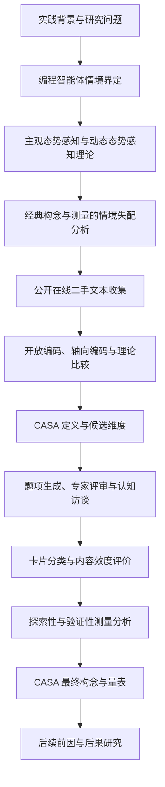
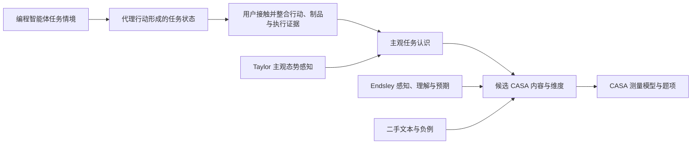

# 编程智能体态势感知研究

<!-- 本稿整合第 54 号开篇稿与第 68 号构念开发稿，并按照 Dong 学位论文第一至第三章的功能结构重写。第三章所述数据收集、编码和量表验证尚未实施，均为预期研究方案。 -->

## 第 1 章 绪论

### 1.1 选题背景与问题提出

#### 1.1.1 研究背景

作为数字产品、数字服务和组织信息基础设施的生产活动，软件开发已经成为现代经济运行和企业价值创造的重要基础。工业和信息化部统计显示，2025 年我国软件和信息技术服务业实现软件业务收入 154831 亿元，同比增长 13.2%，其中信息技术服务收入 106366 亿元，同比增长 14.7%（工业和信息化部，2026）。随着生成式人工智能快速发展，软件开发正在进入人工智能广泛参与需求理解、程序生成、测试、缺陷修复和软件维护的新阶段。国务院发布的深入实施人工智能+行动意见将智能化研发工具和平台推广应用列为技术研发模式创新的重要内容，并提出在软件等领域推动智能体广泛应用（国务院，2025）。麦肯锡全球研究院对 63 类生成式人工智能用例的分析表明，软件工程是生成式人工智能潜在经济价值最集中的四类企业职能之一，其直接生产率价值可能相当于软件工程年度支出的 20% 至 45%（McKinsey Global Institute, 2023）。中国信息通信研究院人工智能研究所与华为云计算技术有限公司（2024）的调研也显示，人工智能与开发工具的结合正在由代码生成逐步扩展到工具调用和工程任务执行。软件产业规模、国家政策导向和企业生产率预期共同表明，人工智能参与软件开发已经成为具有重要经济影响的实践趋势。

编程智能体为人工智能参与软件开发创造了新的可能，并改变了软件开发的作业方式。本文所称的编程智能体，是能够接受用户提出的软件开发目标，在一定权限边界内获取项目情境、规划任务步骤、调用开发工具、修改软件制品、检查执行结果并继续调整行动的能动型信息系统。它的核心特征是把用户表达的目标转化为一系列相互关联的软件工程行动，而不要求用户预先指定每一步操作。随着模型推理、长上下文和工具调用能力不断提高，个体开发者开始把缺陷修复、代码重构、测试生成、项目理解和文档维护等相对完整的任务交给编程智能体执行。Stack Overflow（2025）的开发者调查显示，24.1% 的专业开发者已经每日或每周在工作中使用人工智能代理；在报告代理用途的开发者中，83.5% 将软件工程列为使用领域。编程智能体因而正在由个人开发者尝试的新型工具发展为企业软件生产中受到关注的技术形态。如何使编程智能体的任务执行能力转化为稳定的软件开发价值，已经成为企业采用这一技术需要面对的问题。

编程智能体突破了传统开发工具主要响应用户具体操作的限制，使用户能够通过目标委托调用连续的软件工程行动。用户的工作由以直接编辑和执行为主，逐步转向任务界定、情境提供、行动确认、变化理解和后续决策等活动与直接操作并存。在一次任务中，编程智能体可以读取项目结构、跨文件修改代码、更新配置或依赖、运行命令和测试，并根据执行结果继续采取行动。相应地，智能体的行动说明、软件制品变化和工具执行结果成为用户认识任务进展与当前状况的重要信息来源。编程智能体的应用由此推动软件开发从用户借助工具亲自改变软件制品，进入用户与能动型信息系统共同推进任务的新阶段（Baird & Maruping, 2021）。

这种任务委托改变了用户参与软件任务的方式，但没有消除用户在任务推进过程中作出判断的需要。Kumar 等（2025）发现，采用渐进方式解决任务并持续调整智能体工作的开发者更容易完成真实软件任务。Dhanorkar 等（2026）进一步表明，开发者会在事前限制、共同规划、实时查看和事后复核等阶段持续判断智能体工作的进展与结果。这些活动要求用户不仅接收智能体最终提交的结果，还要认识智能体采取了哪些行动、软件制品如何变化以及当前结果对任务意味着什么。用户在获得任务执行便利的同时，仍需依据系统提供的行动痕迹和执行证据判断是否继续委托、何时介入以及能否接受智能体的工作。

传统开发工具主要支持用户亲自实施软件开发操作，用户通常能够借助自己的行动记忆理解任务已经进行到何处以及软件制品为何形成当前状态。编程智能体在替用户连续执行任务时，使部分关键行动和工作空间变化发生在用户的直接操作经验之外。它同时具有软件制品生产属性和能动型信息系统的代理行动属性，用户面对的因而不只是一个生成结果，而是由智能体行动持续形成和更新的任务状态。用户需要根据系统反馈形成对智能体行动、软件变化、任务进展和后续影响的整体认识。这种对动态任务状态的认识，与态势感知研究所关注的问题具有直接联系。

既有态势感知研究表明，个体对当前任务情境的认识与其后续评价和行为存在联系。Jaeger 和 Eckhardt（2021）发现，个体的情境信息安全态势感知提高感知威胁和感知应对效能，并最终影响实际安全行为。Nadj 等（2020）发现，交互式分析功能可以提高任务表现却降低态势感知，说明系统产出改善不能替代用户对任务局面的认识。在其他动态任务环境中，任务特定的主观态势感知也能够预测主观和客观任务表现，并且不与工作负荷高度重合（Rose et al., 2018）。在人与人工智能交互研究中，态势感知也被视为用户与自主系统有效互动的重要认知条件（Endsley, 2023）。来自相邻动态任务的证据说明，用户形成的任务认识可能关系到其后续评价与行动。由于编程智能体用户在不直接执行每一步操作的情况下仍需判断任务进展与结果，用户对智能体任务态势的主观认识构成一个具有理论和实践意义的研究问题。

本文把这种主观任务认识称为编程智能体态势感知。编程智能体态势感知是指个体用户在一次具体编程智能体任务中，对自己能够认识智能体代理行动所形成的任务相关状态及其近期发展的程度判断。任务相关状态包括智能体采取的行动、软件制品发生的变化、执行结果提供的证据以及这些内容与用户任务目标之间的关系。较高的编程智能体态势感知表示用户感觉自己能够形成连贯且可更新的任务认识；较低的编程智能体态势感知表示用户难以判断任务已经发生什么、当前状态意味着什么或任务接下来可能如何发展。下文使用其英文名称 Coding Agent Situation Awareness 的首字母缩写 CASA。

CASA 的意义首先体现在一次任务中的后续判断。它可能为用户判断任务是否符合预期、是否让智能体继续执行、是否介入任务以及是否接受其工作提供认知基础。CASA 还可能影响用户的感知控制和使用满意度，而满意度又与信息系统持续使用意愿密切相关（Baronas & Louis, 1988; Bhattacherjee, 2001）。对企业而言，只有当用户愿意在真实工作中持续委托任务时，编程智能体的技术能力和采购投入才可能转化为稳定的使用价值。因此，识别 CASA 的构成、形成条件和使用后果，不仅有助于理解个体用户如何参与编程智能体任务，也能够为产品设计和组织采用提供依据。

#### 1.1.2 问题提出

编程智能体作为一种新兴的软件开发系统形态，已经引起研究者、开发者和企业管理者的广泛关注。然而，相关研究的进展很大程度上由模型能力评价、软件制品分析和产品实践推动，关于个体用户如何认识智能体任务状态的理论研究仍处于起步阶段。不同于传统开发工具，编程智能体不仅支持用户完成操作，而且能够在一定自主程度下替用户连续执行软件开发任务。随着智能体能够承担的行动范围不断扩大，如何在减少用户直接操作的同时支持其了解任务态势，构成编程智能体发展带来的重要研究问题。

代理技术运用于软件开发，促进了用户与开发工具关系的变化。编程智能体连续采取行动并改变软件制品之后，用户需要认识任务已经进行到何种状态，理解智能体行动及软件变化对任务目标的意义，并对任务的后续发展形成判断。现有研究已经讨论了自动化信任、系统透明、感知控制和一般可用性等因素，但这些概念分别关注用户对系统的信赖、系统信息的可见程度、用户对影响系统的感受或交互使用质量，并不直接描述用户感觉自己在多大程度上了解当前任务状态。态势感知关注个体对动态任务情境中相关事件、因素和变量的认识与预期，为解释上述问题提供了适合的概念基础（Taylor, 1990; Endsley, 1995b）。

经典态势感知主要形成于航空、交通控制和自动化等动态操作任务，其中操作者持续认识外部环境与被控系统的当前状况，相关状态要素通常可以依据既定任务预先分析。编程智能体任务中的状态不仅随任务推进而变化，而且由智能体代替用户采取行动而持续形成，并分布在智能体计划与行动、相互依赖的软件制品以及测试和运行证据之间。用户又可能在任务已经推进后，通过智能体保留的行动痕迹重新建立任务认识。经典态势感知的既有内容和测量方式因而无法直接说明用户应当认识哪些编程智能体任务状态，也难以充分反映任务委托所造成的间接行动关系。如何以态势感知为唯一基础构念，发展适用于编程智能体的情境化构念并建立相应测量方式，是本文首先需要解决的问题。

CASA 的构念开发为进一步研究其形成条件和使用后果提供基础。智能体行动说明、差异视图、测试证据和审批机制等设计可能改变用户接触任务状态的机会，任务复杂性、软件开发经验和智能体使用经验也可能影响用户形成任务认识的能力。CASA 形成后，又可能影响用户的继续委托、介入和结果接受判断，并进一步关系到感知控制、满意度和持续使用。现有文献尚未形成 CASA 的清晰概念结构和测量方法，也未系统识别其前因与后果。本文据此依次考虑构念与量表开发、前因研究和后果研究三个相互衔接的子研究。

基于以上分析，本文拟解决以下研究问题。

（1）如何以态势感知为基础发展 CASA 构念，CASA 包含哪些具体内容和维度，如何对 CASA 及其维度进行测量？

（2）CASA 如何形成，影响 CASA 的关键用户因素、任务因素和系统设计因素有哪些？

（3）CASA 如何影响用户的任务判断、感知控制、使用满意度和持续使用意愿？

### 1.2 研究目的与研究意义

#### 1.2.1 研究目的

编程智能体的发展使个体用户能够把多步骤软件任务委托给能够自主采取行动的信息系统，也使用户对任务过程的认识不再完全来自自己的操作经历。现有研究已经揭示开发者在编程智能体使用中需要开展规划、查看、验证和接管等活动，但尚未形成一个能够描述用户主观任务认识程度的情境化构念。本文以主观态势感知为概念基础，以个体用户的一次具体编程智能体任务为分析单位，旨在发展 CASA 构念及其测量，并为后续解释 CASA 的形成条件和使用后果提供理论与方法基础。具体研究目的如下。

（1）明确 CASA 的概念内涵、分析层级和适用边界。本文将比较编程智能体任务与经典动态操作任务在状态生成、状态载体和用户接触方式上的差异，以真实用户材料识别用户所认识的任务状态，并区分 CASA 与客观任务知识、系统透明度、人工智能信任、感知控制和认知负荷。

（2）识别 CASA 的维度结构并开发测量量表。本文将结合公开在线二手文本、态势感知理论和构念开发规范，通过开放编码、轴向编码、理论比较、专家评审、卡片分类、认知访谈和多轮独立样本验证，形成具有内容效度、信度、区分效度和增量效度的 CASA 测量工具。

（3）为 CASA 前因和后果研究建立可检验的理论基础。构念与量表形成后，后续研究将考察用户因素、任务因素和系统设计因素如何影响 CASA，并分析 CASA 与任务判断、感知控制、满意度和持续使用意愿之间的关系。

#### 1.2.2 研究意义

本文以编程智能体任务中的主观任务认识为研究对象，把态势感知引入能动型信息系统的个体使用过程，并通过情境化构念开发建立可供后续实证研究使用的测量工具，具有以下理论意义。

（1）本文拓展态势感知研究所考察的任务关系。经典研究主要关注操作者对外部环境或被控系统状态的认识，本文则考察用户在把任务委托给能够自主改变软件制品的智能体后，如何认识由代理行动持续形成的任务状态。该研究有助于说明态势感知在间接行动、开放目标和数字制品持续变化条件下包含什么具体内容。

（2）本文发展编程智能体情境中的个体层构念。现有编程智能体研究多以任务成功、代码质量、互动模式、审查活动或信任评价为研究对象，尚未形成描述用户感觉自己在多大程度上了解整个智能体任务的统一构念。CASA 能够把分散在行动、软件变化、执行证据和任务目标之间的主观认识纳入同一理论对象，并与系统属性、用户态度和客观知识相区分。

（3）本文为能动型信息系统使用研究提供新的测量基础。信息系统委托研究说明用户可以把目标导向的行动交给能动型制品实施，但尚未提供用于测量用户在委托过程中所形成任务认识的个体层工具（Baird & Maruping, 2021）。CASA 的开发能够为后续考察系统设计、任务条件、用户经验和使用结果之间的关系提供可操作化构念。

本文的实践意义主要体现在以下方面。

（1）CASA 量表可以帮助产品设计者诊断用户在哪些任务状态上难以形成认识。与只评价系统是否提供日志、差异视图或通知不同，CASA 直接考察用户是否感觉自己了解行动、变化、证据及其与任务目标的关系，从而为界面信息呈现、审批机制和任务回顾设计提供更接近用户体验的评价依据。

（2）CASA 研究可以帮助开发者和组织确定适合的任务委托与使用方式。不同任务、工具形态和用户经验可能形成不同程度的 CASA。识别这些差异，有助于组织制定任务边界、过程检查、结果复核和培训安排，避免仅依据代码产出或短期效率评价编程智能体的使用质量。

（3）CASA 的前因和后果研究可以为编程智能体的持续采用提供依据。研究哪些设计与任务条件有助于用户形成连贯的任务认识，并检验这种认识是否关系到感知控制、满意度和持续使用，可以帮助企业理解技术能力如何通过个体使用经历转化为较稳定的应用价值。

### 1.3 研究现状及评述

#### 1.3.1 编程智能体相关研究

##### 1.3.1.1 基于任务能力与软件制品的研究

人工智能编程研究早期主要关注模型生成代码的正确性、任务通过率和软件制品质量。随着系统获得项目读取、工具调用和连续行动能力，研究对象开始由单次代码建议扩展到真实仓库中的多步骤任务。相关研究通过任务基准、仓库问题和软件制品分析评价智能体能否完成缺陷修复、测试生成和代码修改。这类研究有助于识别编程智能体的技术能力与失败模式，但任务是否完成不能直接说明用户是否理解智能体如何推进任务。自动化与决策支持研究已经表明，系统表现与用户态势感知可能发生背离（Endsley & Kiris, 1995; Nadj et al., 2020）。

##### 1.3.1.2 基于开发者互动与审查活动的研究

另一类研究关注开发者如何与人工智能编程系统互动。Barke 等（2023）发现，程序员使用代码生成工具时会在目标明确的加速模式与目标仍在形成的探索模式之间切换。Mozannar 等（2024）进一步识别了程序员阅读、验证、编辑和处理代码建议时的活动及其时间成本。Ferdowsi 等（2024）发现，持续呈现运行时值可以降低部分人工智能生成代码的验证困难，说明执行证据的呈现会改变用户理解建议的条件。Wang 等（2024）表明，开发者通过评价系统能力和具体代码建议形成信任判断，而现有界面仍缺少支持高效评价的功能。

针对能够连续行动的编程智能体，Kumar 等（2025）记录了渐进协作、调试和测试中的互动方式，并发现持续参与和调整与真实任务完成有关。Dhanorkar 等（2026）则识别了任务前、中、后的多类审查工作以及生成代码难以理解和检查等问题。Kuo 等（2026）的现场研究还表明，开发者对主动式人工智能建议的接受取决于建议出现的工作流阶段。上述研究说明用户并未因智能体能够行动而退出任务过程，而是在不同阶段通过计划、观察、验证和调整继续参与。

##### 1.3.1.3 基于个体评价与使用体验的研究

现有个体层研究还考察信任、控制、透明度、工作负荷、可用性和满意度等评价。信任描述用户愿意依赖系统或接受其建议，感知控制描述用户感觉自己能够影响系统或任务结果，透明度描述系统提供行动、理由和状态信息的程度（Baronas & Louis, 1988; Wang et al., 2024; van de Merwe et al., 2024）。这些概念能够解释编程智能体使用中的重要问题，但均不等同于用户对当前任务状态的主观认识。用户可能信任智能体却不了解其改变了什么，也可能拥有停止和回滚权限却不知道何时需要使用。界面还可能提供大量信息，但用户仍无法把这些信息联系到任务目标。因而，编程智能体使用研究需要在系统属性、用户态度和任务认识之间作出清楚区分。

#### 1.3.2 态势感知相关研究

##### 1.3.2.1 基于概念与理论发展的研究

态势感知用于描述个体在动态任务中对相关状态的认识。Taylor（1990）从主观评价出发，把态势感知表述为个体对影响任务成功的事件、因素和变量所具有的知识、认知与预期。Endsley（1995b）则从动态决策出发，将态势感知界定为个体对一定时间和空间范围内环境要素的感知、对这些要素意义的理解以及对其近期状态的预期。前者为研究个体如何评价自身任务认识提供基础，后者说明态势感知的内容如何由感知、理解和预期逐层形成，并受到个体、任务和系统因素影响。

##### 1.3.2.2 基于态势感知测量的研究

态势感知形成了主观评价和客观探测等不同测量传统。Taylor（1990）开发态势感知评定技术，通过注意需求、注意供给和理解等维度评价个体对自身态势感知的总体判断。Endsley（1995a）开发态势感知全球评估技术，通过暂停任务并询问预先确定的状态问题评价参与者实际掌握的任务信息。两类方法对应不同测量对象，主观评价反映个体感觉自己了解任务的程度，客观探测反映个体对预定任务状态的回答正确程度。相关研究表明，主观与客观态势感知不应被视为完全相同的测量结果（Endsley et al., 1998; Endsley, 2020）。

##### 1.3.2.3 基于情境化应用的研究

态势感知已经被应用于航空、自动化、列车驾驶、决策支持、信息安全和人与自主系统互动等任务。Rose 等（2018）发现，通用主观量表难以适应低事件列车驾驶，因而依据列车位置、速度、信号和未来事件等任务要求开发任务特定量表。Jaeger 和 Eckhardt（2021）把态势感知情境化为员工面对网络钓鱼威胁时的信息安全态势感知。Selkowitz 等（2017）及 van de Merwe 等（2024）则讨论系统透明度如何支持用户对自主智能体行动、理由和未来状态的认识。这些研究共同说明，态势感知可以跨任务研究，但其状态内容和测量方法必须与用户目标及任务要求相一致（Stanton et al., 2006; Moens et al., 2026）。

#### 1.3.3 研究现状评述

现有研究为本文提供了以下基础。第一，编程智能体已经能够围绕用户目标连续采取行动，用户与系统的关系由直接操作扩展到任务委托。第二，开发者在任务设置、执行查看和结果复核等阶段仍需参与，说明用户对任务过程的认识具有现实基础。第三，态势感知研究已经形成概念、理论和多种测量传统，并证明任务内容变化可能要求重新界定和操作化具体态势感知。

现有研究仍存在以下不足。

（1）缺少对编程智能体任务认识的统一概念化。现有研究分别讨论互动模式、验证活动、信任判断、审查实践和提示时机，但尚未把用户对智能体行动所形成任务状态的主观认识作为共同构念加以研究。

（2）既有态势感知内容与编程智能体任务结构存在具体失配。经典任务中的状态多来自外部环境或预定系统，编程智能体中的状态则由代理行动持续生成，并分布在行动轨迹、软件制品和执行证据之间。通用态势感知量表不能直接覆盖这些状态对象。

（3）缺少能够服务个体层实证研究的 CASA 测量工具。没有清晰定义和量表，研究者难以比较不同任务、产品形态和用户群体的 CASA，也无法检验系统设计与 CASA、CASA 与用户评价之间的关系。

（4）缺少对主观任务认识与相邻概念的系统区分。系统透明度、信任、感知控制和认知负荷可能成为 CASA 的前因、后果或相邻现象，但不能替代 CASA 本身。若不建立内容边界，编程智能体研究容易把信息提供、态度评价、任务知识和主观认识混为一体。

因此，本文首先需要以态势感知为基础，通过真实用户材料识别编程智能体任务认识的内容和边界，形成 CASA 构念并开发相应量表。该工作构成后续前因和后果研究的基础。

### 1.4 研究内容与结构

#### 1.4.1 研究内容

围绕前述研究问题，本文拟开展以下研究。

（1）发展 CASA 构念并开发测量量表。本文将界定编程智能体及其任务状态，分析经典态势感知在这一情境中的适用性和不足，采用公开在线二手文本识别 CASA 的经验内容，并通过构念定义、维度识别、题项生成、内容效度评价和多轮独立样本验证形成测量量表。

（2）研究 CASA 的形成条件。在构念与量表得到验证后，后续研究将从用户、任务和系统设计三个方面识别可能影响 CASA 的关键因素，并分析不同因素如何共同作用于用户的主观任务认识。

（3）研究 CASA 的使用后果。后续研究将考察 CASA 是否影响用户在任务中的继续、介入和接受判断，并进一步检验 CASA 与感知控制、使用满意度和持续使用意愿之间的关系。

本稿先完成前三章，集中呈现第一项研究。后续两个子研究仅在第一章中说明其与构念开发的衔接，不在第二章展开全部理论背景，也不在本稿中提出完整模型和假设。

#### 1.4.2 研究结构

第 1 章为绪论。本章从软件产业发展、编程智能体的任务代理能力和用户参与方式变化出发，提出 CASA 研究问题，说明研究目的与意义，评述编程智能体和态势感知研究现状，并介绍研究内容、方法和技术路线。

第 2 章为编程智能体态势感知研究的理论基础与分析。本章界定编程智能体及其使用情境，介绍主观态势感知、动态态势感知理论和主要测量传统，比较编程智能体任务与既有态势感知任务的结构差异，并建立服务 CASA 构念开发的理论框架。

第 3 章为编程智能体态势感知的构念发展与量表开发。本章首先发展 CASA 的概念定义和边界，然后采用公开在线二手文本识别构念内容和候选维度，最后按照条目生成、条目修订、条目评估和条目确定的程序开发并验证 CASA 量表。

后续研究将在 CASA 构念和量表成立后，分别考察其形成条件和使用后果。由于本稿只规划构念开发子研究，后续章节的理论模型、研究假设和实证设计暂不展开。

### 1.5 研究方法与技术路线

#### 1.5.1 研究方法

本文采用定性与定量相结合的混合研究方法，使经验材料中的内容发现、理论概念化和量表统计验证相互衔接（Venkatesh et al., 2013）。前三章涉及的主要研究方法如下。

（1）文献研究法。本文系统梳理编程智能体、能动型信息系统委托、态势感知和构念测量文献，用于界定研究对象、选择基础构念、识别既有测量方式及其情境失配，并形成二手文本分析和量表开发的理论依据。

（2）二手定性数据分析法。本文拟从 Reddit 等公开在线社区收集编程智能体用户围绕具体任务发表的帖子和评论，通过开放编码、轴向编码、理论比较和负例分析识别 CASA 的内容与边界。公开文本能够保留用户在自然使用情境中描述行动、变化、理解困难和后续判断的语言，为情境化构念开发提供经验基础。

（3）卡片分类与认知访谈法。本文拟邀请具有编程智能体经验的用户和相关领域研究者，对候选维度和测量题项进行多轮分类，并通过认知访谈检查题项对象、时间边界、程度限定和反应选项是否被参与者按预期理解。

（4）问卷调查与心理测量分析法。本文拟采用多轮独立样本开展探索性因子分析、验证性因子分析、竞争测量模型比较、信度与效度检验、测量不变性和增量效度分析，以确定 CASA 的最终量表及其测量模型。

（5）理论比较法。本文将以 Taylor（1990）的主观态势感知界定被测属性，以 Endsley（1995b）的动态态势感知理论组织候选内容，并将经验范畴与客观任务知识、透明度、信任、感知控制和认知负荷进行比较，防止把前因、后果或相邻概念纳入 CASA。

#### 1.5.2 技术路线

本文前三章的技术路线如下。

## 第 2 章 编程智能体态势感知研究的理论基础与分析

编程智能体是一种能够围绕用户目标连续采取软件工程行动的能动型信息系统，其任务过程不同于用户直接操纵传统开发工具的过程。对 CASA 进行构念开发，首先需要明确编程智能体的概念、特征和任务结构，然后说明态势感知的概念传统、理论内容和测量方法，最后分析经典态势感知在编程智能体情境中的适用性与不足。本章据此界定编程智能体使用情境，系统介绍主观态势感知和动态态势感知理论，比较相关测量传统，并建立第三章构念开发所需的理论框架。

### 2.1 编程智能体及其使用情境的内涵

#### 2.1.1 编程智能体的概念界定

人工智能参与软件开发经历了由规则化自动化、代码生成和建议支持向目标导向代理行动扩展的过程。传统集成开发环境、编译器、测试工具和自动化脚本能够执行用户明确指定的操作，代码生成模型和聊天式系统能够根据提示生成候选代码或解释，而编程智能体进一步取得了读取工作空间、调用工具、修改制品和依据反馈选择后续行动的能力。系统由提供单项输出转向推进一组相互依赖的行动，使用户能够把相对完整的软件开发任务作为交互单位。

信息系统研究把能够自主发起行动、适应环境和代表用户实施目标的系统称为能动型信息系统制品（Schuetz & Venkatesh, 2020; Baird & Maruping, 2021）。Baird 和 Maruping（2021）进一步指出，用户与这类制品之间不仅存在传统意义上的使用关系，还存在任务委托关系。委托意味着用户把目标导向的行动分配给信息系统代理实施，并在任务过程中对行动分配、执行协调和结果作出评价。编程智能体体现了这种关系，因为它不仅响应一次命令，还能够在用户给定目标和权限边界后选择多项软件工程行动。

基于以上分析，本文把编程智能体定义为能够接受个体用户提出的软件开发目标，在一定权限范围内获取项目情境、规划并连续实施软件工程行动、观察执行反馈、修改软件制品或开发环境，并据此调整后续行动的能动型信息系统。该定义包含目标委托、连续行动、环境作用和反馈适应四项必要条件。只提供一次代码补全、文本建议或预定脚本执行的系统不属于本文所研究的编程智能体，除非它在具体任务中获得了围绕目标选择并实施后续行动的能力。

#### 2.1.2 编程智能体的主要特征

第一，编程智能体以目标而不是单项操作作为主要输入。用户可以提出修复缺陷、增加测试、重构模块或迁移依赖等目标，智能体需要把目标转化为一系列具体行动。目标通常只规定预期结果和部分约束，不完全规定行动顺序和中间状态。

第二，编程智能体能够连续选择和调整行动。它可以搜索代码库、阅读相关文件、编辑多个制品、运行命令和测试，并根据错误、测试结果或用户反馈继续推进。一次任务中的后续行动因而可能取决于此前由智能体自己造成或发现的状态。

第三，编程智能体直接改变共享的软件工作空间。代码、配置、依赖、测试、文档和版本状态都可能成为智能体行动的对象。软件制品之间具有依赖关系，一项局部修改可能产生跨文件和跨模块影响（Kretsou et al., 2021）。用户需要认识的不是孤立输出，而是行动在整个任务和软件工作空间中形成的变化。

第四，用户以间歇和混合方式参与任务。用户可能在事前界定任务和权限，在执行中查看、批准或纠正行动，在事后审查差异、测试和结果，也可能在智能体后台推进后重新进入任务。Dhanorkar 等（2026）识别的事前限制、共同规划、实时查看和事后复核说明，用户参与并未消失，而是分布在不同时间位置。

第五，编程智能体任务同时产生行动结果和认识证据。智能体的自然语言说明、行动计划、工具调用记录、软件差异、测试输出和运行结果既是任务过程的一部分，也是用户判断任务状态的证据。不同证据可能分散在多个界面和制品中，也可能相互矛盾。CASA 因而不仅与系统做了什么有关，还与用户能否把这些证据整合为连贯任务认识有关。

#### 2.1.3 编程智能体的任务过程

编程智能体任务并不必然遵循固定流程，但现有研究和产品实践显示，用户参与通常涉及目标界定、任务规划、代理执行、状态检查和后续处置等活动（Kumar et al., 2025; Dhanorkar et al., 2026）。这些活动可以反复发生，也可以由不同界面支持。表 2-1 概括了各类活动、主要状态对象及用户需要作出的判断。

**表 2-1 编程智能体任务中的用户活动与状态对象**

| 任务活动 | 主要状态对象 | 用户可能作出的判断 |
| --- | --- | --- |
| 目标与边界设定 | 任务目标、仓库范围、工具权限和限制条件 | 智能体是否获得了正确且充分的任务边界 |
| 计划与情境建立 | 智能体计划、检索范围、相关文件和依赖关系 | 智能体是否理解任务及项目情境 |
| 行动与执行 | 文件修改、命令调用、测试和运行反馈 | 任务已经发生什么，是否仍按预期推进 |
| 中途查看与介入 | 当前进展、异常、失败和未解决事项 | 是否继续、补充信息、纠正方向或接管 |
| 结果复核与接受 | 最终差异、测试证据、残余问题和影响范围 | 是否接受结果，是否需要进一步验证或修复 |

这些活动并不意味着用户必须持续监看智能体。编程智能体的价值部分来自减少直接操作和持续关注。CASA 所关注的是，无论用户连续参与还是间歇返回任务，用户是否感觉自己能够认识与当前判断有关的任务状态。它不以监督频率或查看次数定义高低，也不预设持续观察一定优于结果后复核。

#### 2.1.4 编程智能体与其他开发交互形态的区别

编程智能体建立在大语言模型、开发工具和自动化能力之上，但其研究边界不能仅由底层技术确定。区分不同交互形态的关键是用户以何种单位提出要求、系统是否选择连续行动、系统是否直接改变工作空间，以及用户通过何种过程认识变化。表 2-2 对相关形态进行比较。

**表 2-2 编程智能体与其他开发交互形态的比较**

| 交互形态 | 用户主要输入 | 系统行动范围 | 软件制品变化来源 | 用户认识任务状态的主要方式 |
| --- | --- | --- | --- | --- |
| 传统开发工具 | 明确命令、点击或编辑 | 执行指定操作 | 用户直接操作 | 行动记忆与即时工具反馈 |
| 代码补全 | 当前代码情境与接受操作 | 提供局部候选代码 | 用户决定并接受候选 | 阅读单项建议与局部差异 |
| 聊天式代码生成 | 自然语言问题或生成请求 | 生成文本、解释或代码片段 | 用户复制、整合或执行 | 阅读回答并自行映射到项目 |
| 预定自动化 | 预先配置的规则或工作流 | 按固定逻辑执行 | 脚本或流水线执行 | 预定步骤、日志和结果状态 |
| 编程智能体 | 软件任务目标与约束 | 选择并调整多步骤行动 | 智能体直接修改工作空间或环境 | 整合计划、行动轨迹、制品变化和执行证据 |

表 2-2 表明，编程智能体的独特之处不只是生成代码，而是以用户未逐项指定的连续行动改变软件任务状态。由此产生的理论问题是，用户如何认识由代理行动而不是自身直接操作形成的任务状态。这一问题构成 CASA 情境化发展的起点。

### 2.2 编程智能体态势感知的理论基础

#### 2.2.1 主观态势感知与 SART

态势感知概念源于对动态复杂任务中操作者认识状态的研究。Taylor（1990）把态势感知表述为个体对影响任务成功的事件、因素和变量所具有的知识、认知与预期，并开发态势感知评定技术 SART。SART 不通过判断参与者回答任务问题是否正确来测量态势感知，而是要求参与者对自身任务认识及其信息处理条件作出主观评价。这一路径适合本文所关注的用户体验属性，因为 CASA 测量的是用户感觉自己在多大程度上了解任务，而不是用户实际回答了多少状态问题。

完整 SART 包含十项评价，并通常归纳为注意需求、注意供给和情境理解三个组成部分。注意需求涉及任务情境的不稳定性、复杂性和变化程度，注意供给涉及个体的唤醒、注意集中和注意分配，情境理解涉及信息数量、信息质量和熟悉程度。传统合成方法以理解减去注意需求与注意供给之差形成总分，但后续研究指出，这种计分方式涉及测量层级和维度解释问题，不能未经分析地把各组成部分视为同一潜在属性的可互换指标（Bolton et al., 2022）。

SART 为 CASA 提供了两个重要基础。其一，态势感知可以作为个体对自身任务认识的程度判断进行测量。其二，主观态势感知量表需要围绕参与者实际面对的任务内容建立可理解的评价对象。然而，SART 中的部分内容同时涉及任务要求和注意资源，并非全部直接描述用户已经形成的任务认识。若把通用 SART 直接用于编程智能体，研究可能把任务复杂、注意负担和用户任务认识混入同一分数。因此，本文以 Taylor 的主观测量传统确定 CASA 的属性性质，但不直接沿用 SART 的全部维度和合成方式。

#### 2.2.2 动态态势感知理论

Endsley（1995b）从动态决策过程出发，将态势感知界定为个体对一定时间和空间范围内环境要素的感知、对这些要素意义的理解以及对其近期状态的预期。该理论把态势感知组织为三个相互联系的层级。第一层是感知任务相关要素及其当前状态，第二层是结合任务目标理解要素的意义，第三层是根据当前认识预期任务近期可能如何发展。

感知、理解和预期不是三个彼此独立的操作步骤，而是动态任务认识的不同内容层级。个体可能接触到大量状态信息，却不能理解其对目标的意义；也可能理解当前局部变化，却无法判断该变化将如何影响后续任务。较高层级通常依赖较低层级提供内容，但人的长期记忆、经验和目标也会影响信息选择及意义形成。态势感知因而是持续更新的任务模型，而不是对系统信息数量的简单反映。

动态态势感知理论还区分了态势感知的影响条件和决策结果。个体能力、经验和目标，任务复杂性、工作负荷和自动化程度，以及系统界面提供的信息，会影响态势感知形成；态势感知又为后续决策和行为提供认知基础。该区分对 CASA 构念开发十分重要。界面是否呈现日志、差异和通知属于潜在系统条件，用户是否信任、介入或接受结果属于相邻评价或后续反应，只有用户对任务状态形成的主观认识属于 CASA 本身。

Endsley 理论在自动化研究中还揭示了脱离过程问题。当系统承担更多任务时，操作者可能减少对任务状态的直接接触，并在系统失效时难以重新接管（Endsley & Kiris, 1995）。编程智能体同样会替用户实施原本由用户完成的操作，但其任务目标更开放，行动会改变相互依赖的软件制品。动态态势感知理论能够解释为什么任务代理能力扩大并不自动意味着用户更了解任务，也为识别 CASA 内容提供感知、理解和近期预期三个理论观察位置。

#### 2.2.3 态势感知的测量与情境化

态势感知研究形成了主观评价、任务探测、行为指标和过程指标等多种方法。不同方法测量的对象并不相同，也不能因为名称相同而相互替代（Stanton et al., 2006; Endsley, 2020; Moens et al., 2026）。表 2-3 汇总了与 CASA 直接相关的主要研究传统。

**表 2-3 与 CASA 相关的态势感知概念和测量传统**

| 研究情境 | 主要研究对象 | 概念或测量重点 | 对 CASA 的作用 | 直接迁移的局限 |
| --- | --- | --- | --- | --- |
| 航空主观态势感知 | 空勤人员 | 注意需求、注意供给与理解的主观评价 | 确定主观程度判断的测量传统 | 混入航空任务要求和注意资源，缺少软件任务状态内容 |
| 动态任务客观态势感知 | 操作者 | 对预定状态问题的回答正确程度 | 说明状态要求需由任务分析确定 | 依赖预定问题与正确答案，不直接测量主观体验 |
| 低事件列车驾驶 | 列车驾驶员 | 位置、速度、信号与未来事件的任务特定主观认识 | 证明主观量表需要依据任务状态重新开发 | 状态对象仍是相对稳定的物理交通环境 |
| 运营决策支持 | 决策者 | 仪表盘功能、态势感知与任务表现 | 说明系统表现与用户态势感知可能背离 | 围绕预定运营变量和分析问题建立 |
| 信息安全威胁 | 个体员工 | 对网络钓鱼威胁情境的注意、解释与风险认识 | 说明个体态势感知可以连接评价与实际行为 | 状态中心是外部威胁，不是代理行动形成的软件变化 |
| 自主智能体协作 | 人类操作者 | 对智能体行动、理由、未来状态和不确定性的认识 | 说明代理透明度可支持不同层级态势感知 | 多数任务不涉及开放软件目标和制品依赖关系 |

Rose 等（2018）的研究尤其说明，情境化不是把原量表中的任务名称替换为新对象。低事件列车驾驶与 SART 所形成的高事件任务条件不同，研究者需要先识别驾驶员真正需要认识的位置、速度、信号和未来事件，再建立任务特定主观量表。信息系统领域的研究也把态势感知具体化到网络钓鱼威胁和分析仪表盘任务（Nadj et al., 2020; Jaeger & Eckhardt, 2021）。这些研究为 CASA 提供了方法论依据，即先明确编程智能体任务中影响用户后续判断的状态内容，再决定构念维度与测量题项。

### 2.3 编程智能体态势感知的理论分析

#### 2.3.1 态势感知解释编程智能体使用的适用性

编程智能体任务具备态势感知理论所处理的三个基本条件。第一，任务状态持续变化。智能体采取行动后，软件制品、执行结果和待解决问题不断更新。第二，用户需要依据当前状态作出后续判断，包括继续委托、补充情境、纠正方向、接管任务和接受结果。第三，用户对状态的认识可能受到任务、经验和系统呈现方式影响，并可能与系统实际表现发生背离。态势感知因而能够解释用户在动态任务中形成什么认识，以及这种认识如何为后续判断提供基础。

态势感知还比信任、控制或透明度更直接地对应本文的研究问题。信任回答用户是否愿意依赖智能体，感知控制回答用户是否感觉能够影响任务，透明度回答系统在多大程度上提供行动及状态信息。CASA 回答的是用户感觉自己在多大程度上了解当前任务。用户可以在不了解任务状态时仍然信任系统，也可以在拥有控制权限时缺乏使用这些权限所需的任务认识。系统提供信息则只是用户形成 CASA 的条件之一。态势感知由此为描述编程智能体任务中的主观认识提供了必要且相对清晰的概念起点。

#### 2.3.2 经典态势感知在编程智能体情境中的不足

经典态势感知可以说明任务认识的一般逻辑，却不能直接确定编程智能体用户需要认识的具体内容。其不充分性来自任务状态生成方式、状态存在形式和用户接触状态方式的共同变化。

第一，任务状态由代理行动持续生成。在航空、列车驾驶和多数控制任务中，操作者面对的是外部环境或被控系统已经存在并持续变化的状态。编程智能体则会选择行动、修改代码和配置、运行命令并产生新的错误或证据。用户需要认识的状态不仅是环境发生了什么，还包括代理采取了什么行动以及这些行动为何形成当前软件状态。

第二，任务状态跨多种数字载体分布。编程智能体的计划和自然语言说明记录其行动意图，工具调用和终端输出记录执行过程，代码差异和文件状态记录制品变化，测试和运行结果记录部分后果。单一载体通常不足以说明任务状态，用户需要把不同证据与任务目标和软件依赖关系联系起来。经典通用量表没有规定这种跨载体整合内容。

第三，用户通过行动痕迹间接接触状态。传统操作任务中，操作者的行动本身构成认识状态的重要来源。编程智能体用户可能没有亲自实施每项修改，也可能在智能体已经推进若干步骤后重新进入任务。用户对任务的认识依赖系统保留和呈现的行动痕迹，并可能在事后重新建立。这种间接行动关系不同于持续直接操作，也不能由传统自动化层级完整表示。

第四，软件任务具有开放目标和制品依赖。不同代码库、任务目标和智能体行动会形成不同的相关状态，研究者难以像封闭实验任务一样预先枚举所有状态要素和正确答案。CASA 需要在保持任务具体性的同时，形成能够跨产品、代码库和任务类型使用的内容表述。

表 2-4 概括了上述差异及其对构念开发的要求。

**表 2-4 编程智能体任务与经典态势感知任务的结构差异**

| 比较方面 | 经典动态操作任务 | 编程智能体任务 | 对 CASA 开发的要求 |
| --- | --- | --- | --- |
| 状态生成 | 外部环境或预定系统持续变化 | 智能体行动持续产生新的软件状态 | 纳入代理行动及其造成的变化 |
| 状态载体 | 仪表、场景或预定变量 | 计划、行动轨迹、软件制品、测试和运行证据 | 识别跨载体整合的任务认识 |
| 用户接触 | 操作者持续直接参与 | 用户可能间歇查看并通过痕迹重建过程 | 测量主观认识，不以持续监看定义高低 |
| 任务结构 | 状态要素和目标可预先分析 | 开放目标、仓库依赖和行动路径随任务变化 | 形成任务特定但可跨情境使用的内容表述 |
| 测量基准 | 可建立预定状态问题和正确答案 | 不同任务的真实行动轨迹和相关状态不同 | 区分主观 CASA 与任务特定客观知识 |

#### 2.3.3 CASA 的概念边界

清晰构念需要说明核心属性、评价对象、适用条件及其与相邻概念的区别（Podsakoff et al., 2016）。CASA 的核心属性是个体对自身任务认识程度的判断，评价对象是一次具体编程智能体任务中由代理行动形成的任务相关状态，适用条件是系统能够围绕软件目标连续采取行动并改变软件制品或开发环境。表 2-5 说明 CASA 与主要相邻概念的边界。

**表 2-5 CASA 与相邻概念的区别**

| 概念 | 核心问题 | 与 CASA 的关系 | 不属于 CASA 的内容 |
| --- | --- | --- | --- |
| 客观任务知识 | 用户实际知道多少任务事实 | 可作为校准或效标证据 | 状态问题正确率本身 |
| 系统透明度 | 系统提供了多少行动、理由和状态信息 | 可能影响 CASA | 日志、差异或解释是否存在 |
| 人工智能信任 | 用户是否愿意依赖智能体 | 可能与 CASA 相互关联并影响接受判断 | 对能力、善意或可靠性的评价 |
| 感知控制 | 用户是否感觉能够影响任务和结果 | 可能是 CASA 的后果或相邻体验 | 停止、回滚或修改的能力感受 |
| 认知负荷 | 用户完成任务需要投入多少心理资源 | 可能影响 CASA 或受到信息设计影响 | 困难、努力和负担程度本身 |
| 任务表现 | 任务完成质量、速度或正确性 | 可用于检验结果关联 | 智能体是否成功完成任务 |

边界判断可以通过反例进一步说明。用户可能拥有清楚的差异视图，却仍然不理解代码变化对任务目标的意义，此时系统透明度较高而 CASA 较低。用户可能不了解智能体修改了什么，但因长期经验而高度信任产品，此时信任较高而 CASA 较低。用户也可能知道任务发生了什么，却没有权限停止或回滚，此时 CASA 较高而感知控制可能较低。这些组合说明 CASA 不能由任何一个相邻概念反向命名获得。

### 2.4 CASA 构念开发的理论框架

CASA 构念开发需要把基础构念、情境差异和经验材料分配到不同理论角色。本文以 Taylor（1990）的主观态势感知确定 CASA 所测量的是个体对自身任务认识程度的判断，以 Endsley（1995b）的动态态势感知理论组织可能涉及的感知、理解和近期预期内容。编程智能体的目标委托、代理行动、软件制品变化和间接状态接触用于界定情境边界，而不构成第二个基础构念。公开在线用户材料用于发现具体任务状态和候选维度，避免理论层级被直接强制为经验结构。

构念开发按照从任务情境到状态内容、从状态内容到主观认识、再从主观认识到测量的路径推进。首先，研究识别编程智能体用户在真实任务中需要认识哪些行动、变化、证据和近期发展。其次，研究判断用户表达是否真正涉及对自身认识程度的评价，而不是只描述客观事件、系统功能、态度或行为。再次，研究比较经验范畴与感知、理解和预期的关系，同时保留不能被既有层级充分解释的稳定内容。最后，研究依据确认后的内容领域决定维度结构和测量模型。

这一框架不预设 CASA 必然形成三个维度，也不预设构念一定属于反映式或形成式高阶结构。感知、理解和预期首先作为理论比较位置。只有当经验材料形成稳定、彼此可区分且具有任务意义的内容，并且这些内容不能由通用态势感知或相邻概念充分表示时，才能据此提出 CASA 的具体维度和测量模型。

### 2.5 本章小结

本章界定了编程智能体及其使用情境，指出目标委托、连续代理行动、软件工作空间变化、间歇用户参与和多源任务证据构成其主要特征。随后，本章介绍了 Taylor 的主观态势感知传统、Endsley 的动态态势感知理论以及主观评价和客观探测等测量方法。理论分析表明，态势感知适合描述用户对动态编程智能体任务的认识，但经典构念和量表未覆盖由代理行动生成、跨软件制品和执行证据分布、并通过行动痕迹间接接触的任务状态。本章据此明确 CASA 的概念边界，并建立由任务情境、状态内容、主观认识和测量操作化组成的理论框架，为第三章的构念发展、维度识别和量表开发奠定基础。

## 第 3 章 编程智能体态势感知的构念发展与量表开发

编程智能体改变了用户参与软件任务和认识任务状态的方式，但现有研究尚未形成用于描述这种主观任务认识的清晰构念与测量工具。本章以第二章建立的理论框架为基础，按照构念发展、维度识别和量表开发三个阶段推进 CASA 研究。首先，依据主观态势感知和编程智能体任务特征发展 CASA 的概念定义。其次，采用公开在线二手文本识别用户在真实任务中认识的状态内容，并通过开放编码、轴向编码、理论比较和分类验证确定候选维度。最后，按照条目生成、条目修订、条目评估和条目确定的程序开发 CASA 量表。由于实证工作尚未实施，本章呈现研究方案、判断标准和预期产出，不报告未经数据支持的维度或统计结果。

### 3.1 编程智能体态势感知的概念发展

#### 3.1.1 构念发展的必要性

构念是理论陈述和经验检验之间的基本连接。清晰构念需要确定研究对象、核心属性、适用条件、分析层级和与相邻概念的区别，测量题项则应完整代表构念所指内容（Lewis et al., 2005; MacKenzie et al., 2011; Podsakoff et al., 2016）。当新技术改变用户面对的对象、任务或交互关系时，直接沿用既有量表可能遗漏新的内容，也可能把原情境中的非核心条件带入新测量。信息系统研究因而强调，情境化理论发展需要说明新情境改变了哪些理论关系和构念内容，而不能只以研究对象新颖作为开发理由（Hong et al., 2014）。移动应用可用性和语音交互可用性研究也表明，研究者需要依据新的使用对象、交互方式和任务内容重新确定构念维度与测量题项，而不能直接移植其他技术环境中的量表（Hoehle & Venkatesh, 2015; Chen et al., 2024）。

态势感知已经具有成熟定义和测量传统，但不存在脱离任务内容的通用状态清单。SART 形成于航空任务，其注意需求、注意供给和理解同时反映任务条件、个体资源和主观认识。SAGAT 依赖任务分析形成预定状态问题和正确答案，适合评价参与者实际掌握的任务信息，却不能直接测量用户对开放编程智能体任务的主观体验。低事件列车驾驶、信息安全和运营决策研究也分别围绕特定任务重新确定状态内容（Rose et al., 2018; Nadj et al., 2020; Jaeger & Eckhardt, 2021）。

编程智能体进一步改变了态势感知的认识对象。用户需要理解的任务状态由智能体行动持续形成，跨计划、行动记录、软件制品和执行证据分布，并可能在用户未直接参与操作时发生变化。通用量表中的信息数量、复杂性或熟悉程度不能说明用户是否认识了智能体做了什么、软件为何形成当前状态以及任务近期可能如何发展。仅将 SART 中的航空任务名称替换为编程智能体，也无法获得与这些状态内容对应的测量。因此，本文需要以主观态势感知为基础，通过经验材料重新识别内容领域，而不是直接改写现有题项。

#### 3.1.2 CASA 的概念定义

本文将编程智能体态势感知定义为个体用户在一次具体编程智能体任务中，对自己能够认识智能体代理行动所形成的任务相关状态及其近期发展的程度判断。

该定义包含四项要素。第一，CASA 的分析层级是个体用户，而不是团队、项目或组织。第二，CASA 的时间边界是一次具体编程智能体任务，量表作答需要锚定参与者刚完成或能够清楚回忆的任务经历。第三，CASA 的评价对象是由智能体代理行动形成的任务相关状态，包括行动、软件制品变化、执行证据及其与任务目标的关系。第四，CASA 的核心属性是用户对自身任务认识程度的判断，而不是任务事实的客观正确率。

较高的 CASA 表示用户感觉自己能够形成连贯且可更新的任务认识，能够说明任务已经发生什么、当前状态对目标意味着什么以及任务近期可能如何发展。较低的 CASA 表示用户难以把智能体行动、软件变化和执行证据联系起来，或者无法据此形成支持后续判断的整体认识。CASA 可以随任务推进而变化，但本文的量表首先评价一个任务片段或任务结束时的总体主观状态，不把它定义为稳定人格特质或对某一产品的长期态度。

#### 3.1.3 构念内容与测量模型的待识别问题

概念定义确定了 CASA 的属性和边界，但尚不能预先回答其包含哪些经验维度。Endsley（1995b）的感知、理解和预期为动态任务认识提供理论结构，却不意味着编程智能体用户材料必然形成三个统计维度。用户可能围绕代理行动、软件变化、执行证据、目标一致性和近期影响形成不同内容，这些内容可能跨越多个理论层级，也可能揭示经典层级未明确表达的状态整合关系。

CASA 的高阶测量模型同样需要依据内容关系决定。若候选维度是同一主观认识状态的可互换表现，删除某一维度不会改变构念内涵，且维度应当共同变化，可以考虑反映式高阶模型。若不同维度共同构成 CASA、不能相互替换，删除任一维度会遗漏必要的任务状态，则应考虑形成式高阶模型（Law et al., 1998; Jarvis et al., 2003; Petter et al., 2007）。本文不会因为某种模型更容易获得良好拟合而预先指定测量形式。

### 3.2 CASA 构念的维度识别

#### 3.2.1 维度识别设计

CASA 的维度识别将采用二手定性数据与理论比较相结合的研究设计。公开在线社区中的用户会围绕真实产品和任务描述自己如何查看修改、理解行动、判断进展、处理审批、验证结果和决定是否接管。这些材料产生于自然使用情境，能够补充实验任务和研究者访谈可能遗漏的实践语言。信息系统构念开发研究已经表明，二手用户文本可以用于识别新交互情境中尚未被既有量表覆盖的体验内容，但编码仍需由明确理论边界和后续内容效度程序约束（Chen et al., 2024）。本文拟以 Reddit 中与编程智能体相关的公开板块、主题帖和评论为主要数据来源，并在研究实施时依据平台规则、社区规范和伦理审查要求确定具体访问方式（Franzke et al., 2020; Gliniecka, 2023）。

维度识别按照问题形成、问题建议、内容发展、内容评价和结论形成五个环节组织。表 3-1 概括各环节的任务和产出。

**表 3-1 CASA 维度识别的研究过程**

| 环节 | 主要任务 | 预期产出 |
| --- | --- | --- |
| 问题形成 | 比较经典态势感知与编程智能体任务，明确内容和测量缺口 | 研究对象、分析单位与初始排除规则 |
| 问题建议 | 提出 CASA 定义及主观任务认识边界 | 初始概念定义与理论观察位置 |
| 内容发展 | 对在线二手文本开展开放编码和轴向编码 | 一阶代码、轴向范畴和候选维度 |
| 内容评价 | 进行理论比较、负例分析、研究者审查和卡片分类 | 修订后的维度定义与边界 |
| 结论形成 | 判断情境特定内容是否稳定并决定测量模型 | CASA 最终定义、维度结构和题项领域 |

数据检索将使用编程智能体产品名称、代理式开发活动和任务状态表达等多组关键词，覆盖命令行、集成开发环境和后台代理等不同交互形态。纳入材料需要描述第一人称或可归属于具体用户的实际使用经历，涉及一个具体任务或连续任务过程，并包含智能体行动、软件变化、执行反馈、任务进展、检查判断或近期影响中的至少一项。仅讨论模型排行、价格、新闻、一般产品推荐、纯代码求助、一次代码补全或无法判断是否实际使用的材料将被排除。

抽样将同时考虑产品形态、用户经验、任务类型、任务结果和评价方向。研究不会只收集抱怨或失败案例，也将纳入用户明确表示能够理解任务、顺利复核变化或有效重新进入任务的正向材料。理论抽样将持续到主要轴向范畴趋于稳定，并使用此前未参与范畴形成的保留批次检查是否仍出现新的重要内容。样本规模根据内容异质性和饱和情况决定，不以预设评论数量代替理论饱和。

分析单位以表达一个完整任务意义的文本片段为主，而不是机械地以单条评论为单位。研究将保留理解片段所需的帖子标题、上文评论和回复关系，使编码者能够判断产品、任务、事件顺序和代词所指。用户名、个人主页、雇主、项目名称、仓库地址和其他可追踪身份信息不会进入分析数据集。对于可能通过搜索定位原作者的独特表述，论文优先采用保持分析含义的转述。

#### 3.2.2 试验性预编码

正式编码前，研究团队将从不同产品形态和任务类型中抽取一组异质材料开展试验性预编码。预编码的目的不是验证预设维度，而是检查纳入标准、分析单位、上下文保留方式和构念边界能否被编码者一致理解。初始编码协议只设置任务目标、智能体行动、软件制品、执行反馈、用户认识表达和后续反应等宽泛观察位置，不把这些位置视为 CASA 的最终维度。

进入 CASA 候选内容的一阶代码必须表达用户对自身认识状态的判断。例如，用户明确说明自己能够或不能判断智能体做了什么、变化意味着什么或任务将如何继续，可以作为 CASA 内容编码。仅陈述智能体修改了某个文件、测试失败或任务完成等客观事件，而没有显示用户如何评价自身认识的文本，只作为任务情境编码。用户表示系统展示了日志或差异，只能说明存在透明度条件；只有用户进一步说明这些信息是否使自己理解任务，相关表达才能进入 CASA 候选内容。

两名编码者将独立处理预编码材料，并用尽可能贴近用户语言的一阶代码描述认识对象和程度。双方比较差异后，澄清代码定义、合并纯同义代码、修订纳入与排除标准，并记录每次决定。预编码还将主动纳入边界案例，例如信息很多但用户仍然无法判断、信息有限但用户能够凭经验理解、用户不知道变化却高度信任结果，以及用户拥有回滚权限却不知道何时使用。经过两至三轮预编码且主要边界能够稳定处理后，再进入正式编码。

#### 3.2.3 二手文本编码与理论比较

正式分析将依次开展开放编码、轴向编码、理论比较和负例检验。两名编码者独立处理全部或按批次分配的材料，并对一部分重叠样本进行双人编码。对于已经形成稳定定义的代码，研究将报告 Cohen's kappa 或适合数据结构的 Krippendorff's alpha；对于仍处于发现阶段的开放代码，研究重点报告差异解决和代码演化过程，不以一致性系数替代理论有效性。

开放编码阶段关注用户认为自己知道、理解、能够预期或无法判断的具体任务内容。编码者将区分认识对象、时间位置和程度表达，保留正向、负向和矛盾材料。代码命名尽量使用用户语言，不在此阶段直接套用感知、理解和预期等理论标签。研究团队分批检查新代码出现情况，并保留代码新增、合并、拆分和删除的审计轨迹。

轴向编码阶段比较一阶代码之间的对象、状态、时间和意义关系，把描述同一类任务认识的代码聚合为轴向范畴。每个范畴需要形成名称、定义、纳入标准、排除标准、正例、负例以及与相邻范畴的区别。仅由少量材料支持、只属于单一产品功能或无法与态度评价区分的代码，不因新颖而自动保留。开放编码和初步轴向范畴将在理论比较前冻结一个版本，以便检查理论介入是否改变经验结构。

理论比较阶段首先依据 Taylor（1990）判断范畴是否属于个体对自身任务认识的主观评价，再以 Endsley（1995b）的感知、理解和预期审查内容覆盖。三个理论层级用于解释范畴，不被强制设定为最终经验维度。跨越多个层级或不能映射到既有层级的稳定范畴将原样保留，并在理论对应表中说明。研究还将依据动态态势感知理论区分用户和任务条件、系统设计、CASA 内容以及认识形成后的评价与行为。

负例检验用于挑战初步结构和排除替代解释。用户完全不知道智能体改了什么但仍相信结果，应分别编码为低 CASA 和高信任；用户拥有清楚差异视图却无法说明变化意义，应区分高信息可见性和低 CASA；用户具有停止或回滚能力却不知道是否需要使用，应区分控制机制和 CASA。相反，用户只说明智能体修改了若干文件而没有评价自己是否了解这些变化时，研究不会据此推断 CASA 高低。只有能够经受边界和负例检验的范畴才进入候选结构。

#### 3.2.4 维度形成与定义验证

定性分析结束后，研究团队将依据一阶代码和轴向范畴修订 CASA 的概念定义。修订过程将重新检查构念的核心属性、分析单位、状态对象、时间边界和法则位置，并形成从原始用户表达、一阶代码、轴向范畴到候选维度的数据结构（Gioia et al., 2013）。每个候选维度必须得到多类任务和产品材料支持，能够解释用户主观任务认识的一项必要内容，并与系统特征、用户态度、客观事实和后续行为相区分。

候选维度将经过两类卡片分类。第一类邀请具有编程智能体实际经验的开发者，根据维度定义把一阶范畴或代表性表达归入候选维度，并允许选择无法归类。第二类邀请信息系统、人机交互和软件工程研究者独立完成同样任务。研究将依据归类命中率、评判者一致性和争议说明修订定义。若某些范畴持续跨维度混淆，研究优先重新检查概念边界，而不是只修改名称。

维度确认还需要回答两个结构问题。其一，各维度是 CASA 的不同表现还是共同组成部分。其二，维度是否能够跨命令行、集成开发环境和后台代理等主要形态成立。研究将结合内容关系、范畴共现、专家判断和后续测量数据决定反映式或形成式结构。若某一内容只存在于单一产品的审批设计中，研究将把它视为产品条件或收窄适用范围，而不会把产品特征提升为一般 CASA 维度。

定性阶段预期形成六类可审计产出，包括数据筛选流程，一阶代码与轴向范畴表，候选维度定义及边界，经典态势感知内容与编程智能体特定内容的比较表，前因、构念、相邻概念和后果的分类表，以及支持和挑战最终结构的正负例。只有这些结果表明编程智能体情境产生了稳定且具有理论意义的内容差异，研究才进入新量表开发。若全部范畴都可由一般主观态势感知完整表示，本文应把工作定位为既有量表的情境适配，而不主张新构念。

### 3.3 CASA 的量表开发

#### 3.3.1 条目生成

初始条目将来自四类材料。第一类是修订后的 CASA 及各候选维度定义，用于确保每个题项直接对应构念属性。第二类是二手文本中用户描述任务认识的语言，用于提高题项与真实使用经验的对应程度。第三类是 SART、LETSSA 和其他态势感知研究中的相关表达，用于借鉴主观程度判断方式。第四类是构念测量与题项写作规范，用于控制语义范围、对象一致性和反应形式（Hinkin, 1998; MacKenzie et al., 2011）。

研究团队将生成明显多于最终量表需要的条目池，使每个候选维度在净化前得到充分覆盖。题项统一锚定一次刚刚完成或能够清楚回忆的具体编程智能体任务，并使用在刚才的任务中等共同时间边界。题项测量用户对自身任务认识的程度，不直接询问界面是否提供差异、日志或通知，也不询问用户是否信任、喜欢或能够控制智能体。

条目将遵循单一判断对象原则，避免在同一句中同时测量多个内容。例如，我了解智能体做了什么并知道这些修改以后不会出问题同时包含行动认识和后续预期，不适合作为初始单维题项。研究将使用 ITEM Ontology 对题项中的评价对象、被测属性、限定条件和反应集合进行语义审计，识别双重问题、对象漂移和范围不一致（Larsen et al., 2026）。这一工具只用于提高题项表达清晰度，不参与决定 CASA 应包含哪些理论内容。

#### 3.3.2 条目修订

条目修订首先开展研究者和专家评审。具有信息系统、心理测量、人机交互或软件工程背景的评审者将独立判断每个题项是否属于目标维度、是否代表必要内容、是否与其他维度混淆，以及普通编程智能体用户能否理解。研究记录保留、删除和改写理由，并检查每次删除后内容领域是否仍然完整。

其次，研究将邀请实际编程智能体用户开展认知访谈。参与者先回忆一个具体任务并完成量表，再解释自己如何理解题项、想到什么任务事件、如何选择反应选项。认知访谈重点检查智能体行动、任务状态、软件变化、执行证据和近期发展等词语是否具有一致指向，也检查参与者是否把 CASA 题项误解为系统能力、任务成功、信任或控制。研究依据参与者复述和作答理由修订项目。

再次，研究将开展多轮题项卡片分类。第一轮可以不提供维度名称，让评判者自由归类并命名，以检查题项是否自然形成与定性分析接近的内容集合。后续轮次提供 CASA、候选维度和主要相邻概念的定义，并设置无法判断类别。研究将报告目标归类命中率、总体命中率、评判者一致性以及每轮删除和改写原因。卡片分类既评价题项内容效度，也用于发现维度定义是否仍然含混（Moore & Benbasat, 1991）。

经过专家评审、认知访谈和卡片分类后，研究形成进入问卷检验的初始量表。每个候选维度应保留足以支持探索性分析的题项数量，并避免因为追求问卷简短而提前牺牲内容覆盖。

#### 3.3.3 条目评估

第一轮调查用于评估题项表现和探索测量结构。参与者必须在近期实际使用过能够读取项目、修改软件制品或调用开发工具的编程智能体，并能够回忆一个具体任务。筛选问题将排除仅使用一次代码补全、一般对话模型或预定自动化脚本的经历。参与者先报告最近一次任务的工具、目标、持续时间、主要行动和结果，再回答 CASA 题项，以减少不同任务参照造成的测量误差。

第一轮样本规模将在最终题项数、预期因子数和统计功效分析后确定，原则上不低于 500 个有效任务经历。研究将检查缺失、低质量作答、极端反应、项目分布、项目间冗余和共同方法风险。探索性因子分析将采用适合有序量表数据的相关矩阵和因子提取方法，并通过平行分析、碎石图、理论可解释性和内容覆盖共同决定因子数量。

题项删除不只依据载荷阈值。低载荷、明显双载荷、语义重复或不能归入预期内容的题项将被进一步检查，但研究需要返回定性代码和构念定义判断删除是否造成内容缺失。若探索性结构与定性结构不一致，研究将说明差异来自题项表达、样本任务分布、维度边界还是原理论结构，并据此修订量表，而不是只服从统计输出。第一轮还将初步检验各候选维度的内部一致性及与相邻构念的区分情况。

#### 3.3.4 条目确定

第二轮独立样本用于确认量表结构和确定最终题项。参与者筛选与任务锚定程序保持一致，但不与第一轮样本重复。样本量根据测量模型复杂度和功效分析确定，原则上不低于 500。研究将比较单因子模型、定性研究提出的多维模型和理论上合理的高阶模型，并依据第三章前述测量理论选择反映式或形成式估计方法。

反映式维度将检验标准化载荷、复合信度、omega、平均方差提取和区分效度。若存在形成式高阶部分，将检验指标权重、冗余和多重共线性。研究还将比较不同软件开发经验、编程智能体经验、命令行与集成开发环境形态以及不同任务类型下的测量不变性。若量表只能在某一种产品或任务中成立，CASA 的适用边界应相应收窄。

区分效度检验将纳入一般主观态势感知、人工智能信任、感知透明度、感知控制和认知负荷。CASA 应与这些概念具有理论上合理的相关关系，但不能因高度重合而失去独立内容。增量效度检验将比较 CASA 与通用 SART 及任务特定的一般主观态势感知项目对任务判断、感知控制和满意度的解释。CASA 只有在保持区分效度的同时提供额外解释或诊断信息，才能证明情境化开发具有价值。

为检验主观 CASA 与客观任务知识的关系，研究还将设计统一任务或任务回放子研究。研究团队固定初始仓库、任务目标、工具权限和可接受结果，并依据智能体日志、版本差异、命令输出和测试结果建立每次任务的实际行动轨迹。参与者先完成 CASA 量表，再回答与该次轨迹相匹配的状态问题。客观问题用于检验主观认识的校准和效标关联，但不把 CASA 重新定义为状态问题正确率。

最终量表需要同时满足内容、统计和理论标准。若定性范畴完全落入一般主观态势感知，CASA 应被定位为情境适配量表。若候选题项主要测量信息可见性、信任、控制或负荷，应将其放回相应概念。若 CASA 与一般主观态势感知或相邻构念缺乏区分效度，研究需要修订定义和量表，必要时终止新构念主张。若 CASA 不表现出相对于一般测量的内容优势或增量价值，本文不能仅凭良好拟合声称构念开发成功。

### 3.4 本章小结

本章以主观态势感知为基础，提出 CASA 的正式定义，并明确个体用户、具体编程智能体任务、代理行动形成的任务状态和主观程度判断四项构念要素。在维度识别阶段，研究拟使用公开在线二手文本，通过试验性预编码、开放编码、轴向编码、理论比较、负例检验和卡片分类识别 CASA 的经验内容与边界。在量表开发阶段，研究拟依次开展条目生成、专家评审、认知访谈、题项卡片分类、探索性因子分析和验证性测量分析，并检验 CASA 与一般主观态势感知及相邻概念的区分和增量价值。

本章不预设 CASA 必然形成新的多维构念。构念开发能否成立取决于二手文本是否揭示稳定的编程智能体特定内容，候选维度是否具有清晰边界，以及最终量表是否表现出内容效度、信度、区分效度和增量效度。通过这些程序形成的 CASA 构念和量表，将为后续识别其形成条件并检验其使用后果提供测量基础。

## 参考文献

- Baird, A., & Maruping, L. M. (2021). The next generation of research on IS use: A theoretical framework of delegation to and from agentic IS artifacts. *MIS Quarterly, 45*(1), 315-341. https://doi.org/10.25300/MISQ/2021/15882
- Barke, S., James, M. B., & Polikarpova, N. (2023). Grounded Copilot: How programmers interact with code-generating models. *Proceedings of the ACM on Programming Languages, 7*(OOPSLA1), Article 78, 85-111. https://doi.org/10.1145/3586030
- Baronas, A.-M. K., & Louis, M. R. (1988). Restoring a sense of control during implementation: How user involvement leads to system acceptance. *MIS Quarterly, 12*(1), 111-123. https://doi.org/10.2307/248811
- Bhattacherjee, A. (2001). Understanding information systems continuance: An expectation-confirmation model. *MIS Quarterly, 25*(3), 351-370. https://doi.org/10.2307/3250921
- Bolton, M. L., Biltekoff, E., & Humphrey, L. R. (2022). The level of measurement of subjective situation awareness and its dimensions in the Situation Awareness Rating Technique (SART). *IEEE Transactions on Human-Machine Systems, 52*(6), 1147-1154. https://doi.org/10.1109/THMS.2021.3121960
- Chen, Q., Gong, Y., Keil, M., Liu, S., & Lu, Y. (2024). Conceptualization and measurement of voice-interaction usability: The development of cooperative principle theory for smart product use. *MIS Quarterly, 48*(3), 1009-1046. https://doi.org/10.25300/MISQ/2023/17525
- Dhanorkar, S., Passi, S., & Vorvoreanu, M. (2026). Human oversight of agentic systems in practice: Examining the oversight work, challenges, and heuristics of developers using software agents. In *Proceedings of the 2026 ACM Conference on Fairness, Accountability, and Transparency* (pp. 6438-6465). Association for Computing Machinery. https://doi.org/10.1145/3805689.3812402
- Endsley, M. R. (1995a). Measurement of situation awareness in dynamic systems. *Human Factors, 37*(1), 65-84. https://doi.org/10.1518/001872095779049499
- Endsley, M. R. (1995b). Toward a theory of situation awareness in dynamic systems. *Human Factors, 37*(1), 32-64. https://doi.org/10.1518/001872095779049543
- Endsley, M. R., & Kiris, E. O. (1995). The out-of-the-loop performance problem and level of control in automation. *Human Factors, 37*(2), 381-394. https://doi.org/10.1518/001872095779064555
- Endsley, M. R., Selcon, S. J., Hardiman, T. D., & Croft, D. G. (1998). A comparative analysis of SAGAT and SART for evaluations of situation awareness. *Proceedings of the Human Factors and Ergonomics Society Annual Meeting, 42*(1), 82-86. https://doi.org/10.1177/154193129804200119
- Endsley, M. R. (2020). The divergence of objective and subjective situation awareness: A meta-analysis. *Journal of Cognitive Engineering and Decision Making, 14*(1), 34-53. https://doi.org/10.1177/1555343419874248
- Endsley, M. R. (2023). Supporting human-AI teams: Transparency, explainability, and situation awareness. *Computers in Human Behavior, 140*, 107574. https://doi.org/10.1016/j.chb.2022.107574
- Ferdowsi, K., Huang, R., James, M. B., Polikarpova, N., & Lerner, S. (2024). Validating AI-generated code with live programming. In *Proceedings of the 2024 CHI Conference on Human Factors in Computing Systems* (Article 143, pp. 1-8). Association for Computing Machinery. https://doi.org/10.1145/3613904.3642495
- Franzke, A. S., Bechmann, A., Zimmer, M., Ess, C., & the Association of Internet Researchers. (2020). *Internet research: Ethical guidelines 3.0*. Association of Internet Researchers. https://aoir.org/reports/ethics3.pdf
- Gioia, D. A., Corley, K. G., & Hamilton, A. L. (2013). Seeking qualitative rigor in inductive research: Notes on the Gioia methodology. *Organizational Research Methods, 16*(1), 15-31. https://doi.org/10.1177/1094428112452151
- Gliniecka, M. (2023). The ethics of publicly available data research: A situated ethics framework for Reddit. *Social Media + Society, 9*(3). https://doi.org/10.1177/20563051231192021
- Hinkin, T. R. (1998). A brief tutorial on the development of measures for use in survey questionnaires. *Organizational Research Methods, 1*(1), 104-121. https://doi.org/10.1177/109442819800100106
- Hong, W., Chan, F. K. Y., Thong, J. Y. L., Chasalow, L. C., & Dhillon, G. (2014). A framework and guidelines for context-specific theorizing in information systems research. *Information Systems Research, 25*(1), 111-136. https://doi.org/10.1287/isre.2013.0501
- Hoehle, H., & Venkatesh, V. (2015). Mobile application usability: Conceptualization and instrument development. *MIS Quarterly, 39*(2), 435-472. https://doi.org/10.25300/MISQ/2015/39.2.08
- Jaeger, L., & Eckhardt, A. (2021). Eyes wide open: The role of situational information security awareness for security-related behaviour. *Information Systems Journal, 31*(3), 429-472. https://doi.org/10.1111/isj.12317
- Jarvis, C. B., MacKenzie, S. B., & Podsakoff, P. M. (2003). A critical review of construct indicators and measurement model misspecification in marketing and consumer research. *Journal of Consumer Research, 30*(2), 199-218. https://doi.org/10.1086/376806
- Kretsou, M., Arvanitou, E.-M., Ampatzoglou, A., Deligiannis, I., & Gerogiannis, V. C. (2021). Change impact analysis: A systematic mapping study. *Journal of Systems and Software, 174*, 110892. https://doi.org/10.1016/j.jss.2020.110892
- Kumar, A., Bajpai, Y., Gulwani, S., Soares, G., & Murphy-Hill, E. (2025). Why AI agents still need you: Findings from developer-agent collaborations in the wild. In *2025 IEEE/ACM 40th International Conference on Automated Software Engineering* (pp. 432-444). IEEE. https://doi.org/10.1109/ASE63991.2025.00043
- Kuo, N., Sergeyuk, A., Chen, V., & Izadi, M. (2026). Developer interaction patterns with proactive AI: A five-day field study. In *Proceedings of the 31st International Conference on Intelligent User Interfaces* (pp. 264-275). Association for Computing Machinery. https://doi.org/10.1145/3742413.3789148
- Larsen, K. R., Mueller, R. M., Bonaretti, D., Fischer-Preßler, D., Burleson, J. J., Singh, N., Parsons, J., Pillet, J.-C., Sang, L., & Zhang, Z. (2026). The ITEM Ontology: A tool to elucidate the anatomy of psychometric indicators. *Information Systems Research, 37*(1), 549-567. https://doi.org/10.1287/isre.2023.0257
- Law, K. S., Wong, C.-S., & Mobley, W. H. (1998). Toward a taxonomy of multidimensional constructs. *Academy of Management Review, 23*(4), 741-755. https://doi.org/10.5465/amr.1998.1255636
- Lewis, B. R., Templeton, G. F., & Byrd, T. A. (2005). A methodology for construct development in MIS research. *European Journal of Information Systems, 14*(4), 388-400. https://doi.org/10.1057/palgrave.ejis.3000552
- MacKenzie, S. B., Podsakoff, P. M., & Podsakoff, N. P. (2011). Construct measurement and validation procedures in MIS and behavioral research: Integrating new and existing techniques. *MIS Quarterly, 35*(2), 293-334. https://doi.org/10.2307/23044045
- McKinsey Global Institute. (2023). *The economic potential of generative AI: The next productivity frontier*. https://www.mckinsey.com/capabilities/tech-and-ai/our-insights/the-economic-potential-of-generative-ai-the-next-productivity-frontier
- Moens, L. L., Lydon, S., Cucurachi, S., O'Connor, P., Sauter, T. C., Töndury, G.-A., & Manser, T. (2026). Measuring situation awareness: A meta-review across domains. *Human Factors, 68*(5). https://doi.org/10.1177/00187208251412110
- Moore, G. C., & Benbasat, I. (1991). Development of an instrument to measure the perceptions of adopting an information technology innovation. *Information Systems Research, 2*(3), 192-222. https://doi.org/10.1287/isre.2.3.192
- Mozannar, H., Bansal, G., Fourney, A., & Horvitz, E. (2024). Reading between the lines: Modeling user behavior and costs in AI-assisted programming. In *Proceedings of the 2024 CHI Conference on Human Factors in Computing Systems* (Article 142, pp. 1-16). Association for Computing Machinery. https://doi.org/10.1145/3613904.3641936
- Nadj, M., Maedche, A., & Schieder, C. (2020). The effect of interactive analytical dashboard features on situation awareness and task performance. *Decision Support Systems, 135*, 113322. https://doi.org/10.1016/j.dss.2020.113322
- Petter, S., Straub, D., & Rai, A. (2007). Specifying formative constructs in information systems research. *MIS Quarterly, 31*(4), 623-656. https://doi.org/10.2307/25148814
- Podsakoff, P. M., MacKenzie, S. B., & Podsakoff, N. P. (2016). Recommendations for creating better concept definitions in the organizational, behavioral, and social sciences. *Organizational Research Methods, 19*(2), 159-203. https://doi.org/10.1177/1094428115624965
- Rose, J., Bearman, C., & Dorrian, J. (2018). The Low-Event Task Subjective Situation Awareness (LETSSA) technique: Development and evaluation of a new subjective measure of situation awareness. *Applied Ergonomics, 68*, 273-282. https://doi.org/10.1016/j.apergo.2017.12.006
- Schuetz, S., & Venkatesh, V. (2020). Research perspectives: The rise of human machines: How cognitive computing systems challenge assumptions of user-system interaction. *Journal of the Association for Information Systems, 21*(2), 460-482. https://doi.org/10.17705/1jais.00608
- Selkowitz, A. R., Lakhmani, S. G., & Chen, J. Y. C. (2017). Using agent transparency to support situation awareness of the Autonomous Squad Member. *Cognitive Systems Research, 46*, 13-25. https://doi.org/10.1016/j.cogsys.2017.02.003
- Stack Overflow. (2025). *2025 Developer Survey: AI*. https://survey.stackoverflow.co/2025/ai
- Stanton, N. A., Salmon, P. M., Walker, G. H., & Green, D. (2006). Situation awareness measurement: A review of applicability for C4i environments. *Applied Ergonomics, 37*(2), 225-238. https://doi.org/10.1016/j.apergo.2005.02.001
- Taylor, R. M. (1990). Situational awareness rating technique (SART): The development of a tool for aircrew systems design. In *Situational Awareness in Aerospace Operations* (AGARD-CP-478, pp. 3/1-3/17). NATO Advisory Group for Aerospace Research and Development.
- van de Merwe, K., Mallam, S., & Nazir, S. (2024). Agent transparency, situation awareness, mental workload, and operator performance: A systematic literature review. *Human Factors, 66*(1), 180-208. https://doi.org/10.1177/00187208221077804
- Venkatesh, V., Brown, S. A., & Bala, H. (2013). Bridging the qualitative-quantitative divide: Guidelines for conducting mixed methods research in information systems. *MIS Quarterly, 37*(1), 21-54. https://doi.org/10.25300/MISQ/2013/37.1.02
- Wang, R., Cheng, R., Ford, D., & Zimmermann, T. (2024). Investigating and designing for trust in AI-powered code generation tools. In *Proceedings of the 2024 ACM Conference on Fairness, Accountability, and Transparency* (pp. 1475-1493). Association for Computing Machinery. https://doi.org/10.1145/3630106.3658984
- 工业和信息化部. (2026). 2025 年软件业运行情况. https://www.miit.gov.cn/gxsj/tjfx/rjy/art/2026/art_65a12a560865432bb1548fdddc74f19c.html
- 国务院. (2025). 国务院关于深入实施人工智能+行动的意见（国发〔2025〕11 号）. https://www.miit.gov.cn/xwfb/szyw/art/2025/art_f8bd63905b384841a84e643c1b9455c7.html
- 中国信息通信研究院人工智能研究所, & 华为云计算技术有限公司. (2024). *智能化软件开发落地实践指南（2024 年）*. https://www.caict.ac.cn/kxyj/qwfb/ztbg/202409/P020240919585073158926.pdf
