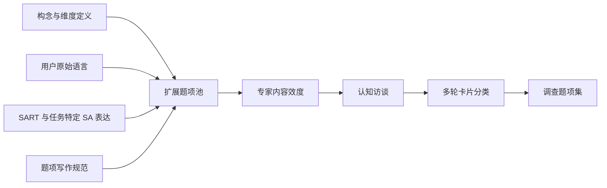

<!-- 01 -->

# 编程智能体态势感知

## 研究动机、理论基础与构念开发方案

<Keywords :keywords="['Coding Agent', 'Situation Awareness', 'User Experience', 'Construct Development']" />

---
layout: agenda
title: 汇报主线
items:
  - 编程智能体为何产生新的用户问题
  - CASA 是什么，以及为什么不能直接沿用经典量表
  - 用什么理论组织 CASA 的内容
  - 如何从二手文本走向可靠量表
---

<!-- 02 -->

---
layout: section
---

<!-- 03 -->

# 一、研究背景与问题提出

## 编程智能体的价值，取决于用户能否持续参与委托后的任务判断

---
layout: default
title: 软件开发正在成为生成式人工智能价值最集中的场景之一
---

<!-- 04 -->

  

    <strong>15.48 万亿元</strong>
    2025 年我国软件业务收入，产业规模为智能化研发提供现实基础
  

  

    <strong>20%–45%</strong>
    生成式人工智能对软件工程年度支出的潜在直接生产率价值
  

  

    <strong>83.5%</strong>
    报告人工智能代理用途的开发者中，将软件工程列为使用领域的比例
  

国家政策、产业规模与产品采用共同推动人工智能由代码生成走向工程任务执行

数据来源：@miit2026 @mckinsey2023 @stackoverflow2025 @statecouncil2025 @caict2024

---
layout: default
title: 编程智能体不是更长的代码补全，而是能够代理实施任务的系统
---

<!-- 05 -->

编程智能体能够接受软件开发目标，在权限边界内获取项目情境、规划步骤、调用开发工具、修改软件制品，并依据执行反馈继续调整行动。

核心变化是交互单位由单项操作变成相对完整的软件任务 @schuetz2020 @baird2021

---
layout: compare
title: 用户与软件变化之间的关系由直接操作扩展为任务委托
leftLabel: 传统开发工具
rightLabel: 编程智能体
leftColor: blue
rightColor: green
---

<!-- 06 -->

### 直接行动

- 用户逐项编辑、点击或执行命令
- 软件变化可以对应到自己的操作过程
- 行动记忆是理解任务状态的重要来源
- 系统主要响应明确操作

::right::

### 代理行动

- 用户给出目标、约束和项目情境
- 智能体选择并连续实施多个行动
- 软件变化部分发生在直接操作经验之外
- 用户依靠行动痕迹重新认识任务

---
layout: two-cols
ratio: "1:1"
title: 委托减少直接操作，却没有消除用户判断
---

<!-- 07 -->

## 渐进协作

Kumar 等发现，采用渐进方式解决任务并持续调整智能体工作的开发者，更容易完成真实软件任务。@kumar2025

任务成功仍然需要用户理解并调整过程。

::right::

## 分阶段审查

Dhanorkar 等识别出事前限制、共同规划、实时查看和事后复核等持续审查活动。@dhanorkar2026

用户需要判断进展、变化、证据与结果。

---
layout: default
title: 相邻研究说明，任务认识可能关系到后续评价与行动
---

<!-- 08 -->

  
<b>信息安全</b> 态势感知影响威胁评价、应对效能与实际行为

  
<b>决策支持</b> 系统表现提高时，态势感知仍可能下降

  
<b>主观测量</b> 任务特定主观态势感知能够预测任务表现

  
<b>人机协作</b> 态势感知是人与自主系统有效互动的重要条件

证据来源：@jaeger2021 @nadj2020 @rose2018 @endsley2023

这些证据不直接证明 CASA 已具有相同后果，但为研究编程智能体中的主观任务认识提供了理论依据。

---
layout: default
title: 论文围绕一个构念和两类后续关系展开
---

<!-- 09 -->

  
<strong>RQ1</strong>如何以态势感知为基础发展 CASA 构念，识别其内容、维度并形成测量？

  
<strong>RQ2</strong>哪些用户因素、任务因素和系统设计因素影响 CASA 的形成？

  
<strong>RQ3</strong>CASA 如何影响任务判断、感知控制、满意度与持续使用意愿？

本次汇报集中于第一个子研究，后两项关系将在构念和量表成立后检验。

---
layout: section
---

<!-- 10 -->

# 二、CASA 的概念化

## 研究对象不是系统是否成功，而是用户感觉自己是否了解任务

---
layout: default
title: CASA 测量用户对代理行动所形成任务状态的主观认识
---

<!-- 11 -->

编程智能体态势感知是个体用户在一次具体编程智能体任务中，对自己能够认识智能体代理行动所形成的任务相关状态及其近期发展的程度判断。

  
<h3>分析单位</h3>
个体用户的一次具体任务，而不是产品、团队或组织。

  
<h3>认识对象</h3>
行动、软件制品变化、执行证据及其与任务目标的关系。

  
<h3>被测属性</h3>
用户对自身认识程度的判断，而不是客观问题正确率。

---
layout: compare
title: CASA 是一个有程度高低的主观任务状态
leftLabel: 较低 CASA
rightLabel: 较高 CASA
leftColor: red
rightColor: green
---

<!-- 12 -->

### 难以形成任务认识

- 不清楚智能体采取了哪些关键行动
- 无法说明软件为什么形成当前状态
- 难以把测试与运行结果联系到任务目标
- 不知道任务接下来可能如何发展

::right::

### 形成连贯且可更新的认识

- 能够识别与判断有关的关键行动
- 理解软件变化及其任务意义
- 能够整合行动、制品和执行证据
- 对任务近期发展形成可更新预期

---
layout: default
title: 编程智能体改变了态势感知的对象、载体和形成方式
---

<!-- 13 -->

  
<h3>状态由代理行动生成</h3>
用户不仅观察环境，还要理解智能体造成的新状态。

  
<h3>状态跨载体分布</h3>
计划、工具调用、代码差异、测试与运行结果需要被整合。

  
<h3>用户间接接触状态</h3>
部分变化发生在直接操作经验之外，需要借助行动痕迹重建。

  
<h3>任务开放且相互依赖</h3>
代码库、目标与行动路径不同，难以预先枚举统一状态清单。

经典态势感知的一般逻辑仍有价值，但既有内容和量表不能直接覆盖这些变化

自动化承担更多行动并不保证用户仍然了解任务状态 @endsleykiris1995

---
layout: default
title: CASA 与信任、透明度和控制感相邻，但回答不同问题
---

<!-- 14 -->

| 概念 | 核心问题 | 与 CASA 的关系 |
| --- | --- | --- |
| 系统透明度 | 系统提供了多少行动、理由和状态信息 | 可能是 CASA 的前因 |
| 人工智能信任 | 用户是否愿意依赖智能体 | 可能影响接受判断，也可能与 CASA 相互关联 |
| 感知控制 | 用户是否感觉能够影响任务与结果 | 可能是 CASA 的后果或相邻体验 |
| 认知负荷 | 用户投入多少心理资源 | 可能影响 CASA，但不是任务认识本身 |
| 客观任务知识 | 用户实际掌握多少任务事实 | 可用于检验校准，不等同于主观 CASA |
| 任务表现 | 任务是否正确、高效完成 | 是结果指标，不能替代用户任务认识 |

CASA 的核心问题始终是：用户感觉自己在多大程度上了解当前智能体任务。

---
layout: default
title: 既有态势感知测量各自解决了不同问题
---

<!-- 15 -->

| 传统 | 测量重点 | 对 CASA 的启示 | 直接迁移的局限 |
| --- | --- | --- | --- |
| SART | 注意需求、注意供给与理解的主观评价 @taylor1990 | 确立主观程度判断 | 混入任务条件与注意资源 |
| SAGAT | 对预定状态问题的回答正确程度 @endsley1995a | 说明状态要求需由任务分析确定 | 依赖正确答案，不测主观体验 |
| LETSSA | 列车位置、速度、信号与未来事件 @rose2018 | 证明主观量表需要任务化 | 状态仍来自物理交通环境 |
| 信息安全 SA | 对网络钓鱼威胁的认识 @jaeger2021 | 个体层 SA 可连接行为 | 状态中心是外部威胁 |
| 仪表盘 SA | 运营变量与分析问题 @nadj2020 | 绩效与 SA 可以背离 | 任务变量预先确定 |

---
layout: default
title: CASA 构念开发需要同时填补三个测量缺口
---

<!-- 16 -->

  
<h3>内容缺口</h3>
既有量表没有覆盖代理行动、软件变化、执行证据与目标关系。

  
<h3>边界缺口</h3>
任务复杂性、信息可见性、信任和控制容易被误写成构念内容。

  
<h3>实证缺口</h3>
尚无任务锚定的 CASA 量表，无法比较用户、任务与产品差异。

新构念的必要性来自旧测量遗漏了什么，而不只是编程智能体这一对象较新

情境化理论发展需要说明新对象具体改变了哪些内容与关系 @hong2014

---
layout: section
---

<!-- 17 -->

# 三、理论基础

## Taylor 确定主观属性，Endsley 组织任务认识的内容

---
layout: two-cols
ratio: "1:1"
title: 两条态势感知传统在研究中承担不同角色
---

<!-- 18 -->

## Taylor 的主观态势感知

- 研究个体如何评价自己的任务认识
- SART 证明态势感知可以主观测量
- 为 CASA 确定被测属性与回答视角
- 不直接沿用原有十项内容与合成方式

@taylor1990

::right::

## Endsley 的动态态势感知

- 感知任务相关要素及其状态
- 理解这些状态对任务目标的意义
- 预期任务近期可能如何发展
- 区分影响条件、态势感知与决策结果

@endsley1995b

---
layout: default
title: 动态态势感知理论解释任务认识如何形成并支持判断
---

<!-- 19 -->

理论层级是经验编码的观察位置，不是预先规定 CASA 必须形成三个统计维度。@endsley1995b

---
layout: default
title: CASA 把动态态势感知落到编程智能体任务状态
---

<!-- 20 -->

| 理论内容 | 编程智能体中的潜在认识对象 | 需要避免的混淆 |
| --- | --- | --- |
| 感知 | 关键行动、文件变化、测试与运行反馈 | 不能把信息是否出现等同于用户已经感知 |
| 理解 | 行动和变化为何发生，对任务目标意味着什么 | 不能把解释文本是否存在等同于用户已经理解 |
| 近期预期 | 尚未完成事项、潜在影响、下一步可能行动 | 不能把系统计划本身等同于用户形成预期 |

  
<h3>状态来源</h3>
代理行动

  
<h3>状态载体</h3>
行动轨迹、软件制品、执行证据

  
<h3>意义基准</h3>
用户的具体任务目标

---
layout: default
title: 构念开发文章集中回答两个问题
---

<!-- 21 -->

  
<strong>RQ1</strong>CASA 包含哪些能够稳定区分的内容或维度，如何把这些内容操作化为可靠量表？

  
<strong>RQ2</strong>CASA 是否相对于一般主观态势感知提供额外的内容效度、诊断价值和解释能力？

第一问决定构念是什么，第二问决定开发一个情境特定构念是否真的有价值。

---
layout: section
---

<!-- 22 -->

# 四、构念与量表开发

## 先让二手文本揭示内容，再由理论比较和量化研究验证结构

---
layout: default
title: 混合方法把内容发现、理论解释与测量验证连接起来
---

<!-- 23 -->

  
<h3>阶段 1</h3>
发现 CASA 的经验内容与边界。

  
<h3>阶段 2</h3>
开发并验证任务锚定的主观量表。

  
<h3>整合逻辑</h3>
定性结果决定测什么，定量结果检验能否稳定测量。

混合方法不是两种数据的并列，而是构念内容与统计结构之间的连续证据链 @venkatesh2013

---
layout: two-cols
ratio: "3:2"
title: 阶段 1 从真实编程智能体任务文本识别 CASA 内容
---

<!-- 24 -->

## 数据来源与抽样

- Reddit 中与编程智能体相关的公开板块、主题帖和评论
- 纳入能够定位到具体任务或连续任务过程的实际使用经历
- 覆盖 CLI、IDE 与后台代理等交互形态
- 同时抽取正向、负向和矛盾案例
- 以完整意义片段为分析单位，保留必要上下文

::right::

## 伦理与数据治理

- 遵守平台政策与机构伦理审查要求
- 用户名、雇主、仓库和可追踪信息不进入分析集
- 对可反向搜索的独特表述优先转述
- 发布代码本、定义和审计轨迹，不公开原始身份数据

---
layout: default
title: 编码程序先归纳用户语言，再引入理论比较
---

<!-- 25 -->

<Steps :steps="[
  { title: '准备', description: '确定分析单位、上下文与排除规则' },
  { title: '预试', description: '两名编码者独立开放编码并修订协议' },
  { title: '全样本编码', description: '形成稳定的一阶代码并检查新代码出现' },
  { title: '轴向编码', description: '聚合对象、状态、时间和意义相近的代码' },
  { title: '理论比较', description: '用 Taylor 与 Endsley 审查属性、覆盖和法则位置' }
]" :activeStep="5" />

维度形成前冻结经验代码版本，用于检查理论映射是否造成强制拟合 @gioia2013

---
layout: default
title: 负例用于证明 CASA 不是相邻概念的重新命名
---

<!-- 26 -->

| 经验材料 | 应当如何区分 |
| --- | --- |
| 不知道智能体改了什么，但仍相信结果 | 低 CASA 与高信任可以同时存在 |
| 有清楚差异视图，却无法说明变化意义 | 高信息可见性不等于高 CASA |
| 有停止和回滚权限，却不知道何时应使用 | 控制机制存在不等于形成任务认识 |
| 智能体修改三个文件，但用户未评价自己是否了解 | 客观事件不能被编码者推断为 CASA 高低 |
| 用户信息有限，却能凭经验解释任务状态 | CASA 不由信息数量单独决定 |

只有直接表达用户认识程度的材料才能进入 CASA 内容。

---
layout: two-cols
ratio: "1:1"
title: 测量模型由维度关系决定，而不是由统计便利决定
---

<!-- 27 -->

## 反映式高阶模型

- 维度是同一主观状态的可互换表现
- 删除一项维度不改变构念核心含义
- 维度应当表现出较强共同变化
- 题项反映潜在认识状态

::right::

## 形成式高阶模型

- 不同维度共同构成 CASA
- 各维度不可相互替换
- 删除一项会遗漏必要任务状态
- 需要检验权重、冗余和共线性

最终选择依据构念与指标之间的理论关系 @petter2007

---
layout: default
title: 阶段 1 必须交付可审计的构念证据链
---

<!-- 28 -->

  
<h3>数据结构</h3>
用户表达 → 一阶代码 → 轴向范畴 → 候选维度

  
<h3>边界结构</h3>
构念、前因、相邻概念与后果的分类表

  
<h3>理论结构</h3>
一般态势感知内容与编程智能体新增内容的比较

若全部稳定范畴都能由一般主观态势感知完整表示，研究应定位为量表情境适配，而不是新构念开发。

---
layout: two-cols
ratio: "3:2"
title: 阶段 2 先保证内容正确，再追求量表简洁
---

<!-- 29 -->

::right::

- ITEM Ontology 检查对象、属性、限定词与反应集合 @larsen2026
- 人工智能辅助内容验证只作补充诊断，不替代专家判断 @pillet2026
- 卡片分类同时检查题项与维度定义是否清晰 @moore1991
- 所有题项锚定一次刚完成或可清楚回忆的具体任务 @hinkin1998

---
layout: timeline
title: 两轮独立样本用于净化题项并确认测量结构
items:
  - year: "样本 1"
    title: 探索性评估
    description: 真实任务筛选、项目分析、平行分析、EFA 与内容回查
  - year: "修订"
    title: 理论与统计共同净化
    description: 不只依据载荷删除题项，返回定性代码检查内容损失
  - year: "样本 2"
    title: 确认性验证
    description: CFA、竞争模型、信度效度、高阶结构与测量不变性
---

<!-- 30 -->

样本量根据题项数、模型复杂度和功效分析确定，原则上每轮不少于 500 个有效任务经历 @mackenzie2011

---
layout: default
title: CASA 的价值需要区分、增量和校准三类证据
---

<!-- 31 -->

  
<h3>区分效度</h3>
与一般主观态势感知、信任、透明度、控制和认知负荷相关，但不高度重合。

  
<h3>增量效度</h3>
在控制通用 SART 与任务特定一般 SA 后，仍增加对控制、满意度或判断的解释。

  
<h3>主客观校准</h3>
以统一任务回放和实际行动轨迹检验主观 CASA 与客观任务知识的关系。

客观问题提供效标证据，但不会把 CASA 重新定义为状态问题正确率。

---
layout: default
title: 研究预先设置五个停止或降级判断门槛
---

<!-- 32 -->

<strong>门槛 1</strong>定性范畴完全落入一般态势感知时，只能主张情境适配。

<strong>门槛 2</strong>内容主要描述透明度、可用性、信任或负荷时，应放回原构念。

<strong>门槛 3</strong>特定内容只存在于单一产品或界面时，应收窄研究边界。

<strong>门槛 4</strong>CASA 与一般 SA、控制或信任缺乏区分效度时，应修订或终止。

<strong>门槛 5</strong>没有内容优势、增量效度或诊断价值时，不能声称新构念改善了解释。

---
layout: default
title: 研究设计逐层回答为什么需要情境化构念
---

<!-- 33 -->

| 论证任务 | CASA 的对应设计 |
| --- | --- |
| 说明新技术如何改变交互 | 由直接操作转向代理行动，用户通过痕迹认识任务 |
| 识别既有测量的具体遗漏 | 比较状态生成、状态载体、接触方式与任务开放性 |
| 让理论参与但不支配编码 | Taylor 确定主观属性，Endsley 组织内容，经验代码先冻结 |
| 建立从内容到量表的证据链 | 二手文本发现内容，内容效度与两轮独立样本验证结构 |
| 证明情境化具有额外价值 | 与一般 SA 比较内容、区分、增量与诊断价值 |

这一逻辑借鉴情境特定构念开发研究，但 CASA 的内容必须由编程智能体材料独立支持 @chen2024

---
layout: references
perPage: 8
page: 1
title: 参考文献
---

<!-- 34 -->

---
layout: references
perPage: 8
page: 2
title: 参考文献（续）
---

<!-- 35 -->

---
layout: references
perPage: 8
page: 3
title: 参考文献（续）
---

<!-- 36 -->

---
layout: references
perPage: 8
page: 4
title: 参考文献（续）
---

<!-- 37 -->

---
layout: default
title: 预期贡献不只是增加一张新量表
---

<!-- 38 -->

  
<h3>构念贡献</h3>
明确用户在代理式软件任务中主观认识什么，并提供可检验定义与量表。

  
<h3>理论贡献</h3>
发展态势感知在开放目标、代理行动和数字制品持续变化条件下的内容。

  
<h3>实践贡献</h3>
诊断用户在哪些任务状态上难以形成认识，为差异、证据、审批和回顾设计提供依据。

CASA 只有在区别于信任、控制和一般 SA，并能改善解释或诊断时才成立。

---
layout: statement
---

<!-- 39 -->

# 编程智能体的关键用户问题，不只是它能做什么

## 而是任务由它推进之后，用户在多大程度上仍然知道发生了什么、意味着什么，以及接下来可能发生什么

CASA 构念开发的任务，是把这种主观任务认识变成一个边界清楚、能够测量、经得起替代解释检验的研究对象。

