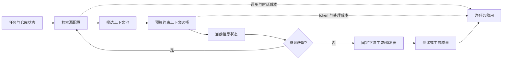

# 有限信息预算下 Coding Agent 的仓库上下文获取决策研究

## ——平衡任务效用与信息获取成本

**Repository Context Acquisition Decisions for Coding Agents under Limited Information Budgets: Balancing Task Utility and Information Acquisition Cost**

博士学位论文初稿

作者：〔待填〕  
指导教师：〔待填〕  
学科专业：管理科学与工程 / 信息系统〔待定〕  
完成日期：〔待填〕

---

## 稿件状态与证据声明

本文是一份可继续扩展为正式博士学位论文的理论与研究设计初稿，而不是已经完成实证检验的定稿。第一、二、三章所引用的既有研究、公开数据集、评价指标及其基本规模，已依据正式论文页面、公开代码仓库、Otero AIS Basket 本地全文及其参考文献进行核验；2026 年发布的数据集信息以 2026 年 8 月 11 日可见版本为准，正式投稿或答辩前必须再次核对版本、许可与样本规模。

第四至第六章中的算法名称、模型、实验流程、基线和统计检验属于拟实施研究方案。凡表题或段落中出现“**假想结果**”“**占位结果**”或方括号变量，均用于展示未来结果应如何组织和解释，不构成真实实验发现。本文不填造显著性、提升比例或置信区间；在完成可复现实验之前，不得把这些段落改写为事实陈述。

---

# 摘要

大语言模型驱动的 coding agent 正在从单文件代码生成扩展到真实软件仓库中的缺陷修复、功能实现和测试维护。与单轮代码补全不同，仓库级任务要求 agent 在大量文件、符号、依赖关系、测试和历史线索之间主动获取上下文。现有研究已经提出词法检索、稠密检索、静态分析、代码图检索和 agent 导航等多种方法，并在 RepoBench、CrossCodeEval、SWE-bench、CodeRAG-Bench、Agent Retrieval Bench、ContextBench 和 SWE-Explore-Bench 等公开基准上形成了可运行的评价环境。然而，主流研究通常把上下文获取处理为排序、工具调用或端到端 agent 架构中的一个局部模块，评价也常集中于 Recall@k 或最终任务通过率。由此尚未充分回答三个相互关联的决策问题：在固定 token 预算下应装入哪些上下文，从异质检索源中应选择哪些来源并如何分配预算，以及在多轮探索中何时继续获取信息、何时停止并进入代码修改。

本研究把 coding agent 的仓库上下文获取界定为有限信息预算下的序贯决策问题，以“任务效用—信息获取成本”为统一主线。信息系统领域关于信息获取成本、决策中心型信息采集、分布式信息检索、多源服务组合和信息搜索停止的研究表明，信息的价值并不等于预测准确率或相关性分数：只有能够改善后续决策且其边际收益超过获取、等待和处理成本的信息，才具有正的净决策价值。基于这一认识，本文将传统理论情境化到 coding agent，重新定义信息项、信息源、信息状态、任务效用和获取成本，并形成三个递进研究。

研究一考察“装入哪些上下文”。本研究拟提出结构感知的预算约束上下文选择方法，在候选文件、符号或代码跨度中，联合考虑查询相关性、定义—引用和调用依赖覆盖、候选间替代性以及 token 成本，以边际决策价值而非单一相关性排序构造上下文包。研究二考察“从哪些来源获取”。本研究拟把 BM25、稠密向量检索和静态代码图检索视为质量、时延与成本异质的信息服务，估计任务条件下各来源预算增量的边际贡献，并在检索前配置来源组合与配额。研究三考察“何时停止获取”。本研究拟在固定检索与修复流程上建立有限时域最优停止模型，根据新增覆盖、表示稳定性、来源一致性、执行反馈和已耗成本，比较继续检索的预期增量效用与成本，从而选择停止时机。

本文在研究设计上遵循理论驱动人工制品的逻辑：先由一般信息获取理论提出可迁移命题，再结合代码仓库的图依赖、token 约束和执行反馈形成情境变量与设计要求，继而把设计要求映射为算法组件，最后分别评价检索层表现、下游任务效用、资源成本、机制有效性与边界条件。研究拟以 RepoBench-R 和 CrossCodeEval 支持快速算法开发，以 Agent Retrieval Bench、ContextBench、SWE-Explore-Bench 和 CodeRAG-Bench 作为主要检索与过程基准，并在算法冻结后使用 SWE-bench Lite/Verified 子集开展端到端验证。预期贡献在于：形成一个连接信息系统决策理论与 coding-agent 上下文工程的统一分析框架；提供三类可实现、可消融且可解释的上下文获取算法；提出兼顾中间检索质量、最终任务效用与资源成本的评价规范；并识别不同任务、仓库和预算条件下信息价值的变化规律。

**关键词：** Coding agent；仓库级代码检索；信息获取成本；决策效用；多源检索；最优停止；设计科学

# Abstract

Large-language-model-based coding agents are moving from single-file code generation to issue resolution, feature implementation, and test maintenance in real software repositories. Repository-level tasks require an agent to acquire context actively from files, symbols, dependency relations, tests, and execution feedback. Existing studies have developed lexical, dense, static-analysis-based, graph-based, and agentic retrieval methods, while public benchmarks such as RepoBench, CrossCodeEval, SWE-bench, CodeRAG-Bench, Agent Retrieval Bench, ContextBench, and SWE-Explore-Bench make systematic evaluation increasingly feasible. Nevertheless, repository context acquisition is often treated as a ranking component, a tool call, or an implicit part of an end-to-end agent. This leaves three connected operational decisions insufficiently addressed: which context items should be packed under a token budget, which heterogeneous retrieval sources should receive the available budget, and when an iterative agent should stop acquiring information and proceed to code modification.

This thesis conceptualizes repository context acquisition as a sequential decision problem under a limited information budget and adopts task utility net of information-acquisition cost as its unifying objective. Research in information systems on costly information acquisition, decision-centric active learning, distributed information retrieval, service composition, and stopping rules suggests that information value cannot be equated with predictive accuracy or relevance alone. Information is valuable only to the extent that it improves a downstream decision and its marginal benefit exceeds acquisition, waiting, and processing costs. Contextualizing this principle to coding agents, the thesis develops three cumulative studies.

Study 1 examines what to include. It proposes a structure-aware, budget-constrained context selection method that jointly considers query relevance, definition–reference and call-dependency coverage, substitutability among candidates, and token cost. Study 2 examines where to retrieve from. It models BM25, dense retrieval, and static code-graph retrieval as heterogeneous information services and allocates retrieval quotas according to their task-contingent marginal contributions. Study 3 examines when to stop. It formulates finite-horizon optimal stopping over a fixed retrieval-and-repair process and compares the expected incremental utility of another retrieval step with its token, tool, and latency costs.

Methodologically, the thesis follows a theory-driven artifact logic: general theoretical propositions are contextualized into repository-specific constructs and design requirements; each requirement is implemented by a traceable algorithmic mechanism; and the artifact is evaluated at retrieval, downstream task, resource, mechanism, and boundary-condition levels. RepoBench-R and CrossCodeEval support rapid development; Agent Retrieval Bench, ContextBench, SWE-Explore-Bench, and CodeRAG-Bench serve as the main retrieval and process benchmarks; and frozen algorithms are finally evaluated on a manageable subset of SWE-bench Lite/Verified. The expected contributions are a unified bridge between information-systems decision theory and coding-agent context engineering, three implementable and interpretable context-acquisition artifacts, and an evaluation protocol that jointly accounts for retrieval quality, downstream task utility, and resource cost.

**Keywords:** coding agents; repository-level code retrieval; information-acquisition cost; decision utility; multi-source retrieval; optimal stopping; design science

---

# 目录

1. 绪论  
2. 文献综述  
3. 有限信息预算下的仓库上下文获取决策框架  
4. 研究一：预算约束下的结构感知上下文项选择  
5. 研究二：任务条件下的多源检索组合与预算配置  
6. 研究三：基于在线证据的序贯检索停止决策  
7. 研究结论与展望  
参考文献  
附录

---

# 第1章 绪论

## 1.1 研究背景

### 1.1.1 Coding agent 从代码生成走向仓库级问题解决

大语言模型显著提高了自然语言到代码的生成能力，但软件开发中的多数高价值任务并不是从空白文件生成一段独立函数。真实缺陷修复通常要求开发者理解 issue 描述，定位相关文件和符号，追踪调用关系与数据流，识别既有实现约束，修改一个或多个位置，并通过测试或执行反馈验证修改。SWE-bench 将真实 GitHub issue、仓库快照和测试环境结合起来，使“模型能否解决真实软件问题”成为可重复评价的任务（Jimenez et al., 2024）。SWE-agent 进一步表明，模型与仓库交互的接口、导航命令和编辑反馈会显著影响最终表现（Yang et al., 2024）。因此，coding agent 的能力不只取决于基础模型能否生成代码，还取决于它能否在正确时间获得正确且足量的仓库证据。

这一变化把代码生成问题转化为信息系统中的“信息获取—决策—行动”问题。对一个待解决 issue 而言，仓库中可被读取的文件和代码跨度构成潜在信息集合；grep、BM25、向量检索、静态分析、代码图和 agent 导航构成异质信息服务；读取文件、扩大图邻域、执行测试和等待工具返回均产生 token、调用次数、计算和时延成本；最终补丁是否通过测试则是信息支持决策之后的任务结果。上下文获取既是技术过程，也是稀缺资源配置过程。

### 1.1.2 仓库上下文既稀缺又可能过量

大模型上下文窗口持续扩展，但“能够放入”不等于“应当放入”。首先，完整仓库通常远大于可经济处理的 token 预算。其次，无关或重复代码会挤占有效信息、增加推理时延和模型调用费用，还可能使模型关注错误实现。第三，仓库信息具有结构依赖：issue 可能只提到一个接口，真正需要修改的实现、调用者、配置或测试位于多跳依赖路径上。第四，信息价值随决策状态变化：一个文件在尚未定位入口时价值很高，在其定义和所有调用者已经被读取后可能只增加冗余。

Mullins and Sabherwal（2022）在 IS-enabled 团队决策情境中发现，客观信息量与决策绩效呈倒 U 型关系。该发现不能直接解释 LLM 的内部机制，但提示信息量本身不是无条件的正向投入。对 coding agent 而言，是否存在类似的“过量上下文惩罚”必须在模型、任务和预算层面重新检验，而不应由上下文窗口大小先验决定。相应地，本研究关注的是 agent 实际访问并进入决策过程的信息，而不是仓库中理论可用的信息总量。

### 1.1.3 公开 benchmark 已使决策型算法研究具备条件

早期仓库级检索研究常使用跨文件补全作为替代任务。CrossCodeEval 覆盖 Python、Java、TypeScript 和 C#，并提供不同检索设置；RepoBench 将仓库级检索、补全及其流水线拆分评价（Ding et al., 2023; Liu et al., 2024）。随后，CodeRAG-Bench 统一比较检索器、生成模型和执行结果（Wang et al., 2025），SWE-bench 及其 Lite、Verified 子集提供真实缺陷修复环境。

2026 年出现的过程型基准进一步降低了本研究的实施风险。Agent Retrieval Bench（ARB）在完整仓库候选空间上构造 427 个任务，含 345 个有金标准任务和 82 个无金标准任务，提供文件级排序、不同 token 预算下的覆盖收益以及选择性检索指标（Qin and Xie, 2026）。ContextBench 提供 1,136 个 issue-resolution 任务及文件、符号、跨度和编辑位置层级的人工金标准，其中 500 个任务经过额外验证。SWE-Explore-Bench 提供 848 个 issue、203 个仓库和 10 种语言的探索任务，并记录核心/可选行、读取步骤和首次有效命中等过程信息。这些基准并不消除所有困难，但已经使“选择哪些信息、配置哪些来源、何时停止”能够分别评价，而不必先训练一个完整的通用 coding agent。

### 1.1.4 现有研究仍缺少统一的决策目标

仓库检索方法大体沿四条路线发展：词法或向量相似性、静态结构与代码图、agent 主动导航、选择性或迭代检索。每条路线都回答了“怎样更可能找到相关代码”的部分问题，但尚未形成统一的资源决策规范。

其一，排序后截断把候选项价值视为独立且固定，难以处理代码块之间的依赖和替代。两个高分片段可能来自同一文件并表达相同实现，而一个单独相关性较低的调用者可能是完成修改不可缺少的证据。

其二，多检索器常通过固定拼接、倒数排名融合或统一 reranker 组合。该做法没有明确回答为什么一个任务应当调用图检索、另一个任务应当把更多预算给 BM25，以及较慢来源带来的增量是否足以抵偿成本。

其三，agent 常由固定轮数、token 上限或模型自行判断终止。固定规则忽略任务差异，完全自由的语言模型判断又难以校准和复现。结果是有些任务在信息不足时过早修改，另一些任务在关键证据已经出现后仍反复浏览。

这些不足共同指向一个研究机会：不再把仓库上下文视为静态输入，而把上下文获取视为具有明确状态、行动、效用和成本的决策过程。

## 1.2 问题界定与核心概念

### 1.2.1 研究对象

本文所称 **coding agent**，是指能够接收自然语言软件任务、调用仓库读取或搜索工具、生成代码修改并可选地执行测试的语言模型系统。本文研究 agent 的仓库上下文获取子系统，不研究基础模型预训练、通用代码生成能力或完整软件项目管理。

本文所称 **仓库上下文**，是 agent 在形成代码修改决策前或过程中实际获得的文件、符号、代码跨度、依赖关系、测试信息和执行反馈。为保证前三项研究的边界清楚，研究一与研究二主要处理静态仓库内容；研究三才引入随轮次产生的检索结果和执行反馈。

本文所称 **信息预算**，是允许上下文获取消耗的资源上限。它至少包括进入模型上下文的 token 数，并可扩展为检索调用次数、工具执行时间、模型调用费用和墙钟时延。不同成本不被未经说明地相加，而是通过预先报告的标准化权重或帕累托曲线展示。

本文所称 **任务效用**，是上下文对后续软件任务决策产生的价值。检索层可用金标准文件/跨度覆盖和预算收益近似，端到端层则以测试通过、补丁正确性或代码补全质量衡量。任务效用与检索相关性不同：相关性是候选项属性，任务效用是将一组上下文交给固定下游决策器后得到的结果。

### 1.2.2 不研究的内容

本文不把所有 coding-agent 改进都归因于检索，也不比较所有基础模型和 agent 框架。为了识别上下文决策的增量价值，主要实验固定基础模型、提示模板、编辑器、测试工具和最大总体预算，仅改变上下文选择、来源配置或停止策略。轨迹记忆、强化学习检索器和 MCTS 图搜索可作为候选信息服务或未来扩展，但不各自构成一项独立研究。

## 1.3 研究问题

围绕有限信息预算下的净任务效用，本文提出三个递进研究问题：

**RQ1：在给定候选上下文和 token 预算时，如何利用代码结构与候选间替代关系选择上下文项，使其比按相关性排序截断产生更高的下游任务效用？**

该问题决定“装入什么”。研究对象是文件、符号或代码跨度；决策变量是选择集合；新增复杂性是集合价值而非单项排序。

**RQ2：面对质量、互补性、时延和调用成本异质的检索源，如何依据任务与仓库特征选择来源组合并配置预算，使多源检索获得更高的成本调整任务效用？**

该问题决定“去哪里获取”。研究一的上下文选择器保持不变；研究二只增加来源组合和配额决策。

**RQ3：在多轮仓库探索中，如何根据已经获得的信息和执行反馈估计继续检索的边际价值，从而在信息不足与过度检索之间选择停止时机？**

该问题决定“何时结束获取”。研究二的来源配置与研究一的上下文打包方法继续复用；研究三只增加在线状态与停止行动。

三问不是并列的算法清单，而是一条累积链：若不能选择上下文项，多源结果无法在固定预算内被有效使用；若不能配置来源，继续检索的行动缺乏稳定执行机制；在前两项固定后，停止问题才可被单独识别。

## 1.4 研究意义

### 1.4.1 理论意义

第一，本文把信息系统领域的有成本信息获取理论拓展到由生成式 AI 执行的软件决策情境。Mookerjee and Dos Santos（1993）、Mookerjee and Mannino（1997）以及 Saar-Tsechansky and Provost（2007）强调系统价值或决策价值而非孤立准确率，Voorberg et al.（2021）进一步把继续获取信息与最终决策放入同一序贯模型。本文检验这些一般原则在仓库图依赖、token 上下文和可执行反馈条件下如何改变。

第二，本文连接分布式信息检索与现代多检索器上下文工程。Roussinov and Chau（2008）考察信息服务组合，Hosanagar（2011）联合决定查询源、等待时间和展示结果。本文把异质服务器转化为词法、语义和结构检索服务，并处理其结果高度重叠这一原模型未重点处理的条件。

第三，本文为 coding-agent 研究提供“中间检索性能—最终决策性能—资源成本”的跨层解释。它有助于区分一个方法究竟是更准确地找到了金标准、以更少成本获得同等信息，还是虽然提高 Recall 却没有改善补丁。

### 1.4.2 方法意义

本文拟形成三个可独立复现又能够组合的算法制品：预算约束上下文选择器、多源预算配置器和检索停止器。每个制品都具有明确输入、输出、目标函数、基线与失败条件，不依赖训练超大检索模型才能成立。算法将尽可能使用公开 benchmark 的标准格式和固定下游 agent，降低重现实验的门槛。

### 1.4.3 实践意义

对 coding-agent 平台开发者而言，扩大上下文窗口或并行调用更多检索器不是免费的。本文可提供面向不同任务难度、仓库规模和延迟要求的预算配置规则，并说明何时增加图索引或 agent 导航带来的收益足以抵偿额外工程成本。对使用 coding agent 的软件组织而言，成本调整效用指标可用于选择部署配置、设定服务等级和审计异常长的探索轨迹。

## 1.5 研究方法与技术路线

本文采用以设计科学为主、规范建模与计算实验相结合的方法。Hevner et al.（2004）要求设计科学人工制品对应重要问题并经过严格评价；Peffers et al.（2007）的过程包括问题识别、目标定义、设计开发、示范、评价与传播；Gregor and Hevner（2013）进一步强调人工制品应形成可复用设计知识。本文据此执行以下技术路线。

第一步，开展跨领域文献综述。coding-agent 文献用于识别任务、检索范式、公开环境和评价缺口；IS 文献及其参考文献链用于提炼信息项、来源和停止决策中的一般结构。文献迁移必须说明原情境、可迁移命题和边界，不以概念相似代替理论联系。

第二步，建立统一决策模型。定义任务效用、token 成本、工具成本和时延成本，给出三项研究共享的记号、因果顺序与控制变量。

第三步，依次设计三个人工制品。每个制品均由理论命题推导设计要求，再将设计要求落实为可执行算法，而非在算法完成后寻找解释。

第四步，实施分层计算实验。首先评价中间检索或决策预测性能，其次把输出接入固定下游生成/修复器评价最终任务效用，再评价成本、敏感性和失败类型。数据按仓库分组划分，防止同一仓库的结构和命名泄漏到测试集。

第五步，进行机制与边界分析。通过消融、替代操作化、成本权重敏感性、跨语言/跨仓库验证和错误案例分析，确认性能变化是否来自设计机制而非模型规模、候选量或计算预算。

## 1.6 论文总体框架

第1章说明问题背景、概念边界、研究问题与方法。第2章综述仓库级检索、coding agent、公开 benchmark，以及 IS 中有成本信息获取、多源检索和停止规则三条文献链。第3章提出统一决策框架和评价规范。第4章研究上下文项选择，第5章研究多源组合与预算配置，第6章研究序贯停止。第7章总结理论贡献、设计知识、实践含义和局限。

三项研究的累积关系如下：

| 层次 | 新增决策变量 | 固定的既有部分 | 核心输出 |
|---|---|---|---|
| 研究一 | 选择哪些候选项 | 候选池、预算、下游模型 | 结构覆盖且不冗余的上下文包 |
| 研究二 | 选择哪些检索源及其配额 | 研究一选择器、总预算、下游模型 | 任务条件下的来源组合与候选池 |
| 研究三 | 继续检索或停止 | 研究一选择器、研究二来源执行器、下游模型 | 停止时机与可解释理由 |

## 1.7 可能的创新点

第一，提出 coding-agent 仓库上下文获取的统一净效用框架，把相关性、结构覆盖、下游任务效果和资源成本放入同一决策链。

第二，从“项—源—时间”三个最小且递进的决策维度构造系列研究，避免把图检索、RAG、轨迹记忆和强化学习等方法名称误作彼此割裂的研究问题。

第三，提出结构感知的预算选择、多源边际预算配置和有限时域停止三类人工制品，并使每个算法组件都可追溯到理论命题与情境变量。

第四，建立适合 coding-agent 上下文算法的分层评价规范：既检验文件/跨度检索与决策预测，又检验固定下游 agent 的增量任务效用，同时报告 token、调用、时延、尾部失败和跨仓库稳健性。

应当强调，上述内容在当前阶段是待实证确认的“可能创新点”。若实验显示结构选择、来源配置或停止策略不能稳定优于简单基线，论文必须相应收缩贡献，而不能用复杂叙事替代效果证据。

## 1.8 本章小结

本章指出，coding agent 的仓库上下文获取已经具备公开数据和运行环境，但现有研究仍缺少跨越上下文项、检索源和停止时机的统一决策目标。本文以成本调整任务效用为主线，提出三个递进研究问题，并确定设计科学、规范建模和分层计算实验相结合的研究路线。下一章将分别回顾 coding-agent 技术文献和 IS 信息获取文献，说明二者之间哪些联系可以迁移、哪些只能作为边界参照。

---

# 第2章 文献综述

## 2.1 文献检索范围与证据分级

本文的综述服务于理论建构与人工制品设计，不把一次关键词查询等同系统综述。检索由两条互补路径组成。技术路径从 repository-level code generation、cross-file code completion、code localization、coding agent、repository exploration、selective retrieval、graph retrieval 和 trajectory retrieval 等主题出发，检索 Scopus 本地导出、会议官方论文集、ACL Anthology、PMLR、OpenReview、NeurIPS Proceedings、arXiv 及论文公开仓库；随后围绕 RepoBench、CrossCodeEval、SWE-bench、CodeRAG-Bench、ARB、ContextBench 和 SWE-Explore 进行前后向追踪。IS 路径使用 Otero AIS Senior Scholars' Basket 数据库的本地全文，从 information acquisition cost、decision-centric information acquisition、distributed information retrieval、source selection、information volume 和 stopping rule 等概念出发，读取全文模型、实验和参考文献链。

此前工作区中的全盘筛选以“唯一客观改进指标且存在明确 benchmark 表述”为目的，对 13,909 篇可判定全文得到 315 篇纳入文章，其中 2020—2027 年为 88 篇。该筛选帮助发现客观成本、时延、预测与决策评价的 IS 写法，但其纳入条件并非“与 coding-agent 检索有关”。因此，本章不把 315 篇或 88 篇当作本文的综述样本，而只从中选择能够提供目标函数、决策结构、测量方法或理论驱动人工制品逻辑的文章，并沿其参考文献回溯关键前件。

文献按三类证据使用。第一类为正式发表且有官方论文页面或可核全文的研究，用作理论或技术锚点。第二类为数据、代码和评价脚本已经公开的预印本，用作 2026 年 benchmark 和可行性证据，但明确版本日期。第三类为代码/模型尚未完全开放或出版状态未确认的预印本，只用于讨论发展方向，不支撑“可直接开展”的判断。纳入正文的每篇跨领域文献均记录原情境、可迁移命题和迁移边界；仅名称相似、没有决策结构联系的文章不纳入理论链。

检索截止日为 2026 年 8 月 11 日。正式提交前需补充完整检索式、数据库字段、去重流程、纳入排除表和 PRISMA 风格流程图，并对 2026 年条目重新核验。

## 2.2 仓库级 Coding Agent 与上下文获取

### 2.2.1 从跨文件补全到真实 issue 修复

仓库级代码任务至少包含两类不同目标。第一类是根据当前位置和其他文件完成后续代码，典型基准包括 CrossCodeEval 和 RepoBench-C/P；Shrivastava et al.（2023）则较早把仓库级代码补全明确表述为仓库级提示生成问题。该类任务有明确目标代码，运行成本低，适合比较检索与生成组件。第二类是根据自然语言 issue 修改真实仓库，典型基准是 SWE-bench。后者更接近软件维护实践，但最终测试通过同时受到定位、理解、编辑和验证能力影响，因而仅凭最终通过率难以识别上下文获取机制。

Agentless 将修复拆为定位、修复与验证，说明强性能并不必然依赖高度自由的 agent 循环（Xia et al., 2025）。SWE-agent 则强调工具接口和行动空间的重要性（Yang et al., 2024）。两类工作共同表明，为研究上下文获取，必须固定下游流程并同时保留中间定位指标。否则，一个更强生成器可能掩盖较差检索，或一个较好检索器可能因不稳定编辑器而看不到最终收益。

### 2.2.2 词法检索、稠密检索与重排序

词法检索利用标识符、错误消息和自然语言描述之间的精确匹配。在包含函数名、路径或异常文本的 issue 中，grep 和 BM25 往往是强而廉价的基线。稠密检索把查询与代码映射到语义空间，能够发现词面不一致但语义相近的实现，却可能忽略精确标识符并引入编码和索引成本。CodeRAG-Bench 对多类检索器和语言模型进行统一比较，说明没有单一检索器在所有任务和模型组合上占优（Wang et al., 2025）。ARB 的结果也支持检索器异质性这一事实。

现有系统常在得到单项分数后取 top-k。这一规则隐含两个强假设：候选价值与已经选择的候选无关，且每个候选成本相同。代码上下文显然经常违反两者。一个文件级候选可能包含数千 token，一个符号只占几十 token；多个相邻片段可能高度重复；定义、调用者和测试之间又具有互补性。因此，排序是候选生成方法，不应被视为完整的预算分配方法。

### 2.2.3 静态结构、数据流与代码图检索

DraCo 通过数据流分析构造跨文件上下文图，以依赖关系指导代码补全（Cheng et al., 2024）。RepoGraph 把仓库组织为图并向 agent 暴露导航结构（Ouyang et al., 2025）。LocAgent 使用有向异构图执行多跳代码定位（Chen et al., 2025）。这些工作共同说明，issue 未直接提到的定义、调用者和测试可以通过结构边到达，图检索因此不仅是另一种相似度函数，还改变了候选间关系的表达。

但图方法并不天然优于词法或稠密检索。图构建可能受语言、动态调用、宏和反射影响；宽泛的邻域扩展会产生大量低价值节点；同一结构路径在不同 issue 中具有不同意义。2026 年 FSE 的系统比较把代码上下文工程归纳为相似度、静态分析和 agent 导航三类范式，并发现它们在性能上限与计算成本之间存在显著差异（Li et al., 2026）。这为研究二把检索方式视为异质来源而非寻找唯一“最佳检索器”提供直接动机。

### 2.2.4 Agent 导航、迭代检索与选择性检索

RepoCoder 在检索与生成之间迭代，把阶段性生成结果用于更新查询（Zhang et al., 2023）。SWE-agent 和 CodeAgent 允许模型调用仓库搜索、文件读取、编辑和测试工具（Yang et al., 2024; Zhang et al., 2024）。这类方法扩大了可发现的信息范围，但也引入路径依赖：早期错误查询可能导致后续浏览集中在错误区域，且更多轮次同时消耗 token 和时延。

Repoformer 通过自监督构造“检索是否有益”的标签，让模型选择性地跳过跨文件检索（Wu et al., 2024）。这项工作直接证明检索并非每次都必要，但其主要决策是一轮选择性调用，尚未覆盖已经进行了若干轮探索后如何利用在线新证据停止。CodeGrep 等新工作尝试用强化学习训练专用检索 agent，但截至本文核验日仍非常新，代码和轨迹成熟度不足以支撑整篇博士论文的可行性。因此，本文选择有限时域最优停止这一数据需求更清楚、行动空间更小的路径。

### 2.2.5 轨迹与经验检索的边界

检索历史成功轨迹可以为当前 agent 提供查询方式、文件访问顺序或修复模板。其潜在价值在于复用过程知识，而非只复用代码文本。然而，轨迹的任务间可比性、模型依赖性、许可和失败偏差仍未解决。本文允许在研究二后续扩展中把轨迹库作为第四类信息源，但不将其设置为必要来源，也不把“经验检索”单独扩成一项缺乏成熟 benchmark 的研究。

ExpRAG 在一般文本交互环境中检索历史 agent 轨迹，并研究如何通过微调使 agent 使用检索经验（Ferraz et al., 2026）。它说明轨迹可以成为区别于仓库文本的经验来源，但并未直接提供 coding-agent 仓库检索 benchmark。因此，本文把 ExpRAG 视为相邻的正式顶会工作，而不是研究二可直接运行的数据支点。

### 2.2.6 正式顶会锚点与新预印本的证据边界

本研究优先以已经在 ICLR、NeurIPS、ICML、ACL 和 FSE 等正式会议发表的工作作为技术锚点。例如，RepoBench、SWE-bench 和 RepoGraph 分别提供仓库补全、真实 issue 修复和代码图；CrossCodeEval 与 SWE-agent 提供跨文件基准和 agent–computer interface；Repoformer 提供选择性检索；DraCo、CodeAgent 与 LocAgent 提供数据流、工具集成和图引导定位；Agentless 提供成本较低的强修复基线。这些论文是否属于某一版 CCF 目录的 A 类，终稿应按学校采用的目录版本逐项核对，但其正式出版状态不依赖预印本承诺。

近两年的预印本则用于识别新算法可能性而非证明研究基础已经成熟。GraphCodeAgent 用需求图与结构—语义代码图支持多跳检索（Li et al., 2025）；RANGER 用知识图谱、Cypher 和 MCTS 处理实体与自然语言查询（Shah et al., 2025）；CodeGrep 用 GRPO 训练专用检索 agent（Chen et al., 2026）。这些方向与研究一、二有关，但截至核验日，GraphCodeAgent 和 RANGER 没有被本文核验为正式 CCF-A 论文，CodeGrep 发布仅数日且模型与训练环境仍处于“将发布”状态。把它们作为主要可行性支点会使论文依赖尚未稳定的代码、数据和复现结果。相反，本研究可在成熟的 BM25、dense、静态图和公开 benchmark 上先完成三项决策研究，再把上述方法作为可插拔来源做扩展验证。

## 2.3 仓库级上下文 Benchmark 与评价指标

### 2.3.1 基准的功能分层

不同 benchmark 观察的是决策链的不同环节。RepoBench-R、CrossCodeEval 和 ARB 主要观察检索；RepoBench-C/P 和 CrossCodeEval 的生成任务观察上下文对补全的作用；ContextBench 和 SWE-Explore-Bench提供更细的文件、符号、跨度或探索过程标注；SWE-bench 观察最终补丁是否通过测试。没有一个单一 benchmark 同时给出所有因果环节，因此本研究采用分层而非替代关系。

| 基准 | 主要观测层 | 可用于本文的指标 | 主要局限 |
|---|---|---|---|
| RepoBench | 检索、补全、流水线 | EM、Edit Similarity、CodeBLEU、检索命中 | 与真实 issue 修复仍有距离 |
| CrossCodeEval | 跨文件补全 | 跨语言检索和代码生成质量 | 缺少多轮 agent 行动 |
| CodeRAG-Bench | 检索—生成—执行 | 检索、生成、执行联合比较 | 多设置运行成本较高 |
| ARB | 全仓 agent 检索 | MRR、Recall@k、BCY@B、选择性检索、轨迹指标 | 正例 345 个且仓库分布不均，必须按仓库切分 |
| ContextBench | issue 所需上下文 | 文件、符号、跨度、编辑位置覆盖 | 2026 年新基准，版本仍可能变化 |
| SWE-Explore-Bench | 探索过程 | 行级精确率/召回率、首个有效命中、噪声、预算 nDCG、下游补丁 | 停止动作的反事实效用仍需自行回放 |
| SWE-bench | 最终问题解决 | resolved/pass、测试结果 | Docker、磁盘和模型调用成本高，难以高频迭代 |

### 2.3.2 中间检索指标

MRR 和 Recall@k 衡量金标准项的排序位置和覆盖，但不考虑候选长度。对代码上下文而言，token 预算比固定 k 更接近实际约束。ARB 的 budget-constrained yield 类指标以及 SWE-Explore-Bench 的预算覆盖指标可用于比较同等 token 下的有效信息。精确率和噪声率则约束通过塞入大量候选获得高召回的行为。

结构检索还需要关系覆盖指标。若补丁所需定义、调用者和测试组成一个依赖子图，则只命中其中一个文件不等于获得完整证据。本研究拟在有相应金标准或可由补丁/静态分析构造的任务上，报告节点覆盖、关键边覆盖和最短解释路径覆盖。该指标属于中间机制证据，不能取代最终补丁评价。

### 2.3.3 下游任务与资源指标

下游指标包括代码补全的 EM、Edit Similarity、CodeBLEU，以及 issue 修复的测试通过率。考虑到 CodeBLEU 等相似度不保证功能正确，真实修复最终以测试或 benchmark 官方判定为主。资源指标至少包括进入模型的上下文 token、检索 token、检索器调用数、LLM 调用数、索引构建摊销、P50/P95 时延和货币成本。报告均值而不报告尾部成本会掩盖少数异常长轨迹，因此本文同时报告分位数和超预算率。

### 2.3.4 现有评价的不足

现有研究常见四种不足：只在一个预算点比较；把更多计算换来的效果当作算法优势；使用随机任务切分导致仓库泄漏；只报告总体均值而不分析 no-gold、跨语言、仓库规模和任务类型。本文据此采用多预算曲线、等成本比较、repository-grouped split、bootstrap 置信区间和任务分层分析。

## 2.4 信息系统中的有成本信息获取

### 2.4.1 从分类准确率到系统价值

Mookerjee and Dos Santos（1993）讨论归纳专家系统设计时指出，获取额外信息只有在预期收益超过成本时才有价值；最大化分类准确率不等同于最大化系统价值。Mookerjee and Mannino（1997）在 case retrieval 中进一步提出 `ID3_c`，以单位信息获取成本带来的不确定性下降指导属性选择，并在 Zoo、Lymphography 和合成数据上比较获取成本与分类表现。Melville et al.（2005）随后以期望效用处理主动特征值获取。与此相邻，Choudhury and Sampler（1993）从经济视角讨论信息特异性和环境扫描，说明获取方式的设计需要结合信息性质与获取代价。上述研究的重要共同点不是某一种分类器或原始情境，而是把知识表示、获取行动和终局价值置于同一决策目标下。

这一传统对 coding agent 的直接启示是：相关性排序只有在相关性能够稳定代表下游价值且成本近似相等时才合理。若两个代码片段重复、一个片段过长、或者某个低分调用者能补全关键依赖，则应以加入当前上下文集合后的边际任务价值除以 token 成本决策。

### 2.4.2 决策中心型信息采集

Saar-Tsechansky and Provost（2007）批评只以预测误差指导主动学习，提出根据模型将支持的实际决策和差异化错误成本采集标签。其 GOAL-AC 方法关注每单位采集成本带来的决策收益。该研究与本论文并非同一算法问题：前者选择训练数据标签，本文选择推理时仓库上下文。但两者共享一个规范性原则，即信息质量必须由其所服务的下游决策定义。

Voorberg et al.（2021）把决策密集型流程中的信息收集建模为马尔可夫决策过程。状态表示当前已知信息，行动是在继续执行信息收集任务与作出最终决策之间选择，奖励为最终收益减去信息成本。该结构为研究三提供了最直接的理论基础。区别在于代码仓库状态维度极高，不能把已读代码逐字作为 MDP 状态，必须提炼为覆盖、增益、稳定性、来源一致性和执行反馈等可估计变量。

### 2.4.3 动态资源配置

Wang, Ipeirotis, and Provost（2017）研究 crowd labeling 中的质量保证，指出对所有对象固定分配相同数量的标签会浪费成本，应在推断过程中把下一单位标签配置给预期回报更高的对象。他们同时评价中间推断质量、标签配置和最终成本，并构造贡献价值指标。本文不把检索器类比为劳动者，而只迁移两点：资源配置应随当前信息状态更新；算法评价应把中间估计准确性与终局目标分开。

## 2.5 多源信息检索与服务组合

Roussinov and Chau（2008）把多个 information-seeking services 组织为 facts 的 meta supply chain，在 TREC 2004 上同时比较答案排序质量、服务组合和响应时间。其研究说明，多源信息获取的价值来自异质能力的组合，而不是简单增加相同来源。

Hosanagar（2011）进一步建立分布式信息检索 broker 的效用模型，联合决定查询哪些服务器、等待多久以及展示哪些结果。服务器的结果质量、响应时间分布和访问费用异质；用户还承担等待和信息评价成本。其核心决策条件是：只有当服务器在给定等待时间内响应的概率乘以预期净效用不低于查询费用时才查询该服务器；最优等待时间使继续等待的边际预期收益等于边际等待成本。论文使用 FedStats 真实记录校准 15 个服务器的响应时间和相关性分布，并与“查询全部服务器并固定等待五秒”的启发式比较。

该模型与 coding-agent 多源检索具有实质联系：BM25、稠密检索和代码图可视为异质服务，分别具有质量、覆盖、响应时间和索引成本。然而，两者仍有重要差别。Hosanagar（2011）的基础模型假设不同服务器文档基本不重叠且评价成本近似线性；代码检索器通常返回高度重叠的文件和符号。因此，本研究不能直接相加各来源的期望效用，而必须估计来源相对于已选来源和研究一打包结果的条件边际贡献。

## 2.6 信息量与停止搜索

### 2.6.1 规范性边际规则

自 Stigler（1961）以来，信息搜索的规范性停止原则是继续搜索直到新增信息的边际价值不再超过边际成本。McCardle（1985）把信息获取与技术采纳决策联系起来，Moore and Whinston（1986, 1987）把序贯信息获取与最终决策联结起来，Pednault et al.（2002）进一步研究序贯成本敏感决策；Voorberg et al.（2021）则以 MDP 形式处理决策密集型流程中的信息收集。这一原则构成研究三目标函数的基础，但本文采用受控的有限时域回放，而不预设强化学习是必要实现。

### 2.6.2 描述性停止规则及其任务依赖

Browne, Pitts, and Wetherbe（2007）通过 115 名参与者执行三类在线搜索任务，识别 mental list、representational stability、difference threshold、magnitude threshold 和 single criterion 等停止规则，并发现规则使用依赖任务结构及表征方式。本文不声称 coding agent 具有与人类相同的认知过程，而把这些规则转化为可观察设计变量：关键证据清单覆盖率、上下文表示跨轮稳定度、新增信息差异、累计证据量和单一关键条件是否满足。它们作为停止状态的候选特征，其有效性必须由 agent 任务数据检验。

### 2.6.3 信息过量与倒 U 型关系

Mullins and Sabherwal（2022）在两个 ERP 模拟研究中，以每轮实际访问的信息线索数除以决策数操作化信息量，并用面板模型发现信息量的线性项为正、二次项为负。该研究提供了两项写作和测量启示。第一，信息量要测量实际进入决策过程的线索，而不是系统提供的信息总量。第二，过量信息导致绩效下降是需要实证检验的关系，不能只根据“更多 token 更贵”推断。coding agent 没有人类工作记忆，因此本文把倒 U 型作为待检验的情境化命题，并同时考虑 LLM 注意稀释、重复证据和上下文位置等替代解释。

## 2.7 理论驱动人工制品的 IS 写作逻辑

Hevner et al.（2004）和 Gregor and Hevner（2013）强调，设计科学贡献不止是一个性能更高的实例，还包括可复用的设计原则及其适用边界。Hong et al.（2014）的情境化理论指南则要求从一般理论出发，识别目标情境的核心因素，并检验这些因素与 IT artifact 的交互。

肖帅勇参与的两篇 ISR 论文提供了与本研究特别接近的写作范式。Chen, Xiao, Zhang, and Zhao（2023）以期望不一致理论定义个性化偏好、动态期望、实际体验和动态满意度，将三项理论要求逐一转化为偏好嵌入、跨视图注意和对比学习组件；评价不止比较 AUC，还考察表征质量、理论构念的增量效用、累积满意度、消融和解释性模式。Chen et al.（2024）则从信息处理过程和粒度框架推导四类顾客注意指标，将它们嵌入多模态销售预测网络，并通过预测、表征、历史销售强基线、集成增量、权重探索和消融形成累积证据。

本研究借鉴的是“理论—设计—证据”的可追踪性，而不是顾客满意或注意力构念本身。具体而言，每项研究均需回答五个问题：一般理论提出了什么决策命题；代码仓库情境增加了什么可观察条件；该条件要求人工制品具有什么功能；哪个算法组件落实该功能；哪一项专门实验能够证明该组件而非额外计算导致了结果。与此同时，本文避免把模型内部权重等同真实心理机制，也不把 benchmark 上的提升直接改写为理论贡献。

## 2.8 文献述评与研究缺口

综合上述文献，可以得到四点判断。

第一，coding-agent 检索已经具备多种公开算法和 benchmark，选题不缺“可运行对象”。真正缺少的是在同一资源目标下比较和组合这些对象的决策层。

第二，现有检索指标仍以单项排序和固定预算为主，尚未充分处理候选集合中的结构互补、内容替代和长度异质。由此形成研究一。

第三，现有多源检索通常关注融合结果，较少把来源调用、配额和时延作为任务条件下的决策变量。IS 的分布式检索与服务组合研究提供了直接理论连接，但需要为代码检索的高重叠性重新建模。由此形成研究二。

第四，选择性检索和 agent 导航已经说明获取过程具有动态性，但公开研究尚缺一个作用范围窄、可重复的多轮停止决策：只决定继续或停止，并把后续检索与修改流程固定。IS 的序贯获取与停止规则为其提供结构，SWE-Explore-Bench 和 ContextBench 则提供过程数据基础。由此形成研究三。

上述缺口共同指向本文的核心研究命题：**仓库上下文的价值不是候选自身的固定属性，而是它在特定任务、既有信息集合、来源配置和决策时点下，对最终软件行动产生的成本调整边际贡献。** 下一章将把这一命题形式化为统一决策框架。

## 2.9 本章小结

本章回顾了仓库级任务、检索范式、公开 benchmark，以及 IS 中有成本信息获取、多源服务和停止搜索的文献链。综述表明，二者之间存在可操作而非牵强的连接：单位成本决策价值对应上下文项选择，异质服务效用对应检索源配置，序贯边际价值对应停止时机。理论迁移同时受到代码结构、高重叠结果和 LLM 非人类认知等边界约束。基于这些结论，第3章将定义三项研究共享的任务效用、成本和评价原则。

# 第3章 有限信息预算下的仓库上下文获取决策框架

## 3.1 问题情境与过程抽象

给定软件任务 $x$，coding agent 首先接收 issue、补全位置或自然语言需求 $q_x$，随后可从仓库 $R_x$ 中调用一个或多个检索服务，获得候选上下文，选择其中一部分进入模型上下文，并在一次或多次获取后生成代码决策 $\hat{y}_x$。若任务允许执行测试，agent 还可观察执行反馈并更新下一轮获取行为。整个过程可抽象为：



图3-1中的三个粗体决策位置分别对应研究二、研究一和研究三；图中流程顺序并不等于论文研究顺序。论文先解决上下文包选择，是因为任何来源产生的候选最终都必须在有限窗口中被打包；随后解决来源配置；最后在前两项已经确定时解决循环停止。

## 3.2 基本记号

设任务集合为 $\mathcal{X}$。对任务 $x\in\mathcal{X}$：

- $q_x$：issue 描述、补全前缀或需求；
- $R_x$：固定版本的软件仓库；
- $\mathcal{M}=\{1,\ldots,M\}$：可调用的检索源集合；
- $V_x$：由检索源产生的候选上下文项集合；
- $c(v)$：候选项 $v$ 的 token 成本；
- $B_x$：任务的上下文 token 预算；
- $S_x\subseteq V_x$：实际装入的上下文集合；
- $b_{xm}$：分配给来源 $m$ 的检索配额；
- $s_{xt}$：第 $t$ 轮获取后的信息状态；
- $a_{xt}\in\{\text{continue},\text{stop}\}$：停止决策；
- $g_\theta(q_x,S_x;\omega)$：参数和提示固定、随机种子为 $\omega$ 的下游生成或修复器；
- $Y_x$：任务金标准、测试套件或验收函数；
- $U_x(S_x)$：给定上下文后下游任务的期望效用；
- $C_x$：获取、处理和等待信息的总成本。

候选项可以是文件、符号或代码跨度。为避免不同粒度造成不可比，主实验在每个 benchmark 的原生评价粒度上运行；跨基准汇总只使用标准化效用，不把一个文件命中与一个代码行命中直接相加。

## 3.3 统一目标：成本调整任务效用

### 3.3.1 任务效用

任务效用定义为固定下游决策器在所给上下文上的期望结果：


\[
U_x(S)=\mathbb{E}_{\omega}\big[V_x(g_\theta(q_x,S;\omega),Y_x)\big].
\]

对于代码补全，$V_x$ 可取 Exact Match、Edit Similarity 或功能测试；对于 issue 修复，以 benchmark 官方测试通过为主要效用；对于只提供检索金标准的任务，以预算下的加权覆盖 $\tilde{U}_x$ 作为代理。代理效用与端到端效用必须分别命名和报告，不能把前者写成实际修复价值。

### 3.3.2 信息获取成本

总成本分解为：

\[
C_x=\lambda_{\text{ctx}}C^{\text{ctx}}_x+\lambda_{\text{call}}C^{\text{call}}_x+\lambda_{\text{lat}}C^{\text{lat}}_x+\lambda_{\text{llm}}C^{\text{llm}}_x+\lambda_{\text{idx}}C^{\text{idx}}_x.
\]

其中，$C^{\text{ctx}}$ 为装入上下文的 token 数，$C^{\text{call}}$ 为检索与工具调用次数，$C^{\text{lat}}$ 为墙钟时延，$C^{\text{llm}}$ 为输入输出 token 或相应费用，$C^{\text{idx}}$ 为索引构建与更新的摊销成本。由于不同权重代表不同部署偏好，本文不只报告一个任意加权总分，而采用三层呈现：

1. 在固定预算下比较任务效用；
2. 在固定任务效用下比较资源消耗；
3. 在预注册的若干 $\lambda$ 组合下报告净效用和帕累托前沿。

### 3.3.3 总体优化问题

三项研究共同追求：

\[
\max_{\pi}\;J(\pi)=\mathbb{E}_{x\sim\mathcal{D}}\big[U_x(S_x^\pi)-C_x^\pi\big],
\]

其中 $\pi$ 是上下文获取策略。研究一仅优化 $S_x$；研究二在研究一选择器固定时优化 $\{b_{xm}\}$；研究三在前两项固定后优化停止规则。该分解使每章的增量贡献可以被配对实验识别。

## 3.4 从 IS 理论到 Coding-agent 情境的设计原则

### 3.4.1 原则一：信息价值由下游决策定义

Mookerjee and Dos Santos（1993）与 Saar-Tsechansky and Provost（2007）均表明，提高分类或预测准确率不必然提高系统或决策价值。情境化到 coding agent，可提出设计原则 DP1：**上下文选择的目标应逼近固定下游 agent 的任务效用，而非只最大化候选相关性。**

其直接设计要求是：训练与评价同时保留检索金标准和下游任务结果；候选价值估计至少使用任务类型、代码关系和下游历史收益；实验必须包含“检索改善但任务不改善”的诊断类别。

### 3.4.2 原则二：信息项的边际价值依赖已有集合

传统成本敏感属性获取已承认不同属性具有不同成本，但代码上下文还具有更强的关系结构。一个定义与其调用者互补，两段重复实现则相互替代。因此提出 DP2：**候选项价值应以加入当前集合后的边际覆盖衡量，而非固定单项分数。**

该原则形成研究一的集合目标和边际收益/成本选择机制。

### 3.4.3 原则三：异质来源应按条件净贡献配置

Roussinov and Chau（2008）与 Hosanagar（2011）表明，信息服务在质量、响应时间与成本上异质；全查所有来源并固定等待在成本非平凡时可能低效。代码检索还增加结果重叠。因此提出 DP3：**来源配额应由任务条件下、相对于已配置来源的增量效用决定。**

该原则形成研究二的条件收益曲线、来源交互项与预算增量选择机制。

### 3.4.4 原则四：停止取决于状态变化和边际成本

规范性信息搜索要求边际价值与边际成本比较，Browne et al.（2007）又表明信息充分性规则随任务结构变化。因此提出 DP4：**停止策略应同时观察关键证据是否满足、表示是否稳定、最近增益是否衰减和成本是否接近上限，而不是只依据固定轮数。**

该原则形成研究三的状态变量和有限时域停止规则。人类停止规则在此是特征设计来源，不被解释为 LLM 的认知机制。

### 3.4.5 原则五：人工制品必须产生跨层证据

借鉴 Chen et al.（2023, 2024）的理论驱动人工制品写法，提出 DP5：**每个算法组件都应有与之对应的中间机制指标、端到端增量评价和消融证据。** 例如，结构覆盖组件首先应提高关键依赖覆盖，其次才预期提高修复率；若依赖覆盖没有变化却出现最终提升，应寻找其他解释。

表3-1给出完整映射。

| 一般理论命题 | Coding-agent 情境变量 | 设计要求 | 算法组件 | 专门证据 |
|---|---|---|---|---|
| 决策价值优先于准确率 | 金标准命中不一定改善补丁 | 以固定下游任务效用校准 | 价值代理与双层目标 | 检索—任务效用相关/增量分析 |
| 单位成本获取 | 代码块 token 长度异质 | 比较边际收益/token | 预算约束选择 | 多预算曲线、同效用成本 |
| 信息互补与替代 | 定义—引用互补、重复片段替代 | 以集合价值而非单项值选择 | 设施位置与结构覆盖函数 | 冗余、关键边覆盖、消融 |
| 异质服务选择 | BM25/dense/graph 的质量与时延不同 | 任务条件下配置来源 | 边际来源收益估计与配额搜索 | oracle regret、来源份额、交互分析 |
| 序贯边际停止 | 每轮新增覆盖和反馈变化 | 比较继续价值与成本 | 有限时域停止模型 | stop regret、首个有效命中后冗余轮数 |

## 3.5 共享人工制品架构

### 3.5.1 候选表示层

仓库解析器生成文件、符号和跨度三种索引，并构造语言支持范围内的定义—引用、调用和导入关系。所有候选保存仓库提交哈希、路径、起止行、token 数和来源。对无法可靠解析的语言保留文件与词法索引，使方法能够退化而不是删除样本。

### 3.5.2 检索服务层

首版只实现三个可复现来源：BM25、公开句向量/代码向量模型的稠密检索、静态代码图邻域检索。选择三者是因为它们分别代表词面、语义和结构信号，且能够在公开仓库离线运行。agent 导航和轨迹库作为扩展来源，在三源版本稳定后再加入。

### 3.5.3 决策层

研究二先根据任务特征和总预算生成来源配额，检索结果合并并保留来源与耗时。研究一对候选池执行集合选择，形成上下文包。研究三在多轮情境下读取当前覆盖、增益和反馈，决定是否再次调用研究二的来源执行器；若停止，则把研究一生成的当前上下文包交给固定下游 agent。

### 3.5.4 日志与评价层

每次实验记录候选、分数、来源、选择顺序、token、耗时、模型输入输出、测试结果和随机种子。日志格式与 benchmark 原始 ID 绑定，确保可重放和按仓库聚类统计。任何被排除的任务必须保留排除原因。

## 3.6 数据集分工与样本划分

### 3.6.1 数据集分工

RepoBench-R 和 CrossCodeEval 用于快速开发与跨语言检查；ARB 用于三项研究的主要检索层比较；ContextBench 用于文件—符号—跨度的细粒度机制检验；CodeRAG-Bench 用于多检索器统一接口和检索—生成联动；SWE-Explore-Bench 用于多轮过程与停止；SWE-bench Lite/Verified 子集用于最终端到端验证。

### 3.6.2 仓库级划分

所有可训练模块采用 repository-grouped split。若同一仓库的不同提交同时出现在训练和测试中，模型可能记住路径、目录结构和命名模式，造成不真实的泛化。主结果报告完全未见仓库测试；同仓库跨任务测试只作为部署内适应的补充分析。

ARB 的正例集中于少数仓库，不能只做一次任意划分。拟采用预先固定的仓库组训练/验证/测试，并以 leave-one-repository-group-out 或 grouped bootstrap 检查稳健性。样本量不足时优先使用浅层校准模型，不训练高容量 router。

## 3.7 共享评价规范

### 3.7.1 五层评价

1. **估计层**：相关性、边际收益或停止价值估计的校准误差、排序相关和 oracle regret；
2. **检索层**：MRR、Recall@k、预算覆盖、精确率、冗余率、结构覆盖；
3. **任务层**：补全质量、测试通过率、resolved rate；
4. **成本层**：token、工具调用、LLM 调用、P50/P95 时延、费用和超预算率；
5. **解释与边界层**：组件消融、来源份额、停止原因、任务/语言/仓库异质性和失败案例。

### 3.7.2 对照与公平性

同一比较中固定候选生成规模、总 token 预算、基础模型、提示、最大生成 token、温度、工具和测试环境。若某方法需要额外索引或模型调用，成本必须计入。所有方法使用相同仓库快照，不允许基线访问实验方法不可访问的未来补丁或金标准。

### 3.7.3 统计分析

主比较以任务为配对单位。连续指标使用 paired bootstrap 估计均值/中位数差及 95% 置信区间；二元通过结果使用配对比例差与适当的配对检验；多基线比较采用 Holm 校正。任务嵌套于仓库时使用按仓库聚类的 bootstrap 或混合效应模型作为稳健性分析。除显著性外报告标准化效应量、胜/平/负任务数和帕累托占优比例。

### 3.7.4 随机性与模型版本

检索层算法尽可能确定化。涉及 LLM 的端到端实验在主样本固定解码设置，并在可负担的分层子样本上使用多个种子估计波动。记录模型精确版本、日期与 API 参数。模型升级后的结果不得与旧版本无说明地合并。

## 3.8 可行性、资源与实施顺序

本研究可按“离线优先、端到端后置”实施。阶段一在 RepoBench-R、CrossCodeEval 和 ARB 缓存三个检索源输出，开发研究一和研究二；该阶段无需重复调用生成模型。阶段二在 ContextBench 和 SWE-Explore-Bench 构造过程特征并验证研究三的停止估计。阶段三只在算法与超参数冻结后，对分层抽取的 SWE-bench Lite/Verified 任务运行端到端 Docker 评价。

研究三并非完全具有现成的“最优停止标签”。SWE-Explore-Bench 和 ContextBench 提供轨迹或细粒度金标准，但“在第 $t$ 轮停止后补丁是否成功”的反事实结果仍需通过公共 runner 生成。因此，本论文的可行性判断是：数据和环境成熟到足以实施，但停止标签构造属于研究工作的一部分，不能描述成直接下载即得。

## 3.9 本章小结

本章定义了仓库上下文获取的统一过程、任务效用、资源成本和三项研究的决策边界，并从 IS 理论导出五项设计原则。共享架构和评价规范确保三项研究形成累积证据，而不是分别选择有利 benchmark。下一章首先在来源和停止均固定时，研究如何从给定候选池中选择上下文项。

---

# 第4章 研究一：预算约束下的结构感知上下文项选择

## 4.1 研究背景与问题

检索器通常为每个候选文件或代码块产生相关性分数，然后按分数选取 top-k 或截断到 token 上限。这种做法实现简单，却把上下文构造误写成单项排序问题。对于真实仓库，一组上下文的价值至少受三种关系影响。

第一是替代关系。多个候选可能包含同一函数的相邻窗口、重复声明或近似实现。把它们同时装入只会重复消耗 token。第二是互补关系。定义、调用者、配置和测试可能分别只提供部分证据，组合后才足以支持修改。第三是长度异质。同样相关的两个候选可能相差数十倍 token，较短的符号签名有时比整个文件更具单位成本价值。

Mookerjee and Mannino（1997）表明，检索设计应考虑每单位获取成本带来的不确定性降低；Saar-Tsechansky and Provost（2007）进一步要求以最终决策价值而非预测误差评价信息。本章将该逻辑情境化为代码上下文集合选择，回答 RQ1。

## 4.2 理论分析与设计要求

### 4.2.1 排序截断的适用条件

若每个候选 $v$ 具有固定价值 $r_v$，候选之间彼此独立且成本相同，则选择最高分的 $k$ 项最优。若成本不同但价值仍可加，问题退化为 0-1 knapsack。代码仓库的结构依赖和内容重复使固定可加价值一般不成立。因此提出：

**设计要求 DR1：选择器必须根据当前已选集合重新计算候选边际收益。**

### 4.2.2 相关性、代表性与结构覆盖

一个有效上下文包既要靠近任务查询，又要覆盖候选池中不同信息簇，并触达 issue 相关的结构证据。单纯最大化候选间差异可能选择离题代码，单纯扩大图邻域又可能引入结构上相连但任务无关的节点。因此提出：

**设计要求 DR2：集合价值同时包含查询加权代表性和查询加权结构覆盖。**

### 4.2.3 预算与粒度

固定文件数不能反映 token 成本。研究一必须以实际序列化后 token 为约束，并允许文件、符号和跨度在 benchmark 支持时分别比较。因此提出：

**设计要求 DR3：所有选择在统一 tokenizer 下满足硬 token 预算，且报告预算利用率和被截断比例。**

### 4.2.4 可解释性

为了形成设计知识，每个入选项应能说明其贡献来自代表性、结构证据还是低成本。因此提出：

**设计要求 DR4：输出逐项边际收益及被覆盖的候选簇/结构单元，支持消融与错误分析。**

## 4.3 问题形式化

### 4.3.1 候选池与关系图

对任务 $x$，初始检索器产生候选集合 $V_x$。每个候选包含文本、token 成本 $c(v)$、查询相关先验 $r_x(v)$ 和仓库定位。静态解析器构造候选关系图 $G_x=(V_x,E_x)$，边类型包括定义—引用、调用、导入和测试关联。为防止全仓图把大量无关结构纳入目标，只保留初始高相关种子及其限定跳数邻域，并以端点相关性衰减设置边权。

### 4.3.2 查询加权代表性

定义候选间非负相似度 $k(u,v)\in[0,1]$，可由词法、向量和结构相似度的校准组合得到。令 $w_x(v)$ 为查询相关权重，则代表性函数为：

\[
F_{\text{rep}}(S)=\sum_{v\in V_x}w_x(v)\max_{u\in S}k(u,v).
\]

该设施位置形式奖励用少量入选项代表多个高相关候选，并约定空集合上的最大值为零。若两个候选近似重复，第二个候选的边际收益自然下降。

### 4.3.3 查询加权结构覆盖

把图中的定义、引用、调用入口、测试触达和依赖路径摘要映射为结构证据单元集合 $\mathcal{Z}_x$。候选 $v$ 可覆盖其中若干单元 $A(v)\subseteq\mathcal{Z}_x$，每个单元权重为 $w_x(z)$。结构覆盖函数为：

\[
F_{\text{str}}(S)=\sum_{z\in\mathcal{Z}_x}w_x(z)\mathbb{I}\big[\exists v\in S:z\in A(v)\big].
\]

这里“覆盖一条边”只表示上下文中出现了足以识别该关系的证据，不预先断言模型真正理解了关系。

### 4.3.4 预算约束集合目标

研究一的选择目标为：

\[
\max_{S\subseteq V_x}\;F_x(S)=\alpha F_{\text{rep}}(S)+(1-\alpha)F_{\text{str}}(S),
\qquad \text{s.t. }\sum_{v\in S}c(v)\le B_x.
\]

当权重和相似度非负时，两部分均具有单调性和次模性，组合仍为单调次模函数。直观上，候选加入较小集合时更可能覆盖新信息，加入较大集合时边际收益递减。该性质允许使用预算约束次模最大化算法，而不是穷举所有子集（Nemhauser et al., 1978; Sviridenko, 2004）。

**待形式证明的命题 4-1：** 在候选池、结构单元和非负权重固定的条件下，$F_x(S)$ 为归一化、单调次模函数；采用适用于单背包约束的部分枚举加边际密度贪心可获得经典的 $1-1/e$ 近似保证。

命题的证明将依据设施位置与加权覆盖函数的已知次模性展开，并明确指出以下情况不受保证：选择后额外扩展代码窗口导致成本变化；使用要求两个端点同时入选的超边互补奖励；或相关权重在选择过程中由 LLM 动态重估。主实验先采用满足保证的静态版本，扩展版本单独报告。

## 4.4 拟议方法：结构感知预算上下文选择器

本文暂称该人工制品为 **结构感知预算上下文选择器**（Structure-aware Budgeted Context Selector, SBCS）。名称只描述功能，不作为贡献本身。

### 4.4.1 算法流程

1. 使用一个固定基础检索器产生最多 $L$ 个候选，并统一切分到 benchmark 需要的粒度；
2. 计算候选 token 成本、查询相关权重和候选相似度；
3. 从高相关种子构造限定跳数的代码关系图，生成结构证据单元；
4. 从空集合开始，以 $\Delta F_x(v\mid S)/c(v)$ 最大的候选作为下一项；
5. 使用 lazy evaluation 维护边际收益上界，直至没有候选可在剩余预算中加入；
6. 对少量最高单项值候选执行部分枚举，与贪心解比较；
7. 将入选项按“入口/定义—实现—调用者—测试”的可用顺序序列化，并记录每项选择理由。

### 4.4.2 伪代码

```text
Input: query q, candidates V, budget B, relation graph G, alpha
Output: selected context S

build relevance weights w and structural units Z from (q, V, G)
initialize S = {}, remaining = B
initialize a max-heap with upper bounds DeltaF(v | {}) / cost(v)
while heap is not empty:
    v = pop(heap)
    recompute gain = DeltaF(v | S)
    if cost(v) <= remaining and gain/cost(v) is still maximal:
        add v to S; remaining -= cost(v)
    else:
        push v with updated gain/cost(v), unless gain <= 0
compare S with feasible partial-enumeration seeds
order selected items for prompt serialization
return S and item-level contribution log
```

### 4.4.3 复杂度与工程实现

朴素贪心需要反复计算所有候选边际收益。lazy greedy 利用次模函数边际收益递减维护上界，在实际候选池中通常减少计算，但最坏复杂度仍需随候选规模报告。相似度矩阵不在全仓文件上构造，只在各检索源 top-$L$ 合并池中计算。结构图可缓存到仓库提交级；token 成本按最终 prompt tokenizer 计算。

## 4.5 数据、基线与实验设置

### 4.5.1 数据集使用

主实验使用 ARB 的有金标准任务，在 4K、8K、16K 和 32K token 预算下评价文件级选择；no-gold 任务用于检验选择器是否不必要地填满预算。ContextBench 的 verified 子集用于符号和跨度级结构覆盖分析。RepoBench-R 与 CrossCodeEval 用于开发和跨语言外部验证。端到端补全/修复只在参数冻结后运行。

### 4.5.2 基线

基线按所排除的机制分层，而不是无解释地堆积：

- **Rank-Truncate**：按原检索分数排序并在预算处截断，代表主流做法；
- **Length-Normalized Rank**：按相关性/token 排序，隔离仅考虑成本的效果；
- **Independent Knapsack**：以固定单项相关值做 0-1 knapsack，隔离集合依赖的效果；
- **MMR**：相关性与多样性折中，隔离结构覆盖的增量；
- **Graph-only Coverage**：只最大化结构覆盖，检验结构信号是否会离题；
- **Random Feasible**：作为完整性检查，不作为主要竞争方法；
- **Oracle Gold Packing**：在可得金标准时给出预算内上界，不参与公平性能排名。

### 4.5.3 固定条件

所有方法共享同一候选池和初始检索分数；否则“候选生成更强”会与“打包更好”混淆。SBCS 的 $\alpha$、图跳数和相似度组合只在训练/验证仓库上选择。测试仓库不用于阈值调节。

## 4.6 评价问题与指标

**EQ4-1：SBCS 是否在同等 token 预算下提高金标准上下文覆盖？** 使用 Recall、BCY@B、关键结构单元覆盖和预算利用率。

**EQ4-2：改善是否来自减少冗余并增加互补证据？** 使用候选相似度冗余、重复文件比例、定义—引用/调用/测试覆盖和选择日志。

**EQ4-3：中间检索改善是否传递到固定下游模型？** 在 RepoBench-P/CrossCodeEval 生成任务以及分层抽取的 issue 修复任务上比较下游质量。

**EQ4-4：效果在哪些条件下成立？** 按预算、语言、仓库规模、修改文件数、查询是否含标识符、图可解析性分层。

## 4.7 预设结果呈现与解释规范

> **重要：本节全部为假想结果模板，不是实验发现。** 方括号中的数值、方向和显著性必须由未来实验填写；若结果不支持预期，应保留真实结果并修改解释。

### 4.7.1 检索层表现

**表4-1 假想结果：ARB 不同预算下的上下文选择性能**

| 方法 | BCY@4K | BCY@8K | BCY@16K | 冗余率 | 结构覆盖 | 平均 token |
|---|---:|---:|---:|---:|---:|---:|
| Rank-Truncate | [待填] | [待填] | [待填] | [待填] | [待填] | [待填] |
| Length-Normalized | [待填] | [待填] | [待填] | [待填] | [待填] | [待填] |
| MMR | [待填] | [待填] | [待填] | [待填] | [待填] | [待填] |
| SBCS | [待填] | [待填] | [待填] | [待填] | [待填] | [待填] |

预期模式是 SBCS 在紧预算下首先通过减少重复获得优势，随后在中等预算下通过补全定义—调用—测试证据获得更高结构覆盖；在极大预算下，各方法差异可能收敛。若只在 32K 预算出现优势，说明算法可能依赖更多候选而非改善稀缺预算分配，应削弱理论主张。

### 4.7.2 下游任务表现

**表4-2 假想结果：固定生成/修复器上的增量效用**

| 上下文方法 | RepoBench EM | CrossCodeEval ES | issue 定位成功 | SWE-bench 子集通过 | 每成功任务 token |
|---|---:|---:|---:|---:|---:|
| Rank-Truncate | [待填] | [待填] | [待填] | [待填] | [待填] |
| MMR | [待填] | [待填] | [待填] | [待填] | [待填] |
| SBCS | [待填] | [待填] | [待填] | [待填] | [待填] |

解释遵循两步。首先检验 SBCS 是否提高下游结果；其次检验结构覆盖提升是否与任务提升共同出现。若检索指标提高但下游无变化，至少考虑三种解释：金标准包含下游模型不需要的冗余信息；上下文顺序或格式抵消了选择优势；下游模型本身无法利用跨文件结构。该结果仍可能形成对 benchmark 指标效度的贡献，但不能宣称提高了 coding-agent 任务效用。

### 4.7.3 消融与机制分析

消融依次移除结构覆盖、代表性、token 成本归一和结构化序列化。每个消融只改变一个组件并保持总预算一致。预期结构覆盖组件主要影响多文件和多跳任务，代表性组件主要降低重复，成本归一主要在候选长度方差大时有效。使用选择日志绘制入选顺序的边际收益曲线，检验是否存在预期的递减收益。

### 4.7.4 no-gold 任务

在 ARB 的 no-gold 任务上，评价选择器是否能够把“没有仓库证据”误判为必须填满上下文。SBCS 本身是选择算法而非 abstention 模型，因此主版本增加一个只在验证集校准的最低总价值阈值。当所有候选边际价值低于阈值时允许返回空或极小上下文。该阈值的评价使用 selective success/coverage，而不把 no-gold 任务混入普通 Recall。

## 4.8 稳健性与替代解释

第一，更换候选生成器，分别以 BM25 和 dense 作为基础池，检验 SBCS 是否只修补某一检索器的缺陷。第二，更换候选粒度，比较文件、符号和跨度。第三，使用不同 tokenizer 和 prompt 排序，检验成本操作化与位置效应。第四，去除图解析失败任务与保留退化版本分别报告，防止通过选择容易语言获得优势。第五，用独立值 knapsack 和 MMR 说明结果是否只来自长度归一或一般多样性。

## 4.9 理论贡献与设计知识（待实证确认）

若结果支持预期，本章将形成三项设计知识。其一，代码上下文项的价值具有集合依赖，排序分数不是完整决策变量。其二，仓库结构的作用不是简单扩大搜索范围，而是在预算内优先覆盖互补证据。其三，信息获取成本理论在代码情境中的关键情境化因素是 token 长度、内容替代和依赖覆盖。若结构组件不产生稳定增量，则贡献应收缩为“成本与冗余感知的上下文打包”，并把图覆盖列为无效或条件性设计。

## 4.10 本章小结

本章把仓库上下文构造从排序截断改写为预算约束集合选择，提出兼顾查询加权代表性与结构覆盖的 SBCS。研究方案可在现有 ARB、ContextBench、RepoBench 和 CrossCodeEval 上直接实施，并通过同候选池、同预算和固定下游模型识别增量。下一章保持 SBCS 不变，把问题从给定候选池扩展到异质检索源的选择与预算配置。

# 第5章 研究二：任务条件下的多源检索组合与预算配置

## 5.1 研究背景与问题

研究一假定候选池已经给定，解决在固定 token 预算下如何构造上下文包。然而，候选池本身取决于检索源。词法检索擅长匹配 issue 中的文件名、标识符和错误文本；稠密检索能够发现表达不同但语义相近的代码；静态图检索能够沿定义—引用、调用和导入关系发现 query 未直接提及的依赖。三类来源在不同任务上既可能互补，也可能返回相同文件。

固定调用全部来源并统一融合存在两个问题。第一，它把候选生成视为免费，而忽略向量编码、图索引、检索时延和候选处理成本。第二，它没有利用任务条件：一个包含精确异常栈和函数名的 issue 可能主要需要词法检索，一个描述行为而不含标识符的需求可能更依赖语义检索，一个跨模块 ripple-effect 任务可能需要结构扩展。

Hosanagar（2011）把分布式检索 broker 的来源选择和等待时间定义为基于预期净效用的运营决策；Roussinov and Chau（2008）说明异质信息服务能够通过组合提高答案质量；Wang et al.（2017）则说明固定平均分配不如随对象状态调整资源。本章将这些命题情境化到仓库检索，在研究一选择器固定的前提下回答 RQ2。

## 5.2 决策边界：配置来源，而不是重新设计检索器

本章不训练新的 BM25、embedding 模型或图搜索 agent，也不比较无限多种检索算法。首版来源集合固定为：

1. **Lexical**：BM25/grep 风格词法检索；
2. **Dense**：公开可复现的代码/文本向量检索；
3. **Graph**：基于定义—引用、调用、导入和测试关联的静态图检索。

三个来源分别产生带分数、路径、跨度、token 和时延的候选。来源配置器只决定是否调用某来源以及分配多少候选配额；候选合并后统一进入研究一的 SBCS。这样可以把“来源策略更好”与“打包策略不同”分开。agent 导航可在扩展实验中作为第四来源，但不作为主结论成立的前提。

## 5.3 理论分析与设计要求

### 5.3.1 来源异质性

令来源 $m$ 在任务 $x$ 上的返回质量和成本分别为随机变量 $Q_{xm}$ 与 $C_{xm}$。若所有来源的质量—成本比恒定且任务无关，则全局固定的最佳来源足够；若来源能力随任务特征变化，则配置应条件化。因此提出：

**DR5：来源配置器必须使用推理时可观察的任务与仓库特征估计来源收益，不能使用测试金标准或未来补丁。**

### 5.3.2 来源互补与重叠

Hosanagar（2011）的可加期望效用在来源结果不重叠时成立。代码检索中，BM25 和 dense 可能同时返回同一文件；Graph 则可能在 BM25 已找到定义后才有较高增量。因此提出：

**DR6：来源价值必须相对于当前来源组合计算，并通过 SBCS 最终打包结果操作化。**

这意味着不能把三个来源各自 Recall 简单相加，也不能只根据独立离线分数分配预算。

### 5.3.3 配置粒度与可实现性

高容量路由器可能在样本较少的新 benchmark 上过拟合。ARB 只有数百任务且仓库分布不均，因此提出：

**DR7：主配置器采用离散配额、小候选源集合和可校准的浅层模型，并与全局固定配置比较。**

### 5.3.4 效率与最坏情况保护

任务条件模型可能错误地不给关键来源分配预算。为降低部署风险，提出：

**DR8：配置器输出不确定性；高不确定任务可退化为经过验证的保守配置，并报告相对 oracle 的尾部 regret。**

## 5.4 多源预算配置模型

### 5.4.1 决策变量

设来源配额 $b_m\in\mathcal{B}_m$，其中 $\mathcal{B}_m$ 是离散候选数或候选 token 档位，例如零、低、中、高四档。检索预算满足：

\[
\sum_{m=1}^{M}c_m(b_m)\le B^{\text{ret}}_x.
\]

给定配置 $\mathbf{b}=(b_1,\ldots,b_M)$，各来源返回候选并合并为 $V_x(\mathbf{b})$，研究一选择器产生：

\[
S_x(\mathbf{b})=\text{SBCS}\big(q_x,V_x(\mathbf{b}),B^{\text{ctx}}_x\big).
\]

来源配置的真实净效用为：

\[
J_x(\mathbf{b})=U_x\big(S_x(\mathbf{b})\big)-\lambda_{\text{ctx}}C^{\text{ctx}}_x\big(S_x(\mathbf{b})\big)-\lambda_{\text{ret}}C^{\text{ret}}_x(\mathbf{b})-\lambda_{\text{lat}}C^{\text{lat}}_x(\mathbf{b}).
\]

### 5.4.2 全信息离线标签

三源、少量配额档位使所有可行配置可以离线枚举。各来源检索结果只需计算一次，任意配额配置都可由缓存前缀组合。对检索层任务，使用金标准覆盖形成 $\tilde{J}_x(\mathbf{b})$；对较小端到端子样本，运行固定下游 agent 估计 $J_x$。由此可以得到每个训练任务上的检索代理 oracle 配置，而不依赖 bandit 的缺失反事实估计。

如果每个来源有四个配额档位，三源组合的理论上限仅为 $4^3-1$ 个非空配置，且可通过预算约束进一步减少。这里的可枚举性是本章选择“小而异质的来源集合”的重要可行性依据。所有配置都运行完整下游修复仍然过于昂贵，因此代理效用用于全量配置，端到端效用用于校准代理与最终结果的关系。

### 5.4.3 任务与仓库特征

配置器只使用执行前可见特征：

- query 长度、代码标识符比例、路径/函数名匹配数、错误栈或测试名是否出现；
- issue 的自然语言—代码词汇重合度、语义不确定度；
- 仓库语言、规模、目录深度、静态图解析覆盖率和平均度；
- 各来源小额探测返回的最高分、分数陡降、路径多样性和来源间重合；
- 总检索预算、上下文预算和成本权重。

小额探测若被使用，其 token、时延和调用成本计入总成本。主实验分别报告“零探测”和“统一低额探测”两个版本。

### 5.4.4 条件效用估计

令 $\phi_x$ 表示任务与仓库特征，拟合可校准模型：

\[
\hat{J}_x(\mathbf{b})=h\big(\phi_x,\mathbf{b},\phi_x\otimes\mathbf{b},\mathbf{b}\otimes\mathbf{b}\big).
\]

其中，$\phi_x\otimes\mathbf{b}$ 表示任务与来源配额的交互，$\mathbf{b}\otimes\mathbf{b}$ 表示来源组合的互补或替代。主模型优先采用正则化广义加性模型或小型梯度提升树，并对输出进行 held-out calibration；不以深度网络作为默认选择。

配置决策为：

\[
\mathbf{b}^{*}_x=\arg\max_{\mathbf{b}\in\mathcal{F}(B^{\text{ret}}_x)}\hat{J}_x(\mathbf{b}),
\]

其中 $\mathcal{F}$ 为满足预算的离散配置集合。若预测区间过宽或最优与次优配置差异低于校准阈值，则选择验证集上尾部 regret 较小的保守配置。

本文暂称该方法为 **任务条件多源配置器**（Task-conditional Multi-source Allocator, TMA）。

## 5.5 算法流程与实现

### 5.5.1 离线阶段

1. 在训练仓库上为所有任务运行三个来源，并缓存完整排序、token 与耗时；
2. 枚举预算可行配置，调用固定 SBCS 生成上下文包；
3. 计算检索层净效用，并在分层子样本上运行固定下游任务器；
4. 构造任务特征、配置特征和来源交互；
5. 拟合并校准 $\hat{J}$，在验证仓库上选择模型和不确定性阈值；
6. 冻结模型、来源版本、配额档位和成本权重。

### 5.5.2 在线阶段

```text
Input: task q, repository profile r, retrieval budget Bret, context budget Bctx
Output: packed context S and allocation explanation

extract observable task/repository features phi
optionally execute equal low-cost probes and update phi
enumerate feasible source allocations b
predict net utility J_hat(phi, b) and uncertainty for each b
if decision confidence is low:
    choose the pre-registered conservative allocation
else:
    choose argmax_b J_hat(phi, b)
execute sources according to b and merge candidates with provenance
call frozen SBCS with budget Bctx
return context, source quotas, predicted contributions, actual costs
```

### 5.5.3 与研究三的边界

TMA 在每个检索批次开始前配置来源和配额，但不决定是否再开启一个批次。研究二的主实验是一次性检索；研究三在多轮环境中重复调用冻结的 TMA，并单独学习 continue/stop。由此避免一个模型同时改变来源、查询、轮数和修复行为而无法归因。

## 5.6 数据、基线与评价设计

### 5.6.1 数据

CodeRAG-Bench 提供多检索器与生成器接口，适合产生统一来源日志；ARB 提供完整候选仓库和预算指标，适合仓库外评价；ContextBench 用于细粒度来源互补分析；RepoBench/CrossCodeEval 提供低成本跨语言验证。SWE-bench 只用于冻结配置后的端到端子样本。

### 5.6.2 基线

- **Best Single Source**：分别只用 Lexical、Dense 或 Graph；
- **Global Best**：在训练集选一个对所有任务固定的最佳配额；
- **Equal Split**：三个来源平均分配预算；
- **All Sources + RRF**：固定调用全部来源并用 reciprocal rank fusion 合并；
- **Rule-based Router**：含标识符时偏向 Lexical、跨文件词时偏向 Graph 的透明规则；
- **TMA-NoInteraction**：移除来源交互，检验互补建模；
- **Oracle Allocation**：利用测试金标准选择配置，只作上界与 regret 基准。

### 5.6.3 评价问题

**EQ5-1：TMA 能否准确预测不同配置的相对净效用？** 指标包括配置排序相关、校准误差、top-1 配置命中及 oracle regret。

**EQ5-2：TMA 是否在同等预算下提高检索和下游任务效用？** 使用 ARB 预算覆盖、ContextBench 多粒度覆盖、代码生成/修复表现。

**EQ5-3：性能提升是否足以抵偿来源调用和时延成本？** 报告帕累托前沿、每成功任务成本、P95 时延和超预算率。

**EQ5-4：哪些任务与仓库条件改变来源价值？** 使用来源份额、条件局部效应和分层胜负分析；这些是关联性设计知识，不自动解释为因果机制。

## 5.7 预设结果呈现与解释规范

> **重要：本节为假想结果模板。所有数字和显著性均待实验，不是已有发现。**

### 5.7.1 配置预测与 oracle regret

**表5-1 假想结果：来源配置预测性能**

| 方法 | 配置排序相关 | Top-1 命中 | 平均 oracle regret | P95 regret | 校准误差 |
|---|---:|---:|---:|---:|---:|
| Global Best | [待填] | [待填] | [待填] | [待填] | — |
| Rule-based | [待填] | [待填] | [待填] | [待填] | — |
| TMA-NoInteraction | [待填] | [待填] | [待填] | [待填] | [待填] |
| TMA | [待填] | [待填] | [待填] | [待填] | [待填] |

若 TMA 平均 regret 较低但 P95 regret 很高，说明个性化配置带来尾部风险，保守退化规则是必要组件；若 TMA 与 Global Best 无显著差异，则当前样本不足以支持任务条件路由，应保留简单固定配置并把结果解释为来源异质性有限或特征无效。

### 5.7.2 检索、任务和成本的累积证据

**表5-2 假想结果：多源策略的跨层比较**

| 策略 | ARB BCY@8K | 结构覆盖 | 下游任务效用 | 检索 P95 时延 | 每成功任务成本 |
|---|---:|---:|---:|---:|---:|
| Lexical only | [待填] | [待填] | [待填] | [待填] | [待填] |
| Dense only | [待填] | [待填] | [待填] | [待填] | [待填] |
| Graph only | [待填] | [待填] | [待填] | [待填] | [待填] |
| Equal Split | [待填] | [待填] | [待填] | [待填] | [待填] |
| All + RRF | [待填] | [待填] | [待填] | [待填] | [待填] |
| TMA + SBCS | [待填] | [待填] | [待填] | [待填] | [待填] |

理想证据链不是“TMA 的某个分数最高”，而是：（1）配置预测能够区分来源收益；（2）实际配置降低重复或增加互补覆盖；（3）固定 SBCS 和下游模型时，改善传递到任务层；（4）成本调整后仍处于帕累托前沿。任一环节中断都要缩小结论。

### 5.7.3 来源价值的解释性分析

拟按任务特征绘制来源分配比例和条件效应。例如，标识符密度高的任务是否获得更多 Lexical 配额，图解析覆盖较高且金标准跨文件距离较大的任务是否获得更多 Graph 配额，自然语言描述与仓库命名低重合时 Dense 是否更有价值。该分析借鉴 Chen et al.（2023, 2024）通过中间构念和模型权重回到理论的做法，但必须加两项限制：配置权重是算法决策，不是开发者或 LLM 的心理注意；观察到的条件关系可能受语言、仓库规模和候选质量混杂。

### 5.7.4 增量与消融

依次移除任务特征、仓库图质量特征、来源交互、成本项和不确定性退化。若移除交互后配置几乎不变，说明多源互补并未被有效识别；若移除成本后检索质量提高但净效用下降，则支持成本建模；若小额探测收益小于其成本，应采用零探测版本。

## 5.8 稳健性与边界条件

第一，改变来源实现，例如更换 embedding 模型或 BM25 tokenizer，检验结论是范式级还是实现级。第二，改变总检索预算和上下文预算，观察来源配置是否随稀缺程度变化。第三，分别计入在线时延和包含索引摊销的总成本。第四，在未见语言和未见仓库上测试。第五，以随机效应或仓库聚类 bootstrap 控制仓库内相关。第六，比较使用检索代理效用训练和使用端到端子样本校准后的配置，量化代理偏差。

## 5.9 理论贡献与设计知识（待实证确认）

若得到支持，本章将扩展分布式信息检索的来源选择理论：现代仓库检索中的来源效用不仅由其自身质量、响应概率和费用决定，还取决于其他来源已经提供的内容以及预算打包器能否保留其独特证据。对 coding-agent 设计而言，来源不是固定流水线组件，而是随任务和仓库结构变化的运营决策变量。

本章还可形成一组更具体的设计原则：精确标识符和错误文本提高词法来源的先验价值；结构可解析性和跨文件依赖提高图来源潜力；来源高度重合时应减少总候选而非盲目融合；不确定性高且样本稀缺时，保守配置可能优于高容量路由。所有原则均须由分层和交互结果限定，不作为先验事实写入结论。

## 5.10 本章小结

本章在研究一选择器固定的条件下，把 BM25、dense 和 graph 建模为异质信息服务，提出 TMA 依据任务与仓库特征选择来源组合和离散配额。该设计利用少量来源使配置可离线枚举，避免必须依赖大规模强化学习；同时用 oracle regret、下游增量和成本前沿评价配置质量。下一章保持来源执行器和上下文选择器固定，把一次性配置扩展到多轮检索中的停止决策。

---

# 第6章 研究三：基于在线证据的序贯检索停止决策

## 6.1 研究背景与问题

一次性检索无法覆盖所有仓库任务。初始 issue 可能含糊，agent 在读取入口文件后才知道新的符号或模块；测试错误也可能暴露此前未知的依赖。因此，RepoCoder、SWE-agent 和其他 agent 框架允许迭代查询。但多轮探索带来一个常被隐藏的问题：系统怎样知道“已经足够”？

固定一轮对简单任务可能足够，对跨模块任务则过早。固定最大轮数可以避免缺信息，却可能在关键证据已经获得后继续消费 token。让 LLM 自行用自然语言判断“是否需要更多上下文”缺少校准，且不同模型版本和提示会改变行为。研究三把行动空间严格限定为继续或停止：下一轮检索的查询生成规则、来源配置、上下文选择和下游修复器均固定，从而单独研究停止价值。

## 6.2 理论基础与情境化设计要求

### 6.2.1 边际收益—成本规则

若停止于 $t$ 的预期终局效用为 $U(s_t)$，继续一轮的期望价值为 $\mathbb{E}[V(s_{t+1})\mid s_t]-c_{t+1}$，则规范性停止条件为：

\[
\text{stop if }U(s_t)\ge\mathbb{E}[V(s_{t+1})\mid s_t]-c_{t+1}.
\]

该式延续 Moore and Whinston（1986, 1987）、Hosanagar（2011）和 Voorberg et al.（2021）的边际信息价值逻辑。由此提出：

**DR9：停止器必须比较“现在行动”与“按固定流程继续一轮”的价值，而不能只预测当前上下文是否相关。**

### 6.2.2 信息充分性的多种可观察信号

Browne et al.（2007）的五类停止规则可转译为工程特征，但不外推其人类认知机制：

| 描述性规则 | Coding-agent 可观察操作化 | 可能适用任务 |
|---|---|---|
| Mental list | issue 实体、错误符号、预期测试和依赖清单的覆盖比例 | 结构清楚、可分解任务 |
| Single criterion | 某个关键定义、失败测试根因或编辑位置是否已命中 | 单点缺陷或明确接口任务 |
| Difference threshold | 最近一轮新增的非重复文件、结构单元与金标准代理增益 | 通用多轮检索 |
| Representational stability | 相邻轮上下文集合、候选分布或定位概率的稳定度 | 需求模糊、需形成整体表示的任务 |
| Magnitude threshold | 累计高置信证据 token 或覆盖量 | 缺少结构解析时的退化规则 |

因此提出：

**DR10：状态同时包含证据满足、增量、稳定性和累计成本，不把单一置信度阈值当作普遍停止规则。**

### 6.2.3 信息过量与在线反馈

Mullins and Sabherwal（2022）提示信息量可能具有负边际效应。对 coding agent，这一关系可能来自上下文重复、位置稀释或错误证据，并非人类工作记忆。因此提出：

**DR11：停止评价必须允许更多检索降低终局表现，并直接比较各轨迹前缀的任务结果。**

### 6.2.4 可复现的有限行动空间

完整 agent policy 同时决定查询、工具、编辑和停止，反事实空间巨大。为保证研究可实施，提出：

**DR12：研究三只优化固定 continuation policy 上的最优停止；不声称求得所有可能检索行动中的全局最优策略。**

## 6.3 有限时域最优停止模型

### 6.3.1 状态与行动

第 $t$ 个检索检查点的状态表示为：

\[
s_t=(\phi_x,\kappa_t,\delta_t,\sigma_t,\rho_t,\epsilon_t,c_{1:t}),
\]

其中：

- $\phi_x$：任务和仓库静态特征；
- $\kappa_t$：关键实体、文件、结构单元的当前覆盖代理；
- $\delta_t$：最近一轮新文件、新结构单元和候选分数带来的增量；
- $\sigma_t$：相邻轮集合 Jaccard、定位分布或摘要表示的稳定度；
- $\rho_t$：不同来源对文件/符号的排序一致性和分歧；
- $\epsilon_t$：若标准流程允许，当前测试/编译错误及其变化；
- $c_{1:t}$：累计 token、调用和时延。

所有状态特征均由当时可获得日志计算，不使用未来金标准。主论文先报告“检索状态版”；包含测试反馈的“执行状态版”作为扩展，防止测试工具差异混入主结论。

### 6.3.2 固定 continuation policy

若决定继续，系统使用冻结的查询生成模板或固定 Mini-SWE-Agent 导航器产生下一查询，调用研究二 TMA 配置来源，再由研究一 SBCS 更新上下文包。这样，继续行动的后果可通过实际 rollout 观察。停止后立即把当前上下文交给固定补全/修复器，不允许额外仓库读取。

### 6.3.3 后向归纳标签

对任务 $i$ 的一条最长为 $H$ 的固定轨迹，在每个前缀 $t$ 独立运行下游决策器，得到“现在停止”的效用 $u_{it}$。令下一轮增量成本为 $c_{i,t+1}$，则沿该固定 continuation path 的 oracle 价值为：

\[
V_{iH}=u_{iH},
\]

\[
V_{it}=\max\big\{u_{it},-\lambda c_{i,t+1}+V_{i,t+1}\big\},\quad t=H-1,\ldots,0.
\]

oracle 行动在第一项更大时为 stop，否则为 continue。该标签具有清楚边界：它是“给定实际后续轨迹”的最优停止，不包含另一种未执行查询可能取得的收益。

### 6.3.4 学习式停止器

用训练仓库前缀拟合两个量：当前停止效用 $\hat{u}(s_t)$ 和继续后的价值 $\hat{v}^{+}(s_t)$。决策规则为：

\[
\pi_{\text{stop}}(s_t)=
\begin{cases}
\text{continue}, & \hat{v}^{+}(s_t)-\lambda\hat{c}_{t+1}-\hat{u}(s_t)>\tau, \\
\text{stop}, & \text{otherwise},
\end{cases}
\]

其中 $\tau$ 是继续行动的风险缓冲：只有继续的净优势超过 $\tau$ 才继续。高失败代价场景可通过降低 $\tau$ 减少过早停止，高资源成本场景可提高 $\tau$ 抑制低把握的继续。主模型使用可校准梯度提升或广义加性模型；与简单阈值和小型序列模型比较，但不默认使用强化学习。

本文暂称该人工制品为 **证据增量停止器**（Evidence-Marginal Stopping, EMS）。

## 6.4 数据构造与可实施性

### 6.4.1 现成数据能够提供的部分

SWE-Explore-Bench 提供行级核心/可选上下文、读取过程、首次有效命中和下游补丁质量，适合计算覆盖、噪声、稳定性与成本特征。ContextBench 提供文件、符号、跨度和编辑位置，并开放 trajectory/evaluator 组件。ARB 的 trajectory 指标和 no-gold 任务可支持“无需继续检索”的边界评价。这些资源能够直接支持状态计算和检索代理效用。

### 6.4.2 必须自行生成的部分

现成 benchmark 通常不提供每个轨迹前缀上“立即停止并生成补丁”的结果。为得到后向归纳所需 $u_{it}$，拟执行以下受控回放：

1. 按仓库分层抽取任务，固定仓库提交和环境；
2. 使用固定 continuation policy 生成到最大轮数/预算的轨迹；
3. 在每个检索检查点保存完整状态和 SBCS 上下文包；
4. 从干净环境分别启动固定下游 agent，只允许使用该前缀上下文生成修改；
5. 执行 benchmark 测试，记录通过、部分测试变化、生成 token、时延和失败原因；
6. 在代表性小样本上使用多个随机种子估计 $u_{it}$ 的不确定性；
7. 后向计算 oracle stop 标签，并按仓库划分训练与测试。

这一流程计算成本高但范围可控。初期用检索代理效用在全部 SWE-Explore-Bench/ContextBench 任务上开发；端到端前缀回放只对预注册的分层子样本执行；最终再扩大到资源允许的范围。论文将报告完整任务流和端到端子样本流两组结果，不用代理结果冒充测试通过。

### 6.4.3 轨迹选择偏差

固定 continuation policy 只访问它选择的路径，因而训练数据对其他查询路径没有覆盖。这是设计边界而非普通噪声。本文通过以下方式控制：使用至少两种固定 continuation policy 做外部验证；主结论限定为“在给定检索执行器上的停止改进”；不把结果表述为通用搜索策略最优。

## 6.5 基线与评价问题

### 6.5.1 基线

- **Fixed-1/2/3/...**：固定轮数停止；
- **Fixed Token Budget**：达到统一 token 阈值停止；
- **No-new-file**：连续一轮没有新文件时停止；
- **Difference Threshold**：新增候选价值低于固定阈值停止；
- **Stability Threshold**：上下文集合连续两轮变化小于阈值停止；
- **LLM Self-Stop**：让同一模型根据标准提示判断，记录其额外 token；
- **Repoformer-style Selective**：仅比较第一轮是否需要检索，作为一次性选择边界；
- **Oracle Prefix Stop**：使用未来前缀结果选择最优时点，只作上界。

### 6.5.2 评价问题

**EQ6-1：EMS 能否预测继续一轮的增量价值并逼近 oracle 停止？** 使用 continue-value MAE/校准、行动准确率和 stop regret。

**EQ6-2：EMS 能否在维持或提高任务效用时减少获取成本？** 使用同等通过率 token、同等 token 通过率、每成功任务成本和帕累托占优。

**EQ6-3：EMS 减少的是无效后续轮次还是造成过早停止？** 区分 premature-stop error、late-stop error、首次成功前缀后的额外轮数和失败任务中的无效消耗。

**EQ6-4：不同任务采用哪些停止信号？** 比较清单覆盖、差异、稳定性、累计量和执行反馈的条件贡献与消融。

## 6.6 预设结果呈现与解释规范

> **重要：本节全部是未来实证的假想呈现方式，不代表 EMS 已经实现或取得优势。**

### 6.6.1 停止预测与 regret

**表6-1 假想结果：停止决策性能**

| 方法 | 行动准确率 | Stop regret | Premature-stop 率 | Late-stop 率 | 校准误差 |
|---|---:|---:|---:|---:|---:|
| Difference Threshold | [待填] | [待填] | [待填] | [待填] | — |
| Stability Threshold | [待填] | [待填] | [待填] | [待填] | — |
| LLM Self-Stop | [待填] | [待填] | [待填] | [待填] | [待填] |
| EMS | [待填] | [待填] | [待填] | [待填] | [待填] |

行动准确率可能被大量容易“继续”或“停止”的状态主导，因此 stop regret 和两类错误是主指标。若 EMS 通过过早停止大幅节省 token 但通过率下降，则它只是在改变风险偏好，不构成无损效率提升；必须用不同 $\lambda$ 下的效用曲线呈现权衡。

### 6.6.2 端到端任务与成本

**表6-2 假想结果：固定 agent 上的终局表现**

| 停止策略 | 任务通过率 | 平均检索轮数 | 上下文 token | 工具调用 | P95 时延 | 每成功任务成本 |
|---|---:|---:|---:|---:|---:|---:|
| Fixed-1 | [待填] | 1 | [待填] | [待填] | [待填] | [待填] |
| Fixed-Max | [待填] | [待填] | [待填] | [待填] | [待填] | [待填] |
| LLM Self-Stop | [待填] | [待填] | [待填] | [待填] | [待填] | [待填] |
| EMS | [待填] | [待填] | [待填] | [待填] | [待填] | [待填] |
| Oracle Prefix | [待填] | [待填] | [待填] | [待填] | [待填] | [待填] |

理想模式是 EMS 接近 Fixed-Max 的任务效用但使用更少轮次，或在相同成本下超过固定策略。若 EMS 只在检索代理指标上有效而在真实补丁上无增量，说明停止标签代理不足；论文应把贡献限定为探索效率，而不是问题解决效率。

### 6.6.3 信息量与任务效用曲线

对每个任务记录前缀 token 与终局效用，并用非参数平滑或分段模型估计总体和分层关系。重点检验三种模式：单调增加、平台期和下降。只有观察到控制任务难度后的下降证据，才可在 coding-agent 情境中讨论倒 U 型或负边际信息；仅有成本上升不足以证明“信息过载”。

### 6.6.4 停止理由的解释性分析

对 EMS 决策给出结构化理由，例如“关键 issue 实体已覆盖；最近一轮无新结构单元；来源排序趋于稳定；继续一轮预测增益低于成本”。然后比较不同任务类别的理由分布。该解释来源于模型特征与局部贡献，不宣称还原 LLM 内部推理。

## 6.7 消融、稳健性与压力测试

第一，分别移除清单覆盖、差异、稳定性、来源一致性、累计成本和执行反馈，观察哪类错误增加。第二，改变最大时域 $H$ 和成本权重，检验策略是否只适用于一个预算。第三，在不同基础模型和 continuation policy 上外部验证。第四，将检索器响应延迟人为扰动，检验等待成本变化。第五，在 no-gold 任务和需要多文件修改的困难任务上分别报告。第六，使用单种子与多种子前缀效用比较标签噪声。第七，对模型置信度外样本设置保守退化，报告是否降低 P95 regret。

## 6.8 理论贡献与设计知识（待实证确认）

若结果支持预期，本章将把 IS 序贯信息获取原则情境化为 coding-agent 的可执行停止模型。其理论增量不是重复“边际收益等于边际成本”，而是识别在仓库探索中哪些可观察状态能够近似边际收益：关键证据满足、结构覆盖增量、跨轮表示稳定、来源一致性和执行反馈。

本章还将区分规范性与描述性理论的角色。经济边际规则定义目标；Browne et al.（2007）的规则帮助生成状态变量；实验决定这些状态在 coding agent 上是否有效。若稳定性特征无效但差异阈值有效，结论应具体到任务和执行器，而不能笼统声称复现了人类停止理论。

## 6.9 实施风险与收缩方案

研究三最大风险是端到端前缀回放成本和标签噪声。若无法在足够任务上多次生成补丁，论文采用三级收缩：首先保留全量检索代理实验；其次在较小但按任务难度、仓库和语言分层的端到端样本上验证代理方向；最后将结论限定为固定 continuation policy 的检索停止，不声称提高通用 agent 修复率。该收缩仍可产生规范、算法和数据构造贡献，但必须诚实报告统计功效和外部效度。

## 6.10 本章小结

本章把多轮仓库探索收缩为可实施的有限时域最优停止问题。EMS 根据证据满足、增量、稳定性、来源一致性和累计成本比较现在停止与继续一轮的价值。SWE-Explore-Bench、ContextBench 和 ARB 提供状态与代理评价，真实前缀停止效用则需通过公开环境自行回放。本章由此明确了成熟 benchmark 与新增研究数据之间的边界。

# 第7章 研究结论与展望

## 7.1 研究总结

本文围绕一个统一问题展开：当仓库信息远多于 agent 可以经济处理的上下文时，系统应如何用有限信息预算支持软件决策。现有 coding-agent 研究已经提供丰富的检索器、图表示、agent 工具和公开 benchmark，但“使用哪条算法”与“如何配置稀缺信息资源”仍常被混在一起。本文因此把仓库上下文获取分解为三个递进且可单独识别的决策：选择上下文项、配置检索来源、决定停止时机。

研究一把排序截断改写为预算约束集合选择。SBCS 利用查询加权代表性减少重复，利用结构证据覆盖保留定义、引用、调用和测试等互补信息，并按边际收益/token 构造上下文包。研究二把词法、稠密和静态图检索视为异质信息服务。TMA 依据任务与仓库特征预测离散来源配置的净效用，并在可枚举配置上选择预算组合。研究三把多轮 agent 探索限制为固定 continuation policy 上的最优停止。EMS 根据关键证据满足、最近增量、表示稳定、来源一致和累计成本，在继续一轮与立即进入代码行动之间选择。

三项研究共享固定下游 agent、成本调整任务效用、仓库级数据划分和五层评价。它们构成一条因果顺序清楚的证据链：来源决定候选池，选择器决定实际上下文，停止器决定获取过程长度，最终上下文影响代码行动和测试结果。该设计避免用一个端到端总分同时为所有组件背书。

## 7.2 回答研究问题的规范

由于当前稿未完成实证，本节说明未来应以何种证据回答研究问题，而不提前给出肯定结论。

对 RQ1，只有当 SBCS 在同候选池、同 token 预算下提高预算覆盖或结构覆盖，并且至少在部分固定下游任务上产生增量效用，才能回答“结构感知集合选择优于排序截断”。若只降低冗余但不改善任务，结论应限定为上下文压缩效率。

对 RQ2，只有当 TMA 在未见仓库上降低相对 oracle 的配置 regret，并在计入来源时延和调用成本后优于 Global Best、Equal Split 或 All+RRF，才能回答“任务条件来源配置有价值”。若来源差异无法泛化，则应保留简单全局配置。

对 RQ3，只有当 EMS 在真实前缀回放中降低 stop regret，并在相同任务效用下减少 token/轮次或在相同成本下提高任务效用，才能回答“在线证据可以支持更好的停止”。仅在检索代理标签上的改善不足以支持端到端结论。

## 7.3 预期理论贡献

### 7.3.1 情境化有成本信息获取理论

本文把有成本信息获取从结构化属性、标签和分布式文档扩展到生成式 AI 处理的软件仓库。传统理论中的“信息项”在本情境中具有 token 长度、代码粒度和结构关系；“决策价值”由固定 coding agent 的补全或修复结果定义；“处理成本”还包括长上下文推理、工具调用和测试时延。该情境化不是术语替换，而是导致集合依赖、来源重叠和高维状态三个新的建模条件。

### 7.3.2 连接分布式检索与上下文工程

Hosanagar（2011）联合考虑服务器质量、响应时间、访问费和展示决策。本文把这一运营逻辑扩展到代码检索来源，并把来源间结果重叠及下游打包器纳入条件效用。若研究二得到支持，它将说明检索源的价值不是独立常数，而是任务、其他来源和上下文选择机制的联合函数。

### 7.3.3 建立生成式 AI 的序贯信息停止解释

本文以经济边际规则定义规范性停止，以人类停止规则启发可观察状态，再由 coding-agent 数据检验状态是否有效。这种处理区分“理论用来定义目标”“理论用来生成设计变量”和“机制是否真的存在”三个层次，可避免把人类认知概念直接投射到 LLM。

### 7.3.4 从 benchmark 涨点到可复用设计知识

借鉴 Chen et al.（2023, 2024）的理论驱动人工制品写法，本文要求每个组件沿“理论命题—情境变量—设计要求—算法机制—专门证据”形成闭环。预期可复用知识不是 SBCS、TMA 或 EMS 的名称，而是以下条件性原则：集合价值应反映替代与互补；异质来源应按条件边际贡献配置；停止应依据状态变化而非固定量；检索改善必须经固定下游任务验证。

## 7.4 预期方法与人工制品贡献

第一，SBCS 提供一个可解释、具有条件性近似保证的预算上下文打包器。第二，TMA 利用少量异质来源与离散配额，使任务条件配置能够在数百任务规模上实施，不以大规模 RL 为必要前提。第三，EMS 给出可通过轨迹前缀回放构造标签的最优停止方法，并明确其只在固定 continuation path 上最优。第四，本文提出统一日志和五层评价规范，为后续方法比较提供可复制协议。

## 7.5 实践含义

对 agent 平台，本文的直接含义是：上下文窗口、检索器数量和最大轮数应被视为可配置资源，而不是越大越好的默认参数。平台可以根据 issue 中是否存在标识符、仓库图质量、来源重合和最近检索增益选择轻量或重型路径。

对软件组织，成本调整任务效用可用于比较部署方案。例如，在相同 resolved rate 下，某配置是否减少 P95 时延和每成功任务 token；在高优先级修复中，是否应采用较低 premature-stop 风险的保守策略；在大型多语言仓库中，图索引的摊销收益是否足够。

对 benchmark 维护者，本文建议同时保存候选来源、token、选择顺序、工具时延、轨迹前缀和最终测试，使研究者能够区分“找到了什么”“实际给了模型什么”“模型是否利用了它”。

## 7.6 研究局限

第一，公开 benchmark 的金标准并不等同唯一正确上下文。测试补丁涉及的文件可能只是一个实现路径，agent 可能通过其他证据完成任务。本文通过多粒度评价和下游测试缓解，但不能完全消除标签不完整。

第二，2026 年过程型 benchmark 规模仍有限且可能版本变化。ARB 的正例集中于少数仓库，ContextBench 和 SWE-Explore-Bench 仍需长期复现验证。所有结论必须采用仓库级划分并报告单仓库影响。

第三，固定下游 agent 有利于识别上下文增量，却限制外部效度。不同基础模型对结构化上下文、噪声和长度的利用能力不同。论文应至少使用一个主模型和一个结构不同的外部验证模型，但不可能覆盖所有模型版本。

第四，成本权重具有部署依赖。本文通过固定预算、帕累托曲线和多组 $\lambda$ 展示，而不能给出一个对所有组织通用的货币价值函数。

第五，静态代码图对动态语言、反射、生成代码和多仓依赖可能不完整。图组件失败时方法应退化到词法/语义候选，结论也应按语言和图覆盖率分层。

第六，研究三的 oracle 只在实际 continuation path 上定义，不包含未执行查询的反事实。它解决的是停止而非全局搜索控制。未来工作可以在积累足够多策略轨迹后扩展到离线策略学习或强化学习。

第七，本文主要关注功能正确性与资源效率，尚未系统处理生成补丁的安全性、许可证、隐私和可维护性。这些维度在生产部署中不可忽略。

## 7.7 未来研究方向

第一，在三源主实验稳定后，把 agent 导航、历史成功轨迹、动态测试生成或外部文档加入来源集合，检验来源价值框架能否扩展。第二，研究仓库更新下的索引维护和缓存决策，把离线摊销成本转化为长期运营模型。第三，利用多 agent 或不同模型之间的来源分歧估计认识不确定性，但必须控制额外调用成本。第四，把停止问题扩展为查询与停止联合策略，并使用受控仿真或足够覆盖的离线轨迹解决反事实偏差。第五，研究企业私有仓库中的访问控制、敏感文件和组织知识，使信息获取不仅受 token 预算，还受治理约束。

## 7.8 结论

仓库级 coding agent 的关键困难并不只是“模型缺少更多代码”，而是系统缺少一套决定什么信息值得获取、应从哪里获取以及何时已经足够的规范。公开 benchmark 已经使这一问题具备实际研究基础；IS 中有成本信息获取、多源检索和序贯停止的文献又提供了可以真正迁移的决策结构。本文据此提出以净任务效用为主线的三项累积研究。其最终价值将取决于严格实证能否证明：这些决策机制不仅让检索指标更好看，而且以更低或可解释的成本改善真实软件行动。

---

# 参考文献

> 说明：以下条目采用作者—年份体例。2026 年预印本和 benchmark 需在正式提交前再次核对版本、出版状态、作者顺序和 URL。正文不得把预印本写成已正式发表于 CCF-A 会议。

1. Browne, G. J., Pitts, M. G., & Wetherbe, J. C. (2007). Cognitive stopping rules for terminating information search in online tasks. *MIS Quarterly, 31*(1), 89–104. https://doi.org/10.2307/25148782

2. Browne, G. J., & Walden, E. A. (2021). Stopping information search: An fMRI investigation. *Decision Support Systems, 143*, 113498. https://doi.org/10.1016/j.dss.2021.113498

3. Chen, G., Huang, L., Xiao, S., Zhang, C., & Zhao, H. (2024). Attending to customer attention: A novel deep learning method for leveraging multimodal online reviews to enhance sales prediction. *Information Systems Research, 35*(2), 829–849. https://doi.org/10.1287/isre.2021.0292

4. Chen, G., Xiao, S., Zhang, C., & Zhao, H. (2023). A theory-driven deep learning method for voice chat-based customer response prediction. *Information Systems Research, 34*(4), 1513–1532. https://doi.org/10.1287/isre.2022.1196

5. Chen, Z., Tang, R., Deng, G., Wu, F., Wu, J., Jiang, Z., Prasanna, V., Cohan, A., & Wang, X. (2025). LocAgent: Graph-guided LLM agents for code localization. *Proceedings of the 63rd Annual Meeting of the Association for Computational Linguistics*, 8697–8727. https://doi.org/10.18653/v1/2025.acl-long.426

6. Cheng, W., Wu, Y., & Hu, W. (2024). Dataflow-guided retrieval augmentation for repository-level code completion. *Proceedings of the 62nd Annual Meeting of the Association for Computational Linguistics*. https://aclanthology.org/2024.acl-long.431/

7. Choudhury, V., & Sampler, J. L. (1993). Information specificity and environmental scanning: An economic perspective. *MIS Quarterly, 17*(1), 25–53. https://doi.org/10.2307/249741

8. Ding, Y., Wang, Z., Ahmad, W. U., Ding, H., Tan, M., Jain, N., Ramanathan, M. K., Nallapati, R., Bhatia, P., Roth, D., & Xiang, B. (2023). CrossCodeEval: A diverse and multilingual benchmark for cross-file code completion. *Advances in Neural Information Processing Systems, 36: Datasets and Benchmarks Track*. https://proceedings.neurips.cc/paper_files/paper/2023/hash/920f2dced7d32ab2ba2f1970bc306af6-Abstract-Datasets_and_Benchmarks.html

9. Gregor, S., & Hevner, A. R. (2013). Positioning and presenting design science research for maximum impact. *MIS Quarterly, 37*(2), 337–355. https://doi.org/10.25300/MISQ/2013/37.2.01

10. Hevner, A. R., March, S. T., Park, J., & Ram, S. (2004). Design science in information systems research. *MIS Quarterly, 28*(1), 75–105. https://doi.org/10.2307/25148625

11. Hong, W., Chan, F. K. Y., Thong, J. Y. L., Chasalow, L. C., & Dhillon, G. (2014). A framework and guidelines for context-specific theorizing in information systems research. *Information Systems Research, 25*(1), 111–136. https://doi.org/10.1287/isre.2013.0501

12. Hosanagar, K. (2005). A utility theoretic approach to determining optimal wait times in distributed information retrieval. *Proceedings of the 28th Annual International ACM SIGIR Conference on Research and Development in Information Retrieval*. https://doi.org/10.1145/1076034.1076063

13. Hosanagar, K. (2011). Usercentric operational decision making in distributed information retrieval. *Information Systems Research, 22*(4), 739–755. https://doi.org/10.1287/isre.1100.0287

14. Jimenez, C. E., Yang, J., Wettig, A., Yao, S., Pei, K., Press, O., & Narasimhan, K. R. (2024). SWE-bench: Can language models resolve real-world GitHub issues? *International Conference on Learning Representations*. https://openreview.net/forum?id=VTF8yNQM66

15. Li, H., Zhu, L., Zhang, B., Feng, R., Wang, J., Pan, Y., Barr, E. T., Sarro, F., Chu, Z., & Ye, H. (2026). ContextBench: A benchmark for context retrieval in coding agents. *arXiv preprint arXiv:2602.05892*. https://github.com/EuniAI/ContextBench

16. Li, Y., Lin, Q., Peng, Y., Jiang, Z., Liu, J., Wang, C., Huo, Y., & Gao, C. (2026). One size does not fit all: Revisiting code context engineering for repository-level code generation. *Proceedings of the ACM on Software Engineering / FSE 2026*. 〔正式卷期与 DOI 待核〕

17. Liu, T., Xu, C., & McAuley, J. (2024). RepoBench: Benchmarking repository-level code auto-completion systems. *International Conference on Learning Representations*. https://proceedings.iclr.cc/paper_files/paper/2024/hash/d191ba4c8923ed8fd8935b7c98658b5f-Abstract-Conference.html

18. McCardle, K. F. (1985). Information acquisition and the adoption of new technology. *Management Science, 31*(11), 1372–1389.

19. Melville, P., Saar-Tsechansky, M., Provost, F., & Mooney, R. J. (2005). An expected utility approach to active feature-value acquisition. *Proceedings of the Fifth IEEE International Conference on Data Mining*.

20. Mookerjee, V. S., & Dos Santos, B. L. (1993). Inductive expert system design: Maximizing system value. *Information Systems Research, 4*(2), 111–133. https://doi.org/10.1287/isre.4.2.111

21. Mookerjee, V. S., & Mannino, M. V. (1997). Redesigning case retrieval to reduce information acquisition costs. *Information Systems Research, 8*(1), 51–68. https://doi.org/10.1287/isre.8.1.51

22. Mookerjee, V. S., & Mannino, M. V. (2000). Mean-risk trade-offs in inductive expert systems. *Information Systems Research, 11*(2), 137–153. https://doi.org/10.1287/isre.11.2.137.11777

23. Moore, J. C., & Whinston, A. B. (1986). A model of decision-making with sequential information-acquisition (Part 1). *Decision Support Systems, 2*(4), 285–307.

24. Moore, J. C., & Whinston, A. B. (1987). A model of decision-making with sequential information-acquisition (Part 2). *Decision Support Systems, 3*(1), 47–72.

25. Mullins, J. K., & Sabherwal, R. (2022). Just enough information? The contingent curvilinear effect of information volume on decision performance in IS-enabled teams. *MIS Quarterly, 46*(4), 2197–2228. https://doi.org/10.25300/MISQ/2022/17290

26. Nemhauser, G. L., Wolsey, L. A., & Fisher, M. L. (1978). An analysis of approximations for maximizing submodular set functions—I. *Mathematical Programming, 14*, 265–294. https://doi.org/10.1007/BF01588971

27. Ouyang, S., Yu, W., Ma, K., Xiao, Z., Zhang, Z., Jia, M., Han, J., Zhang, H., & Yu, D. (2025). RepoGraph: Enhancing AI software engineering with repository-level code graph. *International Conference on Learning Representations*. https://openreview.net/forum?id=dw9VUsSHGB

28. Pednault, E. P. D., Abe, N., & Zadrozny, B. (2002). Sequential cost-sensitive decision making with reinforcement learning. *Proceedings of the Eighth ACM SIGKDD International Conference on Knowledge Discovery and Data Mining*.

29. Peffers, K., Tuunanen, T., Rothenberger, M. A., & Chatterjee, S. (2007). A design science research methodology for information systems research. *Journal of Management Information Systems, 24*(3), 45–77. https://doi.org/10.2753/MIS0742-1222240302

30. Qin, B., & Xie, Y. (2026). Agent Retrieval Bench: Evaluating repository context retrieval for coding agents. *arXiv preprint arXiv:2607.24882*. https://github.com/eyuansu62/agent-retrieval-bench

31. Roussinov, D., & Chau, M. (2008). Combining information seeking services into a meta supply chain of facts. *Journal of the Association for Information Systems, 9*(3/4). https://doi.org/10.17705/1jais.00154

32. Saar-Tsechansky, M., & Provost, F. (2007). Decision-centric active learning of binary-outcome models. *Information Systems Research, 18*(1), 4–22. https://doi.org/10.1287/isre.1070.0111

33. Shrivastava, D., Larochelle, H., & Tarlow, D. (2023). Repository-level prompt generation for large language models of code. *Proceedings of the 40th International Conference on Machine Learning*, 31693–31715. https://proceedings.mlr.press/v202/shrivastava23a.html

34. Stigler, G. J. (1961). The economics of information. *Journal of Political Economy, 69*(3), 213–225.

35. Sviridenko, M. (2004). A note on maximizing a submodular set function subject to a knapsack constraint. *Operations Research Letters, 32*(1), 41–43. https://doi.org/10.1016/S0167-6377(03)00062-2

36. Voorberg, S., Eshuis, R., van Jaarsveld, W., & van Houtum, G. J. (2021). Decisions for information or information for decisions? Optimizing information gathering in decision-intensive processes. *Decision Support Systems, 151*, 113632. https://doi.org/10.1016/j.dss.2021.113632

37. Wang, Z. Z., Asai, A., Yu, X. V., Xu, F. F., Xie, Y., Neubig, G., & Fried, D. (2025). CodeRAG-Bench: Can retrieval augment code generation? *Findings of the Association for Computational Linguistics: NAACL 2025*, 2459–2480. https://aclanthology.org/2025.findings-naacl.176/

38. Wang, J., Ipeirotis, P. G., & Provost, F. (2017). Cost-effective quality assurance in crowd labeling. *Information Systems Research, 28*(1), 137–158. https://doi.org/10.1287/isre.2016.0661

39. Wu, D., Ahmad, W. U., Zhang, D., Ramanathan, M. K., & Ma, X. (2024). Repoformer: Selective retrieval for repository-level code completion. *Proceedings of the 41st International Conference on Machine Learning*, 53270–53290. https://proceedings.mlr.press/v235/wu24a.html

40. Xia, C. S., Deng, Y., Dunn, S., & Zhang, L. (2025). Agentless: Demystifying LLM-based software engineering agents. *Proceedings of the ACM on Software Engineering, 2*(FSE). https://doi.org/10.1145/3715754

41. Yang, J., Jimenez, C. E., Wettig, A., Lieret, K., Yao, S., Narasimhan, K., & Press, O. (2024). SWE-agent: Agent-computer interfaces enable automated software engineering. *Advances in Neural Information Processing Systems, 37*. https://proceedings.neurips.cc/paper_files/paper/2024/hash/5a7c947568c1b1328ccc5230172e1e7c-Abstract-Conference.html

42. Zhang, F., Chen, B., Zhang, Y., Keung, J., Liu, J., Zan, D., Mao, Y., Lou, J.-G., & Chen, W. (2023). RepoCoder: Repository-level code completion with iterative retrieval and generation. *Proceedings of the 2023 Conference on Empirical Methods in Natural Language Processing*, 2471–2484. https://aclanthology.org/2023.emnlp-main.151/

43. Zhang, K., Li, J., Li, G., Shi, X., & Jin, Z. (2024). CodeAgent: Enhancing code generation with tool-integrated agent systems for real-world repo-level coding challenges. *Proceedings of the 62nd Annual Meeting of the Association for Computational Linguistics*, 13643–13658. https://doi.org/10.18653/v1/2024.acl-long.737

44. Zhang, S., Wang, Y., Liang, J., Shi, Y., Zeng, W., Wang, M., He, S., Xu, N., Ye, S., Cai, K., & Gu, X. (2026). SWE-Explore: Benchmarking how coding agents explore repositories. *arXiv preprint arXiv:2606.07297*. https://github.com/Qiushao-E/SWE-Explore-Bench

45. Chen, W., Yang, Y., Cao, Y., & Lin, Y. (2026). CodeGrep: An RL-trained retrieval agent for LLM coding agents. *arXiv preprint arXiv:2608.05886*. https://arxiv.org/abs/2608.05886

46. Ferraz, T. P., Deffayet, R., Nikoulina, V., Déjean, H., & Clinchant, S. (2026). Retrieval-augmented LLM agents: Learning to learn from experience. *International Conference on Learning Representations*. https://arxiv.org/abs/2603.18272

47. Li, J., Shi, X., Zhang, K., Li, G., Jin, Z., Li, L., Zhang, H., Li, J., Liu, F., Zhang, Y., Tao, Z., Dong, Y., Zhu, Y., & Tao, C. (2025). GraphCodeAgent: Dual graph-guided LLM agent for retrieval-augmented repo-level code generation. *arXiv preprint arXiv:2504.10046*. https://arxiv.org/abs/2504.10046

48. Shah, P., Ghosh, R., Singhal, A., & Dutta, D. (2025). RANGER—Repository-level agent for graph-enhanced retrieval. *arXiv preprint arXiv:2509.25257*. https://arxiv.org/abs/2509.25257

## 需要在终稿前补齐的参考文献

1. ARB、ContextBench、SWE-Explore-Bench 和 FSE 2026 context-engineering 论文的最终出版信息；
2. 所用具体 BM25、embedding、代码解析器和下游基础模型的正式模型卡/论文；
3. 各 benchmark 数据许可、版本 tag 和下载日期；
4. 研究一完整算法证明所需的次模优化文献；
5. 若使用 Mini-SWE-Agent，补充所冻结版本的论文或官方软件引用。

---

# 附录A 主要符号表

| 符号 | 含义 |
|---|---|
| $x,q_x,R_x$ | 任务、任务查询、仓库快照 |
| $\mathcal{M}$ | 检索来源集合 |
| $V_x$ | 候选上下文项集合 |
| $S_x$ | 实际进入模型的上下文集合 |
| $c(v)$ | 候选项 token 成本 |
| $(B^{\text{ret}},B^{\text{ctx}})$ | 检索预算、上下文预算 |
| $\mathbf{b}$ | 多源配额向量 |
| $F_{\text{rep}},F_{\text{str}}$ | 查询加权代表性、结构覆盖函数 |
| $U_x(S)$ | 固定下游模型的任务效用 |
| $\tilde{U}_x$ | 检索金标准得到的代理效用 |
| $C_x,J_x$ | 总成本、成本调整净效用 |
| $s_t,a_t$ | 第 $t$ 轮状态与继续/停止行动 |
| $u_{it},V_{it}$ | 轨迹前缀立即停止效用、后向最优价值 |

# 附录B Benchmark—研究—指标映射

| Benchmark | 研究一 | 研究二 | 研究三 | 最终任务 |
|---|---|---|---|---|
| RepoBench-R/C/P | 快速选择开发 | 低成本来源比较 | 不作为主停止数据 | 代码补全 |
| CrossCodeEval | 跨语言选择稳健性 | 跨语言来源配置 | — | 跨文件补全 |
| ARB | 主要预算选择 | 主要配置测试 | no-gold/trajectory 边界 | 检索代理 |
| ContextBench | 文件/符号/跨度覆盖 | 来源互补 | 状态与前缀代理 | issue 上下文 |
| CodeRAG-Bench | 固定打包接口 | 多检索器日志主来源 | — | 检索—生成—执行 |
| SWE-Explore-Bench | 过程上下文覆盖 | 多轮来源表现 | 主要停止状态 | 探索与补丁 |
| SWE-bench Lite/Verified | 冻结后验证 | 冻结后验证 | 前缀回放子样本 | 测试通过 |

# 附录C 预注册清单

正式实验前，应冻结并公开或内部存档以下内容：

1. 数据版本、仓库提交、纳入/排除规则与仓库级划分；
2. 三个检索源的实现、索引参数和配额档位；
3. tokenizer、候选切分、最大候选池和 prompt 序列化格式；
4. SBCS 的 $\alpha$、图跳数、相似度构成和 tie-breaking；
5. TMA 的特征、模型族、校准方法、成本权重与保守退化阈值；
6. EMS 的状态特征、最大时域、continuation policy、前缀回放协议和风险缓冲；
7. 主指标、次指标、统计检验、多重比较校正和缺失数据处理；
8. 固定下游模型、版本、提示、温度、最大生成 token、种子和测试环境；
9. 主要比较、消融、稳健性与探索性分析的明确区分；
10. 计算资源停止条件，防止根据中期结果任意扩大样本或更换模型。

# 附录D 失败类型编码表

| 层次 | 失败类型 | 判定示例 |
|---|---|---|
| 候选生成 | 关键项不在候选池 | 任一来源 top-$L$ 均未命中金标准 |
| 上下文选择 | 候选存在但未装入 | SBCS/基线因预算舍弃关键项 |
| 来源配置 | 关键来源未获配额 | oracle 配置包含某来源而策略未调用 |
| 停止 | 过早停止 | 后续固定轨迹存在成本调整后更优前缀 |
| 停止 | 过晚停止 | 已达最优前缀后继续产生净损失 |
| 上下文利用 | 信息齐全但定位错误 | 覆盖金标准而生成修改位置错误 |
| 代码生成 | 定位正确但补丁错误 | 修改位置正确、测试失败 |
| 环境 | 测试/依赖失败 | 与补丁无关的容器或网络错误 |

# 附录E 文献检索与引用链审计协议

1. 以仓库检索、repository-level code generation、code localization、coding agent exploration、selective retrieval 和 stopping 为技术入口；
2. 优先纳入正式会议/期刊与官方 benchmark 页面，预印本单独标记；
3. 以 Mookerjee and Mannino（1997）、Roussinov and Chau（2008）、Saar-Tsechansky and Provost（2007）、Hosanagar（2011）和 Voorberg et al.（2021）为 IS 种子，检查本地全文的前向论证与参考文献；
4. 只在参考文献链能提供目标函数、决策变量、测量或评价逻辑时纳入正文；仅关键词相似的文献不作为理论支点；
5. 对每篇核心文献记录原情境、数据、指标、可迁移命题和迁移边界；
6. 投稿前用 Otero、官方出版社页面和 DOI 再核作者、年份、卷期与标题；
7. 保留文献证据矩阵和检索日期，以便审稿时追溯。

# 附录F 研究章写作模板

为保持三项研究的 IS 论证一致，每章按以下顺序完成：

1. 从真实信息决策困境而不是算法名称提出问题；
2. 回顾最接近的 coding-agent 方法及其评价缺口；
3. 从 IS 理论提出规范性命题，并说明迁移边界；
4. 把命题情境化为可观察变量和设计要求；
5. 用映射表说明每项设计要求对应的算法组件；
6. 给出模型、算法、复杂度、实现与可证性质；
7. 先评价中间机制，再评价下游任务和成本；
8. 用强基线、增量实验、消融和解释性分析形成累积证据；
9. 报告不支持预期的结果、替代解释和边界；
10. 从实证模式抽象条件性设计知识，不把短期 benchmark 优势直接称为理论。

# 附录G 当前稿件到正式论文的工作清单

- [ ] 完成系统文献检索流程图、检索式、纳入排除表和质量评价；
- [ ] 复核 2026 年 benchmark 的最终版本与数据许可；
- [ ] 实现三源统一候选格式与 repository-grouped split；
- [ ] 完成 SBCS 证明、代码、单元测试和离线主实验；
- [ ] 完成 TMA 全配置缓存、代理—终局效度分析和跨仓库评价；
- [ ] 建立轨迹前缀回放 harness，估计研究三的实际资源需求；
- [ ] 预注册主假设/评价问题、统计分析和终止条件；
- [ ] 将所有假想表替换为真实结果，并保留不支持预期的结果；
- [ ] 增加图、表目录、数据字典、模型卡和复现说明；
- [ ] 按所在学校学位论文规范调整封面、编号、参考文献和排版。
